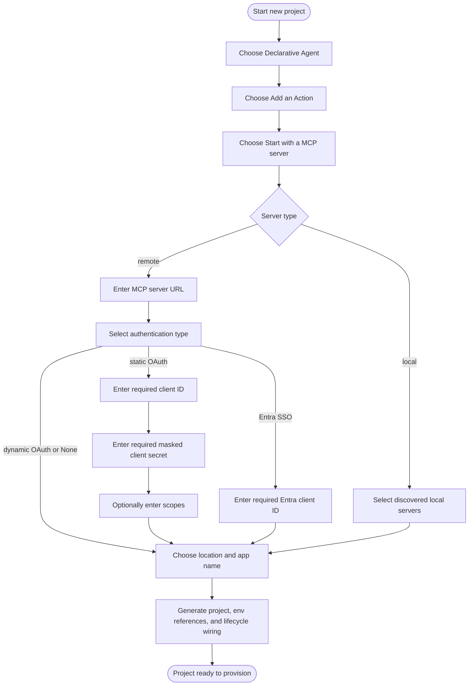

# Create Declarative Agent With MCP Server

## Metadata

- Created: 2026-07-20T09:29:44Z
- Last updated: 2026-07-29T00:00:00Z
- Status: approved
- PM owner: summzhan
- Engineer owner: HuihuiWu-Microsoft, Alive-Fish
- Scenario group: da
- Scenario ID: SCN-DA-CREATE-WITH-MCP-SERVER
- Primary goal: create
- Start state: No project choice has been made; the developer can start the new project flow and choose `Declarative Agent`.
- Success state: The generated DA project contains the selected local MCP configuration or a remote MCP action, the declarative agent reference, and the lifecycle wiring and credential environment references needed to provision and run it.
- Lifecycle phases: [create]
- Visual/state reference: create-da-with-mcp-server.html

## Scenario

A developer creates a Declarative Agent project backed by a local or remote MCP server. For a remote server, the developer provides the server URL and selects `OAuth (with static registration)`, `OAuth (with dynamic registration)`, `Entra SSO`, or `None`. For a local server, the developer selects one or more servers discovered on the machine and does not provide remote authentication details.

Dynamic Tool Discovery is the default behavior. The generated remote action points at the MCP server and lets the agent host discover tools at runtime; scaffolding does not fetch or freeze a static tool list.

After the developer selects an authentication type, V4 collects only the credentials required by that type before asking for the project location and application name. Static OAuth requires a client ID and masked client secret and accepts optional scopes. Entra SSO requires a client ID. Dynamic OAuth and `None` require no credential follow-ups. The entered values are persisted through environment references so provision does not ask for the same credentials again.

This change removes the V4 credential-flow difference while preserving the existing V3 behavior.

While `TEAMSFX_MCP_FOR_DA_DT` still exists, setting it to `false` selects the compatibility path documented by [`create-mcp-server-static.md`](../../../03-specs/scenarios/da/create-mcp-server-static.md). That path materializes a static tools list and is not changed by this proposal.

## Dependencies

- Produces a standard DA project, including the app manifest, declarative agent manifest, action manifest, lifecycle files, `.vscode/mcp.json`, environment files, and evaluation assets.
- Remote servers must expose a valid MCP URL. Dynamic OAuth additionally depends on compatible authorization discovery for Dynamic Client Registration.
- Local server choices come from the installed local MCP server provider. No remote URL, auth, or credential question is shown for a local choice.
- Provision owns cloud-side OAuth registration; Create owns collection and secure persistence of credentials required by static OAuth and Entra SSO.

## Feature flags

- `TEAMSFX_MCP_FOR_DA_DT` defaults to `true`. When true, create uses dynamic discovery; the V4 implementation is the `da/mcp-server` template. When false, create retains the static-tools compatibility behavior.
- `TEAMSFX_MCP_FOR_DA_DCR` defaults to `true`. `OAuth (with dynamic registration)` is visible and accepted only when both DT and DCR are true.
- `TEAMSFX_V4_ENABLED` selects the V4 implementation; this proposal removes the credential-flow difference between V3 and V4.
- These flags describe temporary rollout states, not separate product scenarios.

## Surfaces

- VS Code: guided Quick Pick and input-box flow. The client secret input is masked.
- CLI interactive: prompt-driven `atk new` flow with the same conditional question model. The client secret input is masked.
- CLI non-interactive: flag-driven `atk new` flow. Static OAuth requires client ID and client secret flags; scopes are optional. Entra SSO requires the client ID flag. Dynamic OAuth and `None` reject no missing credential input because none is required.
- Visual Studio and chat: not covered by this scenario.

## States

- Entry: the developer starts project creation and chooses `Declarative Agent` -> `Add an Action` -> `Start with a MCP server`.
- Server source: when local discovery is available, the developer chooses `Local MCP server` or `Remote MCP server`; otherwise the flow continues with remote.
- Local: the developer selects one or more discovered local servers. The flow skips URL, authentication, and credential questions.
- Remote: the developer enters an MCP server URL and selects an authentication type. The URL is checked as it is entered: a value that is not an absolute `http(s)` address, or one the server answers with 404 to an MCP `initialize` request, is rejected on the question.
- Remote auth: `OAuth (with static registration)`, `Entra SSO`, and `None` are always available on the dynamic route. `OAuth (with dynamic registration)` is available only when both DT and DCR are true.
- Static OAuth: immediately after auth selection, the flow asks for a required OAuth client ID, a required masked client secret, and optional space-separated scopes, in that order.
- Entra SSO: immediately after auth selection, the flow asks only for a required Microsoft Entra Application (Client) ID.
- Dynamic OAuth and None: the flow asks no client ID, client secret, or scopes question and continues to project location and application name.
- Dynamic OAuth: scaffolding injects `dcr/register`. If authorization discovery cannot be resolved, the generated action contains the documented well-known URL placeholder and the developer receives a warning to repair it before provision.
- Static OAuth: scaffolding injects `oauth/register`. If the server advertises no OAuth endpoints, the generated action contains authorization and token URL placeholders and the developer receives the same repair warning.
- Validation: an empty required credential, a server URL that is not an absolute `http(s)` address or that answers 404 to the MCP `initialize` request, an invalid app name or location, an unsupported auth value, or a missing required non-interactive input keeps the flow recoverable and does not accept partial output.
- Cancellation: cancelling before generation leaves no partially scaffolded project and persists no credential value.

## User-visible outputs

### File changes

- `appPackage/manifest.json`, `appPackage/declarativeAgent.json`, and the standard DA assets are created.
- On the default remote path, `appPackage/ai-plugin.json` contains a URL-derived namespace and a `RemoteMCPServer` runtime with `spec.url` and `run_for_functions: ["*"]`.
- `.vscode/mcp.json` contains the remote server entry. For a local selection, it instead contains the selected `stdio` server definitions and the action manifest has no remote runtime.
- `m365agents.yml` receives `oauth/register` for static OAuth or Entra SSO, `dcr/register` for dynamic OAuth, and no auth registration action for `None` or a local server.
- Static OAuth `oauth/register` references `MCP_DA_OAUTH_CLIENT_ID_<NS>` and `SECRET_MCP_DA_OAUTH_CLIENT_SECRET_<NS>`, and references `MCP_DA_OAUTH_SCOPE_<NS>` only when scopes were entered. Entra SSO references only `MCP_DA_OAUTH_CLIENT_ID_<NS>`.
- Static OAuth and Entra SSO write the deterministic `MCP_DA_AUTH_ID_<NS>=` registration-result placeholder.

### Notifications and prompts

- The guided flow shows the DA template choices, MCP source, conditional local selection or remote URL, auth type, required credential follow-ups, project location, and app name.
- The client secret is masked while entered and is never included in generated review artifacts, warnings, or logs.
- Dynamic OAuth discovery fallback produces a warning identifying the manual repair needed before provision.
- A server URL that answers the `initialize` request like something other than an MCP endpoint, without answering 404, produces an advisory warning after scaffolding. Generation still succeeds.
- Successful generation opens or reports the generated project through the normal surface behavior.

### Error and recovery messages

- Empty required client ID or client secret input produces a correctable validation error and keeps the user on that question.
- A missing required non-interactive credential fails before scaffold output is written and identifies the missing input.
- A non-empty target fails before rendering and writes nothing.
- Cancelling a picker or input exits without a partial project or persisted credential.

### Environment and secret writes

- Static OAuth and Entra SSO write the entered client ID to `MCP_DA_OAUTH_CLIENT_ID_<NS>` in `env/.env.<env>`.
- Static OAuth writes `MCP_DA_OAUTH_SCOPE_<NS>` to the regular environment file only when non-empty scopes were entered.
- Static OAuth writes the client secret as `SECRET_MCP_DA_OAUTH_CLIENT_SECRET_<NS>` through the encrypted, masked user-environment path. The secret is never written to a regular environment file, manifest, lifecycle YAML, telemetry, warning, or log.
- Dynamic OAuth, `None`, and local MCP write no static credential value or credential environment reference.

### External side effects

- Local selection reads the discovered local MCP server catalog.
- Entering the remote URL sends an unauthenticated MCP `initialize` request to it to establish whether an MCP endpoint is there.
- Remote auth wiring may probe authorization discovery endpoints while generating the lifecycle action. OAuth configuration creation and DCR execution occur during provision, not scaffolding.

## Flow



## Validation notes

- The existing VS Code vscuse `DA_MCP_Oauth_Remote` case is the L3 target for the static OAuth sequence: auth type -> client ID -> masked client secret -> optional scopes -> workspace folder.
- Entra SSO must validate the shorter auth type -> client ID -> workspace folder sequence. `None`, dynamic OAuth, and local MCP must validate that credential prompts remain absent.
- L1 V4 scenario tests must cover the conditional question declarations, required descriptor inputs, environment references, regular env values, and a secret sink that cannot expose the secret through ordinary scaffold files.
- Existing CLI E2E files carry the same Scenario ID; static OAuth and Entra non-interactive input matrices remain L2 validation targets.
- DT-off compatibility criteria remain in [`create-mcp-server-static.md`](../../../03-specs/scenarios/da/create-mcp-server-static.md) until the DT flag is removed.

## Implementation binding

```yaml
version: 1
scaffolding:
  kind: create
  templateIds:
    - da/mcp-server
  reviewContexts:
    - id: vscode-remote-dcr-defaults
      surface: vscode
      environmentProfile: vscode-v4-preview
      featureFlags: {}
      answers:
        projectType: copilot-agent-type
        daTemplate: add-action
        actionSource: mcp
        mcpServerType: remote
        mcpServerUrl: https://example.com/mcp
        authType: oauth-dynamic
    - id: vscode-remote-static-oauth
      surface: vscode
      environmentProfile: vscode-v4-preview
      featureFlags: {}
      answers:
        projectType: copilot-agent-type
        daTemplate: add-action
        actionSource: mcp
        mcpServerType: remote
        mcpServerUrl: https://example.com/mcp
        authType: oauth
        oauthClientId: review-client-id
        oauthClientSecret:
          state: non-empty
        oauthScopes: read:user
    - id: vscode-remote-entra-sso
      surface: vscode
      environmentProfile: vscode-v4-preview
      featureFlags: {}
      answers:
        projectType: copilot-agent-type
        daTemplate: add-action
        actionSource: mcp
        mcpServerType: remote
        mcpServerUrl: https://example.com/mcp
        authType: entra-sso
        entraClientId: review-entra-client-id
    - id: vscode-remote-none
      surface: vscode
      environmentProfile: vscode-v4-preview
      featureFlags: {}
      answers:
        projectType: copilot-agent-type
        daTemplate: add-action
        actionSource: mcp
        mcpServerType: remote
        mcpServerUrl: https://example.com/mcp
        authType: none
    - id: vscode-local
      surface: vscode
      environmentProfile: vscode-v4-preview
      featureFlags: {}
      answers:
        projectType: copilot-agent-type
        daTemplate: add-action
        actionSource: mcp
        mcpServerType: local
        selectedLocalServers:
          - local-server
    - id: cli-remote-static-oauth
      surface: cli
      environmentProfile: cli-v4-preview
      featureFlags: {}
      answers:
        projectType: copilot-agent-type
        daTemplate: add-action
        actionSource: mcp
        mcpServerType: remote
        mcpServerUrl: https://example.com/mcp
        authType: oauth
        oauthClientId: review-client-id
        oauthClientSecret:
          state: non-empty
  reviewedFingerprints:
    semantic: 67640d38e3f87a610b66899366009c709dc790bb89fa175e7d23a5467e751f72
    presentation: 6fd81458e6ccea7b1855cbb5a8a5698fb81e8224c046483748adadcf7c5a0622
```
