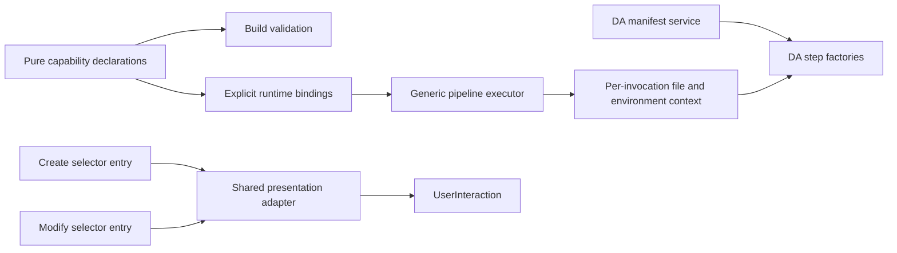

# ADR-0025 - Scaffolding extension ownership

- **Status:** Accepted (chat-approved architecture work, 2026-09-11).
- **Partially supersedes:** ADR-0017's manifest dependency injection boundary only; its domain-typed steps, wrapper requirement and template contract remain unchanged.
- **Scope:** Refine ADR-0017's injected manifest boundary and consolidate existing capability declarations and selector presentation. No new template dialect or product flow.
- **Requirements:** The user approved domain-interface decoupling, one capability declaration source, and shared create/modify selector presentation after architectural review. No PRD/scenario change is needed; modify consumes the presentation metadata already declared by its selector.

## Decision

1. The pipeline context exposes generic file I/O, environment persistence and warnings, not DA manifest operations. DA step factories receive a domain-owned manifest service. Each service call receives the current invocation's read/write context; no global sink or filesystem bypass is allowed. The service continues to use the existing manifest wrappers, error names, path rules and upsert behavior. The sensitivity lookup remains best-effort: an absent ID performs no manifest I/O.
2. Template-visible step, provider and validator IDs, introduction versions and derived output declarations have one source-owned, dependency-free declaration module. Runtime implementations bind those declarations explicitly; build validation reads only their data. Output introduction versions may override the capability version only when the output is consumed. This is not a plugin discovery framework or service container.
3. Create and modify selectors share only their presentation adapter: localization fallback, feature-flag labels, icons, conditional visibility and prompt result conversion. Their entry points retain package-kind lookup, navigation, create resume/history and error boundaries.
4. The existing pipeline whitelist, pre-render empty-target guard, frozen render variables, unsupported cross-step outputs and legacy package compatibility remain unchanged. Domain protocol constants stay in their owning domain modules.

## Acceptance Criteria

All rows are L1, required PR gates. Existing operation/scenario tests continue to own output compatibility.

| ID | Given / When | Then | Purpose / Harness |
| --- | --- | --- | --- |
| OWN-01 | A generic pipeline context and an injected DA manifest service execute the action step | The service receives current read/write context and resolved paths, with no manifest operation on the generic context | operation-integration / typed step and in-memory context |
| OWN-02 | Real DA action and sensitivity steps run on separate runtimes | Relative paths, idempotent upserts, existing error names and no-ID no-op are preserved; no writes cross runtimes | compatibility / real wrappers and in-memory runtimes |
| OWN-03 | Default runtime registries and providers are assembled | Their IDs and derived schemas match pure declarations; literal capability identities and version gates remain unchanged | operation-integration / registry and catalog tests |
| OWN-04 | Build validation runs before product API output is available | Capability declarations load without runtime/API imports, including output-floor checks | compatibility / existing source-archive AC-29 child process and catalog tests |
| OWN-05 | Create and modify selectors use identical presentation metadata | Both resolve localization, feature labels, icons and visibility identically, including fallback text and error propagation | surface / actual selector entry points and fake UserInteraction |
| OWN-06 | Selector Back, cancellation, create resume or batch resolution occurs | Existing navigation and return contracts remain unchanged | compatibility / existing create/modify selector tests |

## Flow

## Boundary

No changes to pipeline names, template data, engine versions, authentication behavior, credential persistence, legacy migrations, cross-step data flow or render-before-step ordering. No direct runtime dependency is added to template build validation. No global registry mutation or dynamic capability discovery is introduced.

## Invariants

- Manifest mutations still use the manifest package wrappers, never raw JSON mutation.
- Runtime assembly contains bindings, not domain mutation algorithms.
- The same pure declaration supplies capability ID, introduction version and output metadata; tests independently pin external strings and versions.
- Per-run sinks and secret boundaries remain isolated.
- The shared walker remains the only answer/navigation engine; presentation sharing must not add another walk.

## Alternatives

Moving functions into a utility without changing the domain-specific context would retain the coupling. A generic service locator would hide dependencies and weaken typing. Importing runtime registries into the build validator would repeat the clean-setup bootstrap regression. These alternatives are rejected.

## Verification

Run DA step/pipeline/runtime/scenario tests after context migration; catalog/provider/validator/archive tests after declaration consolidation; both selector suites after presentation sharing. Finish with source and scenario-tooling typechecks, affected lint/format, template build, full fx-core coverage suite and independent diff review.