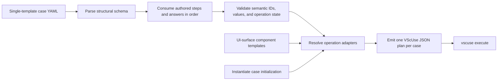
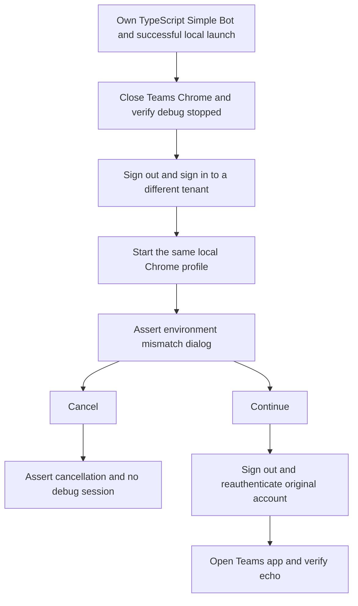
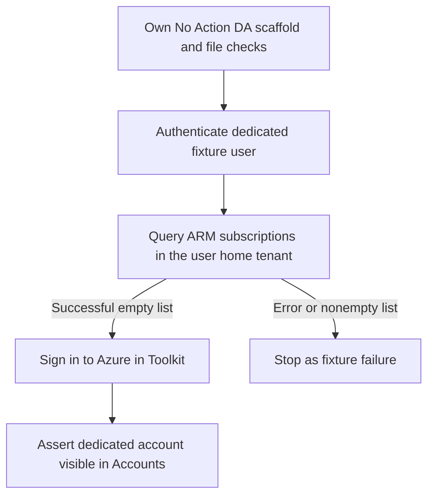
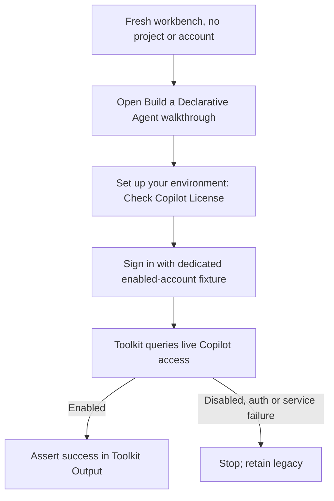

# Operation — `compile-vscuse-case-bundles`

- **Status:** Implemented
- **Product behavior change:** none; this operation defines test sources and generates VscUse plans.
- **Related contracts:** [scenario model](../../../01-product/scenarios/README.md),
  [`inspect-scaffold-catalog`](../scaffolding/inspect-scaffold-catalog.md)

## Purpose

Define several validation cases for exactly one template in one concise YAML file. Reusable atomic
steps are defined once at the file level, while every case explicitly owns its ordered step
references. The YAML is the reviewable source of truth; a compiler adapts the authored semantic
question IDs, option IDs, accounts, lifecycle inputs, and launch titles to reusable UI components,
then emits one existing-format VscUse JSON plan per case. The VscUse runner, recordings,
screenshots, and shared groups remain unchanged.

## Decision

| Option                                      | Decision     | Reason                                                                                  |
| ------------------------------------------- | ------------ | --------------------------------------------------------------------------------------- |
| Make YAML a native VscUse runner format     | Rejected     | Requires changing the external runner and duplicates its plan model.                    |
| Compile semantic YAML to current JSON plans | **Selected** | Reuses UI components, recorded interactions, variables, and current CI.                 |
| Put VscUse group IDs directly in YAML       | Rejected     | Group filenames and plan IDs are implementation details and already vary across cases.  |
| Inherit one file-level execution sequence   | Rejected     | Hides each case's actual behavior and conflates reusable definitions with control flow. |
| Define reusable multi-step sequence macros  | Rejected     | Adds nested control flow when named atomic steps provide sufficient reuse.              |

## Current Implementation Limits

The root object, case objects, and semantic step-definition objects are closed schemas. Check
assertions, check expectations, provision input groups, and `deploy.with` are also closed by their
semantic adapters. Other nested `with` objects are currently consumed field by field rather than
rejected for every unknown field. In particular, the compiler currently accepts an empty scaffold
`answers` array, an empty non-initial `checks.with` array, and unused nested fields on login,
target, and open definitions. Authors must not rely on those accepted-but-unused
values; complete nested closure remains follow-up validation work.

Text answers generally accept any string. `appName` is the exception: it must use an expression
that initializes `app_name` with one Linux workspace path segment, such as
`${{var:app_name:vscuse_app_#####}}`, because mandatory workspace checks and later adapters
reference `${{var:app_name}}`. Literal, unresolved, absolute, and path-like app names fail
compilation.

The compiler validates known question IDs, option IDs, answer types, value shapes, duplicate
questions, and secret expressions, and it preserves authored answer order. It does not maintain a
per-template question graph, so it cannot prove that an authored selector path is complete or that
all conditional questions are in the correct order. The generated prompt assertions detect an
incorrect path at execution time. Parser and structural diagnostics include a source path and YAML
path and may be aggregated; semantic adapter compilation currently stops at the first error and
returns only a stable code and redacted message.

The Teams Agent with Data templates hardcode `gpt-3.5-turbo`, and `text-embedding-ada-002` for
Azure AI Search, on their OpenAI branch. Generated cases replace the unsupported chat model with
`gpt-4o-mini` before launch and redirect the OpenAI client to the Azure OpenAI v1-compatible
endpoint. The embedding deployment remains unchanged because the test resource hosts it under the
template's existing name.

## YAML Contract

```yaml
version: 1

steps:
  scaffold-ts:
    type: scaffold
    with:
      template: weather-agent
      answers:
        - question: projectType
          value: custom-engine-agent-type
        - question: customEngineAgent
          value: weather-agent
        - question: llmService
          value: llm-service-azure-openai
        - question: azureOpenAIKey
          type: text
          value: "${{secret:AZURE_OPENAI_API_KEY}}"
        - question: azureOpenAIEndpoint
          type: text
          value: "${{env:AZURE_OPENAI_ENDPOINT}}"
        - question: azureOpenAIDeploymentName
          type: text
          value: "${{env:AZURE_OPENAI_MODEL}}"
        - question: language
          value: typescript

  check-scaffold:
    type: checks
    with:
      - type: file
        path: m365agents.yml
        expect:
          exists: true
          contains: ["provision:", "deploy:"]
          notContains: ["oauth/register"]
      - type: file
        path: appPackage/manifest.json
        expect:
          exists: true

  login-azure:
    type: login
    with:
      type: azure
      account: "${{env:AZURE_ACCOUNT_NAME}}"
      password: "${{secret:AZURE_ACCOUNT_PASSWORD}}"

  login-m365:
    type: login
    with:
      type: m365
      account: "${{env:M365_ACCOUNT_NAME}}"
      password: "${{secret:M365_ACCOUNT_PASSWORD}}"

  provision-arm:
    type: provision
    with:
      arm:
        targetResourceGroupName: "+ New resource group"
        newResourceGroupName: "${{var:app_name}}-rg"
        newResourceGroupLocation: "${{env:RESOURCE_GROUP_REGION}}"

  deploy:
    type: deploy

  remote-preview:
    type: target
    with:
      profile: "Launch Remote in Teams (Chrome)"
      profileSelection: first

  open-app:
    type: open
    with: { kind: app, destination: chat }

  check-remote-preview:
    type: checks
    with:
      - type: chat
        send: What is the weather in Seattle?
        expect:
          replied: true
          contains: [Seattle]

cases:
  - id: weather-ts-remote
    scenarioId: SCN-TEAMS-WEATHER-REMOTE-PREVIEW
    steps:
      - scaffold-ts
      - check-scaffold
      - login-azure
      - login-m365
      - provision-arm
      - deploy
      - remote-preview
      - open-app
      - check-remote-preview
```

The example scenario ID identifies the target behavior as the case's primary validation goal;
scaffold, login, provision, and deploy may be setup for that goal. The current compiler preserves
this required ID in generated metadata but does not yet resolve it against the scenario documents.

`bundleId` is intentionally absent. Its original purpose was to identify the source file and its
generated outputs, but the repository-relative YAML path already provides that identity. Generated
plan filenames use `<normalized-scaffold-template>--<case-id>.json`, so another authored ID would
only duplicate information.

## Field Semantics

| Field                                                   | Rule                                                                                                                                                                                                                                                                                      |
| ------------------------------------------------------- | ----------------------------------------------------------------------------------------------------------------------------------------------------------------------------------------------------------------------------------------------------------------------------------------- |
| `version`                                               | Required; first version is `1`.                                                                                                                                                                                                                                                           |
| `featureFlags`                                          | Optional non-empty list of unique `NAME=true` or `NAME=false` compatibility switches inherited by every case and emitted as `feature_flag:` plan metadata.                                                                                                                                |
| `steps`                                                 | Required non-empty map of unique step names to atomic semantic step definitions.                                                                                                                                                                                                          |
| `steps.<name>.type`                                     | Required; one of `scaffold`, `login`, `provision`, `deploy`, `pythonEnvironment`, `localEnvironment`, `playgroundEnvironment`, `localUserEnvironment`, `projectEnvironment`, `removeWorkspaceFile`, `workflowVersion`, `configureTypeSpecAction`, `share`, `target`, `open`, or `checks`. |
| `steps.<name>.with`                                     | Step-local input consumed by the definition's semantic adapter. Provision and check inputs are closed; see current implementation limits for other nested objects.                                                                                                                        |
| `cases`                                                 | One or more explicit cases for the file's single scaffold template. V1 has no matrix expansion.                                                                                                                                                                                           |
| `case.id`                                               | Required and unique within the file. Combined with the resolved scaffold template for the generated plan name.                                                                                                                                                                            |
| `case.scenarioId`                                       | Required non-empty product/engineering Scenario ID; copied to generated metadata without current doc lookup.                                                                                                                                                                              |
| `case.steps`                                            | Required ordered references containing exactly one `scaffold`. Inline definitions and overrides are invalid.                                                                                                                                                                              |
| `case.gate`                                             | Optional execution gate: `pr`, `scheduled`, or `manual`; default is `pr`.                                                                                                                                                                                                                 |
| `case.featureFlags`                                     | Optional non-empty list of unique case-local compatibility switches. These are merged with bundle-level defaults, and duplicate names across the two scopes are invalid.                                                                                                                  |
| `scaffold.with.template`                                | Required stable v4 template ID, such as `weather-agent`.                                                                                                                                                                                                                                  |
| `scaffold.with.answers`                                 | Required ordered array of `{ question, type?, value }` entries representing the executed prompt path. Current validation permits an empty array.                                                                                                                                          |
| `answers[].question`                                    | Stable selector or create-question key. Each key may occur at most once in one scaffold definition.                                                                                                                                                                                       |
| `answers[].type`                                        | Optional UI type: `singleSelect`, `multiSelect`, or `text`; defaults to `singleSelect`.                                                                                                                                                                                                   |
| `answers[].value`                                       | One supported option ID, a non-empty option-ID list, or a string compatible with the authored question type. Secret questions require `${{secret:NAME}}`.                                                                                                                                 |
| `login.with.type`                                       | Required provider for this login step: `azure` or `m365`.                                                                                                                                                                                                                                 |
| `login.with.account`                                    | Required `${{env:NAME}}` expression identifying the exact account used by the selected provider recipe.                                                                                                                                                                                   |
| `login.with.password`                                   | Required `${{secret:NAME}}` expression for the selected account.                                                                                                                                                                                                                          |
| `file.path`                                             | Required workspace-relative path to one generated file.                                                                                                                                                                                                                                   |
| `file.expect.exists`                                    | Optional boolean. `false` asserts absence and cannot be combined with content expectations.                                                                                                                                                                                               |
| `file.expect.contains`                                  | Optional non-empty list of literal UTF-8 substrings that must all occur.                                                                                                                                                                                                                  |
| `file.expect.notContains`                               | Optional non-empty list of literal UTF-8 substrings that must all be absent.                                                                                                                                                                                                              |
| `provision.with.arm`                                    | Presence means Azure resources are required. Keys come from the operation-owned ARM question set below.                                                                                                                                                                                   |
| `provision.with.apiKey`                                 | API-key value as a required `${{secret:NAME}}` expression; supported only by the existing-API template adapter.                                                                                                                                                                           |
| `provision.with.oauth`                                  | OAuth credentials: `clientId` uses `${{env:NAME}}`; non-PKCE existing-API flows also require `clientSecret` using `${{secret:NAME}}`, while the pinned PKCE no-action flow rejects `clientSecret`.                                                                                        |
| `provision.with.environment`, `deploy.with.environment` | Optional literal `none`, declaring that the project exposes a single selectable environment so the toolkit auto-selects it and shows no picker. Orthogonal to the input groups above; omitting it emits the recorded `dev` selection.                                                     |
| `configureTypeSpecAction.with.action`                   | Required literal `github-issues`, `github-oauth-with-reference-id`, or `github-oauth-without-reference-id`. The adapter owns `src/agent/main.tsp`, immutable external source revisions, and exact transformations; authors cannot provide a path, URL, line number, or source text.       |
| `addDaCapability.with.capability`                       | Required supported capability literal. `copilotConnector` additionally requires `connectionId`; `embeddedKnowledge` accepts no other authored input and uses the compiler-owned immutable document fixture.                                                                               |
| `target.with.profile`                                   | Required for every `target`; the exact launch-configuration title visible in the VS Code F5 picker.                                                                                                                                                                                       |
| `open.with.kind`                                        | Required activation object: `app` or `agent`.                                                                                                                                                                                                                                             |
| `open.with.destination`                                 | Required converged destination: `chat` or `page`.                                                                                                                                                                                                                                         |
| `chat.send`                                             | Required string sent as one user turn through the active target's chat adapter. Authors should use a non-empty message; current validation permits an empty string.                                                                                                                       |
| `chat.allowAction`                                      | Optional literal `true`; after a Copilot message, accepts the deterministic capability-consent prompt.                                                                                                                                                                                    |
| `chat.expect`                                           | Optional for `chat` only; omitting it sends the message without asserting the reply so a later assertion can observe the surface the message produced.                                                                                                                                    |
| `chat.expect.replied`                                   | Optional boolean. `true` requires one completed, non-empty assistant response; `false` emits no response assertion.                                                                                                                                                                       |
| `chat.expect.contains`                                  | Optional non-empty list of literal visible substrings that must all occur in the completed response.                                                                                                                                                                                      |
| `chat.expect.notContains`                               | Optional non-empty list of literal visible substrings that must all be absent from the completed response.                                                                                                                                                                                |
| `browser.expect.role`                                   | Required non-empty accessible role for an element visible after a target operation.                                                                                                                                                                                                       |
| `browser.expect.name`                                   | Exact non-empty accessible name for that visible browser element. Exactly one of `name` or `namePrefix` is required.                                                                                                                                                                      |
| `browser.expect.namePrefix`                             | Non-empty prefix for a dynamic accessible name. Exactly one of `name` or `namePrefix` is required.                                                                                                                                                                                        |
| `page.expect.contains`                                  | Required non-empty list of literal visible substrings that must all occur on the page the current target opened.                                                                                                                                                                          |
| `removeWorkspaceFile.with.path`                         | Required workspace-relative path to one generated file the operation deletes, so a later operation can be observed recreating it.                                                                                                                                                         |
| `workflowVersion.with.version`                          | Required literal `v1.9`; the compiler-owned mutation replaces and verifies the top-level `version` in `m365agents.yml` so compatibility behavior can be tested without installing an old extension.                                                                                       |
| `share.with.scope`                                      | Required literal `users`; the V1 adapter selects Share access, then the specified-users scope.                                                                                                                                                                                            |
| `share.with.email`                                      | Required `${{env:NAME}}` expression submitted to the specified-users prompt after a preceding Microsoft 365 login.                                                                                                                                                                        |
| `share.with.expectError`                                | Required literal `unsupportedWorkflowVersion`; the adapter asserts the localized Share error for workflow versions below v1.10 and never calls the remote sharing service.                                                                                                                |

Step definitions own all authored operation input. A case owns only case metadata and the ordered
names of the definitions it executes. Definitions are atomic: they cannot reference other steps or
expand into a sequence. A definition may be referenced by multiple cases or repeated within one
case. A case cannot change a referenced definition; when two cases need different input, the file
declares two named definitions, such as `scaffold-ts` and `scaffold-js`.

## Step Semantics

The file-level `steps` map owns reusable atomic definitions; each `case.steps` list owns control
flow. A definition is an object with a semantic `type` and optional type-specific fields:

```yaml
steps:
  scaffold-ts:
    type: scaffold
    with:
      template: weather-agent
      answers:
        - { question: projectType, value: custom-engine-agent-type }
        - { question: customEngineAgent, value: weather-agent }
        - { question: llmService, value: llm-service-azure-openai }
        - { question: language, value: typescript }
  check-scaffold:
    type: checks
    with:
      - type: file
        path: m365agents.yml
        expect:
          exists: true
          contains: ["provision:"]
          notContains: ["oauth/register"]
  remote-preview:
    type: target
    with:
      profile: "Launch Remote in Teams (Chrome)"
      profileSelection: first
  open-app:
    type: open
    with: { kind: app, destination: chat }
  check-remote-preview:
    type: checks
    with:
      - type: chat
        send: What is the weather tomorrow?
        expect:
          replied: true
          contains: [weather]

cases:
  - id: weather-remote
    scenarioId: SCN-TEAMS-WEATHER-REMOTE-PREVIEW
    steps:
      [
        scaffold-ts,
        check-scaffold,
        remote-preview,
        open-app,
        check-remote-preview,
      ]
```

V1 step types are `scaffold`, `login`, `provision`, `deploy`, `pythonEnvironment`,
`localEnvironment`, `playgroundEnvironment`, `localUserEnvironment`, `projectEnvironment`,
`removeWorkspaceFile`, `workflowVersion`, `configureTypeSpecAction`, `share`, `target`, `open`,
and `checks`.
`scaffold` accepts `template` and `answers`; `login`, `provision`, and `target` accept their
same-named operation input. `deploy` has no semantic input, although current validation ignores an
authored `with` object. `pythonEnvironment` requires exactly one input, `with.interpreter`, the
label the Python extension's interpreter picker shows for the interpreter the case selects.
`localEnvironment` accepts a `with` mapping of environment variable names to values, each added to
the `envs` mapping that the project's local lifecycle writes into its runtime environment file,
which is `.localConfigs` for Node projects and `.env` for Python projects.
`playgroundEnvironment` accepts the same closed mapping shape but adds each variable to the `envs`
mapping in `m365agents.playground.yml` that writes `.localConfigs.playground`. It exists for
Playground launches, which do not consume the local lifecycle's `.localConfigs` output.
`localUserEnvironment` accepts the same closed mapping shape but replaces an existing variable in
`env/.env.local.user`, so a profile-owned local provision can resolve the value before it writes
runtime configuration. It accepts no authored path and never creates a missing variable.
`projectEnvironment` accepts the same closed mapping shape but replaces an existing non-secret
variable in `env/.env.dev`, which has higher resolution priority than `env/.env.dev.user`. It
accepts no authored path and never creates a missing file or variable.
`removeWorkspaceFile` requires exactly one input, `with.path`, and deletes that project-relative
file after the post-scaffold file check has proven it exists. It exists so a case can observe a
later operation recreating a file the template ships, which cannot be observed while the scaffolded
copy is still on disk.
`configureTypeSpecAction` accepts `with.action: github-issues`,
`github-oauth-with-reference-id`, or `github-oauth-without-reference-id`. Its component opens a new
integrated terminal and types one compiler-owned command that targets the generated project's
absolute path. The GitHub issues command requires the disabled declarations to occur exactly once
in `src/agent/main.tsp` and enables only those declarations without relying on line numbers. The
OAuth commands replace that file from one immutable revision and verify whether the compiler-owned
authentication reference is present or absent. Every command re-reads the file and prints a unique
success marker only after verification.
The component waits for that marker and closes the terminal before continuing. It does not use a
CodeAgent that can reinterpret the command. Any other action, authored field, missing source, or
ambiguous source fails instead of modifying the workspace.
`open` requires `with.kind` and
`with.destination`; the current template, target profile, and those two values select a compatible
adapter. The profile already identifies the host surface, so `open` does not repeat Teams or
Copilot as authored input. A future Playground target adapter can follow the same rule.

`pythonEnvironment` is the one operation a Python case authors that a TypeScript or JavaScript case
does not. A Python scaffold writes a `src/requirements.txt` it never installs, and every launch
profile the Python templates author starts the app from the workspace interpreter, so a case that
launches a Python project without first creating its virtual environment starts an app whose
dependencies are missing. The operation runs `Python: Create Environment...`, filters the
environment-type picker to `Venv`, filters the interpreter picker to the authored label, confirms
the `Select dependencies to install` prompt with every dependency checked, and then waits on the
notification the extension raises when the environment is selected.

A `checks` definition requires a `with` array. The check immediately following `scaffold` must
contain at least one `file` assertion; current validation permits a later `checks` definition to be
empty. Each assertion selects its adapter and required runtime state by `type`; there is no
separate check context field:

- `file` uses the generated workspace and requires a successful preceding `scaffold`. It requires
  one workspace-relative `path` and a non-empty `expect` object. `expect.exists` accepts a boolean;
  `expect.contains` and `expect.notContains` are non-empty lists of literal substrings. At least one
  expectation is required, content expectations imply `exists: true`, and `exists: false` cannot be
  combined with either content expectation.
- `browser` requires a preceding `target` and asserts one visible element by its accessible `role`
  and `name`. It does not expose coordinates, selectors, screenshots, or free-form source tags.
- `page` uses the page the current target opened and requires `page-ready` state. A preceding `open`
  with `destination: page` establishes that state. It requires a non-empty `expect.contains` list of
  literal visible substrings and emits one assertion per item in authored order. It names visible
  content only; page URLs, frames, and reload mechanics belong to the open adapter.
- `chat` uses the current target's chat adapter and requires `chat-ready` state. A preceding `open`
  establishes that state for the current Teams or Copilot profile. `allowAction: true` is supported
  only by the Copilot adapter after a capability-producing message; it accepts exactly one recorded
  consent prompt before response assertions. When `expect` is present, one or more of
  `expect.replied`, `expect.contains`, or `expect.notContains` is required, and content
  expectations imply `replied: true`. Omitting `expect` sends the message and asserts nothing about
  the reply, which lets a following assertion observe the surface the message produced — for example
  the sign-in button an OAuth-protected plugin raises instead of an answer.

Assertions execute in their authored array order. A `checks` definition may combine assertion
types only when every assertion's required runtime state exists at that position in the case. The
closed schema rejects `checks.on` and unknown assertion types.

File content is decoded as UTF-8 and matched as authored without trimming or case folding. Every
`contains` value must occur; every `notContains` value must be absent. Invalid UTF-8, a missing file,
or a failed content assertion fails the check. Absolute paths and paths escaping the generated
workspace are rejected before execution. Diagnostics identify the path and failed expectation but
never include the file contents.

Referenced definitions execute exactly in each case's authored order and may repeat. The compiler
validates operation preconditions rather than silently reordering them: every case references
exactly one `scaffold`; it must be immediately followed by a `checks` definition containing at
least one `file` assertion; other workspace-dependent steps require that pair to succeed; ARM
provision requires a preceding Azure login; a target requires every compatible login and lifecycle
operation declared by its launch profile; and `chat` assertions require a successful
preceding `target`. An `open` requires that target and must appear before any assertion whose
required state it establishes. A `chat` assertion is rejected unless the preceding sequence has
reached `chat-ready`.

`target` is one authored F5 operation that selects and starts its declared launch profile. The
current adapters support the remote profiles `Launch Remote in Teams (Chrome)`,
`Launch Remote (Chrome)`, `Preview in Copilot (Chrome)`, and
`(Preview) Launch Remote in Copilot (Chrome)`, and the local debug profiles
`Debug in Teams (Chrome)`, `(Preview) Debug in Copilot (Chrome)`, and
`Debug in Microsoft 365 Agents Playground`; any
other exact title fails until a deterministic adapter is added. The
authored `profile` is the exact case-sensitive `name` shown in the F5 picker after template rendering;
it is not a compiler-defined semantic ID. For example, the TypeScript Weather template authors
`Launch Remote in Teams (Chrome)` while the Python templates author the same remote Teams launch
as `Launch Remote (Chrome)`.
A selected profile's `preLaunchTask` may validate prerequisites, create local debug state, start the
tunnel, provision and deploy locally, and start the application. Those profile-owned tasks are not
duplicated as case step references. A profile without lifecycle prelaunch tasks instead requires the
explicit preceding lifecycle definitions, such as `provision` or `deploy`, required by its semantic
adapter.

`open` is a separate convergent operation over the current target. `kind` identifies whether the
surface activates an `app` or an `agent`; `destination` identifies whether success must produce
`chat-ready` or `page-ready`. A target profile registers one activation adapter per destination it
can reach, because one launch title serves more than one scaffold package: `Debug in Teams (Chrome)`
opens a conversation for a bot and a tab page for a tab, and only the case knows which of the two it
scaffolded. The compiler selects a compatible adapter for one supported,
deterministic entry state, then verifies the requested destination state. An unsupported state,
including direct Teams Open, an already-active Teams experience, Copilot agent selection, or a
permission prompt, fails adapter resolution until an isolated recording proves its transition.
UI labels, selectors, transient actions, and the difference between DA and CEA surfaces remain in
the selected open adapter rather than in case YAML.

For example, a case can reference the same chat-check definition twice after one target/open
sequence without exposing its recorded UI operations:

```yaml
steps:
  open-app:
    type: open
    with: { kind: app, destination: chat }
  check-weather:
    type: checks
    with:
      - type: chat
        send: What is the weather in Seattle?
        expect: { replied: true, contains: [Seattle] }

cases:
  - id: weather-two-turn
    scenarioId: SCN-TEAMS-WEATHER-REMOTE-PREVIEW
    steps:
      - scaffold-ts
      - check-scaffold
      - remote-preview
      - open-app
      - check-weather
      - check-weather
```

The current Copilot target definition is:

```yaml
remote-preview-da:
  type: target
  with:
    profile: "Preview in Copilot (Chrome)"
    profileSelection: second
```

`profileSelection` is the authored position of the intended profile after filtering. Every target
declares `first` or `second`; the compiler does not derive that position from the scaffold template.

An explicit open definition declares the semantic object and desired destination, not the current
UI action:

```yaml
open-agent:
  type: open
  with:
    kind: agent
    destination: chat
```

Every scaffold definition in one source file must declare the same `template`. Its `answers` list
should explicitly include the complete selector path before the selected template's create questions.
For `weather-agent`, the list starts with `projectType: custom-engine-agent-type` and
`customEngineAgent: weather-agent`, which emit `New Project` → `Custom Engine Agent` and
`App Features Using Microsoft 365 Agents SDK` → `Weather Agent`. V1 does not reverse-resolve a
selector path from `template`; the authored selector answers are the source of execution order.

Authored `answers` are an ordered list of stable question keys, UI types, and values. The
optional `type` defaults to `singleSelect`; the V1 closed set is `singleSelect`, `multiSelect`, and
`text`. A single-select requires one option ID, a multi-select requires the literal `all`, and text
accepts a literal, `${{env:NAME}}`, `${{var:app_name}}`, or
`${{secret:NAME}}`. The authored type must equal the semantic adapter's supported type after
applying the default. Unsupported types and value shapes are errors. The compiler consumes entries
exactly in authored order and resolves each question key to its canonical `en-US` visible title and
each option ID to its visible label. Every valid authored entry represents one prompted question
and emits one logical answer expansion. The compiler does not load or maintain a second per-template
question graph, infer omitted questions, or reorder answers.

For a declarative agent that starts with a new API, the `apiAuth` question supports the stable
option IDs `none`, `api-key`, `microsoft-entra`, and `oauth`, resolving them to the visible labels
`None`, `API Key`, `Microsoft Entra`, and `OAuth` respectively.

For `da/mcp-server`, cases explicitly author the observed conditional path: `authType: oauth` is
followed by `mcp-da-client-id`, `mcp-da-client-secret`, and optional `mcp-da-scopes`, while
`authType: entra-sso` is followed only by `mcp-da-client-id`; `none` has no credential follow-up.
Prior authored answers may select a visible-label variant, such as the Entra client ID prompt.
Password follow-ups such as `mcp-da-client-secret` require a secret expression.

Prior authored answers may also select a prompt shape. One question key can reach a single prompt on
one path and a picker followed by an input box on another, because the toolkit composes the second
shape from one `singleFileOrText` question rather than from two questions. `apiSpecLocation` is that
case: the declarative-agent action flow answers `openApiSpecType` first and then reaches a plain
input box, while the Teams Agent with Data custom API flow reaches a prompt that lists
`Enter OpenAPI Document URL` beside the workspace files and opens its input box only after that item
is chosen. Both remain one authored answer, because the case names one value and the prompts carry
one title; the expansion the compiler emits is what differs.

V1 semantic adapters and component assertions use an `en-US` locale snapshot, so execution requires
the VScUse runner and product UI to use `en-US`. This compiler does not configure or enforce the
runner locale. Unknown or duplicate question keys and unknown option IDs fail compilation.
Runtime-discovered values without a deterministic component remain unsupported; in particular,
local MCP server IDs are unsupported until a test-owned interaction exists. The compiler does not
use the template ID to discover, insert, validate, or reorder selector answers, so selector-path
completeness is verified by generated UI assertions at execution time. Password questions require
a secret expression; their literal values are invalid.

`language` is an authored question key when the template supports multiple languages; the compiler
emits it as `Programming Language` and resolves IDs such as `typescript` to labels such as
`TypeScript`. Application name and project location are also authored answers, using the `appName`
and `workspaceFolder` question keys. Current cases use `workspaceFolder: default` and
`${{var:app_name:vscuse_app_#####}}` for `appName`, which initializes the reusable `app_name`
variable. The initializer default must be one segment containing only letters, digits, `_`, `-`,
or `#`. External/non-v4 selector routes are unsupported in V1.

## UI Component Directory Contract

Reusable VScUse templates are organized by the VS Code UI surface they automate rather than by
the product operation that consumes them:

```text
components/
  authentication/
    browser/
      m365-sign-in.json.tpl
    azure/
      sign-in.json.tpl
    m365/
      sign-in.json.tpl
  browser/
    assert-element.json.tpl
    assert-ready.json.tpl
    chat/
      assert-contains.json.tpl
      assert-not-contains.json.tpl
      assert-replied.json.tpl
    copilot/
      allow-action.json.tpl
      send-message.json.tpl
    playground/
      send-message.json.tpl
    teams/
      add-and-open-app.json.tpl
      send-message.json.tpl
  command-palette/
    execute-command.json.tpl
  checks/
    workspace-file.json.tpl
  dialog/
    click-primary-action.json.tpl
  initialization/
    assert-toolkit-view-settled.json.tpl
    close-welcome-overlay.json.tpl
  notifications/
    assert-contains.json.tpl
  quick-input/
    click-option.json.tpl
    confirm-option.json.tpl
    filter-option.json.tpl
    multi-select.json.tpl
    single-select.json.tpl
    text.json.tpl
```

Product operations compose these generic UI components through compiler-owned adapters. Component
paths, low-level tools, command titles, assertions, and interaction details never enter semantic
case YAML.

## Browser Component Contract

Browser components implement `open` and `chat` adapters without exposing host controls in semantic
case YAML. Open components converge one deterministic entry state to the requested readiness
state. Chat components start from `chat-ready`, submit one message through the current host, and
apply host-neutral assertions to the resulting assistant response. V1 includes:

| Operation | Host surface | Entry state          | Component file                               | Converged state      |
| --------- | ------------ | -------------------- | -------------------------------------------- | -------------------- |
| `open`    | Any          | Already ready        | `assert-ready.json.tpl`                      | Adapter-owned        |
| `open`    | Teams        | Teams page           | `teams/trust-local-tab-certificate.json.tpl` | Teams page           |
| `open`    | Teams        | App details popup    | `teams/add-and-open-app.json.tpl`            | Adapter-owned        |
| `open`    | Teams        | Local access prompt  | `teams/allow-local-device-access.json.tpl`   | Teams app tab        |
| `chat`    | Teams        | `chat-ready`         | `teams/send-message.json.tpl`                | `message-submitted`  |
| `chat`    | Copilot      | `chat-ready`         | `copilot/send-message.json.tpl`              | `message-submitted`  |
| `chat`    | Copilot      | Consent prompt       | `copilot/allow-action.json.tpl`              | Consent dismissed    |
| `chat`    | Playground   | `chat-ready`         | `playground/send-message.json.tpl`           | `message-submitted`  |
| `browser` | Any          | Target ready         | `assert-element.json.tpl`                    | Element visible      |
| `page`    | Any          | `page-ready`         | `page/assert-contains.json.tpl`              | `page-ready`         |
| `chat`    | Any          | `message-submitted`  | `chat/assert-replied.json.tpl`               | `assistant-response` |
| `chat`    | Any          | `assistant-response` | `chat/assert-contains.json.tpl`              | `assistant-response` |
| `chat`    | Any          | `assistant-response` | `chat/assert-not-contains.json.tpl`          | `assistant-response` |

`assert-ready.json.tpl` emits only the adapter's semantic readiness assertion. The Teams app details
component asserts that the popup shows its primary action button, clicks that control, asserts that
the dialog it opened shows its Open control, clicks Open, then asserts the converged subject its
adapter supplies. The generic adapter accepts `readySubject`; the Teams adapter accepts
`convergedSubject`, because the transition is the same for every profile that reaches it while what
it converges on is not: a bot or message extension opens into the app's conversation and a tab opens
into the app's tab page.

That closing assertion names what the app opened into rather than the target's
app-details subject. The target asserts that page as the entry state this component consumes, and
the two clicks between them leave it, so a subject that already held
before the transition reports nothing about whether the transition happened. The recording this
component comes from closes the same transition by asserting the app's name is on screen, which the
conversation heading carries alongside the message box that distinguishes it from the page the
component started on.

A local Teams tab needs two extra components around the shared add-and-open transition. Its local lifecycle sets
`TAB_ENDPOINT` to `https://localhost:3978` and the manifest points the static tab at
`${{TAB_ENDPOINT}}/tabs/home`, so the frame Teams opens loads from a self-signed origin Chrome has
never been told to trust and stays blank. `teams/trust-local-tab-certificate.json.tpl` opens that
origin in a separate browser tab, accepts the interstitial, and returns to the Teams tab before the
app is added, so the frame renders on its first load. Trusting the origin afterwards leaves a frame
that has already failed, and the only way back is the app's own reload command, which races the
browser permission prompt Teams raises on the same page. After the app opens,
`teams/allow-local-device-access.json.tpl` asserts that `teams.cloud.microsoft` is asking to access
other apps and services on the device, clicks its Allow button, and asserts that the prompt closes
before page content is checked. The components own the URL and screenshot-recorded controls; a case
authors only `destination: page`. The remote profiles emit neither component, because a provisioned
tab is served from a public endpoint with a valid certificate and does not access the local device.

Neither of the component's first two assertions names a caption. Teams captions the popup's primary
action `Add` for an account that has not installed the app and `Open` for one that has, and titles
the dialog that follows accordingly, so a run that met the second state failed an assertion written
for the first. Both states run the same two clicks against the same two controls, and which one
a run meets is account state the case does not own, so the claims are about the controls the clicks
need rather than about what Teams writes on them.

Both of those clicks resolve their target with the runner's `ocr:true` tag, name every caption the
control can carry, and declare no visual preconditions. A caption that changes changes the control's
width and therefore its centre, so a coordinate recorded against one caption is a coordinate
recorded against the wrong button, and a hash captured over one caption never matches the other.
The recorded coordinate stays as the seed the runner overwrites, and the assertion that precedes
each click is what waits for its target. `groups/group__debug_in_teams_remote.json` records this
same transition the same way, and its seeds are the ones this component carries.

A target profile's `readySubject` names the app by the unique prefix the case authored, as
"an app whose name starts with `${{var:app_name}}`", and tolerates whatever the product appends.
Readiness only has to establish that the app on screen is the one this case scaffolded. Manifests
compose their name as `{{appName}}${{APP_NAME_SUFFIX}}`, but not every template appends that suffix
and the previewed environment decides its value, so a subject that spells out the fully composed
name fails on naming detail rather than on readiness. The post-scaffold file checks already assert
that composition exactly, against the manifest itself rather than against a screenshot, so the
prefix claim loses no coverage. Both readiness components take a complete sentence and append only
a full stop, so a subject reads identically wherever a profile is used.

An adapter template is linear and owns exactly one entry state. It must not use an "Add or Open"
assertion followed by an Add-only sequence, optional steps, or runtime fallback clicks. A test
profile using the fresh-app adapter must guarantee a unique, not-yet-installed app identity. Direct
Open, Teams channel or meeting placement, and Copilot agent selection require their own recorded
components before their entry states can be supported. Each recording must
isolate one entry state, include every required interaction, and finish with an assertion proving
the converged adapter state. Semantic case YAML continues to author only `kind` and `destination`.

Each host `send-message.json.tpl` accepts `instanceSuffix` and `message`. It asserts the host's
message input, clicks the recorded input control, types the message, and presses Enter exactly once.
Microsoft 365 Copilot serves the previewed agent page in more than one variant, one carrying the
agent's own name in the composer placeholder and one leaving the generic `Message Copilot`
placeholder with the agent named above the composer, so the Copilot assertion reads the composer and
the page's agent name separately rather than reading either through the placeholder text, and its
click names only the `Message` composer. It does not assert response content. For one `chat` check,
the compiler emits the current host's send component, the Copilot `allow-action` component when
`allowAction: true`, then
`assert-replied` whenever `replied: true` or a content expectation implies it, followed by one
`assert-contains` per `contains` item and one `assert-not-contains` per `notContains` item. The
consent component asserts the deterministic Allow prompt, clicks its recorded control, and asserts
that the Allow button is gone. It names the button rather than the prompt because an OAuth-protected
action replaces the Allow card with a second consent card offering `Sign in to <service>` and
`Cancel`. Items preserve their authored list order; the two lists execute in
`contains`, then `notContains` order. This keeps variable-length expectations in compiler
composition rather than adding loops, optional branches, or complete caller-supplied descriptions
to a template.

The Playground message component is not reachable until a compatible target adapter can produce
`chat-ready`; that future adapter may reuse `assert-ready.json.tpl`. The recorded Copilot remote
target converges to an already-active agent chat, so `open` for `kind: agent` and
`destination: chat` emits no step. The target has already asserted this profile's readiness subject
with nothing in between, and repeating that assertion cannot fail unless the target's own assertion
already failed. The operation still declares the destination and kind the case chats in, which
compilation rejects when the profile cannot reach them. The recorded Copilot message-input click
belongs to `send-message`, not `open`. The `allow-action` adapter is limited
to the deterministic consent state reached after a capability-producing Copilot message; it is not
a generic permission fallback.

Every Copilot click resolves its target with the runner's `ocr:true` tag rather than the recorded
coordinate alone, and carries no visual preconditions. Everything inside the Copilot conversation
column is laid out relative to that column, and the column moves with the window width and with
whether the left navigation rail is expanded. The recordings these components were derived from
entered Copilot through the full chat surface with the rail expanded, while a previewed agent opens
on its own scoped page with the rail collapsed, which puts the Allow button more than a hundred
pixels to the left of where it was recorded. The recorded coordinate stays as the seed the runner
overwrites, and the assertion that precedes each click is what waits for its target. This follows
the recordings themselves: the Copilot consent click was recorded with `ocr:true`, and
`groups/group__debug_in_teams_remote.json` drops the hashes of a control whose surrounding screen
varies rather than pinning one of its variants.

## Case Initialization Component Contract

Every generated plan begins with exactly one compiler-owned initialization component from
`packages/tests/vscuse/vscode-test-cases/components/initialization/close-welcome-overlay.json.tpl`.
It asserts that the startup "Welcome to VS Code" sign-in overlay and its Close button are visible,
closes that overlay using the recorded visual interaction, then asserts that the overlay is absent
and the VS Code workbench is ready. These generated steps run before the first authored case step
and are not represented in `case.steps`.

The component has no semantic parameters; it accepts only the common `instanceSuffix`. It owns its
recorded click coordinates and visual preconditions as one replaceable interaction unit; a VS Code
layout change requires re-recording the component rather than changing semantic case YAML. V1
requires a fresh runner session with the startup overlay visible and fails initialization when that
precondition is not met. The component does not close the underlying Welcome/Get Started editor or
any project editor.

The scaffold recipe uses a second initialization component,
`initialization/assert-toolkit-view-settled.json.tpl`. It also has no semantic parameters and emits
a single assertion that the toolkit view is open in the side bar and an editor tab labeled Welcome
showing the Build a Declarative Agent walkthrough is open in the editor area. It owns no
coordinates. The scaffold recipe emits it after the toolkit-view focus command, because that editor
can still open after the command returns.

Both assertions name the tab by the label VS Code paints on it. Activating the toolkit opens a VS
Code walkthrough, and VS Code renders every walkthrough inside a tab labeled `Welcome`, so no tab is
ever labeled Get Started; the toolkit does contribute a `Get Started` link under HELP AND FEEDBACK
in its own side bar, which is a different element an assertion naming Get Started can be satisfied
by. Naming the walkthrough heading as well separates the toolkit's Welcome tab from the built-in
Get Started with VS Code walkthrough, which VS Code renders in a tab with the same label.

The scaffold recipe then uses a third initialization component,
`initialization/close-get-started-editor.json.tpl`, between that assertion and the create command.
It asserts that the Welcome tab is the active editor tab, closes it with `Ctrl+W`, and asserts
that no editor tab remains open. It has
no semantic parameters and owns no coordinates. The toolkit sets `ignoreFocusOut` on every quick
pick it opens, so a scaffold quick pick that loses keyboard focus stays on screen instead of
dismissing itself. The Welcome editor reclaims focus while the create command is opening its
first quick pick, which leaves that quick pick visible but deaf: its prompt assertion passes and the
filter keystrokes reach the editor instead. Closing the editor removes the competing focus target
rather than racing it. The component's own opening assertion is what makes the close deterministic.
`Ctrl+W` closes the active editor and closes the window when no editor is open, so the settled
assertion that precedes the component is not enough on its own: it claims the Welcome editor is
visible, not that it is the tab `Ctrl+W` will act on.

The scaffold recipe ends with a fourth initialization component,
`initialization/assert-project-window-ready.json.tpl`, which asserts that the Preview README.md
editor tab is open. It has no semantic parameters and owns no coordinates. Submitting the last
scaffold answer starts project creation, which reopens the workspace in a new window whose extension
host starts the toolkit again. Every later operation drives toolkit-contributed UI, and the toolkit
registers that UI only once activation sets `fx-extension.isTeamsFx`, so an operation that runs
before activation finishes addresses commands and views that do not exist yet. Nothing else in the
reopened window proves activation: the post-scaffold file checks read the workspace directly, and a
command that registers after the Command Palette has already filtered does not appear in the filtered
list. The toolkit opens that README preview only for a freshly created project and only after
activation, so waiting for it converts the race into a bounded wait.

## Command Palette Component Contract

Any compiler-owned recipe that executes a visible VS Code command uses
`packages/tests/vscuse/vscode-test-cases/components/command-palette/execute-command.json.tpl`.
The component opens the Command Palette with `F1`, asserts that the palette is active,
types the exact canonical `en-US` command title, asserts that the highlighted command under the
input box is the titled one, then confirms it with Enter. Its only semantic
parameter is `commandTitle`;
assertion sentences are authored directly in the template. It contains no product command,
scaffold, lifecycle, or business question IDs.

Both assertions name the `>` the palette keeps in its input box. VS Code renders every quick pick
with the same frame, so a sentence that only describes an input box with a filtered list under it
is equally true of the toolkit account menu, the environment picker, and every scaffold question,
and the assertion agent reports such a sentence as satisfied on the wrong surface. The `>` is the
one character that distinguishes the Command Palette from all of them, and the component's
`type_text` appends the command title to it rather than replacing it, so the palette reads
`>` followed by the exact title at the moment the second assertion runs.

The second assertion names the highlighted command, and names neither a result count nor a
position. Both of those describe how VS Code ranks its own fuzzy matches, which the toolkit does
not control. The palette lists more than one command for an exact title, because VS Code appends a
`similar commands` section and the toolkit ships titles that share a prefix, so filtering by
`Microsoft 365 Agents: Create New Agent/App` also lists
`Microsoft 365 Agents Toolkit: Focus on Microsoft 365 Agents Toolkit View` beneath it. Their order
is a ranking decision, and it moves once a command enters the palette's recently used list. What
the component needs before pressing Enter is that Enter runs the intended command, and Enter runs
the highlighted command wherever it sits in the list, so that is the one property the assertion
states. An assertion that quoted a count or a position would fail on a correct screen; this one
fails only when Enter would run something else.

The scaffold recipe instantiates this component twice after case initialization and before
the first scaffold quick-input component. It first executes
`Microsoft 365 Agents Toolkit: Focus on Microsoft 365 Agents Toolkit View`, because activating the
toolkit opens its Welcome editor, which keeps keyboard focus and swallows the text typed into
the first scaffold quick pick; focusing the toolkit view parks focus on a tree view instead. It
waits for the toolkit view to settle through the initialization component described above, then
executes `Microsoft 365 Agents: Create New Agent/App`. Both titles are resolved by the compiler's
command adapter; the compiler does not use a TreeView coordinate or provide a TreeView fallback. The
first emitted quick-input assertion verifies that command execution reached the expected first
scaffold question. A command-specific result assertion remains the responsibility of the following
recipe component because the generic command component cannot know the invoked command's result
surface.

## Lifecycle Component Composition Contract

`provision`, `deploy`, and `target` are compiler-owned recipes composed from UI-surface components;
they are not monolithic component templates. Every visible command, including
`Notifications: Show Notifications` and `Debug: Select and Start Debugging`, is executed through
`command-palette/execute-command.json.tpl` and therefore uses F1. Compiler-owned semantic adapters
map stable operation inputs to canonical command titles, prompt titles, option labels, compatible
entry states, and resulting states.

The current evidence-backed recipe shapes are:

| Operation   | Component sequence                                                                                                                                        | Result state                   |
| ----------- | --------------------------------------------------------------------------------------------------------------------------------------------------------- | ------------------------------ |
| `provision` | Show Notifications; execute Provision; emit supported ARM, API-key, or OAuth prompts when authored; use the matching confirmation adapter; assert success | `provisioned`                  |
| `deploy`    | Show Notifications; execute Deploy; confirm the deploy consent dialog; assert success                                                                     | `deployed`                     |
| `target`    | Execute Select and Start Debugging; select the exact authored profile; assert the adapter-produced target readiness                                       | Profile-owned target readiness |

`dialog/click-primary-action.json.tpl` accepts `dialogTitle` and `actionLabel`, asserts the
recorded dialog entry state, then presses Enter to activate the asserted primary action. It is the
only confirmation component, because every lifecycle and authentication consent the toolkit raises
is a `showMessage(..., modal)` call: the Provision, Deploy, API-key, and OAuth confirmations all
render as modal dialogs whose only on-screen text is the composed message and its buttons.
`dialogTitle` therefore carries that message and never the operation name. The component gates its
Enter on no image hash, because the dialog renders over whatever the scaffolded template left on
screen and that background differs per template. A different dialog layout or focus state requires a
separate recorded adapter.

A lifecycle recipe opens the notification center with the canonical Notifications command through
`execute-command.json.tpl` before it executes the operation's own command, and instantiates
`notifications/assert-contains.json.tpl` with the fixed operation success text from the semantic
adapter as the only step that follows the operation's trigger. VS Code closes the Command Palette as
soon as the window loses focus, and a running lifecycle operation opens browser windows of its own,
so a palette round trip placed after the trigger races the operation it is meant to observe. The
notification template owns its 300-second retry window; timeout is not semantic YAML input. A recipe
with a terminal continuation prompt, such as `Ok to proceed? (y)`, remains unsupported until a
terminal-specific adapter records that entry and converged state.

A target recipe ends before Teams Add/Open, Copilot selection, or chat activity. A preceding
`login:m365` obtains and stores credentials; the Copilot target adapter uses those credentials for
browser M365 sign-in after launch. Provision owns API-key, bearer-token, and OAuth registration
credential prompts and emits each prompt exactly once; target never replays them after profile
selection. Semantic activation remains in `open`, and chat activity remains in `checks`. Existing
recorded debug groups that combine these concerns are evidence sources only and cannot be reused
wholesale as target adapters. A target that launches directly into a ready surface may reuse
`browser/assert-ready.json.tpl`; otherwise the following authored `open` resolves a separate adapter.

## Legacy Share Compatibility Contract

`workflowVersion` and `share` preserve the user-facing compatibility contract from
`DA_Error_Message_of_Legacy_Projects.json` without preserving its extension-installation mechanism.
The compiler-owned workflow mutation changes only the top-level `version` in `m365agents.yml`, from
the current scaffolded value to `v1.9`, and verifies the result before returning control to the UI.
It does not install an old extension, restart extension hosts, or claim that a project generated by
one particular historical extension release remains byte-for-byte reproducible.

The `share` recipe requires a preceding Microsoft 365 login and the downgraded workflow state. It
opens the notification center, executes the canonical Share command through the Command Palette,
selects `Share access`, selects `Share to specified users(s) or user group`, submits the authored
environment-backed email, selects the `dev` environment, and asserts the complete
unsupported-workflow-version notification. All quick inputs use their existing coordinate-free
components. Because the version gate runs before package and remote-service access, the case does
not provision and does not call the sharing service.

## Account Sign-In Component Contract

Azure and Microsoft 365 sign-in recipes first execute
`View: Show Microsoft 365 Agents Toolkit` through
`command-palette/execute-command.json.tpl`. Scaffolding reopens the workspace in a new window whose
side bar defaults to the Explorer, so the toolkit view container that owns the ACCOUNTS section is
not showing, and the readiness assertion at the end of each adapter reads the signed-in account from
that section, which is the first view the container renders.

The recipes show the container rather than focus the ACCOUNTS view, and they never filter the
palette for `Microsoft 365 Agents: Accounts`. VS Code generates
`Microsoft 365 Agents Toolkit: Focus on Accounts View` from the ACCOUNTS view, and every word of the
account command's title is also a word of that generated title in the same order, so no filter text
lists one without the other. Which of the two the palette highlights is decided by VS Code, and it
moves with the palette's recently used list. Showing the container is also the title case
initialization would resolve, because VS Code generates one show command per container regardless of
`fx-extension.isTeamsFx`, while the focus commands exist only for the views that context key allows.

The container reveals the ACCOUNTS section, whose entries carry their own labels, so each adapter
asserts the label it is about to click and clicks the entry rather than a palette result. The side
bar truncates a label wider than its column, so the Microsoft 365 entry is asserted by the prefix
that stays on screen at the default window size rather than by its full label. The recipe
instantiates exactly one deterministic adapter:

| Account         | Adapter                                           | Entry state                                  | Converged state               |
| --------------- | ------------------------------------------------- | -------------------------------------------- | ----------------------------- |
| Azure           | `authentication/azure/sign-in`                    | ACCOUNTS section visible, browser signed out | Azure account visible         |
| M365            | `authentication/m365/sign-in`                     | ACCOUNTS section visible, browser signed out | Microsoft 365 account visible |
| M365, returning | `authentication/m365/sign-in-from-account-picker` | ACCOUNTS section visible, account picker due | Microsoft 365 account visible |

Both adapters accept `accountName` and `accountPassword` in addition to `instanceSuffix`.
`accountName` must be an environment expression and `accountPassword` must be a secret expression;
literal credentials fail compilation. Templates use these values only for browser input and the
non-secret account-name readiness assertion. Password values never appear in descriptions,
assertions, tags, or diagnostics.

Every adapter ends the same way: it closes the browser window and reads the account name from the
ACCOUNTS section it started from. No adapter opens the account menu to verify, because that menu is
a quick pick that would swallow the keystrokes the next operation types, and it shows nothing the
ACCOUNTS section does not already show. The assertion accepts the name cut short by a trailing
ellipsis, because the side bar tree elides a label the container's window is too narrow to hold and
the accounts these cases sign in with are longer than that.

That readiness assertion carries a longer retry window than the default. Closing the browser only
ends the identity endpoint's part of the sign-in: the toolkit then exchanges the authorization code
for its own tokens, and until that finishes the ACCOUNTS section shows a spinner reading
`Microsoft 365: Signing in...` rather than the account name. The exchange runs against a remote
service from inside the runner's container, so its duration is not bounded by anything the plan
controls, and the retried assertion is the only wait the adapter has.

The compatible test profile guarantees that both Toolkit accounts are signed out when a case starts,
so the first sign-in of a case reaches the recorded account-input form. It guarantees nothing about
the sign-ins that follow it. Every Toolkit sign-in goes through the same Microsoft identity endpoint
in the same browser profile, so once one sign-in has completed the next one lands on the Pick an
account page listing the account the earlier one left behind. That is a different page rather than
the same page with an extra step: the email field is not where the first page put it, and Next moves
too, so it gets its own adapter rather than an optional step or a runtime fallback. Compilation
knows which entry state applies because it knows how many logins the case has already compiled. An
account whose adapter has no recording for the picker entry state fails with
`VCB_ACCOUNT_PICKER_UNSUPPORTED` instead of compiling the signed-out recording into a window that
will not show it.

The adapters are separate because their deterministic recordings are not equivalent. Azure has
additional VS Code Sign in and Allow prompts, while the Microsoft 365 path has a developer sandbox
Sign in prompt; their browser coordinates and visual preconditions also differ. They share the F1
account-menu component but do not parameterize coordinates, dhash values, optional steps, or runtime
branches into one sign-in template.

## Quick Input Component Contract

Scaffold answer interactions are reusable VScUse JSON templates under
`packages/tests/vscuse/vscode-test-cases/components/quick-input/`:

| Adapter use                        | Component file            | Parameters supplied by the compiler               |
| ---------------------------------- | ------------------------- | ------------------------------------------------- |
| Filtered `singleSelect`            | `single-select.json.tpl`  | Canonical question title and option label         |
| Recipe-owned recorded-click option | `click-option.json.tpl`   | Question, option, coordinates, and preconditions  |
| Focused `singleSelect` option      | `confirm-option.json.tpl` | Question, option, and preconditions               |
| `multiSelect`                      | `multi-select.json.tpl`   | Canonical question title                          |
| `text`                             | `text.json.tpl`           | Canonical question title and authored input value |
| Recipe-owned filtered option       | `filter-option.json.tpl`  | Canonical option label                            |

The authored answer types are `singleSelect`, `multiSelect`, and `text`. The semantic adapter
starts with `answers[].type`, then may select a `confirm-option` component for a supported
single-select value that the toolkit already focuses. Lifecycle confirmation, recipe-owned option
filtering, and recipe-owned recorded clicks are selected by operation adapters and are not authored
answer types. Components do not name business questions, template IDs, or option IDs. The compiler
resolves semantic IDs before instantiation and JSON-escapes every parameter. Each template has a
top-level `component` declaration and a `steps` array of current-format VScUse step fragments.
`component` declares
`version`, a fixed `id`, its surface or answer type, and its `parameters`; it is removed after
instantiation.

Every prompted answer component begins with an `assertion` step whose description requires the
canonical `en-US` question title to be visible in the active prompt. A component that picks from a
list then asserts, in a second step of its own, that the prompt has finished loading and lists at
least one selectable option. The toolkit renders a prompt's frame before its options: while the
option set is being loaded the prompt already carries its final title and the input box reads
`Loading options...`, so the title assertion alone passes over a list that no keystroke can act on
yet. Keeping the wait in its own step is what makes it a wait: a retried assertion step reports the
difference between a prompt that is still loading and a prompt that loaded the wrong thing, which a
single compound sentence cannot. Its retry window is longer than the default, because the option set
behind an Azure subscription, resource group, region, or fetched OpenAPI description arrives over the
network.

The assertion places no option relative to the input box. The earlier wording required an option
`below its input box`, and a multi-select whose one option had loaded was reported as having none:
the reader placed that option above the input box and read the `0 Selected` and `OK` controls that
sit directly under the box as the whole of what the prompt lists. A multi-select assertion identifies
an option row by its text label beside a square selection control and states that the selection-count
badge does not report the number of available options. Where a prompt draws its rows is not a
toolkit-owned invariant, and the wait needs only the option set, so the claim is about loading and
about a selectable option existing.

A single-select then filters by canonical option label, asserts that the filtered option is visible
and selectable, and only then confirms it. The option assertion intentionally runs after filtering:
a valid option in a long or virtualized list may not be visible before input.

A multi-select moves focus from the prompt's input box to its select-all checkbox with `Shift+Tab`,
checks every option with `Space`, returns focus to the input box with `Tab`, and confirms the
prompt. `Enter` does not confirm the prompt while the select-all checkbox holds focus, so the
component closes the detour it opened before it confirms. It neither filters the list nor steps
through it, so no keystroke depends on an option's position.

No step asserts that the options are checked. The prompt draws its placeholder text on the same row
as the select-all checkbox, directly above the option rows, so a reader of the screen cannot tell
that row from an option row, and the assertion that tried reported the checked select-all control as
an unchecked-neighbour option. The claim was unverifiable for a second reason: it ranges over every
option, and a list that scrolls does not show every option at once. The wait step before `Shift+Tab`
keeps the keystrokes meaningful on their own, since it is what guarantees the list has options at
all. A `multiSelect` answer is
therefore the literal `all`: the option set a prompt renders comes from the resource that the
earlier answers pointed at, such as an OpenAPI description behind an authored URL, so a case file
cannot name an individual option without asserting something the toolkit does not own. Compiler-generated assertion
descriptions contain resolved titles or labels but never authored answer values or secrets.

A dynamic complete JSON value uses `{{json:<name>}}`; the compiler replaces it with the JSON
serialization of one declared parameter. Dynamic content inside a JSON string uses
`{{text:<name>}}`; the compiler replaces it with the JSON-escaped string content of one declared
string parameter, without adding surrounding quotes. The compiler then parses the instantiated
document as strict JSON. Unknown placeholder kinds, non-string `text` values, and undeclared,
missing, extra, or unused parameters are errors.

Every component declares `instanceSuffix`, matching `^[a-z0-9][a-z0-9_-]{0,63}$`. Step IDs and
dependencies are authored directly in the template as fixed strings ending in
`{{text:instanceSuffix}}`; callers cannot supply individual IDs. Every rendered step ID must be
unique within the output plan, so an invalid suffix or collision fails compilation before writing
output.

Assertion descriptions are also authored directly in the template. Fixed assertions are complete
JSON strings; variable assertions embed only declared semantic parameters through `text`
placeholders. Templates do not accept complete assertion descriptions from callers, and the
compiler has no assertion-specific rendering model. Compiler-owned plan metadata, screenshots,
visual preconditions, and execution order are not template parameters. Generated plans contain no
timestamps. Existing VScUse
`${{env:...}}`, `${{secret:...}}`, and `${{var:...}}` expressions remain opaque text and are
preserved verbatim.

The initial component set intentionally excludes folder, file, password, and other controls.
Password questions use `text`; the semantic adapter separately requires a secret expression and
ensures diagnostics never expose its value.

The semantic adapter owns one closed ARM prompt sequence:
`targetResourceGroupName`, `newResourceGroupName`, and
`newResourceGroupLocation`. A `provision` step containing `with.arm` selects that sequence, requires
a preceding Azure login, requires every supported key, and uses the recorded Provision confirmation
component. The sequence has no subscription prompt, because the harness makes the subscription
question unreachable. The runner exports `AZURE_SUBSCRIPTION_ID` into the container, the toolkit
loads `.env.<env>` with the process environment taking priority over the file, and it asks for a
subscription only when that placeholder is still unresolved. The exported value resolves it on every
run, so the toolkit applies the exported subscription directly and never opens the picker. The
picker is also unanswerable from a subscription ID: its items carry the subscription name as their
label and no description or detail, so the ID the environment holds never renders and can never
match a filter. A bare `provision` emits only environment selection and notification verification.
Environment selection is shared by `provision` and `deploy`, because the toolkit resolves the
environment in the middleware that wraps every lifecycle command. It is therefore emitted before any
operation-owned prompt, and it is emitted unless the step declares `with.environment: none`, which
records that the project exposes a single selectable environment so the toolkit auto-selects it.
A project exposes one environment when it scaffolds only `.env.dev`, and also when its manifest
declares a custom engine agent rather than a declarative agent, because only declarative agents
offer the local environment alongside the remote ones. `deploy` accepts no other input. V1
supports non-PKCE `with.oauth` for `da/api-plugin-from-existing-api`; it emits the recorded client ID
and client secret prompts plus confirmation. The no-action adapter also supports `with.oauth` after
the compiler-owned, commit-pinned PKCE fixture and exact PKCE auth contract; that branch emits only
the client ID prompt and rejects a client secret. `clientId` requires `${{env:NAME}}`, and the
non-PKCE `clientSecret` requires `${{secret:NAME}}`. Other templates reject `with.oauth` as redundant
input.

The compiler passes validated expressions through to the existing VScUse resolver. The authored
`appName` answer initializes `app_name` once, and later operations reuse it throughout one plan.
Environment and secret names resolve at execution time; the compiler validates required expression
syntax but never reads their values.

## Semantic Adapter Contract

There is no checked-in per-template catalog or registry. Files under `cases/` are the only authored
template and scenario definitions. The semantic compiler owns stable operation adapters for
command titles, supported account providers, question/option labels, lifecycle interactions,
launch-title behavior, and compatible open/check components. These adapters are selected from the
semantic IDs and exact visible profile titles already authored in each case; they are not indexed
by template and do not duplicate a template question path.

Low-level pointer tools, hashes, and visual guards remain in reusable `components/`. A semantic ID
or launch title without a compatible adapter fails compilation. Adding support therefore changes
the operation adapter or adds a component, but never creates a second YAML definition of the case's
template, answers, conditions, or execution sequence.

## Flow



1. Parse the YAML with closed root, case, and semantic step-definition objects; unknown fields at
   those levels and template declarations outside a scaffold definition are errors. Check and
   provision adapters close their nested inputs; other nested closure has the limits described
   above.
2. Validate unique atomic step definitions, require all scaffold definitions to name one template,
   then resolve every case step reference by exact name and require exactly one scaffold reference.
3. Consume each scaffold definition's `answers` list exactly in authored order. Validate supported
   question keys, option IDs, authored UI types, value shapes, duplicate keys, and secret
   expressions, then resolve canonical `en-US` titles and labels through the semantic adapter. V1
   never discovers, completes, validates as a template-specific path, or reorders answers from the
   template ID.
4. Validate each case's resolved step sequence and build an ordered semantic-step IR without
   reordering or deduplicating references.
5. Resolve accounts, exact launch titles, open/check adapters, ARM input, and lifecycle operations
   through compiler-owned operation adapters. Authored open kind and destination select a compatible
   component for the current target state.
6. Preserve the required non-empty `scenarioId` in generated metadata. Document lookup and
   active/superseded identity validation are not implemented in V1.
7. Compose each plan by instantiating case initialization once, the compiler-owned create command
   once before the scaffold answers, and quick-input components in resolved answer order. Then
   append the remaining authored operations through their compatible recipes.
8. Preflight generated output paths across all input files and reject collisions before writing.
   Then emit current VscUse JSON, reusing existing `${{var:...}}`, `${{env:...}}`, and
   `${{secret:...}}` expressions. Generated JSON is a build artifact, not a second checked-in
   source of truth.

Setup reads immediate `.yml` and `.yaml` files from `vscode-test-cases/cases/` in deterministic
filename order and writes generated plans into the existing `vscode-test-cases/plans/` directory so
current plan discovery and execution require no alternate path. A manifest with a non-JSON
extension owns only files emitted by the compiler. Setup compiles and serializes the complete
candidate set before touching disk, rejects collisions with manually authored plans, prints a
deterministic unified diff for added, changed, and removed generated files, then replaces each
changed file through a sibling temporary file. A non-JSON exclusive lock covers snapshot
revalidation and commit only when output changes. Snapshots include content and file identity. If a
target or the ownership manifest changes after diff reporting, setup preserves that concurrent
content and fails before staging. A target renamed for replacement is revalidated against its
snapshot from the sibling backup, and every new target is installed exclusively. Every installed
target is registered to the transaction immediately after linking and identity-checked again before
commit completes; rollback removes only links still owned by that transaction. Generated filenames
must use the compiler's normalized lowercase alphanumeric-and-hyphen grammar. Compilation,
preflight, or concurrent-change failure leaves plans and the manifest unchanged. If rollback itself
fails, setup preserves the prior content in a sibling backup and reports the recovery condition
rather than deleting the backup. If committed output
cleanup of temporary, backup, or lock files fails, setup returns `VCB_OUTPUT_CLEANUP` without
rolling back committed targets.

From the repository root, regenerate all manifest-owned plans with:

```powershell
pnpm --dir packages/tests run generate:vscuse-cases
```

The command prints the unified diff before mutation. An unchanged run prints
`No generated plan changes.` and performs no writes.

The setup lock coordinates setup processes that follow this protocol; it cannot prevent an
unrelated process from modifying files after the final identity check. Transactional rollback covers
I/O failures observed by the running process, not abrupt process termination. A terminated process
may leave the lock, temporary files, or recoverable backups for manual inspection.

When no compatible semantic adapter or recorded component exists for a question, launch title,
open transition, lifecycle operation, or check, compilation fails. The compiler must not guess
coordinates, omit required prompt guards, or silently choose a nearby component.

## Target, Open, and Check Adapters

- Every `target` selects its exact authored VS Code launch profile and starts it through the same F5
  component. Its semantic adapter declares required preceding operations and resulting readiness
  without implicitly adding or opening an experience.
- An `open` operation resolves a compatible adapter from the current target profile, authored
  `kind` and `destination`, and one deterministic entry state. It performs the semantic activation
  when needed and verifies the requested readiness. A profile registers at most one adapter per
  destination, and a destination it does not register fails resolution.
- The Teams fresh-app adapter handles only Add. Direct Open, already-active Teams
  experiences, Copilot agent selection, and permission prompts require separate recorded adapters;
  until those adapters exist, their entry states fail resolution. Each future adapter must own only
  the transition and confirmation steps reachable from its deterministic entry state. DOM, labels,
  and transient actions never enter case YAML.
- The Agents Playground adapter establishes `chat-ready` from the readiness its target already
  asserted, so its `open` emits no step and only declares the surface the case chats in.
- A `file` assertion selects the workspace-file adapter. It normalizes the authored `path` relative
  to the generated project, rejects absolute paths and traversal, checks existence, then applies
  every `contains` and `notContains` assertion to the UTF-8 content.
- A `chat` check describes only the message and expected visible response. `replied: true` requires
  one completed, non-empty assistant turn. `contains` and `notContains` match that response and imply
  `replied: true`. DOM locations, page URLs, add buttons, and login mechanics belong to adapters.
- Capability use remains a black-box V1 assertion: the authored message requires the capability and
  stable visible result content proves the outcome. Internal tool traces, citations, and action-card
  structure are outside this assertion unless a future dedicated check type defines them.
- A `chat` assertion uses the selected profile's surface adapter and executes at its exact authored
  position after `chat-ready` is reached; checks are never appended implicitly. It sends one
  message, waits for one completed response, then applies its response expectations. A `page`
  assertion executes the same way after `page-ready` is reached and claims only visible content.

## Output and Invariants

- One source file references exactly one template and produces one independently executable plan
  per case; cases may share immutable step definitions but never consume another case's workspace
  or ephemeral resources.
- Generated plan metadata contains four core `key:value` tags: `case_id:<id>`,
  `scenario_id:<id>`, `template_id:<id>`, and `gate:<gate>`. Each authored `featureFlags` entry adds
  one `feature_flag:<NAME>=<value>` tag. Component steps may carry adapter-owned operational tags
  such as `account:m365`; account values and secret names are not emitted as metadata tags.
- Equal repository-relative source path, case YAML, compiler, and component inputs produce
  byte-equivalent plan structure and ordering. `plan_id` is `plan_` plus the first 12 hexadecimal
  characters of SHA-256 over `<source-path>\0<case-id>`. Component instance suffixes use `c` plus
  the first 8 hexadecimal characters of SHA-256 over the case ID, followed by semantic-step
  occurrence and component indexes. Renaming a YAML source therefore changes `plan_id` but does not
  randomize generation.
- `scaffold.with.answers` order is authoritative. Reordering entries changes generated interaction
  order. The compiler does not validate the complete per-template prompt path; incompatible order
  is detected by generated prompt assertions during execution.
- Every case references exactly one scaffold definition; every scaffold definition in the source
  names the same template.
- `open` authors only the stable activation kind (`app` or `agent`) and destination (`chat` or
  `page`), never UI action labels such as `Add`, `Open`, or `Allow`. A case requiring activation
  places it after `target`; dependent checks run only after the requested readiness is established.
- Parser and structural validation collect source-addressed diagnostics before composition. The
  semantic adapter currently fails fast on the first invalid step or case with a stable code and
  redacted message but no YAML path. Setup writes no partial plan output, and diagnostics never echo
  answer values.
- Setup never deletes a plan absent from its generated-plan manifest. An unchanged setup emits an
  empty diff and performs no plan, manifest, or lock writes, including the first setup with no
  candidate plans. Changed setup revalidates its manifest and target snapshots after diff reporting
  and preserves concurrent changes.
- Secrets may appear only as `${{secret:NAME}}`; secret values are never rendered or logged.
- The compiler neither accepts an authored `cleanup` step nor appends teardown operations to a
  generated plan.
- The compiler does not generate a lifecycle Cartesian product. Every case is explicit because a
  case should exist only when a dimension changes visible behavior or a meaningful failure domain.

## Acceptance Criteria

| ID      | Given / When / Then                                                                                                                                                                                                                                                                                                                                                                                                                                                                                                                                                                                                                                                                                                                                                                                                                                                                                                                     |
| ------- | --------------------------------------------------------------------------------------------------------------------------------------------------------------------------------------------------------------------------------------------------------------------------------------------------------------------------------------------------------------------------------------------------------------------------------------------------------------------------------------------------------------------------------------------------------------------------------------------------------------------------------------------------------------------------------------------------------------------------------------------------------------------------------------------------------------------------------------------------------------------------------------------------------------------------------------- |
| VCB-01  | Given scaffold definitions naming one template and multiple valid cases, when compiled, then one deterministic current-format JSON plan is emitted per case.                                                                                                                                                                                                                                                                                                                                                                                                                                                                                                                                                                                                                                                                                                                                                                            |
| VCB-02  | Given named file-level step definitions and case step references, when compiled, then every case resolves its required ordered list by exact name without inheritance, inline definitions, or overrides.                                                                                                                                                                                                                                                                                                                                                                                                                                                                                                                                                                                                                                                                                                                                |
| VCB-03  | Given ordered scaffold answers, compilation emits one supported logical answer expansion per answer in authored order without loading or inferring a second template question path.                                                                                                                                                                                                                                                                                                                                                                                                                                                                                                                                                                                                                                                                                                                                                     |
| VCB-04  | Given a referenced operation requiring Azure or M365 authentication, when compiled, then a compatible preceding `login` definition with explicit type, account, and password is required.                                                                                                                                                                                                                                                                                                                                                                                                                                                                                                                                                                                                                                                                                                                                               |
| VCB-05  | Given `provision.with.arm`, compilation includes the supported ARM questions and requires every supported ARM input; given `provision.with.oauth` for `da/api-plugin-from-existing-api`, compilation requires environment/secret credential expressions and emits its recorded prompts and confirmation; other templates reject OAuth input.                                                                                                                                                                                                                                                                                                                                                                                                                                                                                                                                                                                            |
| VCB-06  | Given an explicit `deploy` definition, when compiled, then its lifecycle recipe is included at that exact position; profile-owned prelaunch deployment remains part of the referenced launch profile.                                                                                                                                                                                                                                                                                                                                                                                                                                                                                                                                                                                                                                                                                                                                   |
| VCB-07  | Given each authored assertion in a `checks` definition, when compiled, then its type selects the matching adapter and required runtime state, and it executes only at its authored position.                                                                                                                                                                                                                                                                                                                                                                                                                                                                                                                                                                                                                                                                                                                                            |
| VCB-08  | Given conflicting scaffold templates, an unknown or duplicate question key, or an unknown option ID, account, launch profile, or semantic adapter, compilation fails precisely and writes no plans. Repeating a compatible login definition is allowed.                                                                                                                                                                                                                                                                                                                                                                                                                                                                                                                                                                                                                                                                                 |
| VCB-09  | Given a literal value for a secret question, when parsed, then it is rejected before plan generation and is absent from diagnostics.                                                                                                                                                                                                                                                                                                                                                                                                                                                                                                                                                                                                                                                                                                                                                                                                    |
| VCB-10  | Given repeated references to one semantic step definition, when compiled, then each occurrence executes in authored order and invalid operation preconditions fail.                                                                                                                                                                                                                                                                                                                                                                                                                                                                                                                                                                                                                                                                                                                                                                     |
| VCB-11  | Given a reference resolving to `scaffold`, when compiled, then the next reference must resolve to `checks` containing at least one `file` assertion that runs before later operations.                                                                                                                                                                                                                                                                                                                                                                                                                                                                                                                                                                                                                                                                                                                                                  |
| VCB-12  | Given a scaffold `file` check, execution enforces positive/negative existence and content assertions; `exists: false` with content expectations is rejected without reading or logging file contents.                                                                                                                                                                                                                                                                                                                                                                                                                                                                                                                                                                                                                                                                                                                                   |
| VCB-13  | Given a case with zero or multiple scaffold references, or a file whose scaffold definitions name different templates, compilation fails before writing any plan.                                                                                                                                                                                                                                                                                                                                                                                                                                                                                                                                                                                                                                                                                                                                                                       |
| VCB-14  | Given authored selector answers, compilation preserves their exact order and does not infer, insert, or repair answers from the declared template ID.                                                                                                                                                                                                                                                                                                                                                                                                                                                                                                                                                                                                                                                                                                                                                                                   |
| VCB-15  | Given a non-empty product/engineering Scenario ID, compilation preserves it in generated metadata without resolving scenario documents in V1.                                                                                                                                                                                                                                                                                                                                                                                                                                                                                                                                                                                                                                                                                                                                                                                           |
| VCB-16  | Given an option answer, compilation accepts it only when the semantic adapter supports its stable ID, visible label, and deterministic component; unknown runtime values fail atomically.                                                                                                                                                                                                                                                                                                                                                                                                                                                                                                                                                                                                                                                                                                                                               |
| VCB-17  | Given a conditional answer authored after its dependency, compilation emits it in order and may use prior answer state to select the compatible visible-label adapter.                                                                                                                                                                                                                                                                                                                                                                                                                                                                                                                                                                                                                                                                                                                                                                  |
| VCB-18  | Given either currently supported remote target, compilation resolves its exact authored `profile` title to a compatible lifecycle adapter and rejects every unsupported title.                                                                                                                                                                                                                                                                                                                                                                                                                                                                                                                                                                                                                                                                                                                                                          |
| VCB-19  | Given a matched target profile requiring explicit provision, compilation emits a bare `provision` recipe at its authored position and rejects a missing or later provision before writing a plan.                                                                                                                                                                                                                                                                                                                                                                                                                                                                                                                                                                                                                                                                                                                                       |
| VCB-20  | Given a target requiring activation, an authored `open` resolves a profile-compatible adapter for its `kind`, `destination`, and deterministic entry state, then reaches the requested readiness before dependent checks.                                                                                                                                                                                                                                                                                                                                                                                                                                                                                                                                                                                                                                                                                                               |
| VCB-21  | Given a `chat` check from `chat-ready`, compilation selects the current host's message component, submits the message exactly once, accepts the deterministic Copilot action-consent prompt when `allowAction: true`, requires one completed non-empty response when explicit or implied, then expands each content expectation in deterministic authored order against only that response.                                                                                                                                                                                                                                                                                                                                                                                                                                                                                                                                             |
| VCB-22  | Given an answer with no `type`, compilation treats it as `singleSelect`; given an explicit supported type, compilation requires the adapter type and value shape to match and instantiates that UI-type component in authored order.                                                                                                                                                                                                                                                                                                                                                                                                                                                                                                                                                                                                                                                                                                    |
| VCB-23  | Given a prompted scaffold answer, its component first asserts the canonical question title; a single-select filters by label, asserts the filtered option is selectable, then confirms it.                                                                                                                                                                                                                                                                                                                                                                                                                                                                                                                                                                                                                                                                                                                                              |
| VCB-24  | Given a fresh runner session, compilation prepends exactly one initialization component that asserts and closes the startup sign-in overlay, verifies workbench readiness, and does not close the Welcome editor.                                                                                                                                                                                                                                                                                                                                                                                                                                                                                                                                                                                                                                                                                                                       |
| VCB-25  | Given a scaffold operation, compilation instantiates the generic Command Palette component exactly once after initialization and before its first quick input; it executes the compiler-owned create command without TreeView interaction.                                                                                                                                                                                                                                                                                                                                                                                                                                                                                                                                                                                                                                                                                              |
| VCB-26  | Given an `open`, compilation selects one profile-compatible browser adapter for its deterministic entry state; a fresh Teams app follows Add then Open and verifies readiness, while an already-ready target emits no step because its target already asserted the same readiness subject with nothing in between.                                                                                                                                                                                                                                                                                                                                                                                                                                                                                                                                                                                                                      |
| VCB-28  | Given a component invocation suffix, direct template rendering produces every step ID from a fixed prefix and validated suffix; caller-supplied IDs, invalid suffixes, and collisions within one rendered component fail atomically. Plan-level uniqueness depends on compiler-generated suffixes and is not independently revalidated after composition.                                                                                                                                                                                                                                                                                                                                                                                                                                                                                                                                                                               |
| VCB-29  | Given a component assertion, its description is authored directly as fixed template text plus declared `text` placeholders; complete caller-supplied descriptions and invalid substitutions fail atomically.                                                                                                                                                                                                                                                                                                                                                                                                                                                                                                                                                                                                                                                                                                                            |
| VCB-30  | Given Azure or Microsoft 365 sign-in, compilation shows the toolkit side bar, selects the account-specific deterministic adapter, preserves secret isolation, and verifies account readiness.                                                                                                                                                                                                                                                                                                                                                                                                                                                                                                                                                                                                                                                                                                                                           |
| VCB-31  | Given `provision`, `deploy`, or `target`, compilation composes only compatible UI-surface components in semantic operation order; visible commands use F1, distinct confirmation entry states do not share fallbacks, lifecycle success is asserted, and target excludes semantic activation while allowing profile-owned browser authentication.                                                                                                                                                                                                                                                                                                                                                                                                                                                                                                                                                                                       |
| VCB-32  | Given ARM inputs on `provision`, compilation emits the fixed supported ARM prompt sequence, requires Azure login and every supported input, and rejects missing, duplicate, or unsupported inputs before plan output.                                                                                                                                                                                                                                                                                                                                                                                                                                                                                                                                                                                                                                                                                                                   |
| VCB-33  | Given setup compilation succeeds for all sources, setup prints the deterministic generated-plan diff and transactionally updates only manifest-owned files in `plans/`; unchanged output performs no writes, compilation errors, manual-plan collisions, or concurrent changes leave prior content unchanged, and a failed rollback preserves a recoverable backup.                                                                                                                                                                                                                                                                                                                                                                                                                                                                                                                                                                     |
| VCB-34  | Given the checked-in case sources and no injected `compileStep`, setup reads no external template contracts and uses the semantic compiler plus component renderer to emit 185 deterministic current-format runnable plans; every operation resolves through a supported adapter, removed manifest-owned cases are deleted, and a second setup reports no generated-plan changes.                                                                                                                                                                                                                                                                                                                                                                                                                                                                                                                                                       |
| VCB-35  | Given a `multiSelect` answer whose value is the literal `all`, compilation emits one component that focuses the prompt's select-all checkbox, checks every option, and confirms the prompt exactly once; any other value fails before plan output.                                                                                                                                                                                                                                                                                                                                                                                                                                                                                                                                                                                                                                                                                      |
| VCB-36  | Given `provision.with.environment: none`, compilation omits environment selection while keeping the remaining provision recipe; omitting the input emits the recorded `dev` selection, and any other value fails before plan output.                                                                                                                                                                                                                                                                                                                                                                                                                                                                                                                                                                                                                                                                                                    |
| VCB-37  | Given any scaffold, compilation focuses the toolkit view through the command component after initialization, waits for the toolkit Welcome editor to finish loading, and only then executes the create command, so no editor can hold keyboard focus when the first scaffold quick pick opens.                                                                                                                                                                                                                                                                                                                                                                                                                                                                                                                                                                                                                                          |
| VCB-38  | Given a `chat` check without `expect`, compilation sends the message and emits no response assertion, so a following assertion observes the surface the message produced; an empty `expect` object still fails before plan output.                                                                                                                                                                                                                                                                                                                                                                                                                                                                                                                                                                                                                                                                                                      |
| VCB-39  | Given `deploy`, compilation emits environment selection under the same contract as `provision`, omits it for `deploy.with.environment: none`, and fails before plan output for any other environment value or any other deploy input.                                                                                                                                                                                                                                                                                                                                                                                                                                                                                                                                                                                                                                                                                                   |
| VCB-40  | Given a lifecycle operation that selects an environment, compilation emits that selection before every operation-owned prompt, matching the toolkit resolving the environment in middleware that wraps the command body.                                                                                                                                                                                                                                                                                                                                                                                                                                                                                                                                                                                                                                                                                                                |
| VCB-41  | Given `scaffold`, compilation closes the toolkit Welcome editor and asserts no editor tab remains open, after the toolkit view has settled and before the create command, so no editor can reclaim keyboard focus from the first scaffold quick pick, which `ignoreFocusOut` would otherwise leave visible but unable to receive its filter keystrokes.                                                                                                                                                                                                                                                                                                                                                                                                                                                                                                                                                                                 |
| VCB-42  | Given `login`, compilation shows the toolkit view container before the sign-in adapter runs, so the ACCOUNTS section the adapter clicks and the readiness assertion reads is showing in the window scaffolding opened, whose side bar defaults to the Explorer.                                                                                                                                                                                                                                                                                                                                                                                                                                                                                                                                                                                                                                                                         |
| VCB-43  | Given a Copilot target profile, its readiness assertion requires an agent's chat to be open in the main section with a visible message input, proving an agent chat is open without comparing the generated app name, requiring an icon, or requiring a selected state in the compact `Agents` sidebar. Other target surfaces retain their own readiness subjects.                                                                                                                                                                                                                                                                                                                                                                                                                                                                                                                                                                      |
| VCB-44  | Given a Copilot `chat` check from `chat-ready`, the message-input assertion requires the open agent chat's message input and the click focuses the recorded `Message` composer without reading its placeholder or comparing an app name, because Microsoft 365 Copilot serves variants that put the agent name in the placeholder and variants that leave the generic `Message Copilot` placeholder.                                                                                                                                                                                                                                                                                                                                                                                                                                                                                                                                    |
| VCB-45  | Given `scaffold`, compilation ends the operation by waiting for the README preview the toolkit opens for a freshly created project, so no later operation addresses a toolkit command or view before the reopened window has activated the extension that contributes it.                                                                                                                                                                                                                                                                                                                                                                                                                                                                                                                                                                                                                                                               |
| VCB-46  | Given a `login` that is not the first sign-in of its case, compilation selects the sign-in component whose entry state is the account picker the earlier sign-in leaves behind, and fails when the account has no recorded sign-in for that entry state.                                                                                                                                                                                                                                                                                                                                                                                                                                                                                                                                                                                                                                                                                |
| VCB-47  | Given any `login`, the sign-in adapter verifies the account in the ACCOUNTS section right after closing the browser, so no operation that follows starts with an account menu open over the window, and that assertion accepts the account name cut short by a trailing ellipsis, because the side bar tree elides a label the container's window is too narrow to hold.                                                                                                                                                                                                                                                                                                                                                                                                                                                                                                                                                                |
| VCB-62  | Given any `login`, the account-readiness assertion retries for 180 seconds, because closing the browser leaves the toolkit exchanging tokens with a remote service and the ACCOUNTS section shows `Microsoft 365: Signing in...` until that exchange finishes.                                                                                                                                                                                                                                                                                                                                                                                                                                                                                                                                                                                                                                                                          |
| VCB-63  | Given a Copilot `chat` check, every click the compiler emits into the conversation column names its control's on-screen text in the description, is tagged `ocr:true`, and declares no visual preconditions, because Microsoft 365 Copilot places that column relative to its navigation rail, so the recorded coordinates only seed a search for the named control.                                                                                                                                                                                                                                                                                                                                                                                                                                                                                                                                                                    |
| VCB-48  | Given any executed command, both Command Palette assertions name the `>` the palette keeps in its input box, so neither is satisfied by another quick pick that VS Code draws with the same frame.                                                                                                                                                                                                                                                                                                                                                                                                                                                                                                                                                                                                                                                                                                                                      |
| VCB-49  | Given `scaffold`, the close component asserts that the tab labeled `Welcome` showing the Build a Declarative Agent walkthrough is the active editor tab before pressing `Ctrl+W`, because that shortcut closes the window when no editor is open, the preceding settled assertion only claims the editor is visible, and no tab is ever labeled Get Started.                                                                                                                                                                                                                                                                                                                                                                                                                                                                                                                                                                            |
| VCB-50  | Given a `multiSelect` answer, the emitted component types no filter text, presses no arrow key, and names no selection count, because the prompt lists whatever the resource behind the earlier answers exposes and neither the option set nor its order is a toolkit-owned invariant.                                                                                                                                                                                                                                                                                                                                                                                                                                                                                                                                                                                                                                                  |
| VCB-51  | Given `provision.with.arm`, the emitted sequence starts at the resource group prompt and rejects an authored `subscriptionId`, because the exported `AZURE_SUBSCRIPTION_ID` resolves the toolkit's subscription placeholder before it can ask, and the picker filters on the subscription name the ID never renders as.                                                                                                                                                                                                                                                                                                                                                                                                                                                                                                                                                                                                                 |
| VCB-52  | Given any executed command, the second Command Palette assertion names the highlighted command and names neither a result count nor a position, because VS Code lists `similar commands` under an exact title match and ranks them itself, while Enter runs the highlighted command wherever it sits in the list.                                                                                                                                                                                                                                                                                                                                                                                                                                                                                                                                                                                                                       |
| VCB-53  | Given `login`, no emitted step selects a result by position, because position is not an invariant the toolkit controls.                                                                                                                                                                                                                                                                                                                                                                                                                                                                                                                                                                                                                                                                                                                                                                                                                 |
| VCB-54  | Given `login`, the side bar is opened with `View: Show Microsoft 365 Agents Toolkit`, which is the only toolkit title the sign-in flow filters the palette for.                                                                                                                                                                                                                                                                                                                                                                                                                                                                                                                                                                                                                                                                                                                                                                         |
| VCB-55  | Given a `singleSelect` or `multiSelect` answer, the emitted component waits on a retried assertion that the prompt lists at least one option before its first keystroke, because the toolkit renders the prompt's title while its options are still loading and the title assertion alone therefore passes over a list that no keystroke can act on.                                                                                                                                                                                                                                                                                                                                                                                                                                                                                                                                                                                    |
| VCB-56  | Given a `multiSelect` answer, the emitted component returns focus to the prompt's input box with `Tab` after checking the options and before pressing `Enter`, because `Enter` does not confirm the prompt while the select-all checkbox that `Shift+Tab` reached still holds focus.                                                                                                                                                                                                                                                                                                                                                                                                                                                                                                                                                                                                                                                    |
| VCB-57  | Given `login`, the sign-in adapter enters from the ACCOUNTS section of the toolkit side bar and no emitted step filters the Command Palette for `Microsoft 365 Agents: Accounts`, because VS Code generates `Microsoft 365 Agents Toolkit: Focus on Accounts View` from that view and every word of the account command's title is a word of the generated title in the same order, so no filter text lists one without the other.                                                                                                                                                                                                                                                                                                                                                                                                                                                                                                      |
| VCB-58  | Given a `multiSelect` answer, no emitted step asserts that the options are checked, because the prompt draws its placeholder on the same row as the select-all checkbox and directly above the option rows, so a reader of the screen cannot tell that row from an option row, and because the claim ranges over every option while a list that scrolls does not show every option at once.                                                                                                                                                                                                                                                                                                                                                                                                                                                                                                                                             |
| VCB-59  | Given `provision` or `deploy`, the notification center is opened before the operation's own command runs and no emitted step reopens the Command Palette between that command and the success assertion, because VS Code closes the palette when the window loses focus and a running lifecycle operation opens browser windows of its own.                                                                                                                                                                                                                                                                                                                                                                                                                                                                                                                                                                                             |
| VCB-60  | Given a lifecycle confirmation, the emitted component gates its Enter on the dialog assertion alone and on no image hash, because the dialog renders over whatever the scaffolded template left on screen and that background differs per template.                                                                                                                                                                                                                                                                                                                                                                                                                                                                                                                                                                                                                                                                                     |
| VCB-61  | Given `provision` or `deploy`, the confirmation is the modal-dialog component and its assertion names the message the toolkit composes, `Costs may apply based on usage. Do you want to provision resources in dev environment using listed accounts?` and `Do you want to deploy resources in dev environment?`, because both consents are `showMessage(..., modal)` calls whose only on-screen text is that message and its buttons.                                                                                                                                                                                                                                                                                                                                                                                                                                                                                                  |
| VCB-64  | Given a `target` whose profile is a local debug profile, the adapter requires no `provision` and no `deploy`, because the profile's own `preLaunchTask` chain runs the local lifecycle before the app starts, so authoring the remote lifecycle commands would create Azure resources the local run never reads.                                                                                                                                                                                                                                                                                                                                                                                                                                                                                                                                                                                                                        |
| VCB-65  | Given the `Debug in Microsoft 365 Agents Playground` target, the adapter requires no `login` and emits no browser sign-in, because the Playground serves the agent from the local machine and never authenticates the run against Microsoft 365.                                                                                                                                                                                                                                                                                                                                                                                                                                                                                                                                                                                                                                                                                        |
| VCB-66  | Given a `chat` check whose target is the Agents Playground, the compiler emits the Playground message adapter, because the Playground renders its own `Type a message...` composer rather than the Teams or Copilot one.                                                                                                                                                                                                                                                                                                                                                                                                                                                                                                                                                                                                                                                                                                                |
| VCB-67  | Given a `pythonEnvironment` operation, the compiler drives `Python: Create Environment...` through the `Venv` environment type, the authored interpreter, and the `Select dependencies to install` prompt, because a Python scaffold ships a `src/requirements.txt` the scaffold itself never installs and every launch profile starts the app from the workspace interpreter.                                                                                                                                                                                                                                                                                                                                                                                                                                                                                                                                                          |
| VCB-68  | Given a `pythonEnvironment` operation, the interpreter is authored per case rather than fixed by the compiler, because the label the picker shows is the patch version the runner image happens to carry and a compiler-owned literal would break on every image bump.                                                                                                                                                                                                                                                                                                                                                                                                                                                                                                                                                                                                                                                                  |
| VCB-69  | Given a `pythonEnvironment` operation, the environment type and interpreter are chosen by filtering the picker on their labels instead of clicking a row, because both pickers list a machine-dependent number of entries and a row's position carries no meaning the recording can pin.                                                                                                                                                                                                                                                                                                                                                                                                                                                                                                                                                                                                                                                |
| VCB-70  | Given a `pythonEnvironment` operation, the notification center is opened before the completion assertion, because creating the virtual environment and installing its requirements takes minutes and the notification the Python extension raises is the only visible signal that the environment is selected.                                                                                                                                                                                                                                                                                                                                                                                                                                                                                                                                                                                                                          |
| VCB-71  | Given the `Launch Remote (Chrome)` target, the adapter reaches the Teams app details page through the same add-and-open transition as `Launch Remote in Teams (Chrome)`, because the Python templates only rename that profile and leave the browser flow it launches unchanged.                                                                                                                                                                                                                                                                                                                                                                                                                                                                                                                                                                                                                                                        |
| VCB-72  | Given the weather agent bundle, every combination of LLM service and language is authored against both the remote and the local Teams launch, because each language is a separate template package and each launch drives a separate lifecycle, so a combination that is never authored is never covered.                                                                                                                                                                                                                                                                                                                                                                                                                                                                                                                                                                                                                               |
| VCB-73  | Given a weather agent case whose LLM service is OpenAI, a local launch redirects the OpenAI client to an Azure OpenAI v1 endpoint and asserts a chat completion, while a remote launch preserves the legacy fake key, sends its legacy forecast prompt, and asserts the resulting error reply.                                                                                                                                                                                                                                                                                                                                                                                                                                                                                                                                                                                                                                          |
| VCB-74  | Given the `(Preview) Launch Remote in Copilot (Chrome)` target, the adapter requires provision and deploy, unlike `Preview in Copilot (Chrome)`, because a custom engine agent answers from a bot the deploy stage publishes while a declarative agent answers from a definition the provision stage uploads.                                                                                                                                                                                                                                                                                                                                                                                                                                                                                                                                                                                                                           |
| VCB-75  | Given a `localEnvironment` operation, each named variable is added to the `envs` mapping that the project's local lifecycle writes into its runtime environment file, because the scaffolded app reads its configuration from that generated file, and writing the variable there scopes it to the authoring case instead of every case sharing the container environment.                                                                                                                                                                                                                                                                                                                                                                                                                                                                                                                                                              |
| VCB-76  | Given a `localEnvironment` operation whose variable name or value would not survive a shell assignment unquoted, the compilation fails, because the value is interpolated into a generated shell command and the runner resolves its own placeholders before the shell sees it.                                                                                                                                                                                                                                                                                                                                                                                                                                                                                                                                                                                                                                                         |
| VCB-77  | Given a `provision` or `deploy` operation, its success notification is awaited for longer than a local operation's, because both stages wait on an Azure control plane rather than on the toolkit, and the wait is only ever paid in full when the stage never reports success.                                                                                                                                                                                                                                                                                                                                                                                                                                                                                                                                                                                                                                                         |
| VCB-78  | Given a Chrome target, the launched browser is signed in before its readiness is asserted, because every Chrome launch configuration the templates ship omits `userDataDir` and therefore gets a profile carrying no Microsoft 365 session, and its URL carries the toolkit's account hint, so the browser opens on the password prompt for the account already signed in to Visual Studio Code.                                                                                                                                                                                                                                                                                                                                                                                                                                                                                                                                        |
| VCB-79  | Given a Chrome target that signs in from the password prompt, the password input is clicked before the password is typed, because the browser the debug session launches keeps focus in its address bar, so a password typed without that click is entered outside the sign-in form.                                                                                                                                                                                                                                                                                                                                                                                                                                                                                                                                                                                                                                                    |
| VCB-80  | Given a lifecycle operation, the notification center is cleared before the operation starts, because it keeps every notification the run has raised, so the assertion that waits for this operation's success would otherwise read it out of a list that also holds the scaffolding, sign-in, and earlier lifecycle entries.                                                                                                                                                                                                                                                                                                                                                                                                                                                                                                                                                                                                            |
| VCB-81  | Given a `singleSelect` or `multiSelect` answer, the assertion that waits for the option set places no option relative to the prompt's input box; for a multi-select it identifies option rows by a text label beside a square selection control and distinguishes the selection-count badge from the number of available options, because a loaded option was otherwise reported as absent.                                                                                                                                                                                                                                                                                                                                                                                                                                                                                                                                             |
| VCB-82  | Given a Teams target, neither assertion around the app details popup names a caption, because Teams captions the popup's primary action `Add` for an account that has not installed the app and `Open` for one that has, and titles the dialog that follows accordingly, and which of the two a run meets is account state the case does not own.                                                                                                                                                                                                                                                                                                                                                                                                                                                                                                                                                                                       |
| VCB-83  | Given a Teams target, both clicks the app details transition makes resolve their target with the runner's `ocr:true` tag, name every caption the control can carry, and declare no visual preconditions, because the caption, and therefore the control's width and position, changes with whether the account has already installed the app, which is what `groups/group__debug_in_teams_remote.json` records for the same two clicks.                                                                                                                                                                                                                                                                                                                                                                                                                                                                                                 |
| VCB-84  | Given a target, its case must explicitly declare `profileSelection: first` or `profileSelection: second`; compilation uses only that declaration to choose the initially highlighted result or move to and assert the second result before confirming, rejects a missing or profile-incompatible selection, and never infers picker order from the scaffold template.                                                                                                                                                                                                                                                                                                                                                                                                                                                                                                                                                                   |
| VCB-85  | Given existing-API provision with API-key, bearer-token, or OAuth registration credentials, compilation emits those credential prompts and their confirmation exactly once inside `provision`; a later target starts profile-owned browser authentication immediately after profile selection and never replays registration credentials.                                                                                                                                                                                                                                                                                                                                                                                                                                                                                                                                                                                               |
| VCB-86  | Given profile-owned Microsoft 365 browser authentication for a Copilot target, compilation never refreshes the browser after confirming `Stay signed in`, preserving the launch deep link that carried the target to the previewed agent.                                                                                                                                                                                                                                                                                                                                                                                                                                                                                                                                                                                                                                                                                               |
| VCB-87  | Given a Copilot target, compilation zooms the browser out once with `Ctrl+-` immediately after the target readiness assertion, because at the container's viewport width Microsoft 365 Copilot lays its navigation rail over the conversation column and clips the left of the `Message <app name>` composer placeholder, and Chrome scopes a zoom level to the origin that holds it, so a zoom pressed while the browser still sits on the sign-in origin leaves Copilot at its own zoom.                                                                                                                                                                                                                                                                                                                                                                                                                                              |
| VCB-88  | Given a `localEnvironment` operation, the emitted step names the variable it sets in its description, refuses a value that resolved to nothing, and re-reads the lifecycle file to confirm the variable is present exactly once carrying that value, because the runner's code agent regenerates the script from this sample rather than replaying it, and a regeneration that dropped the value wrote a valueless `OPENAI_BASE_URL:` key that the step still reported as successful and that surfaced only later, as an `InvalidYamlSchemaError` when the launch profile started.                                                                                                                                                                                                                                                                                                                                                      |
| VCB-89  | Given `allowAction: true`, the consent component seeds its OCR-backed click at `(333,327)`, the recorded center of the `Allow` button in the current 1024x768 Copilot action-consent state, then its closing assertion names that button rather than the consent prompt and converges on the consent being dismissed rather than on a pending assistant response, because an OAuth-protected action answers `Allow` with a second consent card carrying `Sign in to <service>` and `Cancel`, so an assertion reading the prompt rather than the button reports a legitimate state as a failure.                                                                                                                                                                                                                                                                                                                                         |
| VCB-90  | Given a Teams `open`, the component's closing assertion names the conversation the app opened into rather than repeating the target's app-details subject, because the two clicks between them leave that page, so a subject that holds before the transition cannot report whether the transition happened.                                                                                                                                                                                                                                                                                                                                                                                                                                                                                                                                                                                                                            |
| VCB-91  | Given a `default-bot` or `default-message-extension` scaffold, the authored selector path resolves `Teams Agents and Apps` then `Other Teams Capabilities` then the template-specific Teams capability in order, using the bundled wizard's stable option IDs and visible labels.                                                                                                                                                                                                                                                                                                                                                                                                                                                                                                                                                                                                                                                       |
| VCB-92  | Given the `View Remote App in Teams (Chrome)` target, the adapter requires Azure and Microsoft 365 login plus provision and deploy, then reaches the same Teams app-details entry state and Add/Open transition as the other remote Teams profiles.                                                                                                                                                                                                                                                                                                                                                                                                                                                                                                                                                                                                                                                                                     |
| VCB-93  | Given the Basic Custom Engine Agent, Simple Bot, and Message Extension bundles, their explicit cases cover every supported language against remote Teams, local Teams, and Agents Playground launches without deriving a lifecycle Cartesian product in the compiler.                                                                                                                                                                                                                                                                                                                                                                                                                                                                                                                                                                                                                                                                   |
| VCB-94  | Given a Basic Custom Engine Agent remote Teams case, TypeScript and JavaScript select `Launch Remote in Teams (Chrome)`, while Python selects `Launch Remote (Chrome)`, matching the launch profile authored by each language template.                                                                                                                                                                                                                                                                                                                                                                                                                                                                                                                                                                                                                                                                                                 |
| VCB-95  | Given the General Teams Agent bundle, every LLM service and supported language is authored against remote and local Teams, while every language with Azure OpenAI is authored against Agents Playground and remote and local Copilot, so each retained legacy template scenario has a one-to-one generated replacement.                                                                                                                                                                                                                                                                                                                                                                                                                                                                                                                                                                                                                 |
| VCB-96  | Given the General Teams Agent's `Launch Remote in Copilot (Chrome)` and `Debug in Copilot (Chrome)` targets, both reach the Copilot agent chat readiness state; the remote target requires Azure and Microsoft 365 login plus provision and deploy, while the local target requires only Microsoft 365 login because its prelaunch task owns the local lifecycle.                                                                                                                                                                                                                                                                                                                                                                                                                                                                                                                                                                       |
| VCB-97  | Given a General Teams Agent OpenAI case, a local Teams launch writes `OPENAI_BASE_URL` into the local lifecycle and asserts a chat reply, while a remote Teams launch preserves the legacy fake key and sends its legacy prompt; TypeScript and JavaScript assert the resulting error reply, while Python preserves its send-only contract.                                                                                                                                                                                                                                                                                                                                                                                                                                                                                                                                                                                             |
| VCB-98  | Given a General Teams Agent case that targets Copilot, its plan alone declares the `TEAMSFX_CEA_ENABLED=true` test precondition for the launcher to satisfy before the VS Code extension host starts, without changing production configuration precedence; the plan writes no VS Code setting and reloads no window. General Teams Agent cases that target Teams or Agents Playground declare no such flag.                                                                                                                                                                                                                                                                                                                                                                                                                                                                                                                            |
| VCB-99  | Given an Agents Playground chat check that expects a reply, the completion assertion names the visible non-empty assistant response, the composer ready for the next user turn, and the absence of a response-generation indicator, without requiring feedback controls that are not visible in every completed response.                                                                                                                                                                                                                                                                                                                                                                                                                                                                                                                                                                                                               |
| VCB-100 | Given bundle-level and case-level `featureFlags`, each generated plan emits the union of its inherited defaults and its own flags, while sibling cases do not inherit one another's flags; entries remain unique by flag name across both scopes so one plan cannot request conflicting startup environments.                                                                                                                                                                                                                                                                                                                                                                                                                                                                                                                                                                                                                           |
| VCB-101 | Given a selected plan with validated `feature_flag:<NAME>=<VALUE>` tags, preparing its vscuse run copies only those flags into a temporary config's `docker.environment`, preserving the shared config and its existing environment entries.                                                                                                                                                                                                                                                                                                                                                                                                                                                                                                                                                                                                                                                                                            |
| VCB-102 | Given the ATK vscuse image starts with `TEAMSFX_CEA_ENABLED=true` or `false`, its test-only entrypoint writes the corresponding boolean to `M365AgentsToolkit.enableLaunchAgentForTeamsInCopilot` in the seeded VS Code user settings before the extension host starts; when the flag is absent, it does not change that setting.                                                                                                                                                                                                                                                                                                                                                                                                                                                                                                                                                                                                       |
| VCB-103 | Given the smoke pipeline dispatches an ATK vscuse image build with a source ref, the image build checks out that ref before building the Docker context, so the image-side test infrastructure and downloaded VSIX come from the same branch; a build without a source ref keeps the workflow's dispatched ref.                                                                                                                                                                                                                                                                                                                                                                                                                                                                                                                                                                                                                         |
| VCB-104 | Given an image build checks out a source ref different from the dispatch ref, its source-ref tag, source-SHA tag, and OCI revision identify that checkout; post-push digest verification rejects a mismatched revision or an image missing the ATK feature-flag entrypoint or synchronization script, preventing stale infrastructure from carrying the requested source identity.                                                                                                                                                                                                                                                                                                                                                                                                                                                                                                                                                      |
| VCB-105 | Given a declarative-agent New API scaffold answer selecting API Key, Microsoft Entra, or OAuth authentication by stable option ID, compilation emits the matching current visible label through the existing single-select component, just as it does for None authentication.                                                                                                                                                                                                                                                                                                                                                                                                                                                                                                                                                                                                                                                          |
| VCB-106 | Given a declarative-agent template using the `Debug in Copilot (Chrome)` profile, compilation does not require the General Teams Agent launch feature flag merely because the profile title is shared; the flag remains required when that profile belongs to `custom-copilot-basic`.                                                                                                                                                                                                                                                                                                                                                                                                                                                                                                                                                                                                                                                   |
| VCB-107 | Given `localUserEnvironment` with shell-safe non-empty names and values, compilation emits one deterministic workspace mutation per entry that replaces exactly one existing assignment in `env/.env.local.user`, verifies the written value without logging it, and accepts no authored file path; invalid input fails before plan output.                                                                                                                                                                                                                                                                                                                                                                                                                                                                                                                                                                                             |
| VCB-108 | Given a Teams Agent with Data scaffold, the authored selector path resolves `Teams Agents and Apps`, then `Teams Agent with Data`, then the customized-source, Azure AI Search, or custom API data source the case names, using the bundled wizard's stable option IDs and the visible labels it renders for them.                                                                                                                                                                                                                                                                                                                                                                                                                                                                                                                                                                                                                      |
| VCB-109 | Given a scaffold that already answered the Teams Agent with Data source, its `apiSpecLocation` answer first selects `Enter OpenAPI Document URL` in the prompt titled `OpenAPI Document` and only then types the authored URL, because that flow reaches the file-or-URL prompt; a declarative-agent scaffold that answered `openApiSpecType` keeps the single input box.                                                                                                                                                                                                                                                                                                                                                                                                                                                                                                                                                               |
| VCB-110 | Given a scaffold that already answered the Teams Agent with Data source, its `apiOperations` prompt is titled `Select Operation(s) Teams Can Interact with`, while the declarative-agent action flow keeps `Select Operation(s) Copilot Can Interact with`.                                                                                                                                                                                                                                                                                                                                                                                                                                                                                                                                                                                                                                                                             |
| VCB-111 | Given the Teams Agent with Data bundles, each data source authors a local Teams launch for every LLM service and supported language, the customized-source bundle additionally samples one Python OpenAI local Copilot launch, and the Azure AI Search cases write the search credentials and embedding deployment their templates read from the generated runtime environment file but that the scaffold never prompts for.                                                                                                                                                                                                                                                                                                                                                                                                                                                                                                            |
| VCB-112 | Given a local environment step, it writes the variable into whichever runtime environment file the project's local lifecycle generates, because Python projects generate `.env` where Node projects generate `.localConfigs`.                                                                                                                                                                                                                                                                                                                                                                                                                                                                                                                                                                                                                                                                                                           |
| VCB-113 | Given a local Teams Agent with Data case on either the OpenAI or Azure OpenAI branch, its chat check asserts a reply that does not contain an error; the OpenAI branch first redirects the client to the Azure OpenAI v1-compatible endpoint and replaces an unsupported hardcoded chat model with `gpt-4o-mini`.                                                                                                                                                                                                                                                                                                                                                                                                                                                                                                                                                                                                                       |
| VCB-114 | Given the TypeScript, JavaScript, and Python Azure AI Search cases on the OpenAI branch, each uses the Azure OpenAI key, redirects `OPENAI_BASE_URL` to the Azure OpenAI v1-compatible endpoint, replaces `gpt-3.5-turbo` with `gpt-4o-mini`, and asserts an error-free reply; no case overwrites the key with a fake value.                                                                                                                                                                                                                                                                                                                                                                                                                                                                                                                                                                                                            |
| VCB-115 | Given a Tab scaffold answering `teamsOtherAppType: non-sso-tab`, compilation emits `Teams Agent or App Using Microsoft Teams SDK` → `Other Teams Capabilities` → `Tab` and no language selection, because the Tab package ships one language and the toolkit therefore shows no language prompt.                                                                                                                                                                                                                                                                                                                                                                                                                                                                                                                                                                                                                                        |
| VCB-116 | Given a target profile, it registers at most one activation adapter per destination it can reach, and an authored `open` resolves the adapter matching its `destination` and `kind`; `Debug in Teams (Chrome)` therefore reaches `chat-ready` for a bot and `page-ready` for a tab, while a destination the profile does not register fails resolution.                                                                                                                                                                                                                                                                                                                                                                                                                                                                                                                                                                                 |
| VCB-117 | Given a Teams `open`, the add-and-open component's closing assertion is the converged subject its adapter supplies, so the same recorded transition closes on the app's conversation for `destination: chat` and on the app's tab page for `destination: page`, and neither run asserts the app-details page the target already asserted.                                                                                                                                                                                                                                                                                                                                                                                                                                                                                                                                                                                               |
| VCB-118 | Given a `Debug in Teams (Chrome)` open with `destination: page`, the adapter accepts the local development certificate at `https://localhost:3978` in a separate browser tab before it adds and opens the app, then allows the `teams.cloud.microsoft` request to access other apps and services on the device before claiming `page-ready`; the remote tab profile emits neither local-only step because its public endpoint carries a valid certificate and does not access the local device.                                                                                                                                                                                                                                                                                                                                                                                                                                         |
| VCB-119 | Given a `page` check, compilation requires the preceding sequence to have reached `page-ready`, requires a non-empty `expect.contains` list, and emits one visible-content assertion per item in authored order; a `page` check without a preceding page `open` fails before plan output.                                                                                                                                                                                                                                                                                                                                                                                                                                                                                                                                                                                                                                               |
| VCB-120 | Given a `removeWorkspaceFile` operation, compilation emits one workspace mutation that deletes the authored project-relative file and fails when the path is absent, absolute, or escapes the project, so a case can prove that a later local debug recreates a file the template ships.                                                                                                                                                                                                                                                                                                                                                                                                                                                                                                                                                                                                                                                |
| VCB-121 | Given a `teams-collaborator-agent` scaffold, the authored selector path resolves `Teams Agents and Apps` then `Teams Collaborator Agent` followed by the Azure OpenAI key, endpoint, and deployment name inputs, and authors no LLM-service and no programming-language answer, because that template ships TypeScript only and reads Azure OpenAI settings directly.                                                                                                                                                                                                                                                                                                                                                                                                                                                                                                                                                                   |
| VCB-122 | Given the Teams Collaborator Agent bundle, its local Teams case selects `Debug in Teams (Chrome)` and asserts one reply in that personal conversation, where the agent answers without an at-mention.                                                                                                                                                                                                                                                                                                                                                                                                                                                                                                                                                                                                                                                                                                                                   |
| VCB-123 | Given a TypeSpec declarative-agent scaffold selecting the current TypeSpec option and `configureTypeSpecAction.with.action: github-issues`, compilation emits the recorded TypeSpec selector and a compiler-owned integrated-terminal sequence that types one fixed command targeting the generated project's absolute path, enables only the uniquely matched disabled GitHub issues declarations in `src/agent/main.tsp`, verifies the enabled form without line numbers, waits for a unique success marker, closes the terminal, uses no CodeAgent, and rejects every other action or authored mutation field before plan output.                                                                                                                                                                                                                                                                                                    |
| VCB-124 | Given the TypeSpec declarative-agent case provisions its only authored `dev` environment, compilation executes Provision without an environment-selection prompt and still waits for the provision-success notification.                                                                                                                                                                                                                                                                                                                                                                                                                                                                                                                                                                                                                                                                                                                |
| VCB-125 | Given Microsoft 365 Copilot can preserve underscores in one displayed agent name and omit them in another, neither target readiness nor the message-input assertion transforms or compares the generated app name; readiness instead requires a selected agent and its open chat with a visible message input, while a `chat-ready` message step requires only that agent chat's visible input.                                                                                                                                                                                                                                                                                                                                                                                                                                                                                                                                         |
| VCB-126 | Given an OAuth browser check whose sign-in button suffix is generated from the current app name, authoring `expect.namePrefix: Sign in to` emits an accessible-name-prefix assertion rather than binding the check to a fixed service name; browser checks require exactly one of an exact `name` or a `namePrefix`, and reject neither or both before plan output.                                                                                                                                                                                                                                                                                                                                                                                                                                                                                                                                                                     |
| VCB-127 | Given a valid `localUserEnvironment` entry, compilation opens a new integrated terminal, types and runs one compiler-owned mutation command, waits for a unique success marker emitted only after the file reread verifies the exact value, and closes the terminal before continuing; compilation emits no CodeAgent step for this mutation.                                                                                                                                                                                                                                                                                                                                                                                                                                                                                                                                                                                           |
| VCB-128 | Given a semantic case, it requires one or more unique positive integer Azure DevOps work item IDs, preserves its engineering Scenario ID in the `scenario_id:*` tag, and serializes only the numeric work item IDs into `plan_metadata.description.workitem`, so test-run synchronization can resolve imported GitHub test-case parents.                                                                                                                                                                                                                                                                                                                                                                                                                                                                                                                                                                                                |
| VCB-129 | Given a TypeSpec declarative-agent scaffold can leave a recommended-extension notification visible after project creation, `configureTypeSpecAction` clears all VS Code notifications through the Command Palette before opening its integrated terminal, so the terminal mutation starts from an unobstructed workbench.                                                                                                                                                                                                                                                                                                                                                                                                                                                                                                                                                                                                               |
| VCB-130 | Given the Teams Collaborator Agent bundle, its Agents Playground case selects `Debug in Microsoft 365 Agents Playground`, requires no account login, and asserts one reply after sending the collaborator at-mention used by the legacy scenario, so the semantic case is a one-to-one replacement without adding an engine capability.                                                                                                                                                                                                                                                                                                                                                                                                                                                                                                                                                                                                 |
| VCB-131 | Given the retained Azure OpenAI Copilot template scenarios for Weather Agent JavaScript and General Teams Agent JavaScript and Python, each legacy work item is authored as one remote or local semantic case using the existing language scaffold, lifecycle, Copilot target, open, and reply-check operations, so all six hand-recorded plans can be replaced without adding an engine capability.                                                                                                                                                                                                                                                                                                                                                                                                                                                                                                                                    |
| VCB-132 | Given the retained Basic Custom Engine Agent scenarios, TypeScript and JavaScript with OpenAI reuse the Azure OpenAI key and compatible v1 endpoint across remote and local Teams and Copilot, while TypeScript and JavaScript with Azure OpenAI preserve the legacy error-free reply checks across remote and local Copilot; all twelve cases preserve their work items and launch profiles.                                                                                                                                                                                                                                                                                                                                                                                                                                                                                                                                           |
| VCB-133 | Given the retained RAG Customize local Copilot scenarios, TypeScript and JavaScript with OpenAI reuse the existing redirected OpenAI lifecycle and reply-only check, while TypeScript, JavaScript, and Python with Azure OpenAI reuse the existing error-free reply check; all five cases declare the Copilot feature flag and compose existing scaffold, file-check, local lifecycle, Copilot target, open-agent, and chat-check operations, so their hand-recorded plans can be replaced without adding an engine capability.                                                                                                                                                                                                                                                                                                                                                                                                         |
| VCB-134 | Given the retained RAG Customize remote Copilot scenarios, each TypeScript, JavaScript, and Python case provisions and deploys before selecting `Launch Remote in Copilot (Chrome)`; OpenAI cases reuse the Azure OpenAI key and compatible v1 endpoint, while Azure OpenAI cases preserve the legacy history prompt and error-free reply contract. All six cases declare the Copilot feature flag and preserve their work items.                                                                                                                                                                                                                                                                                                                                                                                                                                                                                                       |
| VCB-135 | Given the retained Custom API Azure OpenAI remote Teams scenarios, each TypeScript, JavaScript, and Python case preserves its legacy work item and provisions and deploys before selecting its language-specific remote profile: TypeScript and JavaScript select `Launch Remote in Teams (Chrome)`, while Python selects `Launch Remote (Chrome)`. Each case sends its language-specific legacy repairs prompt and asserts an error-free reply; the Python case also creates its virtual environment. All three cases compose existing scaffold, file-check, lifecycle, target, open-app, and chat-check operations, so their hand-recorded plans can be replaced without adding an engine capability.                                                                                                                                                                                                                                 |
| VCB-136 | Given the retained Custom API OpenAI remote Teams scenarios for TypeScript and JavaScript, each case preserves its legacy work item, reuses the Azure OpenAI key and compatible v1 endpoint, provisions and deploys before selecting `Launch Remote in Teams (Chrome)`, sends `List all repairs without auth`, and asserts that the bot replied without an error.                                                                                                                                                                                                                                                                                                                                                                                                                                                                                                                                                                       |
| VCB-137 | Given the retained RAG Customize Azure OpenAI Playground scenarios, each TypeScript, JavaScript, and Python case preserves its legacy work item, requires no account login, selects `Debug in Microsoft 365 Agents Playground`, sends the legacy `hi` and `List Contoso history in table` prompts in order, and observes a reply to each; the Python case first creates its virtual environment. All three cases compose existing scaffold, file-check, target, open-app, and chat-check operations, so their hand-recorded plans can be replaced without adding an engine capability.                                                                                                                                                                                                                                                                                                                                                  |
| VCB-138 | Given the retained Custom API Azure OpenAI Python Playground scenario, the semantic case preserves its legacy work item, creates its virtual environment, requires no account login, selects `Debug in Microsoft 365 Agents Playground`, sends `get repairs assign Karin`, and asserts that the bot replied. The case composes existing scaffold, file-check, Python-environment, target, open-app, and chat-check operations, so its hand-recorded plan can be replaced without adding an engine capability.                                                                                                                                                                                                                                                                                                                                                                                                                           |
| VCB-139 | Given the retained RAG Customize remote Teams scenarios, the Node OpenAI cases reuse the Azure OpenAI key and compatible v1 endpoint and preserve the `Compare Contoso Electronics plan` prompt, the Node Azure OpenAI cases preserve that prompt and the legacy error-free reply contract, and Python with Azure OpenAI preserves `List Contoso history in table` and the `1985` response assertion. All five cases preserve their work items and provision and deploy before selecting their language-specific remote profile: Node cases select `Launch Remote in Teams (Chrome)`, while Python selects `Launch Remote (Chrome)`; the Python case adds no virtual-environment step absent from its legacy flow.                                                                                                                                                                                                                      |
| VCB-140 | Given the OpenAI remote Teams replacements for Weather Agent TypeScript and JavaScript and General Teams Agent TypeScript, JavaScript, and Python, each remote case reuses the Azure OpenAI key and compatible v1 endpoint, provisions and deploys, launches its language-specific remote Teams profile, sends the legacy prompt, and observes a successful reply instead of preserving the legacy fake-key error contract.                                                                                                                                                                                                                                                                                                                                                                                                                                                                                                             |
| VCB-141 | Given a scaffold `file` check, the emitted CodeAgent instruction requires the supplied generated script to be executed without reinterpreting project files as VS Code `.code-workspace` files, requires its exact project directory under `/home/vscode/AgentsToolkitProjects/` to be read from that script, and forbids substituting `/workspace`, so runtime script regeneration preserves the compiler-owned file assertions without placing the dynamic app name in a description.                                                                                                                                                                                                                                                                                                                                                                                                                                                 |
| VCB-142 | Given any generated OpenAI case, it uses `${{secret:AZURE_OPENAI_API_KEY}}` and `${{env:AZURE_OPENAI_ENDPOINT}}/openai/v1`: `localEnvironment` writes the endpoint for local launches and `remoteEnvironment` adds it to App Service Bicep `appSettings` before remote provision. `openAIModel` replaces exactly one hardcoded model other than `gpt-4o` or `gpt-4o-mini` with `gpt-4o-mini`; supported models emit no mutation. Every compiler-owned mutation executes the supplied script exactly as authored and preserves compiler intent, reads its project directory under `/home/vscode/AgentsToolkitProjects/` from that script, and never substitutes `/workspace`. No plan uses a fake key or asserts a fake-key error.                                                                                                                                                                                                       |
| VCB-143 | Given Microsoft 365 Copilot displays the open agent chat and its visible message input while the compact sidebar shows no selected-agent highlight, the shared Copilot readiness assertion accepts that state and does not require evidence from the `Agents` list.                                                                                                                                                                                                                                                                                                                                                                                                                                                                                                                                                                                                                                                                     |
| VCB-144 | Given the six retained default Message Extension plans, TypeScript and Python each cover remote Teams, local Teams, and Agents Playground through one generated replacement. Teams replacements preserve the recorded Actions and apps search, `test` search-command invocation, selected-result send, and posted result; remote cases select only `${{var:app_name}}dev`, while local cases select only `${{var:app_name}}local`. Playground replacements preserve the distinct Search Command, Action Command, and Link Unfurling invocations. The compiler selects language-and-host components and supplies the target-owned Teams suffix, while every pointer retains its recorded `dhash:` preconditions.                                                                                                                                                                                                                         |
| VCB-145 | Given the eight retained OpenAI and Custom API plans, each receives exactly one semantic replacement with its legacy work item, template, language, provider, and launch contract, and no unrecorded matrix combination is added. OpenAI cases reuse the Azure OpenAI key and compatible v1 endpoint, replace unsupported models where required, and use stable successful chat interactions instead of legacy welcome-only, generic-error, or suggested-prompt-only assertions. Custom API Azure OpenAI TypeScript and JavaScript launch Agents Playground, send the recorded repairs prompt, and assert a reply.                                                                                                                                                                                                                                                                                                                      |
| VCB-146 | Given the ten retained declarative-agent template success plans, each receives exactly one generated replacement with its legacy work item and no unrecorded matrix combination. Local cases sign in to Microsoft 365 and select their exact local Copilot profile; remote cases sign in to Azure and Microsoft 365, provision and deploy, then select `Preview in Copilot (Chrome)`. API Key cases materialize only credential expressions in the `dev` user environment. No Action and TypeSpec No Action preserve their distinct scaffold, lifecycle, file, and chat contracts.                                                                                                                                                                                                                                                                                                                                                      |
| VCB-147 | Given a declarative-agent template that publishes `Preview Local in Copilot (Chrome)`, compilation selects that exact first filtered launch profile, performs the existing Microsoft 365 browser sign-in, and reaches Copilot agent chat readiness after a preceding Microsoft 365 login; it requires neither Azure login, provision, nor deploy and reuses existing target and authentication components without adding coordinates.                                                                                                                                                                                                                                                                                                                                                                                                                                                                                                   |
| VCB-148 | Given the non-SSO Tab scaffold app-name prompt, two inline `rejectedScaffoldTextAttempt` operations preserve the recorded invalid-character and overlength attempts in order, assert their exact validation messages, and return through the recorded Back and Default folder interactions before accepting the generated name. Unknown questions or reasons, extra fields, reordered attempts, unsupported templates, and attempts outside the app-name entry state fail before plan output.                                                                                                                                                                                                                                                                                                                                                                                                                                           |
| VCB-149 | Given a checked `da/no-action` project and `addDaCapability` with `capability: copilotConnector` and connection ID `testconnector`, compilation executes the recorded post-create Add Capability flow and allows a following file check to verify the connection in `appPackage/declarativeAgent.json`; unsupported templates, capability IDs, unsafe or empty connection IDs, missing fields, and extra fields fail before output.                                                                                                                                                                                                                                                                                                                                                                                                                                                                                                     |
| VCB-150 | Given a checked `da/no-action` project and `addDaAction` with the recorded repair-service HTTPS OpenAPI URL and `operations: all`, compilation executes the post-create Add Action flow and allows following checks to require the generated plugin, OpenAPI document, and action reference; unsupported templates, source or operations literals, non-HTTPS or empty URLs, missing fields, and extra fields fail before output.                                                                                                                                                                                                                                                                                                                                                                                                                                                                                                        |
| VCB-151 | Given a checked `da/api-plugin-from-existing-api` project and `regenerateDaAction` with `operationId: listRepairs`, compilation executes Regenerate Action, selects the suggested files, selects the supported operation through the coordinate-free multi-select flow, confirms regeneration, and allows a following plugin file check; unsupported templates, operation IDs, missing fields, and extra fields fail before output.                                                                                                                                                                                                                                                                                                                                                                                                                                                                                                     |
| VCB-152 | Given a checked TypeScript `default-bot` project that has logged in to Microsoft 365 and reached local Teams `chat-ready`, `packageApp` with `environment: local` executes the recorded Zip App Package flow and asserts the package success notification; unsupported templates, missing prerequisite state, invalid environment values, missing fields, and extra fields fail before output.                                                                                                                                                                                                                                                                                                                                                                                                                                                                                                                                          |
| VCB-153 | Given stored Microsoft 365 credentials and a completed local `packageApp`, input-free `publishDeveloperPortal` executes the recorded Publish to Store in Developer Portal flow through `Status Submitted`, preserving every remaining pointer's recorded `dhash:` preconditions; missing package or credential state and any authored input fail before output.                                                                                                                                                                                                                                                                                                                                                                                                                                                                                                                                                                         |
| VCB-154 | Given the migration record, twenty-one legacy plans have complete generated replacements and Full mapping rows. Four legacy plans have Retired rows and are removed without generated replacements because their retained behavior is covered elsewhere: the mislabeled `DA_No_Action_Add_Knowledge_Onedrive.json`, obsolete generic `DA_Add_Action_Import_Existing_API.json`, redundant personal-scope `Feature_DA_Advanced_Personal_Scope_Provision_with_Copilot_License.json`, and timing-dependent `Feature_Prompt_Use_Run_From_Package.json`. The last plan's slow-deploy threshold and recommendation link are covered by the fx-core unit test, while Azure E2E tests verify `WEBSITE_RUN_FROM_PACKAGE=1`. One evidence-backed Not Mapped plan remains until a later criterion replaces or retires it, and generation is idempotent.                                                                                             |
| VCB-155 | Given `userEnvironment` with `target: dev` or `target: playground` and a non-empty closed `variables` map of shell-safe names and values, compilation emits deterministic compiler-owned terminal mutations targeting only `env/.env.dev.user` or `env/.env.playground.user`, creates the target file when absent, upserts and verifies each value without logging it, and rejects unknown targets, extra fields, empty or invalid maps, and unsafe values before output.                                                                                                                                                                                                                                                                                                                                                                                                                                                               |
| VCB-156 | Given the nine retained Azure AI Search plans, Azure OpenAI in TypeScript, JavaScript, and Python covers remote Teams and Agents Playground, and OpenAI in those languages covers remote Teams. Each receives exactly one semantic replacement preserving its legacy work item, scaffold/check path, lifecycle, launch, and stable chat intent. Remote cases materialize search credentials in `dev`, and OpenAI cases additionally reuse the Azure OpenAI key, compatible remote endpoint, and supported model; Playground cases materialize credentials in `playground` and launch without account or remote lifecycle steps. Python creates its environment before launch, credentials remain expressions, and no extra provider/target combination is generated.                                                                                                                                                                    |
| VCB-157 | Given the overlength app-name rejection has been asserted and Back returns to Workspace Folder, the resulting visual assertion describes only the currently visible Workspace Folder prompt and selectable Default folder; it does not require the current screenshot to prove the preceding rejection history.                                                                                                                                                                                                                                                                                                                                                                                                                                                                                                                                                                                                                         |
| VCB-158 | Given the retained Regenerate Action case, its scaffold uses the immutable `real-no-auth.yaml` revision `675fd5e0bf33ac3c4cb77a4eb51fc80461caff1d`, selects all from that single-operation document, and regeneration selects the supported `listRepairs` operation through the coordinate-free multi-select component. The compiler rejects regeneration from any other scaffold source or selection, confirmation must produce the `Action "action_1" updated successfully.` notification, and the final plugin check requires `listRepairs`; the case never claims that an OAuth2 operation marked `Unsupported Authorization type` is selectable.                                                                                                                                                                                                                                                                                   |
| VCB-159 | Given a Python environment operation, the dependency prompt waits for the exact requirements file that the scaffolded template provides: `src/requirements.txt` for standard Python templates and `requirements.txt` for the Custom API template. The assertion names that visible selectable option instead of asking visual inference to distinguish an abstract square selection control from the prompt's select-all control.                                                                                                                                                                                                                                                                                                                                                                                                                                                                                                       |
| VCB-160 | Given `publishDeveloperPortal` after a completed local `packageApp`, the native package chooser uses its keyboard-opened Location field to enter and visibly verify the exact absolute `/home/vscode/AgentsToolkitProjects/${{var:app_name}}/appPackage/build/appPackage.local.zip` path, then submits it with the chooser's Open mnemonic, without pointer interactions. It still returns to the `Select Your App Package` prompt to confirm `appPackage.local.zip`.                                                                                                                                                                                                                                                                                                                                                                                                                                                                   |
| VCB-161 | Given the Weather Agent TypeScript and JavaScript OpenAI Playground cases, each endpoint redirect uses a `playgroundEnvironment` operation that adds `OPENAI_BASE_URL` to the `envs` mapping in `m365agents.playground.yml` which writes `.localConfigs.playground`; the generated mutation must not target `m365agents.local.yml`, because the Playground launch does not consume `.localConfigs`.                                                                                                                                                                                                                                                                                                                                                                                                                                                                                                                                     |
| VCB-162 | Given a checked `da/no-action` project, workflow version `v1.9`, Microsoft 365 login, and specified-users `share` with an environment-backed email, compilation verifies the top-level version mutation, verifies the Command Palette lists `Microsoft 365 Agents: Remove access to the shared app` first and `Microsoft 365 Agents: Share` second, selects Share, completes the coordinate-free Share questions, selects `dev` from the following environment prompt, and asserts the unsupported-version notification. The manual case authors the four `da/no-action` scaffold answers in prompt order, replaces `DA_Error_Message_of_Legacy_Projects.json`, and preserves the VSIX-to-engine compatibility contract without installing historical extension versions.                                                                                                                                                               |
| VCB-163 | Given the invalid-character app-name attempt has returned through Workspace Folder and the overlength attempt begins, its opening visual assertion describes only the currently visible Application Name prompt and readiness for text input; it does not require the current screenshot to prove the preceding invalid-character correction history.                                                                                                                                                                                                                                                                                                                                                                                                                                                                                                                                                                                   |
| VCB-164 | Given the retained `Feature_DA_Add_Action_From_OpenAPI_Spec.json` plan, one generated `da/no-action` case adds the same immutable OpenAPI document twice, checks `action_1` and `action_2` plus both generated plugin and OpenAPI files, writes `AGENT_SCOPE=personal` through the `projectEnvironment` operation, and provisions successfully after Microsoft 365 login. The case preserves work item `29293016` without adding an unrelated engine capability. `Feature_DA_Advanced_Personal_Scope_Provision_with_Copilot_License.json` is retired as duplicate coverage because its only assertion, `AGENT_SCOPE=personal`, is covered by this generated case and it does not validate Copilot-license behavior.                                                                                                                                                                                                                     |
| VCB-165 | Given a checked `da/typespec` project with a configured GitHub issues action, `packageApp` for `dev` runs before login or provision, selects `manifest.json` with the retained coordinates and `dhash:` guards, filters `dev` without coordinates, and asserts package success. It does not repeat `npm run generate:env -- ${{TEAMSFX_ENV}}`, which the workflow runs. An independent case preserves work item `33517192`, then logs in, provisions, opens remote Copilot, validates a stable GitHub issues reply, and replaces `Feature_DA_Package_TypeSpec_Template_With_Action.json`. Default-bot local package behavior is unchanged.                                                                                                                                                                                                                                                                                              |
| VCB-166 | Given a checked `da/no-action` project with one action from the immutable API-key fixture, `addApiAuthConfiguration` accepts only `api-key`, `Header`, auth name `apiKey`, and key name `X-API-KEY`; it drives every prompt without coordinates, asserts the exact success notification, and enables API-key provision only after configuration. An independent case preserves work item `31543255`, verifies the OpenAPI scheme, `ApiKeyPluginVault` runtime, and both `apiKey/register` workflows, then logs in and provisions before replacing `Feature_DA_No_Action_Add_ApiKey_Auth_Configurations.json`. Existing scaffold-auth flows are unchanged.                                                                                                                                                                                                                                                                               |
| VCB-167 | Given a checked `da/no-action` project with an action from the immutable bearer fixture, `addApiAuthConfiguration` accepts only `bearer-token` and auth name `apiKey`, rejecting location and key-name inputs. It selects `API Key (Bearer Token Auth)` coordinate-free, asserts exact success, and enables API-key provision. A case preserves work item `31043015`, verifies the HTTP bearer scheme, `ApiKeyPluginVault`, and both `apiKey/register` workflows, then logs in and provisions with an environment-backed secret before replacing `Feature_DA_No_Action_Add_Bearer_Auth_Configurations.json`. API-key behavior is unchanged.                                                                                                                                                                                                                                                                                             |
| VCB-168 | Given a checked `da/no-action` project with an action from the immutable Entra fixture, `addApiAuthConfiguration` accepts only `microsoft-entra`, auth name `aadAuthCode`, and the retained scope. It selects `Microsoft Entra` coordinate-free, types the scope, opens Notification Center, and asserts its collapsed Entra warning and complete success notification. Provision accepts only an environment-backed Entra client ID after configuration. A case preserves work item `31538607`, verifies tenant-based OAuth URLs, `OAuthPluginVault`, and both `oauth/register` workflows with `identityProvider: MicrosoftEntra`, then logs in, provisions, opens remote Copilot, submits the retained repair prompt, approves the action, and asserts `Sign in` before replacing `Feature_DA_No_Action_Add_Microsoft_Entra_Auth_Configurations.json`. Existing auth variants are unchanged.                                          |
| VCB-169 | Given the six generated Full replacements for retained `Feature_DA_*` plans migrated by VCB-164 through VCB-170, their semantic case IDs begin with `feature-`, and each regenerated descriptor filename is exactly `<case-id>.json`, so the filename itself begins with `feature-` and has no template prefix. Their authored steps, work items, and legacy mappings remain unchanged, while cases replacing non-Feature legacy plans keep their existing IDs and default `<template-id>--<case-id>.json` filenames.                                                                                                                                                                                                                                                                                                                                                                                                                   |
| VCB-170 | Given a checked `da/no-action` project with an action from the immutable GitHub OAuth fixture, `addApiAuthConfiguration` accepts only `oauth`, auth name `oauth2`, the retained authorization URL, token URL, empty refresh URL, scope `repo: Read repos`, and disabled PKCE. It drives every prompt without coordinates, confirms the empty refresh prompt, and asserts exact success before enabling OAuth provision with an environment-backed client ID and secret-backed client secret. A `feature-` case preserves work item `31043030`, verifies the OAuth security scheme, `OAuthPluginVault`, and both custom `oauth/register` workflows, then logs in, provisions, opens remote Copilot, submits the retained repository prompt, approves the action, and asserts `Sign in to GitHub v3 REST API` before replacing `Feature_DA_No_Action_Add_OAuth_Auth_Configurations.json`. Existing authentication variants are unchanged. |
| VCB-171 | Given a checked `da/no-action` project and `addDaAction` with `source: mcp`, an HTTPS URL, and `authType: bearer-token`, compilation executes the coordinate-free Add Action flow through MCP source, URL, and `API Key (Bearer Token Auth)`. The final selection flows directly into retrying file checks for the plugin manifest and equivalent main/local `apiKey/register` actions; no transient notification is required. Default feature flags are used. Unsupported auth, URL, missing, or extra inputs fail before output.                                                                                                                                                                                                                                                                                                                                                                                                      |
| VCB-172 | Given `projectEnvironment` with a non-empty closed `variables` map of shell-safe names and values, compilation emits one deterministic compiler-owned terminal mutation per sorted variable that replaces and verifies exactly one existing assignment in `env/.env.dev`. It does not accept an authored path, create a missing file or variable, target `env/.env.dev.user`, or log the resolved value, and rejects extra fields, empty or invalid maps, and unsafe values before output.                                                                                                                                                                                                                                                                                                                                                                                                                                              |
| VCB-173 | Given the four generated `da/no-action` API-key, bearer-token, Microsoft Entra, and OAuth authentication cases, each writes `AGENT_SCOPE=personal` through `projectEnvironment` after configuring and checking its action authentication and before Microsoft 365 login and provision. These advanced declarative agents contain actions, so the cases do not exercise the unsupported shared-scope deployment path; their authentication, provision, and remote-preview expectations remain unchanged.                                                                                                                                                                                                                                                                                                                                                                                                                                 |
| VCB-174 | Given a checked `da/typespec` project and `configureTypeSpecAction.with.action: github-oauth-with-reference-id`, compilation replaces `src/agent/main.tsp` from the immutable GitHub OAuth TypeSpec revision, adds the compiler-owned `OAUTH2_CONFIGURATION_ID` authentication reference, verifies both the OAuth model and reference, and enables `packageApp` for `dev`. The generated manual case preserves work item `32238176`, checks the source contract, packages it, and replaces `DA_Typespec_Oauth_With_Reference_Id.json`. Unsupported actions or authored mutation fields fail before plan output.                                                                                                                                                                                                                                                                                                                         |
| VCB-175 | Given a checked `da/typespec` project and `configureTypeSpecAction.with.action: github-oauth-without-reference-id`, compilation replaces `src/agent/main.tsp` from the same immutable OAuth revision, verifies that the OAuth model has no authentication reference, and enables OAuth credential prompts only for a following provision. The generated manual case preserves work item `32238147`, supplies an environment-backed client ID and secret-backed client secret, provisions successfully, and replaces `DA_Typespec_Oauth_Without_Reference_Id.json`. The with-reference variant rejects redundant provision credentials.                                                                                                                                                                                                                                                                                                  |
| VCB-176 | Given a checked `da/no-action` project and `addDaCapability` with `capability: embeddedKnowledge` and the compiler-owned document fixture, compilation prepares the immutable `Document.docx`, executes the recorded Embedded Knowledge Add Capability flow, and allows retrying file checks to verify the copied document and declarative-agent knowledge entry. The generated contract case preserves work item `34657755` and replaces `DA_With_EK_Happy_Path.json`. Other fixture names, authored URLs or paths, missing fields, and extra fields fail before plan output.                                                                                                                                                                                                                                                                                                                                                          |
| VCB-177 | Given the generated TypeSpec OAuth without-reference and Embedded Knowledge cases, each logs in to Microsoft 365, provisions, starts `Preview in Copilot (Chrome)`, opens the agent chat, and reuses the Copilot chat adapters. The OAuth case submits the retained repository request, allows the action, and asserts the GitHub sign-in control. The Embedded Knowledge case asks for the student table's column headers and requires the pinned document's literal `Graduation Year` in a completed response. The TypeSpec OAuth with-reference case remains package-only and emits no provision, target, or chat steps until a managed test-tenant configuration ID is available.                                                                                                                                                                                                                                                   |
| VCB-178 | Given the package-only TypeSpec OAuth with-reference case, a preceding `userEnvironment` step writes the all-zero UUID as `OAUTH2_CONFIGURATION_ID` in `.env.dev.user` so manifest substitution and package validation can complete; that placeholder is never used by provision, target, or chat. Given the Embedded Knowledge chat case, it asks for the student table's column headers and requires the pinned document's non-sensitive literal `Graduation Year`, avoiding a request for an individual's educational record.                                                                                                                                                                                                                                                                                                                                                                                                        |
| VCB-179 | Given either generated TypeSpec OAuth case, the compiler-owned fixture mutation derives the generated project name from the resolved `PROJECT_DIR` basename, replaces the pinned fixture's single hardcoded `github-agent0507` agent name before writing `src/agent/main.tsp`, and verifies that the generated name occurs exactly once and the fixture name no longer occurs. Provisioned Copilot therefore displays the same generated name used for the scaffolded project.                                                                                                                                                                                                                                                                                                                                                                                                                                                          |
| VCB-180 | Given a checked scaffolded project with no Microsoft 365 or Azure login, input-free `provisionWithoutAccount` executes `Microsoft 365 Agents: Provision` and asserts the modal text begins with `Microsoft 365 Agents Toolkit needs a Microsoft 365 account`; it does not sign in, select an environment, provision resources, or dismiss the modal. The generated capability case preserves work item `15263834`, while the normal remote Tab case preserves `14134646`; together they replace and remove `Feature_Provision_Without_Account.json` and the partially migrated `Basic_Tab_Remote_Debug.json`. Authored input, prior login, or missing scaffold/file-check state fails before plan output.                                                                                                                                                                                                                               |
| VCB-181 | Given a checked `da/no-action` project with an action from the immutable PKCE OAuth fixture, `addApiAuthConfiguration` accepts the retained authorization URL, token URL, empty refresh URL, scope, auth name `oAuth2AuthCode`, and enabled PKCE. It selects `Yes` without authored coordinates, verifies `isPKCEEnabled: true` in both workflows, and enables provision with only an environment-backed client ID and no client-secret prompt or upload confirmation. A `feature-` case preserves work item `31541624`, provisions, opens remote Copilot, submits the retained repairs prompt, approves the action, and asserts a sign-in control before replacing `Feature_DA_No_Action_Add_PKCE_OAuth_Auth_Configurations.json`. Existing non-PKCE OAuth behavior is unchanged.                                                                                                                                                      |
| VCB-182 | Given a checked `non-sso-tab` project, input-free `configureArmJsonTemplates` executes one compiler-owned, immutable workspace mutation that adds a second ARM template entry to `m365agents.yml` and writes its JSON template and parameter files under `infra/`, verifying all three writes before continuing. After Azure and Microsoft 365 login, ARM provision creates the declared output and a file check retries until `env/.env.dev` contains `SQLRESOURCEID`. A generated case preserves work item `16835373` and replaces `Feature_Arm_Deoploy_Support_Json_Format_And_Multiple_Templates.json`; authored fields, other templates, or a missing initial file check fail before plan output.                                                                                                                                                                                                                                  |
| VCB-183 | Given a Python Custom API project on the OpenAI branch, its `openAIKey` scaffold answer may explicitly defer the secret by submitting the otherwise required prompt empty. Before local Teams launch, the case redirects `OPENAI_BASE_URL` to the Azure OpenAI compatible endpoint and replaces the unsupported model; its local target requires one secret-backed `openAIKey` runtime input, enters that value into the visible `OpenAI Key` prompt immediately after profile selection, then continues through the existing Teams browser lifecycle and stable error-free chat check. A generated case preserves work items `31256782` and `33502084` and replaces `Feature_LocalDebug_Custom_API_without_OpenAI_Keys.json`; empty secrets on other scaffold questions, runtime input on other templates or profiles, literals, missing deferred state, and extra fields fail before plan output.                                     |
| VCB-184 | Given the three generated cases migrated by VCB-181 through VCB-183, the ARM JSON case skips the environment picker because its single `dev` environment is selected automatically, the PKCE OAuth case uses the workflow-provided `EXISTING_GITHUB_OAUTH_CLIENT_ID` fixture, and the deferred Custom API OpenAI-key prompt retains the legacy 180-second retry window while local provisioning completes. No case relies on the undefined `EXISTING_OAUTH_CLIENT_ID`, and the ordinary text-input retry contract remains unchanged.                                                                                                                                                                                                                                                                                                                                                                                                    |
| VCB-185 | Given a checked `da/no-action` project, MCP `addDaAction` accepts either `none` with an HTTPS URL or `oauth` with the URL, environment-backed client ID, secret-backed client secret, and non-empty scopes. It emits coordinate-free source, URL, auth, and conditional credential questions; repeated adds stay ordered. A generated `feature-` case preserves work item `37636970`, adds both actions to one DA, checks their dynamic manifests, DA references, and OAuth wiring, then replaces `Feature_DA_Add_MCP_Server.json`. It relies on default dynamic tool discovery without declaring `TEAMSFX_MCP_FOR_DA_DT`; invalid variants fail before output.                                                                                                                                                                                                                                                                         |
| VCB-186 | Given the existing Developer Portal publishing recipe, its generated case is named `feature-simple-bot-ts-publish-developer-portal` so the feature suite selects it. It preserves work item `16727621`, local packaging, and the `Status Submitted` assertion. After a clean replay, it replaces the correctly spelled `Feature_Open_DeveloperPortal_Publish.json` as well as the already retired misspelled `Featrue_Open_DeveloperPortal_Publish.json`; the old template-prefixed generated descriptor is removed by generation.                                                                                                                                                                                                                                                                                                                                                                                                      |
| VCB-187 | Python Custom API and Azure AI Search may defer the selected LLM key during scaffold, then supply the exact template-owned runtime fields at local Teams launch under the contract below. Three independent feature cases preserve work items `31256782` and `33502084`, use valid credentials and stable chat checks, and retire their legacy counterparts only after clean replay. Existing Custom API/OpenAI coverage is unchanged; the Search fake-key/raw-401 check is not retained as live-service coverage.                                                                                                                                                                                                                                                                                                                                                                                                                      |
| VCB-188 | `pythonEnvironment` accepts explicit `readiness: installedRequirements`. After recorded environment creation it checks active requirement versions using the project's `.venv` Python and runs `pip check`; missing packages, mismatched versions and broken dependencies fail. Only the three VCB-187 replacements opt in; default notification-based plans are unchanged. Invalid readiness values are rejected.                                                                                                                                                                                                                                                                                                                                                                                                                                                                                                                      |
| VCB-189 | Deferred Azure OpenAI feature replacements explicitly configure `AZURE_OPENAI_ENDPOINT` through `localEnvironment` before local launch, matching the runner's inherited endpoint. Targets request only the missing key and deployment, plus Search embedding deployment and key where applicable; authored runtime endpoints are rejected. Both independent Azure feature plans omit the nonexistent endpoint prompt.                                                                                                                                                                                                                                                                                                                                                                                                                                                                                                                   |
| VCB-190 | The independently executable `feature-local-debug-custom-api-without-azure-openai-keys` replacement retains work items `31256782` and `33502084`, deferred Azure key/deployment entry and complete error-free Teams chat coverage. Following verified replay, `Feature_LocalDebug_Custom_API_without_AzureOpenAI_Keys.json` is retired and mapped to this feature; the two unverified Search legacy plans remain active.                                                                                                                                                                                                                                                                                                                                                                                                                                                                                                                |
| VCB-191 | A local Chrome Simple Bot case that reached Teams chat readiness may use `closeDebugBrowser` with no inputs. It closes the recorded browser window, verifies VS Code has no active debug session, and invalidates target/chat readiness before another target. Unsupported templates, profiles, missing readiness, and extra inputs fail before output. A separate JavaScript feature case preserves work item `9795544`, creates its own project, closes and relaunches the browser, then verifies the `test` echo. Its legacy remains until live validation.                                                                                                                                                                                                                                                                                                                                                                          |
| VCB-192 | Each deferred Search feature retains work items `31256782` and `33502084`, its own generated `feature-` filename, protected runtime credentials, and complete error-free Teams chat. After an independently verified clean replay, its corresponding legacy plan is removed and mapped to that feature. Azure OpenAI and OpenAI-compatible replay results are not interchangeable; only verified branches may be retired.                                                                                                                                                                                                                                                                                                                                                                                                                                                                                                               |
| VCB-193 | After `closeDebugBrowser`, relaunching the same local Chrome Simple Bot profile reuses its authenticated browser session and does not emit another password sign-in. The first target still signs in, and a different target retains its own authentication. The second target still asserts Teams app details readiness and opens the app before checking the echo. Ordinary single-launch plans are unchanged.                                                                                                                                                                                                                                                                                                                                                                                                                                                                                                                        |
| VCB-194 | After verified clean replay, `Feature_LocalDebug_Second_Press_F5_for_Bot.json` is removed and mapped to `feature-local-debug-second-f5`. The independent JavaScript replacement retains work item `9795544`, feature routing, browser close, stopped-debug assertion, a second local Chrome launch, and the `test` echo. Unverified account and license legacy cases remain active.                                                                                                                                                                                                                                                                                                                                                                                                                                                                                                                                                     |

### Tenant Mismatch Migration

The existing work item `33849529` supplies the approved interaction contract;
this migration changes test composition, not product UX. Two independent
TypeScript Simple Bot cases own scaffold, initial local launch, browser close,
account switch, and their respective Cancel or Continue outcome. No product
PRD or scenario change is required.

<!-- prettier-ignore -->
| ID | Runtime | Purpose | Gate | Harness | Expected result |
| --- | --- | --- | --- | --- | --- |
| VCB-195 | L1 | scenario | per-PR | Node case compiler | `switchM365Account` accepts only environment-backed `account` and secret-backed `password`, after a checked TypeScript Simple Bot's authenticated local Chrome session has been closed. The next matching `target` requires `tenantMismatch: cancel` or `continue`. Cancel asserts the mismatch dialog, cancels launch and leaves target/chat readiness unset; Continue signs out, reauthenticates the original account and retains launch/open/chat checks. Missing, extra, literal, repeated or out-of-order inputs fail before output. Ordinary login and target flows are unchanged. |
| VCB-196 | L1 / L3 | compatibility | per-PR / retirement | Node case compiler / vscuse UI and clean CLI | Independent `feature-local-debug-tenant-mismatch-cancel` and `feature-local-debug-tenant-mismatch-continue` cases preserve work item `33849529`. Both use a real second-tenant account, not mutated project tenant IDs. Continue requires the bot echo after recovery; Cancel requires the cancelled-operation outcome and no active debug toolbar. The legacy different-account plan remains until both branches have independently verified clean replay. |
| VCB-197 | L1 / L3 | compatibility | per-PR / retirement | Node case compiler / clean vscuse CLI | After both VCB-196 branches pass independent clean replay, remove `Feature_Simple_Bot_ts_Local_Debug_With_Different_Account.json` and map it as Full to both generated feature plans. Preserve their independent setup and distinct Cancel/Continue outcomes. The unverified Copilot-license and no-subscription legacy cases remain active; ordinary template plans are unchanged. |

VCB-197 completes VCB-196's conditional retention and supersedes VCB-194's
temporary retention of the different-account legacy. Independent CLI evidence
and runtime limitations are recorded in the generated-to-legacy case mapping.

The fixture owner must verify that the main and alternate account domains
resolve to different tenant issuers and that both accounts can authenticate.
The alternate fixture uses the existing `MS_AZURE_ACCOUNT_NAME` and
`MS_AZURE_ACCOUNT_PASSWORD` expressions for compatibility with the legacy plan;
it signs in to Microsoft 365, not Azure. Presence of these variables alone does
not prove cross-tenant coverage. Local validation uses atk07 as the main account
and the user-configured cross-tenant account as the alternate fixture.
Do not persist resolved credentials or tenant IDs in cases or components.

Cancel closes the mismatch dialog and returns to the project without starting
reauthentication or opening Teams. Verify this visible outcome and the absence
of the debug control strip; do not require a cancellation notification. The
terminal's `The task is canceled` message belongs to Ctrl+C, not this dialog.



VCB-194 has required L1 migration compatibility coverage in the Node engine
tests and L3 clean CLI evidence. It completes VCB-191's conditional legacy
retention; the VCB-193 relaunch repair must accompany retirement.

VCB-193 has required L1 scenario coverage in the Node engine tests and L3
same-project close/relaunch evidence through a clean vscuse CLI replay.

VCB-192 has required L1 migration compatibility coverage in the Node engine
tests and L3 full-workflow evidence through clean vscuse CLI replay. It supersedes
VCB-190's temporary retention of Search legacy plans one verified branch at a time.

VCB-191 has required L1 scenario and invalid-state coverage in the Node engine
tests and L3 browser-close/relaunch coverage through vscuse. The default-bot
Chrome launch cascades termination to its attached service and its compound
declares `stopAll: true`. The stopped-session assertion precedes the second
launch; this is not concurrent-debug protection coverage.

VCB-187's deferred-credential contract is limited to Python Custom API and Azure
AI Search using the selected OpenAI or Azure OpenAI service. A deferred Azure key
skips scaffold endpoint/deployment answers. Local Teams targets require an exact
runtime-input set: OpenAI key, or Azure key/deployment; Search additionally
requires its key and, for Azure OpenAI, embedding deployment. Keys use secret
expressions and other values use environment expressions. Search recipes configure
their endpoint before launch using `localEnvironment`; the shared runner already
injects it, so no runtime endpoint prompt is expected. The Azure OpenAI endpoint
is likewise explicitly configured before launch (VCB-189): the runner injects
it from its own Azure OpenAI configuration, and the legacy Custom API plan only
fills the missing key and deployment. Compiler-owned prompts
follow template field order after profile selection. Unsupported templates,
languages, services, profiles, missing/extra fields, literals, and contradictory
scaffold answers fail before output.

VCB-187's feature checks target the current Python Teams SDK artifacts:
`src/app.py`, the selected service's config keys, Python requirements, and
the template-specific API specification or Search data source. They verify
the `v1.12` workflow and local environment writer, without requiring a legacy
`src/bot.py`, prompt config, or the conditional Copilot extension action.
Ordinary template-case coverage is unchanged by this migration.

VCB-188 has required L1 scenario coverage in the Node engine tests. Real container
script checks additionally verify a successfully installed project and isolated
missing-package, version-mismatch, and broken-dependency failures.

### Azure Sign-in Without Subscriptions Migration

Work item `36090032` and the approved migration request define an existing
behavior: an account with no accessible Azure subscriptions can still sign in
to Toolkit. This changes test coverage, not product UX; no PRD change is needed.
The independent case owns a No Action Declarative Agent project and Azure login.
It does not provision resources or require Microsoft 365/Copilot licenses.

<!-- prettier-ignore -->
| ID | Runtime | Purpose | Gate | Harness | Expected result |
| --- | --- | --- | --- | --- | --- |
| VCB-198 | L1 / L3 | scenario | per-PR / retirement | Node case compiler / vscuse UI and clean CLI | Azure `login` with `subscriptions: none` accepts only `AZURE_NO_SUB_ACCOUNT_NAME` and the existing `M365_ACCOUNT_PASSWORD` expressions, after a checked `da/no-action` scaffold and before any other login. It emits a fixture check followed by Azure browser login and the account-visible assertion. The fixture authenticates the named user against its home tenant and successfully queries ARM for zero accessible subscriptions; authentication, HTTP, malformed-response and nonempty-list failures stop the case without printing credentials or tokens. Unsupported accounts, passwords, subscriptions values, extra inputs and ordering fail before output. Ordinary Azure and M365 login plans are unchanged. |
| VCB-199 | L1 / L3 | compatibility | per-PR / retirement | Node case compiler and workflow contract / vscuse | `feature-sign-in-no-subscription` preserves work item `36090032` and independent scaffold/check/login setup. The shared workflow supplies `AZURE_NO_SUB_ACCOUNT_NAME` from `vars.AZURE_NO_SUB_ACCOUNT_NAME`; password resolution continues to use `secrets.TEST_TENANT_M365_ACCOUNT_PASSWORD` through `M365_ACCOUNT_PASSWORD`. The feature is included in feature-case discovery. Keep the legacy until the new case passes UI authoring and independent clean CLI replay. |
| VCB-200 | L1 / L3 | compatibility | per-PR / retirement | Node case compiler / clean vscuse CLI | After VCB-199 passes UI authoring and independent clean replay, remove only `Feature_Sign_In_No_Subscription.json` and map it as Full to `feature-sign-in-no-subscription.json`. Preserve work item `36090032`, its own scaffold/file checks, same-user zero-subscription fixture and Azure account-visible outcome. The Copilot-license legacy remains active and ordinary template plans are unchanged. |

VCB-200 completes VCB-199's conditional retention and supersedes VCB-194 and
VCB-197 only for retaining the no-subscription legacy. It does not retire the
Copilot-license case or waive live fixture and browser-login validation.

The tenant administrator owns this dedicated user and its zero-subscription
permissions, including group-inherited access. Configure the non-secret GitHub
variable `AZURE_NO_SUB_ACCOUNT_NAME` in the `engineering` environment (or a
visible repository scope) before CI execution. Local validation uses the same
variable from the atk07 profile. Do not hardcode the account in tracked files or
overwrite the randomized `M365_ACCOUNT_NAME` pool. The fixture uses the same
user/password as browser login, never a service principal or cached admin login.
An unsupported password grant is a fixture/setup failure, not zero subscriptions;
do not relax tenant security policy to bypass it.

The Accounts tree does not display subscription children. A visible account is
login evidence only; it cannot replace the successful zero-subscription query.
Do not require the subscription-selection error dialog in this login-only case.

Run `python packages/tests/vscuse/vscode-test-cases/engine/no-subscription-fixture.test.py`
after generation to exercise the emitted script with network substitutes. The
shared workflow runs this VCB-198 regression gate only for this case, after
checking that the dedicated username and shared password are present. It covers
empty and nonempty pages, identity mismatch, malformed responses, HTTP/network
errors, unsafe continuation URLs and credential/token redaction.



### Project-Independent Copilot License Migration

Work item `28202384` and the approved final legacy migration preserve the
existing Build a Declarative Agent walkthrough's Check Copilot License flow.
No product or PRD change is needed. This is a managed-integration account case,
not a scaffold case: the tenant administrator owns the enabled-account fixture.
The product's live Copilot access query and successful Output message establish
the enabled prerequisite; account presence alone does not establish entitlement.

<!-- prettier-ignore -->
| ID | Runtime | Purpose | Gate | Harness | Expected result |
| --- | --- | --- | --- | --- | --- |
| VCB-201 | L1 / L3 | scenario | per-PR / retirement | Node case compiler / vscuse UI and clean CLI | A case containing only `checkCopilotLicense` may omit scaffold, carries `template_id:none`, and uses only `account: ${{env:M365_ACCOUNT_NAME_EnableCopilotAccess}}` and `password: ${{secret:M365_ACCOUNT_PASSWORD_EnableCopilotAccess}}`. It starts from a fresh workbench without a project or login, opens the Build a Declarative Agent walkthrough, activates Check Copilot License in Set up your environment, authenticates that account, and asserts `Your Microsoft 365 account has Copilot access enabled` in Toolkit Output. No Azure login, project creation or license mutation occurs. Mixed/repeated operations, unsupported credentials and extra fields fail before output. All other cases retain the exactly-one-scaffold and immediate-file-check rules. |
| VCB-202 | L1 / L3 | compatibility | per-PR / retirement | Node compiler and workflow contract / clean vscuse CLI | `feature-check-copilot-license-enabled` preserves work item `28202384` and feature-suite routing. CI continues to provide the existing Copilot-specific username/password variables. Keep `Feature_Check_Copilot_License_Enabled.json` until the replacement passes UI authoring and clean CLI replay, then remove it and record the Full mapping. Ordinary template plans and the previously verified feature replacements are unchanged. |

VCB-201 is a closed exception to VCB-13's scaffold requirement, not general
support for arbitrary project-free operations. A standalone license case has no
template, generated app name, file checks, or lifecycle state to share. VCB-202
supersedes the Copilot-license retention clauses of VCB-194, VCB-197 and VCB-200
only after successful live replay. Missing credentials, authentication errors,
disabled access or unavailable services block retirement; do not change tenant
policy or weaken the success assertion. No Graph license-administration scope
or extra password variable is needed.

The signed-out walkthrough action first raises a non-modal Toolkit notification.
The recorded adapter opens the persistent notification center, verifies the
Microsoft 365 notification and focused Sign in action, then activates it with
the keyboard. The subsequent account dialog is a separate required state, not
an alternative to that notification. Before entering credentials, the adapter
verifies the Microsoft email page and the dedicated account on the password
page. It waits for the successful browser callback before closing the browser,
closes the notification center, and reopens Set up your environment because
sign-in advances the walkthrough selection. Email input semantics must not
depend on Microsoft's changing placeholder wording.



## Boundary

- Replacing the VscUse JSON plan format or recording UI.
- Exposing group IDs, coordinates, screenshots, selectors, or page URLs in case YAML.
- Exposing low-level VscUse `click`, `type_text`, `key_press`, or visual-precondition steps in case YAML.
- Supporting authored folder, file, password, or custom scaffold-answer UI types in V1.
- Defining inherited default sequences, reusable multi-step macros, or case-local step overrides.
- Defining or executing resource cleanup, teardown, or retention policy.
- Inferring product scenarios or generating all template/language/authentication combinations.
- Defining credentials in source control.
- Installing, activating, or restarting historical extension versions to reproduce their complete
  generated project output.
- Proving internal capability or tool invocation through traces, network interception, citations,
  or action-card structure in the V1 `chat` check.
