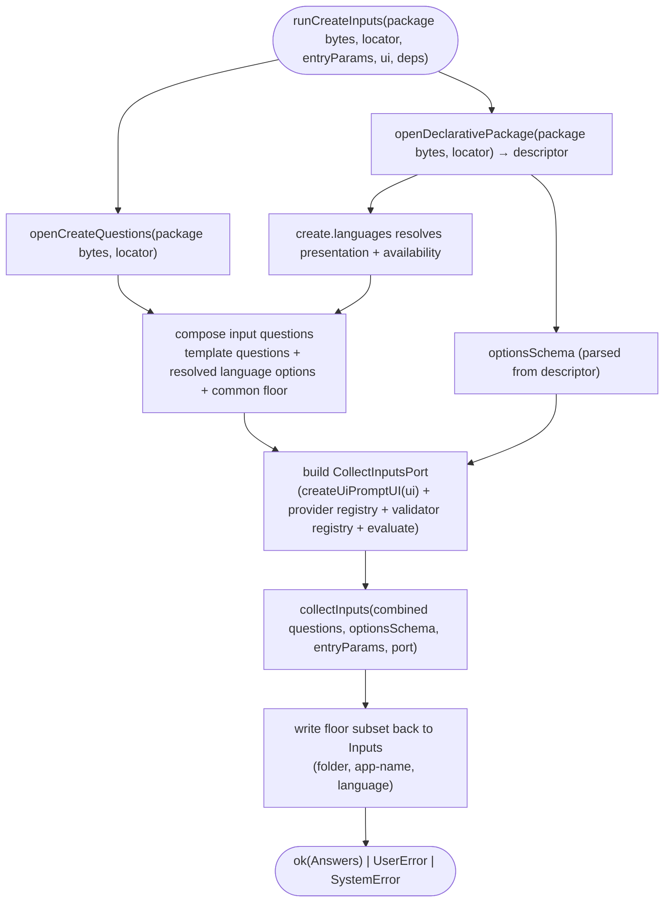

# Operation — `collect-create-inputs`

- **Status:** Accepted (design-first) — ready for tests
- **Domain:** [`01-scaffolding`](../../domains/01-scaffolding.md)
- **Decision source:** [ADR-0016](../../../02-architecture/adr/ADR-0016-declarative-template-format.md)
  (decision 2 `optionsSchema`, decision 5 language axis, decision 6 native
  `QuestionSpec` walked by a surface-neutral driver)
- **Upstream operations:** [`collect-inputs`](collect-inputs.md) (the pure
  questions → answers walk this composes) and
  [`open-template-package`](open-template-package.md) (the floor-zip read this
  reuses, plus the sibling `openCreateQuestions` for the `questions.json` entry)
- **PRD/scenario:** approved product scenario
  [`create-da-with-mcp-server.md`](../../../01-product/scenarios/da/create-da-with-mcp-server.md)
  and engineering scenario
  [`scenarios/da/create-mcp-server`](../../scenarios/da/create-mcp-server.md)

## Purpose

Run one create template's **Q2 + common create floor** over the host
`UserInteraction`, producing the v4 `Answers` and the caller floor needed by the
scaffold (`language`, `folder`, `app-name`). This is the live create caller of
the shared [`collect-inputs`](collect-inputs.md) question-walk engine: it loads
the authored `questions.json` and the `descriptor` (its `optionsSchema` +
`languages`) from caller-supplied package metadata bytes
(`templates-metadata.zip` in production, full `templates.zip` in tests), injects
the common create floor questions, builds a `CollectInputsPort` whose prompt face
is a thin adapter over the host's surface-neutral `UserInteraction`, and walks
the combined question set once.

It is the half of the front-loaded create funnel that comes **after** the engine
is decided. [`resolve-build-target`](resolve-build-target.md) picks the
`templateId` and the `v4` engine (Q1 / principle 1); this operation then asks the
v4 template's own follow-up questions plus the create floor through the shared
v4 question-walk engine — never the v3 question tree. A v4 route's template-local
Q2 remains authored once, in `questions.json`; the common create floor is
operation-owned and injected once, not repeated in every template.

## Boundary

The operation owns the **surface composition** for the create Q2 + common floor
and nothing else:

1. **The prompt bridge** — `createUiPromptUI(ui)` adapts the v4 `PromptUI`
   (`ask` / `askMulti`) onto the host `UserInteraction` (`selectOption` /
   `inputText` / `selectOptions`). It maps a v4 identity-only `OptionItem` to the
   surface option shape and projects the surface result back to the selected
   `id` string / `string[]`. For text questions with `validation`, it also maps
   the named validator registry entry to `InputTextConfig.validation`, using the
   current collected answers as validator context, so interactive hosts can
   reject invalid input before the scaffold runtime receives it.
2. **The port assembly** — build the `CollectInputsPort` from the prompt bridge,
   the engine-owned `optionsFrom` provider registry, the engine-owned validator
   registry, and the shared `evaluate-expression` evaluator (whitelist +
   injected feature-flag reader). The provider/validator implementations are
   registered extension points (`src/v4/providers/createOptionsProviders.ts`,
   `src/v4/validators/createInputValidators.ts`), not code owned by this surface
   adapter.
3. **The combined run** — load `questions.json` + the descriptor's
   `optionsSchema` / `languages` from the caller-supplied metadata/full-package
   bytes, prepend/append the operation-owned common floor questions (`folder` +
   `app-name`, plus the descriptor-bound `language` axis), then call
   `collect-inputs` once.
4. **The floor write-back** — copy the common floor answers back onto the host
   `Inputs` keys the scaffold and existing telemetry surfaces read
   (`QuestionNames.Folder`, `QuestionNames.AppName`, and the v4 `language`
   answer). This write-back is caller glue; the shared question-walk engine does
   not know about `Inputs`.

It does **not** decide routing (that is
[`resolve-build-target`](resolve-build-target.md)), does **not** ask Q1, does
**not** render or scaffold (that is `scaffoldDeclarativeFromV4Channel`), and adds
**no** question grammar — every `condition` / `optionsFromParams` is the shared
evaluator's (collect-inputs INV-6).

The default `optionsFrom` registry includes MCP server-type discovery, local MCP
server listing, MCP tool listing, and OpenAPI operation listing. Live local-server
detection is injected through the ODR listing dependency so tests can pass an
in-memory provider while production uses the default registry.

## Inputs

| Input          | Type                                                                | Origin                                                                                                                                                                                                                                                                                                                 |
| -------------- | ------------------------------------------------------------------- | ---------------------------------------------------------------------------------------------------------------------------------------------------------------------------------------------------------------------------------------------------------------------------------------------------------------------- |
| `packageBytes` | `Buffer` (injected)                                                 | `templates-metadata.zip` bytes from the staged artifact snapshot, or a full bundled-floor `templates.zip` in tests; injectable so the operation is CI-testable from an in-memory floor with no built artifact                                                                                                          |
| `locator`      | `DeclarativeLocator` (`{ kind, templateId }`)                       | the engine-decided create target (e.g. `{ kind:"create", templateId:"da/mcp-server" }`)                                                                                                                                                                                                                                |
| `entryParams`  | `Answers`                                                           | pre-filled answers — a CLI arg / URL seed, **or** the upstream `walk`'s Q1 dimension picks (`BuildTarget.answers`); a pre-filled question is used as-is, never prompted (collect-inputs INPUT-12)                                                                                                                      |
| `ui`           | `UserInteraction`                                                   | the host surface (`@microsoft/teamsfx-api`); the only non-v4 type, upstream of both worlds (INV-7 preserved)                                                                                                                                                                                                           |
| `deps`         | `{ optionsProvider?, flagReader?, surface? }` (injected, defaulted) | provider registry override (merged over the default `optionsFrom` provider registry, e.g. `mcp.serverTypes`, `mcp.localServers`, `mcp.tools`, `openapi.operations`) + feature-flag reader (default: env-backed) + the host `surface` (`vscode` / `cli` / `vs`, default `vscode`) that gates the `csharp` language axis |

## Outputs

`Promise<Result<Answers, FxError>>`:

- `ok(Answers)` — each asked question's value (scalar `string`, or `string[]` for
  a `multiSelect`) ∪ provider `derived.<id>.<key>`, ∪ the `entryParams` seed, ∪
  common create floor answers (`folder`, `app-name`, and `language` when the
  descriptor-bound language axis is recorded). The create caller writes the
  floor subset back to the host `Inputs` bag before scaffold.
- `UserError` — a user-fixable input failure (a `uri` that does not parse,
  surfaced as `INPUT_VALIDATION_FAILED`), a missing required non-interactive
  floor value, or a surface cancellation.
- `SystemError` — an engine-side break (a missing `questions.json` /
  `descriptor.json` in the floor, an unknown provider / validator, or a malformed
  common floor question definition).

## Acceptance Criteria

| ID      | Tier | Given                                                                                                                                                                                  | When                                                                        | Then                                                                                                                                                                                                                                                                                                                                                                                                                 |
| ------- | ---- | -------------------------------------------------------------------------------------------------------------------------------------------------------------------------------------- | --------------------------------------------------------------------------- | -------------------------------------------------------------------------------------------------------------------------------------------------------------------------------------------------------------------------------------------------------------------------------------------------------------------------------------------------------------------------------------------------------------------- |
| CCI-01  | L1   | the real shipped `da/mcp-server` (in-memory floor), the **remote-only** `mcp.serverTypes` provider, a scripted UI answering the url + `authType=none`                                  | `runCreateInputs`                                                           | `ok(Answers)` with `mcpServerType="remote"` (auto-selected by `skipSingleOption`, **not** prompted), `mcpServerUrl=<url>`, `authType="none"`, and `derived.mcp.serverTypes.catalog="{}"` from the empty local-server discovery                                                                                                                                                                                       |
| CCI-02  | L1   | the same template, one ODR discovery yielding local server launch specs, a scripted UI picking `local` and one or more local servers                                                   | `runCreateInputs`                                                           | `mcpServerType="local"` (prompted — two options, no auto-skip), remote URL/auth questions are **not** asked, `selectedLocalServers` preserves the selected ids, and `mcp.serverTypes` returns the discovered launch specs as `derived.mcp.serverTypes.catalog` for the post-render step; `mcp.localServers` reuses that cached discovery, so ODR runs once during the input walk                                     |
| CCI-02a | L1   | the same template with `entryParams.mcpServerType="remote"` plus the remote URL and auth type                                                                                          | `runCreateInputs`                                                           | the prefilled provider-backed answer is not prompted, `derived.mcp.serverTypes.catalog="{}"` is still produced, and ODR discovery is not called because no local server can be selected or materialized                                                                                                                                                                                                              |
| CCI-03  | L1   | `entryParams={ mcpServerUrl:<url> }`, remote-only provider, a scripted UI answering `authType=oauth`, client id, client secret, and optional scopes                                    | `runCreateInputs`                                                           | `mcpServerUrl` is taken from the seed (**not** prompted); after auth type the UI asks `oauthClientId`, `oauthClientSecret` (`password=true`), then optional `oauthScopes`, before the common create floor; all entered values are returned in `Answers`                                                                                                                                                              |
| CCI-03a | L1   | the same route with `authType=entra-sso` and a scripted Entra client id                                                                                                                | `runCreateInputs`                                                           | after auth type the UI asks only `entraClientId`, then continues to the common create floor; no client-secret or scopes question is asked                                                                                                                                                                                                                                                                            |
| CCI-03b | L1   | the same route with `authType=oauth-dynamic` or `authType=none`                                                                                                                        | `runCreateInputs`                                                           | no client-id, client-secret, or scopes question is asked or returned                                                                                                                                                                                                                                                                                                                                                 |
| CCI-03c | L1   | static OAuth or Entra SSO and an empty required credential value                                                                                                                       | `runCreateInputs`                                                           | the corresponding engine-registered MCP credential validator returns a localized required-input message and the walk returns `UserError(INPUT_VALIDATION_FAILED)`; `oauthScopes` remains optional                                                                                                                                                                                                                    |
| CCI-04  | L1   | remote-only provider, a scripted UI returning a non-uri (`"not a uri"`) for `mcpServerUrl`                                                                                             | `runCreateInputs`                                                           | `err` `UserError` named `INPUT_VALIDATION_FAILED` — the `uri` validator is wired into the port                                                                                                                                                                                                                                                                                                                       |
| CCI-05  | L1   | the `da/mcp-server` descriptor whose `languages=["common"]`                                                                                                                            | `runCreateInputs`                                                           | the create floor composer adds no language question; `Answers` carries no `language` key                                                                                                                                                                                                                                                                                                                             |
| CCI-06  | L1   | a `singleSelect` `QuestionSpec` + v4 `OptionItem[]`, a fake `UserInteraction`                                                                                                          | `createUiPromptUI(ui).ask(q, options)`                                      | `ui.selectOption` is called with the options mapped to the surface shape (`returnObject=false`); the chosen `id` is returned as a `string`                                                                                                                                                                                                                                                                           |
| CCI-07  | L1   | a `text` `QuestionSpec` (no options), a fake `UserInteraction`                                                                                                                         | `createUiPromptUI(ui).ask(q, undefined)`                                    | `ui.inputText` is called; the entered string is returned                                                                                                                                                                                                                                                                                                                                                             |
| CCI-08  | L1   | a `multiSelect` `QuestionSpec` + v4 `OptionItem[]`, a fake `UserInteraction`                                                                                                           | `createUiPromptUI(ui).askMulti(q, options)`                                 | `ui.selectOptions` is called; the selected `id`s are returned as a `string[]`                                                                                                                                                                                                                                                                                                                                        |
| CCI-09  | L1   | the in-memory floor                                                                                                                                                                    | `openCreateQuestions(floor, { kind:"create", templateId:"da/mcp-server" })` | `ok([mcpServerType, mcpServerUrl, selectedLocalServers, authType, oauthClientId, oauthClientSecret, oauthScopes, entraClientId])`; credential questions carry the CCI-03 conditions/password/optional/validator metadata; an unknown `templateId` is a `SystemError` named `PackageFileMissing`                                                                                                                      |
| CCI-10  | L1   | a `singleSelect` `QuestionSpec`, a fake `UserInteraction` whose `selectOption` returns `{ type: "back" }`                                                                              | `createUiPromptUI(ui).ask(q, options)`                                      | the host `back` is projected to `ok({ kind: "back" })` (collect-inputs INPUT-16)                                                                                                                                                                                                                                                                                                                                     |
| CCI-11  | L1   | a `text` `QuestionSpec`, a fake `UserInteraction` whose `inputText` returns `{ type: "back" }`                                                                                         | `createUiPromptUI(ui).ask(q, undefined)`                                    | the host `back` is projected to `ok({ kind: "back" })`                                                                                                                                                                                                                                                                                                                                                               |
| CCI-12  | L1   | a `multiSelect` `QuestionSpec`, a fake `UserInteraction` whose `selectOptions` returns `{ type: "back" }`                                                                              | `createUiPromptUI(ui).askMulti(q, options)`                                 | the host `back` is projected to `ok({ kind: "back" })`                                                                                                                                                                                                                                                                                                                                                               |
| CCI-13  | L1   | a `singleSelect` `QuestionSpec`, a caller-supplied `step`                                                                                                                              | `createUiPromptUI(ui).ask(q, options, 2)`                                   | the `step` is threaded onto the host `SingleSelectConfig` (the Back-button gate), so the host shows Back past the first prompt                                                                                                                                                                                                                                                                                       |
| CCI-14  | L1   | a descriptor language list containing `csharp`, `surface="vscode"` (the VS Code extension)                                                                                             | `gateLanguagesBySurface(languages, surface, flagReader)`                    | `csharp` is dropped regardless of `TEAMSFX_CLI_DOTNET` — the VS Code extension never scaffolds C# (mirrors v3, whose template metadata carries no `csharp`)                                                                                                                                                                                                                                                          |
| CCI-15  | L1   | a language list containing `csharp`, `surface="cli"` / `"vs"`                                                                                                                          | `gateLanguagesBySurface(...)`                                               | `csharp` is kept only when `flagReader("TEAMSFX_CLI_DOTNET")` is true (mirrors v3 CLI `listTemplates` / `create`); with the flag off it is dropped                                                                                                                                                                                                                                                                   |
| CCI-16  | L1   | a language list with no `csharp` (e.g. `["typescript","javascript"]` / `["common"]`)                                                                                                   | `gateLanguagesBySurface(...)`                                               | the list passes through unchanged, order preserved — the gate only ever removes `csharp`                                                                                                                                                                                                                                                                                                                             |
| CCI-17  | L1   | a VS Code Teams Agents and Apps template descriptor language list containing `python`; and a non-Teams descriptor language list containing `python`                                    | `runCreateInputs` asks the language axis                                    | the Teams Agents and Apps Python language option keeps label `Python` and carries the localized `Preview` description, matching the v3 Teams Agents and Apps language picker; the non-Teams Python language option has no `Preview` description                                                                                                                                                                      |
| CCI-18  | L1   | the real shipped `da/graph-connector` (in-memory floor), a scripted UI answering connector name + connection id                                                                        | `runCreateInputs`                                                           | `ok(Answers)` with `graphConnectorName` and `graphConnectorConnectionId`; both validators are wired into the port                                                                                                                                                                                                                                                                                                    |
| CCI-19  | L1   | the same template, a scripted UI returning a reserved Microsoft Graph external connection id prefix                                                                                    | `runCreateInputs`                                                           | `err` `UserError` named `INPUT_VALIDATION_FAILED` — the graph connector connection-id validator is wired into the port                                                                                                                                                                                                                                                                                               |
| CCI-20  | L1   | the real shipped standalone `graph-connector` (in-memory floor), a scripted UI answering connector name + connection id                                                                | `runCreateInputs`                                                           | `ok(Answers)` with `language="typescript"`, `graphConnectorName`, and `graphConnectorConnectionId`; the TypeScript-only package owns its Q2 questions instead of falling back to v3                                                                                                                                                                                                                                  |
| CCI-21  | L1   | the DA+MCP v4 route, a scripted UI answering template questions and then `folder` + `app-name` in the same create-input walk                                                           | `runCreateInputs`                                                           | `ok(Answers)` includes the template answers plus `folder` and `app-name`; the caller writes the floor answers to the host `Inputs` bag before scaffold, with no separate `collectCreateFloor` prompt engine                                                                                                                                                                                                          |
| CCI-22  | L1   | the same route, a scripted UI that cancels on `folder` or `app-name`                                                                                                                   | `runCreateInputs`                                                           | `err` is the cancellation `UserError` propagated unchanged; the front door does not scaffold                                                                                                                                                                                                                                                                                                                         |
| CCI-23  | L1   | `entryParams` already contains `folder`, `app-name`, or `language`                                                                                                                     | `runCreateInputs`                                                           | those common floor values are used as pre-filled answers and are not prompted again; validation/bounds checking still happens in the shared walk                                                                                                                                                                                                                                                                     |
| CCI-24  | L1   | an interactive text question with a registered validator (`mcpServerUrl` or common-floor `app-name`) and earlier answers that the validator depends on                                 | `runCreateInputs`                                                           | the prompt bridge passes a validation callback to `inputText`, bound to the current answers, so invalid text can be rejected during collection rather than only later at scaffold runtime                                                                                                                                                                                                                            |
| CCI-25  | L1   | the DA+MCP v4 route, a caller-supplied `baseStep` (Q1's `promptCount`) and `backable: true`                                                                                            | `runCreateInputs`                                                           | the values are threaded onto the shared walk, so the **first** Q2/floor prompt shows a Back button (`step > 1`, collect-inputs INPUT-20) and a `back` at it returns a typed `{ kind:"back" }` outcome to the front door instead of cancelling the create (INPUT-21); the operation adds no back logic of its own                                                                                                     |
| CCI-26  | L1   | two `runCreateInputs` calls under **different** `locator.templateId`s (a Q1 re-pick from `da/mcp-server` to `da/no-action`)                                                            | `runCreateInputs`                                                           | each call re-opens `questions.json` + `descriptor` for its own `templateId` and rebuilds Q2 + the descriptor-bound `language` axis + common floor from scratch, holding no state from the other call — the Q2+Q3 set is a pure function of the current `locator`, so a Q1 re-pick that changes the template yields the new template's questions and discards the prior template's answers with no invalidation logic |
| CCI-27  | L1   | a `skipSingleOption` singleSelect with a single option, a fake `UserInteraction` whose `selectOption` returns `{ type: "skip" }`                                                       | `createUiPromptUI(ui).ask(q, options)`                                      | the host skip is projected to `ok({ kind: "skip", value })` so the shared walk records the answer without a back-stop (collect-inputs INPUT-24)                                                                                                                                                                                                                                                                      |
| CCI-28  | L1   | the real `da/mcp-server` (remote-only `mcp.serverTypes`, so `mcpServerType` auto-skips), a caller `baseStep` + `backable`, and a `back` at the first _visible_ prompt (`mcpServerUrl`) | `runCreateInputsWalk`                                                       | the auto-skipped `mcpServerType` leaves no history, so the `back` returns `{ kind:"back" }` to the front door (re-enters Q1) instead of re-asking the skipped question, and `mcpServerUrl` is shown at `baseStep + 1`                                                                                                                                                                                                |

### Clean engine ownership (ADR-0023)

[ADR-0023](../../../02-architecture/adr/ADR-0023-create-input-policy-ownership.md)
places language presentation in optional `descriptor.languageOptions` and C#
availability/default labels in the registered `create.languages` provider. The
common floor consumes resolved options and retains its existing cardinality,
prefill, and Back semantics. Raw presentation strings can be existing NLS keys.

The OpenAPI operations provider declares the source it parsed as
`derived.openapi.operations.apiSpecLocation`. New DA OpenAPI metadata binds this
value to its pipeline. Search question names remain unchanged; the post-walk
top-level `apiSpecLocation` alias is no longer synthesized by the surface.
The output itself has a `6.12.0` introduction floor, checked when a template
consumes it. A named runtime compatibility adapter preserves pre-6.12 DA search
render bindings without mutating answers or overriding an explicit source.

| ID | Runtime | Purpose | Gate | Harness | Given / When | Then |
| --- | --- | --- | --- | --- | --- | --- |
| CLEAN-01 | L1 | operation-integration | required | synthetic metadata + UI | Arbitrary template ID declares presentation | Metadata controls labels/descriptions; a known ID without metadata receives no special presentation. |
| CLEAN-02 | L1 | operation-integration | required | package validation | Duplicate, undeclared, or malformed presentation overrides | Reject before prompting; the overrides cannot expand descriptor languages. |
| CLEAN-03 | L1 | operation-integration | required | language provider | Surface and .NET flag combinations | Preserve CCI-14..16 availability and order, with default labels and ID fallback. |
| CLEAN-04 | L1 | compatibility | required | common floor + UI | Common, singleton, multiple, prefilled, and Back paths | Preserve existing floor cardinality, defaults, question order, and Back behavior. |
| CLEAN-05 | L1 | operation-integration | required | OpenAPI provider | Successful operation listing | Return the actual source in the declared derived output; catalog parity holds. |
| CLEAN-06 | L1 | compatibility | required | input walk + scaffold | Search and select operations | Preserve question/CLI names and generated artifacts using the provider-derived source, without a surface repair; legacy bindings generate byte-identical files and leave answers unchanged. |
| CLEAN-07 | L1 | compatibility | required | metadata loading | New metadata and packages without overrides | Enforce the 6.12.0 floor for new presentation and consumption of the new derived source, without raising the old operation-listing floor; default old presentation and migrated template localization are explicit. |

## Flow

## Invariants

- **INV-1** — The prompt bridge and the orchestrator are v4-owned; they import no
  v3 symbol. `UserInteraction` is `@microsoft/teamsfx-api` (upstream of both
  worlds), not v3, so INV-7 holds.
- **INV-2** — The template-local Q2 questions are the authored `questions.json`
  walked by the surface-neutral driver, and the common floor questions are
  operation-owned normalized `QuestionSpec`s in the same walk. Neither is ever
  rehydrated into a v3 `IQTreeNode` (ADR-0016 decision 6 / collect-inputs INV-1).
  A `questions` array item may also be a `{ "use": "<name>" }` reference to a
  shared fragment under `v4/_shared/questions/<name>.json`; the loader splices the
  fragment's own `questions` in place (recursively; bare-name / cycle guarded) so
  the walk always sees one flat `QuestionSpec[]`. This is authoring-time reuse
  only (e.g. the `llm-service` fragment shared by the custom-copilot / CEA
  templates) — it changes neither the resolved questions nor any behavior.
- **INV-3** — A v4 identity-only `OptionItem` carries no configuration payload
  across the bridge (no v3 `option.data`); only its `id` round-trips
  (collect-inputs INV-2).
- **INV-4** — The feature-flag reader is injected; v4 imports no
  `featureFlagManager`. The default reads `process.env`.
- **INV-5** — The package bytes are injectable, so the operation is CI-testable
  from an in-memory floor built from the loose `templates/v4` source — no built
  `templates.zip` artifact required.
- **INV-6** — The bridge threads the caller's 1-based `step` onto each host config
  (the Back-button gate), projects a host `back` result to `{ kind: "back" }`, and
  projects a host `skip` (an auto-selected `skipSingleOption`) to `{ kind: "skip" }`,
  so [`collect-inputs`](collect-inputs.md) drives back navigation and
  skip-transparency surface-neutrally (CCI-10..13, CCI-27..28 / INPUT-16..19,
  INPUT-24).
- **INV-6a** — MCP credential questions are template data, and their non-empty
  checks are named validators. Static OAuth collects client id, masked client
  secret, and optional scopes; Entra SSO collects only client id; dynamic OAuth,
  `none`, and local MCP collect none. The generic create-input walk contains no
  MCP-specific branch.
- **INV-7** — The `csharp` language axis is gated by `surface` + the injected
  `TEAMSFX_CLI_DOTNET` reader **before** the create floor composer builds the language question
  (CCI-14..16): the VS Code extension never offers C#, the CLI / VS surfaces offer
  it only under the flag. The gate only removes `csharp`; every other language is
  untouched. This is the v4 mirror of v3's platform gating (C# templates live on
  `Platform.VS`, which the CLI selects only when `CLIDotNet` is on).
- **INV-8** — Q2 and the common create floor are one input walk. `folder` /
  `app-name` are not collected by a second front-door prompt seam after Q2; they
  participate in the same prefill, back/cancel, non-interactive, validation, and
  answer-merge semantics as template questions.
- **INV-9** — Provider and validator implementations are registered extension
  points. This surface adapter composes the registries into `CollectInputsPort`
  and may accept injected overrides for tests or live providers, but concrete
  implementations such as MCP tools, OpenAPI operations, and Graph connector
  validators live in dedicated provider/validator files, parallel to pipeline
  step implementations.
- **INV-10** — Tests are layered at the same boundary as the operation. Most
  Q2/common-floor behavior is tested with synthetic metadata or direct
  [`collect-inputs`](collect-inputs.md) fixtures plus fake registries; concrete
  MCP/OpenAPI/Graph provider and validator behavior is tested in the dedicated
  provider/validator test files. Real `templates/v4` package bytes are used only
  for focused integration checks such as descriptor/question loading and the
  default registry wiring, and may be shared across tests in that file because
  package bytes are immutable input.
- **INV-11** — Q2+Q3 are stateless-rebuilt per call; back navigation is threaded,
  not owned. `runCreateInputs` derives the entire Q2 + `language` + common-floor
  question set from `locator` + the loaded descriptor on every call, holding no
  cross-call state, so the front door's re-entry loop (dispatch-create-by-engine
  INV-10) produces the correct new Q2+Q3 for a changed `BuildTarget` with no
  invalidation logic (CCI-26). The operation only threads the caller's `baseStep`
  / `backable` / typed `{ kind:"back" }` outcome through to the shared
  [`collect-inputs`](collect-inputs.md) engine (collect-inputs INV-9); it
  implements no back-stack of its own.

## Notes

- `openCreateQuestions` is the `questions.json` sibling of
  `openDeclarativePackage` (which reads only `descriptor.json` / `pipeline.json` /
  `content/**`). It locates the same `v4/<kind>/<templateId>/` subtree and parses
  the `{ questions: QuestionSpec[] }` envelope; a structural type guard narrows
  the parsed JSON with no `as` cast, deferring full field validation to the
  build-time `validate-template-package`.
- The bridge supports the question kinds the create templates and common floor
  use today — `singleSelect` / `text` via `ask`, `multiSelect` via `askMulti`,
  and the common floor's folder/app-name prompts through the same prompt bridge.
  Other kinds (`confirm` / `singleFile` / `singleFileOrText`) are an explicit
  `SystemError` until a template needs them, rather than a silent mismatch.
- Local-server Q2 uses the `mcp.serverTypes` and `mcp.localServers` providers
  backed by the injected ODR listing dependency. The provider implementation is
  tested directly, while `runCreateInputs` tests focus on registry wiring and
  question-walk behavior.
- **Q1 answers seed Q2.** The upstream `walk`
  ([`resolve-build-target`](resolve-build-target.md) /
  [`walk-create-selector`](walk-create-selector.md)) surfaces its Q1 dimension
  picks as `BuildTarget.answers`; the create front door passes them straight in
  as `entryParams`, so a Q2 question whose `name` collides with a Q1 dimension is
  taken from the pick and never re-asked (INPUT-12) — the same
  skip-already-answered linkage the v3 visitor gives the v3 path. No translation
  happens here: the picks are the selector's neutral keys, and a v4 Q2 question
  reading one (rare today) reads it by that key.
- **The `language` axis lives here (ADR-0014 Amendment 2).** Routing
  ([`resolve-build-target`](resolve-build-target.md)) resolves no language; the
  resolved template's `descriptor.languages` is the option range of the Q0
  `language` question this operation composes into the `questions` array before
  calling [`collect-inputs`](collect-inputs.md) (CCI-05 / INPUT-13, ADR-0016 decision 5).
  A single-language template (`["common"]`) auto-skips it — the shipped
  `da/mcp-server` never prompts and the scaffolder falls back to `common`; a
  pre-filled `language` in `entryParams` is used-as-is (INPUT-12).
- **C# is surface- + flag-gated (INV-7, CCI-14..16).** Before the language range
  reaches [`collect-inputs`](collect-inputs.md), `gateLanguagesBySurface` filters
  `csharp` out unless `surface !== "vscode"` **and** the injected
  `TEAMSFX_CLI_DOTNET` reader is on. So the VS Code extension never scaffolds C#
  (its resolved `surface` is `vscode`), while the CLI and the VS surface expose C#
  only under the flag — the v4 mirror of v3, where the C# templates live on
  `Platform.VS` and the CLI switches to them only when `CLIDotNet` is set
  (`listTemplates` / `create`). The `surface` is resolved once in the create front
  door (`surfaceOf(inputs.platform)`) and injected; the gate itself imports no v3
  symbol and no `featureFlagManager` (INV-1 / INV-4).
