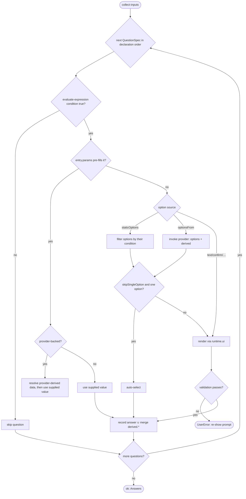

# Operation — `collect-inputs`

- **Status:** Accepted (Decision source [ADR-0016](../../../02-architecture/adr/ADR-0016-declarative-template-format.md) Accepted 2026-06-08) — ready for tests
- **Domain:** [`01-scaffolding`](../../domains/01-scaffolding.md)
- **Decision source:** [ADR-0016](../../../02-architecture/adr/ADR-0016-declarative-template-format.md)
  decisions 2 (`optionsSchema`), 6 (native
  `QuestionSpec`, `OptionItem` identity-only, `staticOptions` xor `optionsFrom`,
  `skipSingleOption`, `validation` shorthand). Question / option `condition` and
  `optionsFromParams` **reference** the shared evaluator
  ([`evaluate-expression`](evaluate-expression.md)); this spec does not restate
  the grammar.
- **Seam:** [`scaffolding.create.proposal.md` §4](../../../02-architecture/scaffolding.create.proposal.md),
  §4.2 (native `QuestionSpec`, no `IQTreeNode` rehydration), §3.3.2
  (`optionsFrom` providers + `derived.<id>.<key>`), §6.4 (validators)
- **PRD/scenario:** the create / modify MCP scenarios drive this surface
  end-to-end —
  [`scenarios/da/create-mcp-server.md`](../../scenarios/da/create-mcp-server.md),
  [`scenarios/da/add-mcp-server.md`](../../scenarios/da/add-mcp-server.md);
  product flows [`create-da-with-mcp-server.md`](../../../01-product/scenarios/da/create-da-with-mcp-server.md),
  [`add-mcp-action-to-da.md`](../../../01-product/scenarios/da/add-mcp-action-to-da.md).

## Purpose

Walk a normalized `QuestionSpec[]` — applying question and option `condition`,
resolving `staticOptions` / `optionsFrom` providers, honoring
`skipSingleOption` and pre-filled `entry.params`, and validating each answer —
into the **resolved answer object** the caller consumes. This is the shared
question-walk engine: Q1 selector adapters and Q2+common-floor create-input
adapters feed it different question sources, but the walking semantics are
implemented once.

For template-local Q2, it realizes ADR-0016 decision 6: the authored
`questions.json` fields **are** the runtime model (§4.2), parsed straight into a
`QuestionSpec[]` a surface-neutral driver renders through `runtime.ui`, with
**no** rehydration into v3's `IQTreeNode` tree and no `func` / `onDidSelection`
callbacks that could change a question's shape at runtime. For Q1 and common
create floor questions, adapters project their source data into the same
normalized question shape before invoking this engine.

This is **one** behavior — questions → answers — distinct from route dispatch,
floor write-back, and [`build-render-context`](build-render-context.md)
(answers → render vars) even though those callers also use the shared evaluator.
It does **not** compute a `BuildTarget`, compute render variables, mutate
`Inputs`, or write files.

## Inputs

| Input           | Type                                                    | Origin                                                                                                                                                                                                                                |
| --------------- | ------------------------------------------------------- | ------------------------------------------------------------------------------------------------------------------------------------------------------------------------------------------------------------------------------------- |
| `questions`     | normalized `QuestionSpec[]`                             | an adapter-owned source: `selector.json` Q1 dimensions, a template's `questions.json`, or common create floor questions injected by the create caller (including a descriptor-derived `language` question when that caller needs one) |
| `optionsSchema` | the answer JSON Schema (validation + identifier domain) | usually `descriptor.optionsSchema` (ADR-0016 decision 2); selector/common-floor callers may supply a narrow schema for their normalized question set                                                                                  |
| `entryParams`   | pre-filled answer ids / strings                         | CLI args, URL seeds, Q1 answers seeding Q2, or caller-provided floor values (`folder` / `app-name`)                                                                                                                                   |
| `port`          | `CollectInputsPort`                                     | injected; an in-memory fake in tests                                                                                                                                                                                                  |

The narrow port (interface-segregation over the full `ScaffoldRuntime`):

| Port face         | Shape                                                     | Responsibility                                                                                                                                                                                                                  |
| ----------------- | --------------------------------------------------------- | ------------------------------------------------------------------------------------------------------------------------------------------------------------------------------------------------------------------------------- |
| `ui`              | the surface-neutral prompt driver (`ScriptedUI` in tests) | renders a `QuestionSpec` across `vscode`/`cli`/`vs`/`server` (proposal §4.2 / §8)                                                                                                                                               |
| `optionsProvider` | `(providerId) => Provider \| undefined`                   | the engine's `optionsFrom` provider registry (§3.3.2), each carrying `paramsSchema` / `derivedSchema`; concrete providers live in dedicated extension-point files and are registered by id                                      |
| `validator`       | `(name) => Validator \| undefined`                        | the engine validator registry (§6.4), shared by Q1 selector and Q2+common-floor create-input callers; concrete validators live in dedicated extension-point files and are registered by id; the `"uri"` shorthand resolves here |
| `evaluate`        | `(expr, scope) => Result<boolean\|string>`                | the shared evaluator ([`evaluate-expression`](evaluate-expression.md)) for `condition` / `optionsFromParams`                                                                                                                    |
| `http`            | read-only fetch                                           | provider I/O only; `InMemoryRuntime` in tests (§3.3.2 rule 3)                                                                                                                                                                   |

## Outputs

A `Result<Answers, FxError>`:

| Field (ok) | Meaning                                                                                                                                                                                   |
| ---------- | ----------------------------------------------------------------------------------------------------------------------------------------------------------------------------------------- |
| `answers`  | the resolved answer object: each asked question's value ∪ provider `derived.<provider-id>.<key>` — exactly the `answers` input [`build-render-context`](build-render-context.md) consumes |

On `err`:

- **`UserError`** for an input-side, user-fixable violation: a `validation`
  failure (e.g. a non-URI `mcpServerUrl`), or a required non-interactive option
  missing. The error names the offending question so the fix is unambiguous. A
  host `back` past the first prompt cancels the walk with a `UserError` named
  `InputWalkCancelled` (INPUT-18).
- **`SystemError`** for an engine-side break: an `optionsFrom` naming a provider
  absent from the whitelist, a `condition` / `optionsFromParams` the evaluator
  rejects, or a forward `derived.<id>.<key>` reference (declared before its
  producing provider) — each should have been caught by
  [`validate-template-package`](validate-template-package.md) at build time.

## Acceptance Criteria

| ID       | Tier | Given                                                                                                                                                                                                                                                            | When          | Then                                                                                                                                                                                                                                                                                                                                                                 |
| -------- | ---- | ---------------------------------------------------------------------------------------------------------------------------------------------------------------------------------------------------------------------------------------------------------------- | ------------- | -------------------------------------------------------------------------------------------------------------------------------------------------------------------------------------------------------------------------------------------------------------------------------------------------------------------------------------------------------------------- |
| INPUT-01 | L1   | `mcpServerUrl` with `condition: { expr: "mcpServerType == 'remote'" }`, `answers.mcpServerType = "local"`                                                                                                                                                        | collect       | the **whole question** is skipped (not asked); no `mcpServerUrl` answer is recorded                                                                                                                                                                                                                                                                                  |
| INPUT-02 | L1   | the `authType` `oauth-dynamic` option with `condition: { expr: "featureFlag('TEAMSFX_MCP_FOR_DA_DT') && featureFlag('TEAMSFX_MCP_FOR_DA_DCR')" }`, flags off                                                                                                     | collect       | **only that one option** is hidden; `authType` is still asked with its other options (option-level vs question-level `condition`)                                                                                                                                                                                                                                    |
| INPUT-03 | L1   | a question declaring **both** `staticOptions` and `optionsFrom`                                                                                                                                                                                                  | load          | rejected (schema `not.required` both) — exactly one option source per question (decision 6)                                                                                                                                                                                                                                                                          |
| INPUT-04 | L1   | `mcpServerType` with `skipSingleOption: true` whose provider returns a single option (`remote`)                                                                                                                                                                  | collect       | the sole option is **auto-selected** without prompting (proposal §3.3.2 / §4)                                                                                                                                                                                                                                                                                        |
| INPUT-05 | L1   | a question with `optionsFrom: "mcp.serverTypes"`                                                                                                                                                                                                                 | collect       | the named engine provider is invoked through `port.optionsProvider`; its `{ options, derived }` is returned (identity-only options)                                                                                                                                                                                                                                  |
| INPUT-06 | L1   | `optionsFromParams: { specLocation: { from: "apiSpecLocation" } }`                                                                                                                                                                                               | collect       | the param closes over the answer via the shared evaluator ([`evaluate-expression`](evaluate-expression.md)) — the **same** `{from}/{expr}` forms as `condition`, no new surface                                                                                                                                                                                      |
| INPUT-07 | L1   | a provider returning `derived: { apiAuthData: … }` declared in its `derivedSchema`                                                                                                                                                                               | collect       | the value is merged under the reserved `derived.<provider-id>.<key>` namespace; two providers cannot collide by construction (§3.3.2 rules 2, 6)                                                                                                                                                                                                                     |
| INPUT-08 | L1   | a question whose `optionsFromParams` reads `derived.<id>.<key>` from a provider declared **later**                                                                                                                                                               | load          | **loader-rejected** (forward reference) — providers resolve in declaration order (§3.3.2 rule 7)                                                                                                                                                                                                                                                                     |
| INPUT-09 | L1   | a provider invoked twice with the same `(providerId, normalize(params))` in one run                                                                                                                                                                              | collect       | the second call returns the first's cached `{ options, derived }` without re-`fetch` (idempotent within a run, §3.3.2 rule 5)                                                                                                                                                                                                                                        |
| INPUT-10 | L1   | `validation: "uri"` on `mcpServerUrl`, a non-URI input                                                                                                                                                                                                           | collect       | the loader normalizes the shorthand string to `{ use: "uri" }`; validation fails with a **`UserError`** naming the question; the prompt is re-shown (interactive)                                                                                                                                                                                                    |
| INPUT-11 | L1   | `mcpServerType`'s `local` option gated on `odr.exe` being installed                                                                                                                                                                                              | collect       | the machine-state probe is the `mcp.serverTypes` **provider**, never a `condition` predicate — the evaluator stays pure (proposal §3.3.2 rule 8)                                                                                                                                                                                                                     |
| INPUT-12 | L1   | the modify `add-mcp-server` with `entry.params = ["mcpServerUrl"]` and a pre-filled URL                                                                                                                                                                          | collect       | the `mcpServerUrl` question is skipped (its `condition: { expr: "mcpServerUrl == null" }` is false); the supplied value is used (conformance fixture)                                                                                                                                                                                                                |
| INPUT-13 | L1   | the caller includes a normalized `language` `singleSelect` question, or pre-fills `language` in `entryParams`                                                                                                                                                    | collect       | `language` behaves like any other question: it is asked in declaration order, pre-filled values skip it, and a caller that wants no language axis simply omits the question                                                                                                                                                                                          |
| INPUT-14 | L1   | identical `(questions, optionsSchema, scripted answers, provider state)`                                                                                                                                                                                         | collect twice | identical `answers` — deterministic under `InMemoryRuntime` + `ScriptedUI`                                                                                                                                                                                                                                                                                           |
| INPUT-15 | L1   | a `multiSelect` question (`staticOptions` or `optionsFrom`) and a scripted selection of ≥1 option ids                                                                                                                                                            | collect       | the answer is recorded as a **`string[]`** of the selected ids, order-preserving; every other kind (`singleSelect` / `text` / …) records a scalar `string`. The list is available to [`build-render-context`](build-render-context.md) `{from}` and step `with`, but is **not** placed in the scalar expression `scope` (INV-7)                                      |
| INPUT-16 | L1   | two prompted questions, the host returns `back` at the second                                                                                                                                                                                                    | collect       | the walk re-asks the **previous** prompted question; the stale second answer is discarded and the re-pick wins. `step` = prompts shown so far + 1, so the first prompt is step 1 (no Back button) and the second is step 2                                                                                                                                           |
| INPUT-17 | L1   | a caller-provided `language` question after one earlier prompted question, and the host returns `back` at `language`                                                                                                                                             | collect       | `back` crosses into the previous prompted question; the re-picked previous answer wins, then `language` is asked again                                                                                                                                                                                                                                               |
| INPUT-18 | L1   | a single prompted question, the host returns `back` at it (the first prompt)                                                                                                                                                                                     | collect       | the walk is cancelled with a **`UserError`** named `InputWalkCancelled` (a `back` past the first prompt — unreachable via UI, where step 1 shows no Back button)                                                                                                                                                                                                     |
| INPUT-19 | L1   | a `singleSelect` then a `multiSelect`, the host returns `back` at the multiSelect                                                                                                                                                                                | collect       | the previous question is re-asked and the staged multi-select is discarded; the re-walk records the new `string[]` (the multi-pick face honours `back` too)                                                                                                                                                                                                          |
| INPUT-20 | L1   | a `baseStep` offset of `N` and two prompted questions                                                                                                                                                                                                            | walkInputs    | the shown `step` for the k-th prompted question is `N + (prompts shown so far) + 1`, so with `N ≥ 1` the **first** prompted question is `step ≥ 2` and the host shows a Back button on it — the create funnel's Q2 continues Q1's step numbering instead of restarting at 1                                                                                          |
| INPUT-21 | L1   | `backable: true`, a single prompted question, the host returns `back` at it (the first prompt)                                                                                                                                                                   | walkInputs    | the walk does **not** cancel; it returns a typed `{ kind: "back" }` outcome carrying the walk `history`, so the caller can hand control to the previous phase. With `backable: false` (the default) the same `back` still cancels with `InputWalkCancelled` (INPUT-18 unchanged)                                                                                     |
| INPUT-22 | L1   | a `resume` of a prior walk's returned `history` (a re-entered phase)                                                                                                                                                                                             | walkInputs    | the walk restores that history and re-asks its **last** prompted question; a subsequent `back` pops the retained history exactly as if it had been built in-process (a resumed phase's back reaches every prompt the previous run recorded), and a `back` past the retained history's first entry follows the `backable` rule (typed `back` or `InputWalkCancelled`) |
| INPUT-23 | L1   | `mcpServerType` is pre-filled as `local` and declares `optionsFrom: "mcp.serverTypes"` whose provider returns a derived catalog                                                                                                                                  | collect       | the question is not prompted, but the provider still resolves once and its catalog is merged as `derived.mcp.serverTypes.catalog` for downstream render and pipeline consumers                                                                                                                                                                                       |
| INPUT-24 | L1   | a question the surface auto-skips (the prompt driver returns `{ kind: "skip" }`, e.g. a `skipSingleOption` provider question resolved to a single option), then a `back` at the next prompt                                                                      | walkInputs    | the skipped question's answer is **recorded** but pushes **no** history, so the `back` crosses straight over it (matching the engine's static `skipSingleOption` skip) — it re-asks the previous _prompted_ question, or crosses into the previous phase / cancels when none remain; the skipped step consumes no `step` number                                      |
| INPUT-25 | L1   | a provider's returned `derived` keys differ from its source-owned `derivedSchema`                                                                                                                                                                                | collect       | `SystemError` names the missing or undeclared key; only an exact schema match enters the reserved `derived.<provider-id>.<key>` namespace                                                                                                                                                                                                                            |
| INPUT-26 | L1   | a pre-filled `singleSelect` answer does not name one of the question's currently visible static options                                                                                                                                                          | collect       | rejected with an `InputValidationFailed` `UserError` naming the question; pre-filled answers do not bypass the authored option contract                                                                                                                                                                                                                              |
| INPUT-27 | L1   | a pre-filled provider-backed `multiSelect` contains an id absent from the provider's resolved options                                                                                                                                                            | collect       | rejected with an `InputValidationFailed` `UserError` naming the question; every selected id is checked after provider resolution and before provider-derived data is committed                                                                                                                                                                                       |
| INPUT-28 | L1   | non-interactive mode uses a `singleSelect` default that is absent from the question's currently visible options                                                                                                                                                  | collect       | rejected with an `InputValidationFailed` `UserError`; authored defaults pass the same option-membership gate as prompted and pre-filled answers                                                                                                                                                                                                                      |
| INPUT-29 | L1   | `entry.params` pre-fills a scalar answer that fails the applicable question declaration's named validator, including when a unique declaration's condition becomes false because the value is pre-filled or when one of several same-name declarations is active | collect       | rejected with an `InputValidationFailed` `UserError` naming the question; condition-based prompt skipping does not bypass validation of the supplied answer. A validator belongs to its declaration: inactive same-name branches do not validate alternate input modes (for example, a URL validator does not reject a file-path branch).                            |
| INPUT-30 | L1   | non-interactive mode uses a scalar default that fails the question's named validator                                                                                                                                                                             | collect       | rejected with an `InputValidationFailed` `UserError` before the default enters the answer set                                                                                                                                                                                                                                                                        |
| INPUT-31 | L1   | a thin prompt driver returns a scalar answer without executing the supplied validation callback, and the value fails the named validator                                                                                                                         | collect       | the walk's authoritative post-prompt validation rejects it with an `InputValidationFailed` `UserError`                                                                                                                                                                                                                                                               |
| INPUT-32 | L1   | a thin prompt driver returns a `singleSelect` id absent from the question's currently visible static options                                                                                                                                                     | collect       | the walk's authoritative option-membership validation rejects it with an `InputValidationFailed` `UserError`                                                                                                                                                                                                                                                         |
| INPUT-33 | L1   | a thin prompt driver returns a provider-backed `multiSelect` containing an id absent from the resolved options                                                                                                                                                   | collect       | the walk rejects the whole selection with an `InputValidationFailed` `UserError` before provider-derived data or the answer is committed                                                                                                                                                                                                                             |
| INPUT-34 | L1   | non-interactive mode uses a provider-backed `singleSelect` default absent from the provider's resolved options                                                                                                                                                   | collect       | rejected with an `InputValidationFailed` `UserError`; a valid provider-backed default resolves and merges the provider's declared derived data before continuing                                                                                                                                                                                                     |
| INPUT-35 | L1 | A synthetic provider declares derived data and scalar/multi answers arrive by prefill, non-interactive default, or prompt | collect | All paths validate option membership and merge identical derived data exactly once; only actual prompts enter history. Runtime L1, purpose operation-integration, gate required, harness synthetic provider + scripted UI. |
| INPUT-36 | L1 | A static singleton is auto-selected for a scalar or multi-select question | collect | Scalar validators remain authoritative, and multi-select retains string[] shape without a history entry. Runtime L1, purpose operation-integration, gate required, harness synthetic questions + scripted UI. |

## Flow

### Unified answer acceptance

Option-source preparation is shared by prefilled, defaulted, auto-selected, and
prompted answers. One acceptance path checks the scalar validator (when applicable),
option membership, and provider-derived schema before recording an answer. Both
scalar and multi-select prompts share Back/history handling. Provider resolution
remains lazy and cached per walk; condition-skipped questions do not fetch.
Unique prefilled scalar declarations retain their validation-before-condition rule.
This is an internal consolidation under INV-1, not a second state machine or a
provider-specific hook.

## Boundary

This operation does **not**:

- Compute **render variables**. That is
  [`build-render-context`](build-render-context.md), downstream; this operation
  produces the `answers` (incl. `derived.*`) it consumes.
- Resolve routes or dispatch engines. Q1 selector callers use this operation to
  collect routing dimensions, then evaluate their routes outside the engine.
- Derive or inject the `language` axis from a descriptor. Descriptor-specific
  language handling belongs to the caller that owns the descriptor, such as
  [`collect-create-inputs`](collect-create-inputs.md), which may include a
  normalized `language` question in `questions` or pre-fill/omit it.
- Mutate host `Inputs` or create folders. Q2+common-floor create callers may
  write selected common floor answers back to `Inputs`, but that is caller-owned
  write-back, not question-walk behavior.
- **Define** the expression grammar. Question / option `condition` and
  `optionsFromParams` **reference** [`evaluate-expression`](evaluate-expression.md);
  this operation adds no operator.
- Carry **configuration payload** on an option. `OptionItem` is identity-only
  (`id` + presentational fields + visibility `condition`); the v3 `option.data` /
  `JSON.parse(option.data)` overload does not exist (decision 6). Computed values
  flow through provider `derived.<id>.<key>`, not the option.
- Run a v3 `IQTreeNode` tree or any `func` / `onDidSelection` callback. v4 owns
  its own surface-neutral question model (§4.2); the two engines never share a
  node type — the seam is the dispatcher, not a shared `IQTreeNode`.
- Register new providers or validators. Both registries are engine-owned
  extension points and grow only via an fx-core PR + a file-unit test (§3.3.2,
  §6.4). Implementations belong in dedicated provider/validator files, not in a
  surface adapter such as create-input UI wiring.
- Defer interactive input validation to scaffold runtime. When a surface can
  validate text while prompting, the prompt bridge receives the current answers
  and may wire the named validator into the host prompt configuration. The
  post-prompt validator check in this operation remains authoritative for
  non-interactive callers and thin prompt fakes.
- Probe runtime machine state from the grammar. Impure question-time data is an
  `optionsFrom` provider; post-answer side effects are pipeline steps
  ([`run-scaffold-pipeline`](run-scaffold-pipeline.md)) — the three runtime-input
  kinds stay cleanly separated (§3.3.2 rule 8).
- Encode capability-specific business logic. The walk engine is a generic
  interpreter for normalized questions and registries. MCP/OpenAPI/Graph/Office
  logic belongs in template-authored question data, provider implementations, or
  validators, never as hardcoded branches in this operation.

## Invariants

- **INV-1 — One walk engine.** The semantics for pre-filled answers,
  `condition`, option filtering, `optionsFrom`, `skipSingleOption`, validation,
  cancellation/back, and non-interactive missing values live here once. Q1
  selector callers and Q2+common-floor create-input callers differ only in how
  they adapt their source files/questions into `QuestionSpec[]` and how they
  consume the resulting answers.
- **INV-1b — No built-in language question.** `language` is not a special case in
  this operation. A descriptor-aware caller that needs a language axis must add a
  normal `QuestionSpec` to `questions`, pre-fill `language`, or omit it.
- **INV-1a — Authored == executed.** Template `questions.json` parses straight
  into the runtime `QuestionSpec[]`; there is no rehydration into `IQTreeNode`
  and no callback that mutates a question's shape at runtime (decision 6 / §4.2).
- **INV-2 — `OptionItem` identity-only.** An option carries `id` +
  presentational fields + an optional visibility `condition`; **no**
  configuration payload hangs off it (no `option.data`). Computed fields go
  through provider `derived.<id>.<key>` (decision 6, §3.3.2).
- **INV-3 — One option source.** Exactly one of `staticOptions` / `optionsFrom`
  per option-bearing question (schema-enforced); a dynamic list is an
  engine-registered provider referenced by name, never an inline closure
  (replacing v3 `dynamicOptions`).
- **INV-3a — Providers and validators are named extension points.** Like
  pipeline steps, each `optionsFrom` provider and validator has a stable id, a
  dedicated implementation file, registry wiring, and focused tests. The shared
  walk engine consumes only the registry callbacks; it does not import MCP,
  OpenAPI, Graph connector, or other domain-specific implementations directly.
- **INV-3b — One validator registry for all question walks.** Q1 selector callers
  and Q2+common-floor create-input callers resolve `validation` through the same
  engine-owned validator registry. Q1 may have no authored validators today, but
  adding validation to selector-normalized questions uses the shared registry,
  not a Q1-specific path.
- **INV-3c — No hidden question-time business logic.** A new capability can add
  or change question-time behavior only by editing template question data or by
  adding/overriding a named provider or validator. Changes to the shared walk
  engine are allowed only for generic semantics that apply to every caller, not
  for template-specific special cases.
- **INV-4 — Provider namespacing + order.** `derived` writes only under
  `derived.<provider-id>.<key>` (collision-free by construction); providers
  resolve in declaration order and forward `derived` references are
  loader-rejected (§3.3.2 rules 6, 7).
- **INV-5 — Provider idempotence within a run.** A `(providerId,
normalize(params))` key resolves once per `createProject` run via the session
  cache; time-sensitive providers declare the dependency in `paramsSchema`
  (§3.3.2 rule 5).
- **INV-6 — Grammar referenced, not redefined.** Every `condition` /
  `optionsFromParams` goes through the shared evaluator; this operation
  introduces no per-site dialect (ADR-0016 decision 7).
- **INV-7 — multiSelect answers are typed lists, off the scalar grammar.** A
  `multiSelect` question records a `string[]` (the selected ids); every other
  kind records a scalar `string`. The list is carried verbatim into
  [`build-render-context`](build-render-context.md) `{from}` and step `with`,
  but is **not** exposed in the scalar expression `scope` —
  [`evaluate-expression`](evaluate-expression.md) stays scalar-valued (ADR-0016
  decisions 6, 7, 9 unchanged), so a `condition` / `when` gates a multiSelect via
  a **scalar** discriminator (e.g. `mcpServerType == 'local'`), never the list
  itself.
- **INV-8 — Back re-asks the previous prompt.** The walk is index-based with a
  per-prompted-step history; a host `back` pops to the previous **prompted** step
  and re-asks it — skipped / pre-filled / auto-selected steps push no history, so
  `back` steps over them — discarding the popped answer and everything downstream.
  `step` = prompts shown so far + 1 (the host shows a Back button only when
  `step > 1`), so the first prompt is step 1 and a `back` there cancels the walk
  (`InputWalkCancelled`). A caller-provided `language` question participates in
  that same history like any other prompted question (INPUT-16..19). A **surface**
  auto-skip (the prompt driver returns `{ kind: "skip" }` — e.g. `skipSingleOption`
  resolved to a single option) is one such auto-selected step: it records its
  answer but pushes no history (INPUT-24), so `back` crosses over it identically
  to the engine's static single-option skip (the two skip paths are symmetric).
- **INV-9 — Resumable walk with step offset (the cross-phase back primitive).**
  The walk exposes an optional `baseStep` (added to the 1-based shown step so a
  later phase continues an earlier phase's numbering, INPUT-20), an optional
  `backable` flag (a `back` past the first prompt returns a typed
  `{ kind:"back" }` outcome instead of cancelling, INPUT-21), and an optional
  `resume` of a prior walk's `history` (re-enter a completed phase at its last
  prompt with the retained history intact, INPUT-22). The engine returns
  `{ kind, answers?, history, promptCount }` (`promptCount` = prompts actually
  shown; skipped / pre-filled / auto-selected steps excluded). The legacy
  `collectInputs(...)` entry is a thin wrapper (`baseStep:0`, `backable:false`,
  no `resume`) mapping `{kind:"done"}` → `ok(answers)` and back-past-first →
  `InputWalkCancelled`, so INPUT-01..19 and INV-8 are byte-for-byte unchanged.
  All back logic lives in this one engine — no surface or front door owns a
  parallel back-stack (v4-scaffolding "one walk engine").
