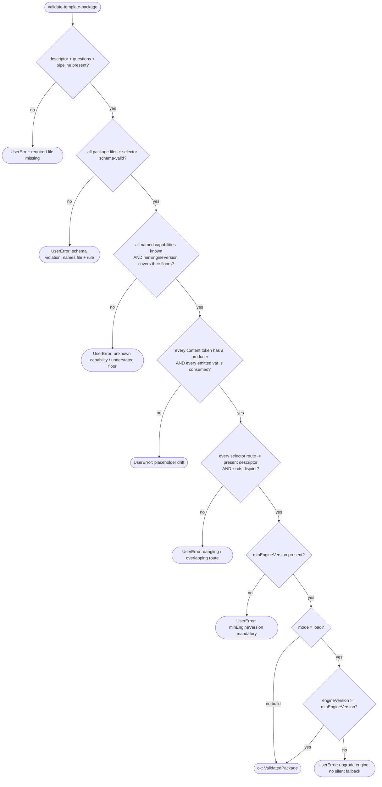

# Operation — `validate-template-package`

- **Status:** Accepted (Decision source ADR-0015 Accepted 2026-06-05) — ready for tests
- **Domain:** [`01-scaffolding`](../../domains/01-scaffolding.md)
- **Decision source:** [ADR-0015](../../../02-architecture/adr/ADR-0015-templates-version-artifact-shape.md)
  (placeholder rows AC-11 – AC-12 share invariant 5 with
  [ADR-0016](../../../02-architecture/adr/ADR-0016-declarative-template-format.md);
  routing-consistency rows AC-13 – AC-15 share descriptor-derived routing with
  [ADR-0014](../../../02-architecture/adr/ADR-0014-dispatcher-buildtarget-resolution.md) §5.3)
- **Seam:** [`scaffolding.create.proposal.md` §3](../../../02-architecture/scaffolding.create.proposal.md),
  §3.4, §4.4, §5.2
- **PRD/scenario:** none required — internal build/load integrity gate with no
  user-visible surface change. Its one user-visible effect — an explicit upgrade
  error when the engine is too old (AC-18) — _is_ the no-silent-fallback
  guarantee, not a new surface.

## Purpose

Validate that one `templates-v4@<version>` package conforms to the ADR-0015
artifact shape and may run on the consuming engine, **before** any of its
content is rendered. The same validation runs in two places (proposal §4.4):

1. **build CI** — the author-time gate, so a malformed package **fails the
   build**, never a user scaffold; and
2. **engine load** — defense-in-depth, so a hand-edited or partially-materialized
   package cannot reach the render stage.

It answers two questions: _is this package well-formed?_ (four-file isomorphism

- schema + placeholder accounting + selector/descriptor consistency) and _may
  this well-formed package run on **this** engine?_ (the **reverse**
  `minEngineVersion` gate). It does **not** decide _which_ package to use (that is
  [`resolve-template-source`](resolve-template-source.md) / ADR-0006) or _what a
  template renders to_ (that is the render phase of
  [`run-scaffold-pipeline`](run-scaffold-pipeline.md) / ADR-0017).

## Inputs

| Input            | Type                             | Origin                                                                                                                                                                 |
| ---------------- | -------------------------------- | ---------------------------------------------------------------------------------------------------------------------------------------------------------------------- |
| `kind`           | `create \| modify`               | selects which per-kind `selector.json` and templateId namespace                                                                                                        |
| `id`             | `templateId` string              | which `<kind>/<id>/` package to validate                                                                                                                               |
| `mode`           | `build \| load`                  | `build` → a violation fails the build; `load` → a violation fails the scaffold (defense-in-depth). The _checks_ are identical; only the failure class differs.         |
| `port`           | narrow `TemplatePackagePort`     | injected; includes the package-level `userError` adapter and uses an in-memory fake in tests                                                                           |
| archive `errors` | `{ user; system }` error factory | injected by the final-archive adapter; runtime maps failures to `UserError` / `SystemError`, while build tooling may supply an engine-independent error implementation |

This operation does **not** depend on the full `ScaffoldRuntime`
(`{ fs, http, archive, clock, binaryCache }`, proposal §8). It declares the
narrow `TemplatePackagePort` it actually uses (interface-segregation), which the
full runtime composes later:

| Port face           | Shape                                                                | Responsibility                                                                                                                                                                          |
| ------------------- | -------------------------------------------------------------------- | --------------------------------------------------------------------------------------------------------------------------------------------------------------------------------------- |
| `userError`         | `(name, message) => FxError`                                         | adapts an author-/user-fixable package diagnosis to the caller's concrete error type; the archive adapter derives this face from its `{ user; system }` factory                         |
| `descriptor`        | `() => unknown \| undefined`                                         | the package's parsed `descriptor.json` (or absence)                                                                                                                                     |
| `questions`         | `() => unknown \| undefined`                                         | the package's parsed `questions.json` (or absence)                                                                                                                                      |
| `pipeline`          | `() => unknown \| undefined`                                         | the package's parsed `pipeline.json` (or absence)                                                                                                                                       |
| `content`           | `() => Array<{ path: string; placeholders: string[] }> \| undefined` | each content file's path plus the `{{token}}` set extracted from it; `undefined` = the `content/` folder is absent (the optional case)                                                  |
| `selector`          | `(kind) => unknown`                                                  | the per-kind `selector.json`                                                                                                                                                            |
| `schemas`           | `{ descriptor; question; pipeline; selector }`                       | the JSON-schema validators under `templates/v4/schema/`                                                                                                                                 |
| `engineVersion`     | `() => string`                                                       | the consuming engine capability SemVer (the `load`-mode reverse gate; source-owned and independent of the template artifact/floor version, which may advance without an engine release) |
| `capabilityFloor`   | `(kind, id) => string \| undefined`                                  | the source-owned introduction version for a named pipeline step, options provider, or validator; `undefined` means the template references an unknown capability                        |
| `capabilityOutputs` | `(kind, id) => string[]`                                             | declared render-variable outputs for a capability; provider output `catalog` is exposed as `derived.<provider-id>.catalog` only when that provider is referenced by the package         |

## Outputs

A `Result<ValidatedPackage, FxError>`:

| Field (ok)         | Meaning                                                           |
| ------------------ | ----------------------------------------------------------------- |
| `descriptor`       | the parsed, schema-valid descriptor                               |
| `minEngineVersion` | the resolved reverse-gate floor (recorded on outcome / telemetry) |
| `contentFiles`     | the validated content-file list (empty when `content/` is absent) |

On `err`:

- **`UserError`** for an author-/user-fixable violation: a missing required
  file, a schema failure, placeholder drift, a selector route with no
  descriptor, or `engineVersion < minEngineVersion`. The error **names** the
  file + rule (or the required version) so the fix is unambiguous.
- This operation does **not** raise digest/integrity `SystemError`s — package
  byte integrity is [`resolve-template-source`](resolve-template-source.md)
  INV-3 (ADR-0006), upstream of this gate.

## Acceptance Criteria

| ID    | Tier | Given                                                                                                                                                                          | When                                         | Then                                                                                                                                                                                                           |
| ----- | ---- | ------------------------------------------------------------------------------------------------------------------------------------------------------------------------------ | -------------------------------------------- | -------------------------------------------------------------------------------------------------------------------------------------------------------------------------------------------------------------- |
| AC-01 | L1   | a package with `descriptor.json` + `questions.json` + `pipeline.json` present and schema-valid, `content/` present                                                             | validate                                     | `ok`; structural + schema checks pass                                                                                                                                                                          |
| AC-02 | L1   | `questions.json` absent                                                                                                                                                        | validate                                     | `UserError` naming `questions.json` as required — even an empty tree must ship as a file                                                                                                                       |
| AC-03 | L1   | `pipeline.json` absent                                                                                                                                                         | validate                                     | `UserError` naming `pipeline.json` as required                                                                                                                                                                 |
| AC-04 | L1   | `questions.json` = `{ "questions": [] }`                                                                                                                                       | validate                                     | `ok` — required-but-empty is valid; there is no "file optional, fall back to defaults" branch                                                                                                                  |
| AC-05 | L1   | `pipeline.json` = `{ "pipeline": "default", "steps": [] }`                                                                                                                     | validate                                     | `ok` — required-but-empty is valid                                                                                                                                                                             |
| AC-06 | L1   | a package that adds no files and ships **no** `content/` folder (`port.content()` is `undefined`)                                                                              | validate                                     | `ok` — `content/` is optional for every package kind; emptiness is absence                                                                                                                                     |
| AC-07 | L1   | a package whose `content/` exists and contains any file (including a would-be "marker")                                                                                        | validate                                     | that file is treated as renderable content (placeholder accounting AC-11 applies to it); there is **no** marker-file exemption — emptiness must be expressed by omitting `content/`, not by a placeholder file |
| AC-08 | L1   | `descriptor.json` fails `schemas.descriptor` (e.g. unknown top-level key under `additionalProperties:false`, or missing `optionsSchema`)                                       | validate                                     | `UserError` naming the descriptor + the failing rule                                                                                                                                                           |
| AC-09 | L1   | `questions.json` fails `schemas.question`                                                                                                                                      | validate                                     | `UserError` naming `questions.json` + the failing rule                                                                                                                                                         |
| AC-10 | L1   | `selector.json` fails `schemas.selector`                                                                                                                                       | validate                                     | `UserError` naming `selector.json` + the failing rule                                                                                                                                                          |
| AC-11 | L1   | a `{{token}}` appears in a rendered `content/**` file or pipeline `with` value but no `replaceMap` entry, caller-injected identifier, or question produces it                  | validate                                     | `UserError` (placeholder drift) naming the token + render surface — the emitted-var set must cover every token (invariant 5, §3.4 `perFile`)                                                                   |
| AC-12 | L1   | a `replaceMap`-emitted or `required` var that no rendered content or pipeline `with` value consumes                                                                            | validate                                     | `UserError` (placeholder drift) naming the orphan var — the shared Mustache surface must match emitted vars in both directions                                                                                 |
| AC-13 | L1   | every route in `selector.json` names a `templateId` whose descriptor is present in the same package set                                                                        | validate                                     | `ok` — routing is derived from descriptors (ADR-0014 §5.3), self-consistent by construction                                                                                                                    |
| AC-14 | L1   | a `selector.json` route names a `templateId` with **no** descriptor in the artifact                                                                                            | validate                                     | `UserError` naming the dangling route                                                                                                                                                                          |
| AC-15 | L1   | the same `templateId` is routed in **both** the `create` and `modify` selectors                                                                                                | validate                                     | `UserError` — the two kinds own disjoint templateId namespaces (§5 per-kind overlap check)                                                                                                                     |
| AC-16 | L1   | `descriptor.minEngineVersion` is missing                                                                                                                                       | validate                                     | `UserError` — `minEngineVersion` is mandatory (the reverse compatibility signal)                                                                                                                               |
| AC-17 | L1   | `mode=load`, `engineVersion=6.11.0`, `descriptor.minEngineVersion=5.20.0`                                                                                                      | validate                                     | `ok` — `6.11.0 >= 5.20.0`; the package may run                                                                                                                                                                 |
| AC-18 | L1   | `mode=load`, `engineVersion=6.11.0`, `descriptor.minEngineVersion=6.11.3`                                                                                                      | validate                                     | `UserError` naming the required `6.11.3` and instructing an engine upgrade; **never** a silent fallback or downgrade                                                                                           |
| AC-19 | L1   | one artifact `templates-v4@6.11.5` containing `da/mcp-server` (`5.20.0`) **and** `da/foo` (`6.11.3`), validated on `engineVersion=6.11.0`                                      | validate each                                | `da/mcp-server` → `ok`; `da/foo` → `UserError` (AC-18). The artifact-level `range` admitted both; only this **per-package** gate separates them                                                                |
| AC-20 | L1   | a malformed package (any of AC-02/03/08–16)                                                                                                                                    | validate with `mode=build`, then `mode=load` | both fail with the same diagnosis; `build` fails the build (before ship), `load` fails the scaffold (defense-in-depth) — one validation, two call sites                                                        |
| AC-21 | L1   | two validations with identical `(package contents, engineVersion, mode)`                                                                                                       | validate twice                               | both return the identical `Result` — validation is a pure function of its inputs                                                                                                                               |
| AC-22 | L1   | `pipeline.json` fails `schemas.pipeline`                                                                                                                                       | validate                                     | `UserError` naming `pipeline.json` + the failing rule                                                                                                                                                          |
| AC-23 | L1   | `pipeline.json` or `questions.json` references a step, options provider, or validator absent from the source-owned capability catalogue, including `inputBoxConfig.validation` | validate                                     | `UserError` naming the unknown capability; malformed package data never reaches runtime registry lookup                                                                                                        |
| AC-24 | L1   | a referenced capability, including a nested input-box validator, was introduced in `6.11.0`, but `descriptor.minEngineVersion=5.20.0`                                          | validate in build or load mode               | `UserError` naming the capability and required floor; a future package cannot understate its reverse compatibility gate                                                                                        |
| AC-25 | L1   | final archive bytes contain a package-owned `questions.json`, `pipeline.json`, or `content/**` root with no `descriptor.json`                                                  | validate archive                             | `UserError` naming the orphan package root and its missing required file; descriptor-based discovery cannot silently omit malformed packages                                                                   |
| AC-26 | L1   | a package content entry is absolute or drive-qualified under POSIX or Windows path rules                                                                                       | validate archive                             | `SystemError` naming the unsafe archive entry; the package is rejected before rendering or filesystem writes                                                                                                   |
| AC-27 | L1   | one per-kind `selector.json` is malformed and the archive contains no package descriptors                                                                                      | validate archive                             | schema validation still fails; both selectors are independently validated rather than only as a side effect of package iteration                                                                               |
| AC-28 | L1   | `descriptor.minEngineVersion` or the consuming `engineVersion` is not valid SemVer                                                                                             | validate                                     | `UserError` names the invalid version; compatibility and capability-floor comparisons never coerce malformed versions                                                                                          |
| AC-29 | L1   | archive validation is composed by runtime or build tooling with a caller-owned error factory                                                                                   | validation rejects malformed archive bytes   | the returned failure is created by that factory; the generic validator does not load or construct product API error classes                                                                                    |

## Flow

## Boundary

This operation does **not**:

- Decide **which** package or version to use. That is
  [`resolve-template-source`](resolve-template-source.md) (ADR-0006); this gate
  runs **after** a source is resolved.
- Verify download/byte integrity (digest). That is
  [`resolve-template-source`](resolve-template-source.md) INV-3 (ADR-0006),
  upstream of this gate; a corrupt download never reaches here.
- Open or return a single template's renderable file entries. That is
  [`open-template-package`](open-template-package.md).
- Render content, evaluate the `replaceMap` / `{expr}` DSL, or type-check
  _rendered_ output. Placeholder accounting here checks token **coverage**
  (invariant 5), not rendering; rendering is the render phase of
  [`run-scaffold-pipeline`](run-scaffold-pipeline.md) (ADR-0017), and the
  `replaceMap` / `{expr}` DSL is [`build-render-context`](build-render-context.md)
  (ADR-0016).
- Execute pipeline steps or validate step parameter **semantics**. That is the
  named pipeline + step whitelist (ADR-0017); this gate checks `pipeline.json`'s
  shape, referenced capability names, and their engine-introduction floors.
- Publish, tag, zip, or stitch content from the v3 tree. The build zips authored
  bytes verbatim (ADR-0015 decision 2); this operation is read-only.

## Invariants

- **INV-1 — Four-file isomorphism.** `descriptor.json` / `questions.json` /
  `pipeline.json` are always required (even when empty); `content/` is optional
  and its emptiness is expressed by **absence**, never a marker file.
- **INV-2 — Build/load symmetry.** The identical validation runs at build CI and
  at engine load; neither path is weaker, so a package that ships clean cannot be
  hand-edited into a render-time crash.
- **INV-3 — Placeholder closure.** The `{{token}}` set across rendered
  `content/**` and pipeline `with` values equals the emitted-var set
  (replaceMap-emitted + caller-injected + question-produced): no orphan token,
  no unused required var (invariant 5, §3.4 / §3.5; ADR-0017 decision 5).
- **INV-4 — Routing derived from descriptors.** The per-kind `selector.json`
  indexes only `templateId`s whose descriptors are present in the same artifact
  (ADR-0014 §5.3); the artifact is self-consistent by construction, and the two
  kinds own disjoint `templateId` namespaces.
- **INV-5 — Reverse gate is explicit.** `engineVersion < minEngineVersion` is
  always an explicit `UserError` instructing an upgrade — never a silent
  fallback, downgrade, or best-effort run. The engine version is the
  source-owned capability version, never `templates-v4@<version>` or the bundled
  floor version; those artifact versions can advance independently.
- **INV-6 — Per-template granularity.** Compatibility is decided **per package**,
  not per artifact: one package may pass while a sibling in the same
  `templates-v4@<version>` fails the reverse gate (AC-19) — the distinction
  `range` (artifact-level) structurally cannot express.
- **INV-7 — v4-owned.** This operation and its tests live in the v4 world; it
  does **not** reuse v3's runtime `ManifestUtil` / ajv path (proposal §5.1) and
  adds no v3-specific method or fixture.
- **INV-8 — Caller-owned error adaptation.** Validation identifies a failure's
  category, name, and message, while composition owns the concrete error class.
  Build tooling can therefore run the generic validator before fx-core's API
  dependency has been compiled; runtime composition still returns the standard
  `UserError` / `SystemError` classes.
- **INV-9 — Read-only.** Validation inspects bytes; it never mutates, rewrites,
  publishes, or synthesizes any package file (authored-not-generated, cluster G).
- **INV-10 — Capability floor is source-owned.** Every template-visible step,
  provider, and validator has one engine introduction version. A package that
  references it declares an equal-or-higher `minEngineVersion`; artifact release
  versions never stand in for this capability floor.
  [ADR-0025](../../../02-architecture/adr/ADR-0025-scaffold-extension-ownership.md)
  OWN-03/04 require one dependency-free declaration source for capability IDs,
  versions and derived outputs, consumed by both validation and runtime bindings.
  An output-specific introduction version is checked only when consumed; this
  does not raise the provider's own introduction version or import runtime
  implementations into build validation.
- **INV-11 — Archive roots are complete and paths are relative.** Archive
  discovery considers every package-owned metadata/content entry, not only
  descriptors; every discovered root satisfies INV-1, both selectors are
  independently schema-valid, and content paths are relative under both POSIX
  and Windows path rules before any file reaches the render sink.
