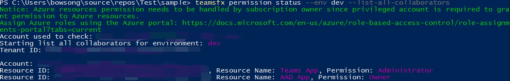
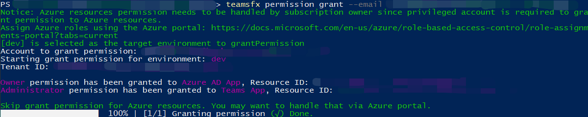
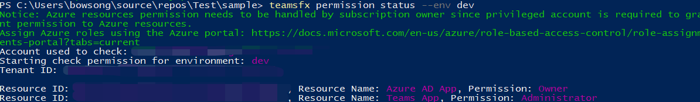

# TeamsFx Command Line Interface

TeamsFx CLI is a text-based command line interface that accelerates Teams application development. It aims you to provide keyboard-centric experience when building Teams applications. It also enables CI/CD scenario where CLI can be easily integrated in scripts for automation.

* [Source code](https://github.com/OfficeDev/TeamsFx/tree/dev/packages/cli) 
* [Package (NPM)](https://www.npmjs.com/package/@microsoft/teamsapp-cli)

## Get Started

Let's start by installing `teamsfx-cli` from `npm` and run `teamsfx -h` to check all available commands:

```bash
  npm install -g @microsoft/teamsapp-cli
  teamsapp -h
```

## Supported Commands

| `teamsfx` Commands  | Descriptions |
|:----------------  |:-------------|
| `teamsfx new`       | Create a new Teams application. |
| `teamsfx account`   | Manage cloud service accounts. The supported cloud services are 'Azure' and 'Microsoft 365'.          |
| `teamsfx env`       | Manage the environments. |
| `teamsfx capability`| Add new capabilities to the current application.         |
| `teamsfx resource`  | Manage the resources in the current application.         |
| `teamsfx provision` | Provision the cloud resources in the current application.             |
| `teamsfx deploy`    | Deploy the current application.  |
| `teamsfx package`   | Build your Teams app into a package for publishing.         |
| `teamsfx validate`  | Validate the current application.             |
| `teamsfx publish`   | Publish the app to Teams.             |
| `teamsfx preview`   | Preview the current application. |
| `teamsfx config`    | Manage the configuration data. |
| `teamsfx permission`| Collaborate with other developers in same project.|

## `teamsfx new`

`teamsfx new` will by default go into interactive mode and guide you through the process of creating a new Teams application by asking few questions. You can also do it in non-interactive mode by setting `--interactive` flag to `false`.

| `teamsFx new` Commands  | Descriptions |
|:----------------  |:-------------|
| `teamsfx new template <template-name>`     | Create an app from an existing template |
| `teamsfx new template list`     | List all the available templates |

### Parameters for `teamsfx new`

| Parameters  | Required | Descriptions |
|:----------------  |:-------------|:-------------|
|`--app-name` | Yes| Name of your Teams application.|
|`--interactive`| No | Select the options interactively. Options are `true` and `false`. The default value is `true`.|
|`--capability`| No| Choose Teams application capabilities, multiple Options are: `tab`, `bot`, `messaging-extension` and `tab-spfx`. The default value is: `tab`.|
|`--programming-language`| No| Programming Language for the project. Options are `javascrip` or `typescript` and default value is: `javascript`.|
|`--folder`| No | Project directory. A sub folder with the your app name will be created under this directory. The default value is: `./`.|
|`--spfx-framework-type`| No| Applicable if `Tab(SPfx)` capability is selected. Frontend Framework. Options are `none` and `react`, the default value is: `none`.|
|`--spfx-webpart-name`| No | Applicable if `Tab(SPfx)` capability is selected. Web part Name. The default value is: "helloworld". |
|`--spfx-webpart-desp`| No | Applicable if `Tab(SPfx)` capability is selected. Web part Description. The default value is: "helloworld description". |
|`--azure-resources`| No| Applicable if contains `tab` capability. Add Azure resources to your project. Options(Multiple) are `sql` (Azure SQL Database) and `function` (Azure Functions). |

### Scenarios for `teamsfx new`

Using interactive mode to create a Teams app is super intuitive, please try it by starting with `teamsfx new`. The following are the few scenerios on controlling all the parameters:

#### A tab app hosted on SPFx using React

```bash
teamsfx new --interactive false --app-name newspfxapp --capability tab-spfx --spfx-framework-type react
```

#### A Teams app in JavaScript contains tab, bot capabilities and Azure Functions

```bash
teamsfx new --interactive false --app-name newtabbotapp --capability tab bot --programming-language javascript --azure-resources function
```

#### A Teams tab app with Azure Functions and Azure SQL

```bash
teamsfx new --interactive false app-name newapp --azure-resources sql function --programming-language typescript
```

## `teamsfx account`

Manage cloud service accounts. The supported cloud services are `Azure` and `Microsoft 365`.

| `teamsfx account` Commands  | Descriptions |
|:----------------  |:-------------|
| `teamsfx account show`       | Display all connected cloud accounts information. |
| `teamsfx account login <service>`      | Log in to the selected cloud service. |
| `teamsfx account logout <service>`      | log out of selected cloud service. |
| `teamsfx account set --subscription`      | Update account settings to set a subscription ID. |

## `teamsfx env`

Manage the environments.

| `teamsfx env` Commands  | Descriptions |
|:----------------  |:-------------|
| `teamsfx env add <new_env_name> --env <existing_env_name>` | Add a new environment by copying from the specified environment. |
| `teamsfx env list` | List all environments. |

### Scenarios for `teamsfx env`

#### Create a new environment

Add a new environment by copying from the existing dev environment:

```bash
teamsfx env add staging --env dev
```

## `teamsfx capability`

Add new capabilities to the current application.

| `teamsFx capability` Commands  | Descriptions |
|:----------------  |:-------------|
| `teamsfx capability add tab`      | Add a tab. |
| `teamsfx capability add bot`      | Add a bot. |
| `teamsfx capability add messaging-extension`      | Add a Messaging Extension. |

> [!NOTE]
> Once your project include a bot, messaging extension cannot be added any more and it applies vice versa. You can include both bot and messaging extensions in your project when creating a new Teams app project.

## `teamsfx resource`

Manage the resources in the current application. Supported `<resource-type>` are: `azure-sql`, `azure-function` and `azure-apim` .

| `teamsFx resource` Commands  | Descriptions |
|:----------------  |:-------------|
| `teamsfx resource add <resource-type>`      | Add a resource into current application.|
| `teamsfx resource show <resource-type>`      | Show configuration details of the resource. |
| `teamsfx resource list`      | List all the resources in the current application. |

### Parameters for `teamsfx resource add azure-function`

| Parameters  | Required | Descriptions |
|:----------------  |:-------------|:-------------|
|`--function-name`| Yes | Provide a function name. The default value is: `getuserprofile`. |

### Parameters for `teamsfx resource add azure-sql`

#### `--function-name`

| Parameters  | Required | Descriptions |
|:----------------  |:-------------|:-------------|
|`--function-name`| Yes | Provide a function name. The default value is: `getuserprofile`. |

> [!NOTE]
> Function name is verified as SQL needs to be accessed from server workload. If your project doesn't contain `Azure Functions`, it will created one for you.

### Parameters for `teamsfx resource add azure-apim`

> [!TIP]
> Below options will take effect when you try to use an existing `APIM` instance. By default, you don't have to specify any options and it will create a new instance during `teamsfx provision` step.

| Parameters  | Required | Descriptions |
|:----------------  |:-------------|:-------------|
|`--subscription`| Yes | Select an Azure subscription|
|`--apim-resource-group`| Yes| The name of resource group. |
|`--apim-service-name`| Yes | The name of the API Management service instance. |
|`--function-name`| Yes | Provide a function name. The default value is: `getuserprofile`. |

> [!NOTE]
> We ask for function name because `Azure API Management` needs to work with `Azure Functions`. If your project doesn't contain `Azure Functions` we will create one for you.

## `teamsfx provision`

Provision the cloud resources in the current application.

### Parameters for `teamsfx provision`

| Parameters  | Required | Descriptions |
|:----------------  |:-------------|:-------------|
|`--env`| Yes| Select an environment for the project. |
|`--subscription`| No | Specify an Azure Subscription ID. |
|`--resource-group`| No | Set the name of an existing resource group. |
|`--sql-admin-name`| No | Applicable when there is SQL resource in the project. Admin name of SQL.|
|`--sql-password`| No| Applicable when there is SQL resource in the project. Admin password of SQL.|

## `teamsfx deploy`

This command is used to deploy the current application. By default it will deploy entire project but it's also possible to deploy partially. Options(Multiple) are: `frontend-hosting`, `function`, `apim`, `teamsbot`, `spfx`.

### Parameters for `teamsfx deploy`

| Parameters  | Required | Descriptions |
|:----------------  |:-------------|:-------------|
|`--env`| Yes| Select an existing environment for the project. |
|`--open-api-document`| No | Applicable when there is APIM resource in the project. The Open API document file path. |
|`--api-prefix`| No | Applicable when there is APIM resource in the project. The API name prefix. The default unique name of the API will be `{api-prefix}-{resource-suffix}-{api-version}`. |
|`--api-version`| No | Applicable when there is APIM resource in the project. The API version. |

## `teamsfx validate`

Validate current application. This command will validate your application's manifest file.

### Parameters for `teamsfx validate`

`--env`: (Required) Select an existing environment for the project.

## `teamsfx publish`

Publish the app to Teams.

### Parameters for `teamsfx publish`

`--env`: (Required) Select an existing environment for the project.

## `teamsfx package`

Build your Teams app into a package for publishing.

## `teamsfx preview`

Preview the current application from local or remote.

### Parameters for `teamsfx preview`

| Parameters  | Required | Descriptions |
|:----------------  |:-------------|:-------------|
|`--local`| No | Preview the application from local. `--local` is exclusive with `--remote`. |
|`--remote`| No | Preview the application from remote. `--remote` is exclusive with `--local`. |
|`--env`| No | Select an existing environment for the project when parameter `--remote` appended. |
|`--folder`| No | Project root directory. The default value is `./`. |
|`--browser`| No | The browser to open Teams web client. Options are `chrome`, `edge` and `default` (system default browser). The default value is `default`. |
|`--browser-arg`| No | Argument to pass to the browser, requires --browser, can be used multiple times (e.g. --browser-args="--guest") |
|`--sharepoint-site`| No | SharePoint site URL, like `{your-tenant-name}.sharepoint.com` (only for SPFx project remote preview). |

### Scenarios for `teamsfx preview`

#### Local Preview

Dependencies:

- Node.js
- .NET SDK
- Azure Functions Core Tools

```bash
teamsfx preview --local
teamsfx preview --local --browser chrome
```

#### Remote Preview

```bash
teamsfx preview --remote
teamsfx preview --remote --browser edge
```

> [!Note]
> The logs of the background services like React will be saved in `~/.fx/cli-log/local-preview/`.

## `teamsfx config`

Manage the configuration data either in user scope or project scope.

| `teamsfx config` Commands  | Descriptions |
|:----------------  |:-------------|
| `teamsfx config get [option]` | View the configuration value of option |
| `teamsfx config set <option> <value>` | Update the configuration value of option |

### Parameters for `teamsfx config`

| Parameters  | Required | Descriptions |
|:----------------  |:-------------|:-------------|
|`--env`| Yes | Select an existing environment for the project. |
|`--folder`| No | Project directory. This is used when get/set project configuration. The default value is: `./`. |
|`--global`| No | Cope of configuration. If this is true, the scope is limited to user scope instead of project scope. The default value is: `false`. Currently supported global configurations including: `telemetry`, `validate-dotnet-sdk`, `validate-func-core-tools`, `validate-node`, `validate-ngrok`, `trust-development-certificate`. |

### Scenerios for `teamsfx config`

Secrets in `.userdata` file are encrypted, `teamsfx config` could help you view / update these values.

#### Stop sending telemetry data

```bash
teamsfx config set telemetry off
```

#### Disable environment checker

There are three configs to turn on/off Node.js, .NET SDK and Azure Functions Core Tools validation, and all of them are enabled by default. You are able to set the config to "off" if you do not need the dependencies validation and would like to install the dependencies by yourself. Check the [Node.js installation guide](https://github.com/OfficeDev/TeamsFx/blob/dev/docs/vscode-extension/envchecker-help.md#how-to-install-nodejs), [.NET SDK installation guide](https://github.com/OfficeDev/TeamsFx/blob/dev/docs/vscode-extension/envchecker-help.md#how-to-install-net-sdk) and [Azure Functions Core Tools installation guide](https://github.com/OfficeDev/TeamsFx/blob/dev/docs/vscode-extension/envchecker-help.md#how-to-install-azure-functions-core-tools).

For example, to disable .NET SDK validation, you can use the following command.

```bash
teamsfx config set validate-dotnet-sdk off
```

To enable .NET SDK validation, you can use the following command.

```bash
teamsfx config set validate-dotnet-sdk on
```

#### View all the user scope configuration

```bash
teamsfx config get -g
```

#### View all the configuration in project

The secret will automatically decrypted:

```bash
teamsfx config get --env dev
```

#### Update the secret configuration in project

```bash
teamsfx config set fx-resource-aad-app-for-teams.clientSecret xxx --env dev
```

## `teamsfx permission`

TeamsFx CLI provides `teamsfx permission` Commands for collaboration scenario.

| `teamsfx permission` Commands | Descriptions |
|:------------------------------|-------------|
| `teamsfx permission grant --env --email` | Grant permission for collaborator's Microsoft 365 account for the project of a specified environment. |
| `teamsfx permission status` | Show permission status for the project |

### Parameters for `teamsfx permission grant`

| Parameters  | Required | Descriptions |
|:----------------  |:-------------|:-------------|
|`--env`| Yes | Provide env name. |
|`--email`| Yes | Provide collaborator's Microsoft 365 email address. Note that the collaborator's account should be in the same tenant with creator. |

### Parameters for `teamsfx permission status`

| Parameters  | Required | Descriptions |
|:----------------  |:-------------|:-------------|
|`--env`| Yes | Provide env name. |
|`--list-all-collaborators` | No | With this flag, Teams Toolkit CLI will print out all collaborators for this project. |

### Scenarios for `teamsfx permission`

Here are some examples, for better handling permission for `TeamsFx` projects.

#### Grant Permission

Project creator and collaborators can use `teamsfx permission grant` command to add a new collaborator to the project:

```bash
teamsfx permission grant --env dev --email user-email@user-tenant.com
```

After successfully granted permission, project creator and collaborators can share the project with the new collaborator by Github, and the new collaborator will have all permission for Microsoft 365 account.

#### Show Permission Status

Project creator and collaborators can use `teamsfx permission status` command to view his Microsoft 365 account permission for specific env:

```bash
teamsfx permission status --env dev
```

#### List All Collaborators

Project creator and collaborators can use `teamsfx permission status` command to view all collaborators for specific env:

```bash
teamsfx permission status --env dev --list-all-collaborators
```

#### E2E Collaboration work flow in CLI

As a project creator:

- Create a new TeamsFx Tab project (You can also select bot), and the hosting type select Azure.

  ```bash
  teamsfx new --interactive false --app-name newapp --host-type azure
  ```

- Login Microsoft 365 account and Azure account.

  ```bash
  teamsfx account login azure
  teamsfx account login Microsoft 365
  ```

- Provision your project.

  ```bash
  teamsfx provision
  ```

- View collaborators. You should see yourself here.

  ```bash
  teamsfx permission status --env dev --list-all-collaborators
  ```

  
- Add another account as collaborator. Note that the added account must under the same tenant:

  ```bash
  teamsfx permission grant --env dev --email user-email@user-tenant.com
  ```

  
- Push your project to GitHub

As a Project Collaborator:

- Clone the project from GitHub.
- Login Microsoft 365 account. Note that the Microsoft 365 account should be the same as added above:

  ```bash
  teamsfx account login Microsoft 365
  ```

- Login Azure account which has contributor permission for all the Azure resources.

  ```bash
  teamsfx account login azure
  ```

- Check permission status. You should find yourself have the owner permission of the project:

  ```bash
  teamsfx permission status --env dev
  ```

  
- Update Tab code, and deploy the project to remote.
- Launch remote and the project should work fine.