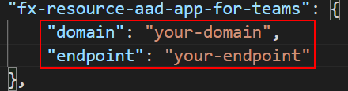

## aad.UpdateAppIdUriError

### Error Message

Failed to update redriect uri for Azure AD app. Please refer to the log for detailed information.

### Address the Error

This error contains two kind of scenario, and please follow this instruction to address the detailed error.

1. Open `.fx\env.default.json` file
2. Find `fx-resource-aad-app-for-teams`. Note value of key *applicationIdUri*
3. Go to Azure Portal, select "Azure Active Directory"
4. Select "App Registrations" and select you Azure AD app.
5. Go to *Expose an API*, and set the value of *applicationIdUri* noted before.
6. Find the error message show on portal, and find error in the table below.

Error Message | Reason | Mitigation
------|------|------
Failed to update application property. Error detail: Another object with the same value for property identifierUris already exists. | The same *applicationIdUri* has already been set to another Azure AD app. This probably because you are using an exising bot in a bot only project. | Please delete the Azure AD app with the same *applicationIdUri* and try again. Or you can try to provision a new bot.
Failed to update application property. Error detail: The host name should not be based on already owned domain paramName. | **Storage Endpoint Host Name** cannot be set to **Application ID URI** of Azure AD App. | [Scenario One: Setup CDN as storage custom domain](#scenario-one-setup-cdn-as-storage-custom-domain).


### Scenario One: Setup CDN as storage custom domain
#### Step #1 Note Frontend Info
1. Open `.fx\env.default.json` file
2. Note the resource group name, fronend storage name.

    

#### Step #2 Provision CDN Profile on Azure Portal
1. Login to Azure portal, create a CDN profile and a CDN endpoint, select endpoint type as Storage static website, then point to your frontend hosting storage. [Learn More](https://docs.microsoft.com/en-us/azure/cdn/cdn-create-new-endpoint)

    

1. Navigate to your created CDN endpoint and copy the endpoint hostname. For example, "https://sample.azureedge.net"

### Step #3 Update Frontend Info
1. Open `.fx\env.default.json` file
1. Find `fx-resource-aad-app-for-teams`. Add two new keys "domain" and "endpoint" with domain and endpoint of CDN.

    

1. Run "TeamsFx - Provision Resource" and "TeamsFx - Deploy Package" or press F5 to start local debug.
1. After adding your app to your teams client, go to teams app store and add app studio, navigate to manifest editor and select your app. Edit the manifest and replace all storage endpoint with your CDN endpoint.

    Including:
   * App details → Developer information → Website
   * App details → App URLs → Privacy statement, Terms of use
   * Tab → Personal Tab → Content URL, Website URL
   * Domains and permissions → Single-Sign-On

    Review your App Manifest(preview) to make sure all xxxx.xxx.web.core.windows.net/ are replaced by xxxx.azureedge.net/. Finally click Test and distribute → install to reinstall the app.

    *Note: You only need to edit the manifest the first time you run your app.*
1. If you're using Azure Functions for backend api, remember to add your CDN endpoint to function's allowed origin list to enable CORS. [Learn More](https://docs.microsoft.com/en-us/azure/azure-functions/functions-how-to-use-azure-function-app-settings?tabs=portal#cors).


## aad.ParsePermissionError
## aad.UnknownPermissionName
## aad.UnknownPermissionRole
## aad.UnknownPermissionScope

### Error Message

`ParsePermissionError`: Failed to parse the permission request. Please refer to the help link for further steps.

`UnknownPermissionName`: Unknown resource name "resourceName". Please refer to the help link for further steps.

`UnknownPermissionRole`: Unknown role name "roleName" for resource "resourceName". Please refer to the help link for further steps.

`UnknownPermissionScope`: Unknown scope name "scopeName" for resource "resourceName". Please refer to the help link for further steps.

### Mitigation

Root cause of this error is that permission is not correctly written in `permission.json` file. Please follow the instruction following to correct the file. [Learn More About Permissions](https://docs.microsoft.com/en-us/azure/active-directory/develop/v2-permissions-and-consent)

A correct permission file should be formated as an JSON array as following:


For `resource`, please fill in "Microsoft Graph".

For the difference of `delegated` and `application`, please refer to [this link](https://docs.microsoft.com/en-us/azure/active-directory/develop/v2-permissions-and-consent#permission-types).

All allowed delegated permissions can be found by running 
```
az ad sp show --id 00000003-0000-0000-c000-000000000000 --query "oauth2Permissions[].value"
```

All allowed application permissions can be found by running 
```
az ad sp show --id 00000003-0000-0000-c000-000000000000 --query "appRoles[].value"
```


## aad.AadGetSkipAppConfigError

### Error Message

Failed to get all necessary info. You need to set objectId, clientId, clientSecret, oauth2PermissionScopeId under fx-resource-aad-app-for-teams in env.default.json.

### Mitigation

Root cause of this error is that necessary info is not included in env.default.json file. To correctly skip creating new Azure AD app, please follow the instruction and make sure required info is included in your file.

#### Step #1 Collect Object Id and Client Id for Azure AD App
1. Go to Azure Portal, select "Azure Active Directory"
1. Select "App Registrations" and select you Azure AD app.
1. Select "Overview" and you can find client id and object id as follows:

    

### Step #2 Collect Client Secret for Azure AD App
1. Go to the Azure AD app owner for the secret or if create a new secret as follows:
   
   Select "Certificates & secrets", select "New client secret" and fill in required info to get the secret.

    

### Step #3 Collect Oauth Scope Id for Azure AD App
1. Select Manifest, find "id" under "oauth2Permissions".

    

### Step #4 Update config file
    
1. For provision:

    

    For local debug:

    

    *Note: You also need to add secret in default.userdata file with the key in your env.default.json file as following.*

    