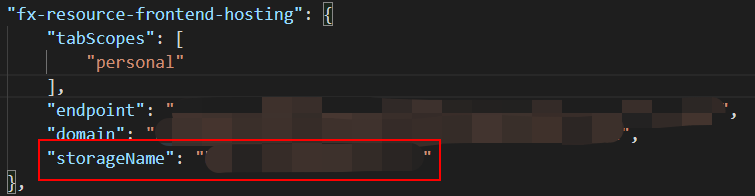
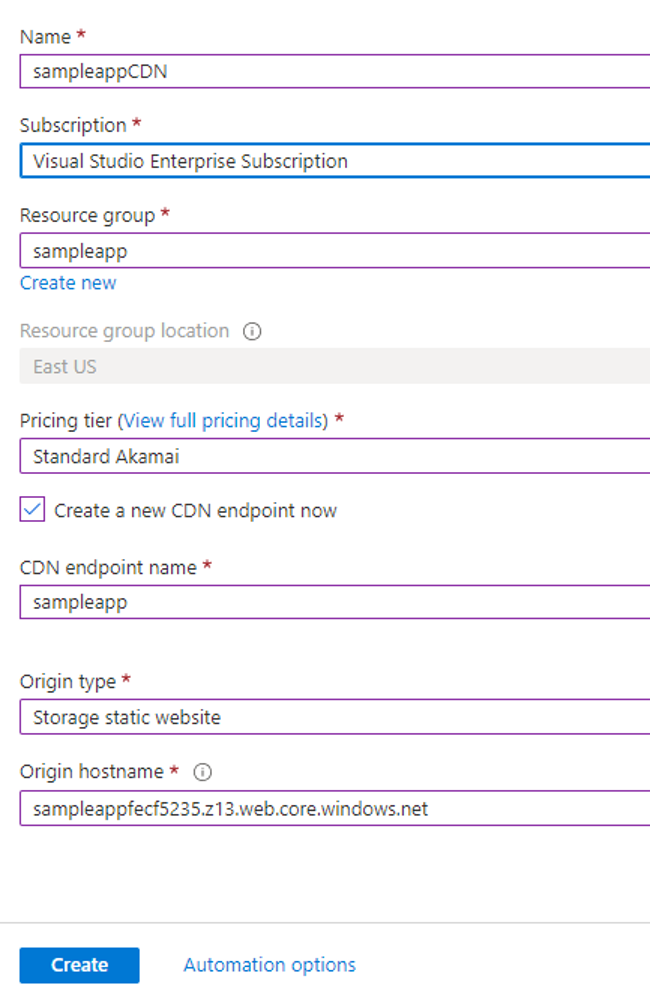
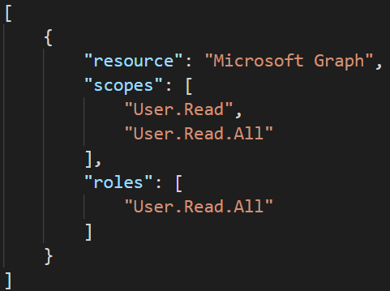
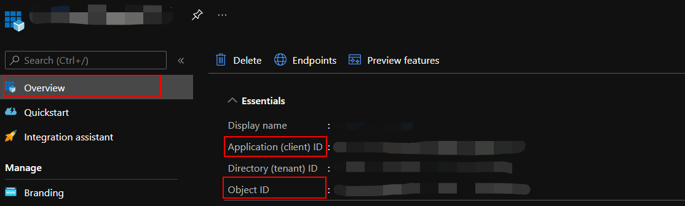
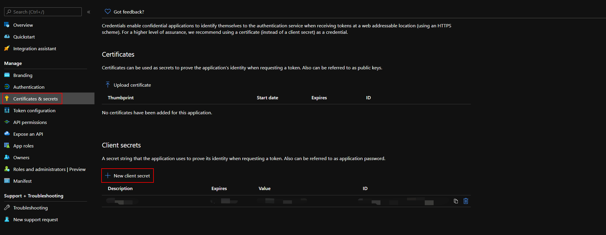
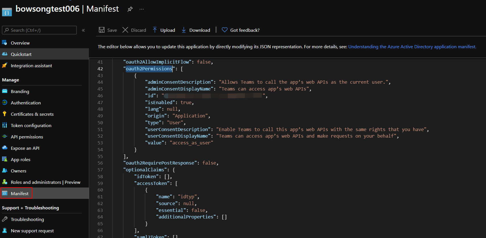
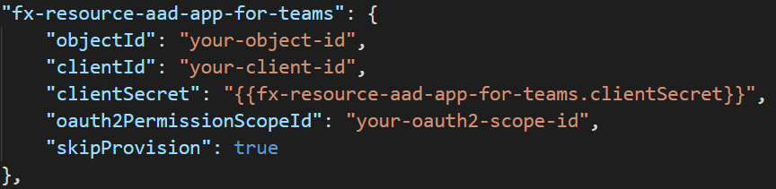
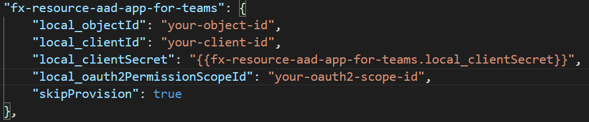
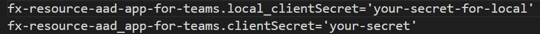

## aad.UpdateAppIdUriError

### Error Message

Failed to update redriect uri for Azure AD app. Please refer to the log for detailed information.

### Address the Error

This error contains two kind of scenario, and please follow this instruction to address the detailed error.

1. Open `.fx\states\state.{envName}.json` file
2. Find `fx-resource-aad-app-for-teams`. Note value of key *applicationIdUris*
3. Go to Azure Portal, select "Azure Active Directory"
4. Select "App Registrations" and select you Azure AD app.
5. Go to *Expose an API*, and set the value of *applicationIdUris* noted before.
6. Find the error message show on portal, and find error in the table below.

Error Message | Reason | Mitigation
------|------|------
Failed to update application property. Error detail: Another object with the same value for property identifierUris already exists. | The same *applicationIdUris* has already been set to another Azure AD app. This probably because you are using an exising bot in a bot only project. | Please delete the Azure AD app with the same *applicationIdUris* and try again. Or you can try to provision a new bot.
Failed to update application property. Error detail: The host name should not be based on already owned domain paramName. | **Storage Endpoint Host Name** cannot be set to **Application ID URI** of Azure AD App. | [Scenario One: Setup CDN as storage custom domain](#scenario-one-setup-cdn-as-storage-custom-domain).


### Scenario One: Setup CDN as storage custom domain
#### Step #1 Note Frontend Info
1. Open `.fx\states\state.{envName}.json` file
2. Note the resource group name, fronend storage name.

    

#### Step #2 Provision CDN Profile on Azure Portal
1. Login to Azure portal, create a CDN profile and a CDN endpoint, select endpoint type as Storage static website, then point to your frontend hosting storage. [Learn More](https://docs.microsoft.com/en-us/azure/cdn/cdn-create-new-endpoint)

    

1. Navigate to your created CDN endpoint and copy the endpoint hostname. For example, "https://sample.azureedge.net"

### Step #3 Update Frontend Info
1. Open `tamplates\azure\provision\frontendHosting.bicep` file, and find the following two lines:
    ```
    output endpoint string = 'https://${siteDomain}'
    output domain string = siteDomain
    ```

1. Replace `siteDomain` with your CDN endpoint as following. Note you need to use your CDN endpoint copied above.
   ```
   output endpoint string = 'https://sample.azureedge.net'
   output domain string = 'sample.azureedge.net'
   ```

1. Run "TeamsFx - Provision in the cloud" and "TeamsFx - Deploy to the cloud" or press F5 to start local debug.


## aad.ParsePermissionError
## aad.UnknownPermissionName
## aad.UnknownPermissionRole
## aad.UnknownPermissionScope

### Error Message

`ParsePermissionError`: Failed to parse the permission request. Please refer to the help link for further steps.

`UnknownPermissionName`: Unknown resource name "resourceName". Please refer to the help link for further steps.

`UnknownPermissionRole`: Unknown role name "roleName" for resource "resourceName". Please refer to the help link for further steps.

`UnknownPermissionScope`: Unknown scope name "scopeName" for resource "resourceName". Please refer to the help link for further steps.

### Mitigation

Root cause of this error is that permission is not correctly written in `permission.json` file. Please follow the instruction following to correct the file. [Learn More About Permissions](https://docs.microsoft.com/en-us/azure/active-directory/develop/v2-permissions-and-consent)

A correct permission file should be formated as an JSON array as following:



For `resource`, please fill in "Microsoft Graph".

For the difference of `delegated` and `application`, please refer to [this link](https://docs.microsoft.com/en-us/azure/active-directory/develop/v2-permissions-and-consent#permission-types).

All allowed delegated permissions can be found by running 
```
az ad sp show --id 00000003-0000-0000-c000-000000000000 --query "oauth2Permissions[].value"
```

All allowed application permissions can be found by running 
```
az ad sp show --id 00000003-0000-0000-c000-000000000000 --query "appRoles[].value"
```


## aad.AadGetSkipAppConfigError

### Error Message

Failed to get all necessary info. You need to set objectId, clientId, clientSecret, oauth2PermissionScopeId under fx-resource-aad-app-for-teams in `state.{envName}.json`.

### Mitigation

Root cause of this error is that necessary info is not included in env.default.json file. To correctly skip creating new Azure AD app, please follow the instruction and make sure required info is included in your file.

#### Step #1 Collect Object Id and Client Id for Azure AD App
1. Go to Azure Portal, select "Azure Active Directory"
1. Select "App Registrations" and select you Azure AD app.
1. Select "Overview" and you can find client id and object id as follows:

    

### Step #2 Collect Client Secret for Azure AD App
1. Go to the Azure AD app owner for the secret or if create a new secret as follows:
   
   Select "Certificates & secrets", select "New client secret" and fill in required info to get the secret.

    

### Step #3 Collect Oauth Scope Id for Azure AD App
1. Select Manifest, find "id" under "oauth2Permissions".

    

### Step #4 Update config file
    
1. For provision:

    

    For local debug:

    

    *Note: You also need to add secret in default.userdata file with the key in your env.default.json file as following.*

    


## aad.AadGetAppError

### Error Message

Failed to get app info with current Object Id in env.default.json. Please make sure object id is valid, or delete 'objectId' under fx-resource-aad-app-for-teams in env.default.json and try again.

### Mitigation

Root cause of this error is that toolkit can not find Azure AD app with the same object id saved in your "env.default.json" file. Please follow the instruction following to address the error.

1. Open `.fx\env.default.json` file
2. Find `fx-resource-aad-app-for-teams`. Note value of key *clientId* or *local_clientId*
3. Go to Azure Portal, login with the same account as the M365 account in toolkit, select "Azure Active Directory"
4. Select "App Registrations" and search for you Azure AD app by client id noted above.

If you can find your Azure AD app, please check your network status and try again.

If you can not find your Azure AD app, please check whether you logged in with the correct account. You can also remove objectId from env.default.json file and then try again.