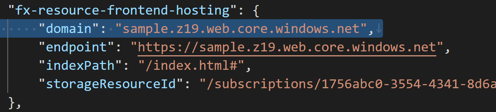

## aad.AadGetSkipAppConfigError

### Error Message

Failed to get all necessary info. You need to set objectId, clientId, clientSecret, oauth2PermissionScopeId under fx-resource-aad-app-for-teams in `state.{envName}.json`.

### Mitigation

Root cause of this error is that necessary info is not included in `config.${env}.json` file. To correctly skip creating new Microsoft Entra app, please follow the instruction and make sure required info is included in your file. For detail, please refer to [tutorial for using existing aad](./using-existing-aad.md#set-necessary-info-in-teamsfx-project).


## aad.AadGetAppError

### Error Message

Failed to get app info with current Object Id in `.fx/state/state.${env}.json`. Please make sure object id is valid, or delete 'objectId' under fx-resource-aad-app-for-teams in `.fx/state/state.${env}.json` and try again.

### Mitigation

Root cause of this error is that toolkit can not find Microsoft Entra app with the same object id saved in your `state.${env}.json` file. Please follow the instruction following to address the error.

1. Open `.fx/state/state.${env}.json` file
2. Find `fx-resource-aad-app-for-teams`. Note value of key *clientId*
3. Go to Azure Portal, login with the same account as the M365 account in toolkit, select "Azure Active Directory"
4. Select "App Registrations" and search for you Microsoft Entra app by client id noted above.

If you can find your Microsoft Entra app, please check your network status and try again.

If you can not find your Microsoft Entra app, please check whether you logged in with the correct account. You can also remove objectId from `.fx/state/state.${env}.json` file and then try again.

## aad.Compliance
To improve the security of app registration, please refer to [Best Practices for app registration](
https://docs.microsoft.com/en-us/azure/active-directory/develop/security-best-practices-for-app-registration) to get detail. The following are several improvements.
### Use certificate credentials
It is strongly recommended that you use x509 certificates as the only credential type for getting tokens for your application. For the Microsoft Entra app created by the toolkit, you can use the certificate credentials.
> To use certificate credentials, you need to prepare the certificate to authenticate.

Please refer to [this guide](https://docs.microsoft.com/en-us/azure/active-directory/develop/active-directory-certificate-credentials#register-your-certificate-with-microsoft-identity-platform) to config the certificate for the Microsoft Entra app.
Please refer to this [code sample](https://github.com/OfficeDev/TeamsFx/tree/dev/packages/sdk#use-certificate-based-authentication-in-azure-function) to utilize the sdk to authenticate with certificate.

## aad.CustomDomain
After provision, you can find the default domain from `TAB_ENDPOINT` in `env/.env.{envName}`. To use custom domain instead of the default one, please follow the instruction as below.
### Step #1 Config Custom Domain by CDN
#### Action 1 Note Frontend Info
1. Open `env\.env.{envName}` file
2. Note the `TAB_ENDPOINT` and find the resource group in `TAB_AZURE_STORAGE_RESOURCE_ID`.

    

#### Action 2 Provision CDN Profile on Azure Portal
1. Login to Azure portal, create a CDN profile and a CDN endpoint, select endpoint type as Storage static website, then point to your frontend hosting storage. [Learn More](https://docs.microsoft.com/en-us/azure/cdn/cdn-create-new-endpoint)

    

1. Navigate to your created CDN endpoint and copy the endpoint hostname. For example, "https://sample.azureedge.net"

#### Action 3 Update Frontend Info
1. Open `infra\azure.bicep` file, and find the following two lines:
    ```
    output TAB_DOMAIN string = siteDomain
    output TAB_ENDPOINT string = 'https://${siteDomain}'
    ```

1. Replace `siteDomain` with your CDN endpoint as following. Note you need to use your CDN endpoint copied above.
   ```
   output TAB_DOMAIN string = 'sample.azureedge.net'
   output TAB_ENDPOINT string = 'https://sample.azureedge.net'
   ```

1. Run "Teams - Provision" and "Teams - Deploy" or press F5 to start local debug.
Please refer to the [Setup CDN as storage custom domain](#scenario-one-setup-cdn-as-storage-custom-domain) to config custom domain.

### (Optional) Step #3 Verify Microsoft Entra App Publisher Domain
To show the aad application domain in the application's consent scenario, please refer to [this guide](https://docs.microsoft.com/en-us/azure/active-directory/develop/howto-configure-publisher-domain).
After that, the custom domain will show in the application's consent screen as below.

