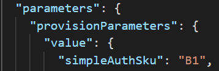
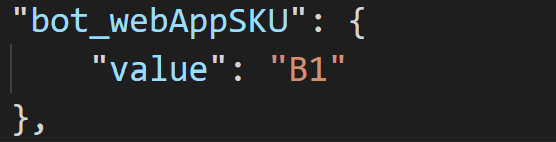

## Solution.FailedToDeployArmTemplatesToAzure

### Error Message

resource deployments `modules` for your project failed. 

### Find the detailed error
1. Select the `Teams toolkit` channel of the output .
1. Find the error message beginning with `[Teams Toolkit] teams_toolkit_deployment`.
1. Get the error code and error message and search them in `General Errors` below to figure out the reason.

# General Errors
list frequent errors as follows. You can find the common deployment error from search engines as well.
***
## Error Message
The maximum number of Free App Service Plan allowed in a Subscription is 10.

### Mitigation

There are two methods to mitigate this issue:
#### Method #1
1. Delete other Free App Service Plan
1. Run `TeamsFx - Provision in the cloud` command again

#### Method #2
1. Locate the segment wrapped the error in output.
1. Open `.fx\configs\azure.parameters.{envName}.json` file
1. If the error wrapped by `simpleAuthProvision` segment, add property `simpleAuthSku` to `provisionParameters` and set the value to "B1" or other valid values.

    
1. If the error wrapped by `botProvision` segment, add property `botWebAppSku` to `provisionParameters` and set the value to "B1" or other valid values.

    
1. Run `TeamsFx - Provision in the cloud` command again

***

## Error Message
Website with given name xxx already exists.

The storage account named xxx already exists under the subscription.

The name 'xxx' already exists. Choose a different name.

### Mitigation
This error indicates the name for one or multiple Azure resources that going to be created already exists. The default name for all Azure resources is calculated based on the `resourceBaseName` parameter in `.fx/configs/azure.parameters.{envName}.json`. Please update the value of `resourceBaseName` to fix this error.

***

## Error Message
Cannot move or create server. Subscription 'xxx' will exceed server quota.

### Mitigation

1. Delete other SQL server
1. Run `TeamsFx - Provision in the cloud` command again

***

## Error Message
The subscription registration is in 'Unregistered' state. The subscription must be registered to use namespace 'xxx'.

### Mitigation
This error indicates your Azure account does not have required permission to register the namespace. There are two ways to mitigate this issue

#### Method 1
Switch to an Azure account that has subscription level Contributor role.

#### Method 2
Ask your subscription administrator to register the namespace mentioned in the error message by following this [link](https://aka.ms/rps-not-found).

***