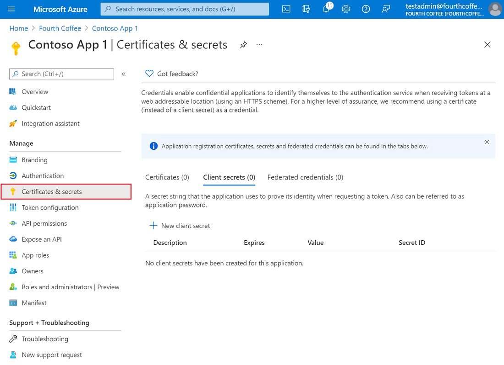

## BT.FreeServerFarmsQuotaError

### Error Message

The maximum number of Free App Service Plan allowed in a Subscription is 10.

### Mitigation

There are two methods to mitigate this issue:

#### Method #1
1. Delete other Free App Service Plan. Just go to [Azure Portal](https://portal.azure.com/), find some useless Free App Service Plans and delete them. To quickly filter Free App Service Plan, use Azure Cli Command: `az appservice plan list --query "[?sku.tier=='Free']"`. 
2. Run `Provision` command again.


#### Method #2
1. Open `.fx\env.default.json` file.
2. Set value of 'skuName' config of 'fx-resource-bot' to, for example, B1.
3. Run `Provision` command again.

## BT.MissingSubscriptionRegistrationError

### Eror Message

The subscription didn't register to use namespace 'Microsoft.BotService'.

### Mitigation

Please refer to this [link](https://aka.ms/rps-not-found) to register your subscription to use namespace 'Microsoft.BotService'.

## How to reuse existing AAD in Toolkit v2?

Suppose an existing AAD has been registered, you can reuse this AAD by configuring Toolkit project settings.

### Register an AAD on Azure Portal
1. Manually create a new App Registration on [Azure Portal](https://ms.portal.azure.com/), note down the **Application (client) ID** on the "overview" page.
2. Create a client secret for the AAD created in step 1, note down the **client secret**.



3. Fill in the appid and secret in `${ProjectFolder}/.fx/configs/config.${env}.json`, add the `bot` section, and the settings will look like:
```
  "manifest": {
        "appName": {
            "short": "xxxx",
            "full": "Full name for xxxx"
        }
    },
    "bot": {
        "appId": "${Application (client) ID}",
        "appPassword": "${client secret}"
    }
```
4. Provision the Bot, then it will reuse this AAD and won't create a new one.

## Configuration schema for bot
This section is to describe configuration items in `fx-resource-bot` section of `.fx/states/state.{envName}.json`.

Config Name | Config Type | Description
------|------|------
wayToRegisterBot|string|The way to register bot, one is `create-new`, the other is `reuse-existing`.
skuName|string|The sku name for Azure Web App which is used for hosting the bot project on Azure. For example, F1, B1. For more options, refer to [App Service Pricing](https://azure.microsoft.com/en-us/pricing/details/app-service/windows/).
localBotId|string|The AAD App client id generated during local debug which is paired with localBotPassword to provide authentication between the bot project and the bot framework service.
localBotPassword|string|The AAD App client secret generated during local debug which is paired with localBotId to provide authentication between the bot project and the bot framework service.
localObjectId|string|The AAD App object id generated during local debug which is co-related with localBotId and localBotPassword.
siteName|string|The site name for Azure Web App which is used for hosting the bot project on Azure.
siteEndpoint|string|The site endpoint for Azure Web App which is used for hosting the bot project on Azure.
validDomain|string|The valid domain item for Azure Web App which is used for hosting the bot project on Azure. Refer to [Teams Manifest Schema's validDomains](https://docs.microsoft.com/en-us/microsoftteams/platform/resources/schema/manifest-schema#validdomains).;
botId|string|The AAD App client id generated during provision which is paired with botPassword to provide authentication between the bot project and the bot framework service.
botPassword|string|The AAD App client secret generated during provision which is paired with botId to provide authentication between the bot project and the bot framework service.
objectId|string|The AAD App object id generated during provision which is co-related with botId and botPassword.
appServicePlan|string|The Azure App Service Plan name for the Azure Web App which is used for hosting the bot project on Azure.
botChannelReg|string|The Azure Bot Channels Registration name for bot registration.
