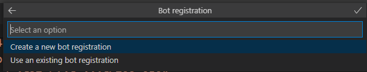
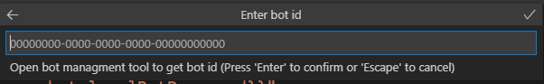
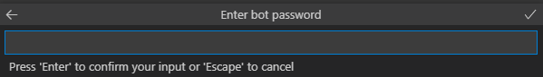
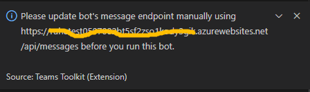
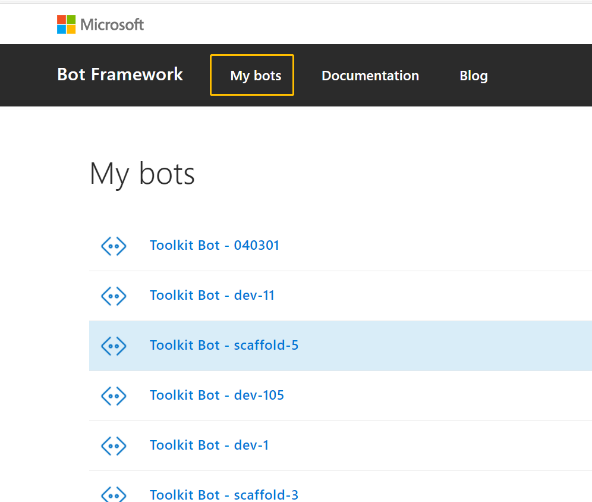
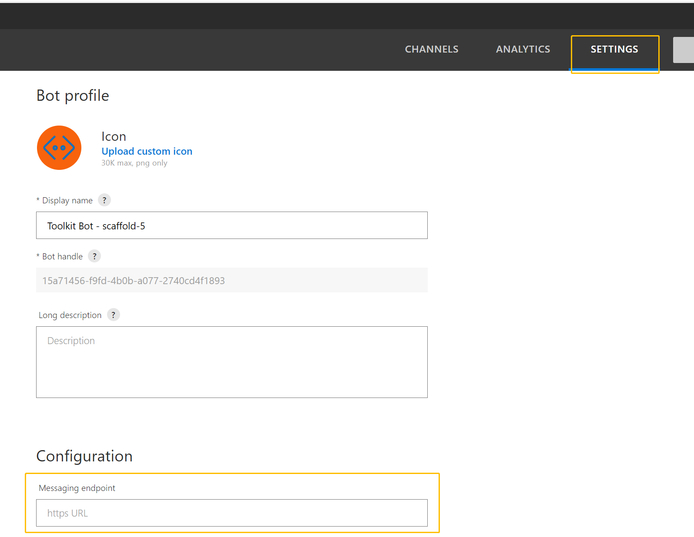
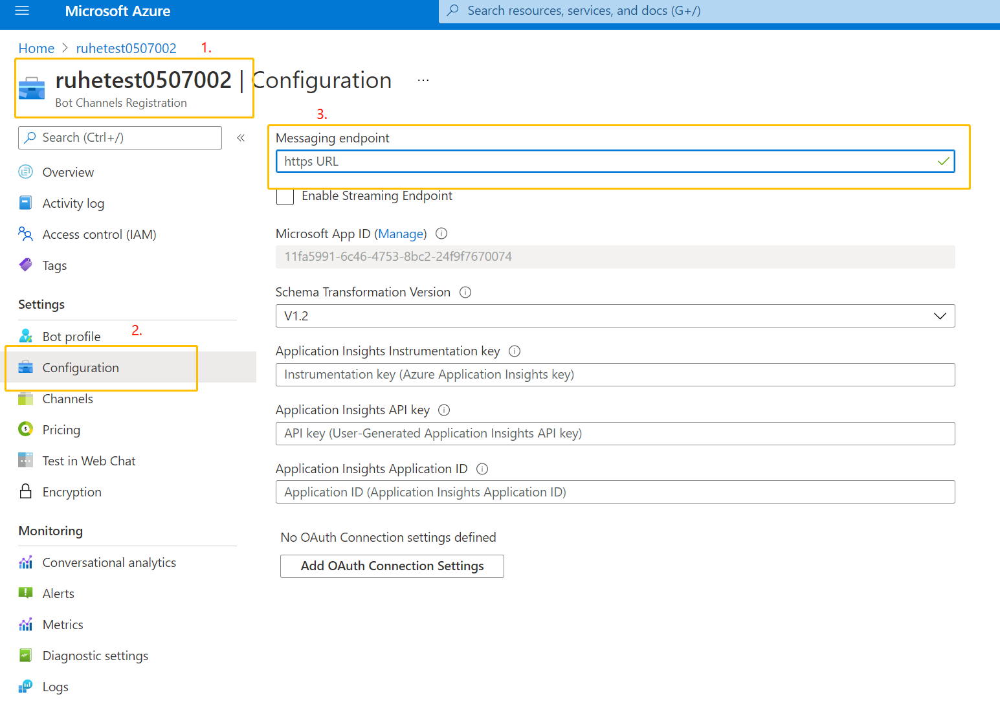

## FreeServerFarmsQuotaError

### Error Message

The maximum number of Free App Service Plan allowed in a Subscription is 10.

### Mitigation

There are two methods to mitigate this issue:

#### Method #1
1. Delete other Free App Service Plan
2. Run `Provision` command again

#### Method #2
1. Open `.fx\env.default.json` file
2. Set value of 'skuName' config of 'fx-resource-bot' to, for example, B1.
3. Run `Provision` command again

## MissingSubscriptionRegistrationError

### Eror Message

The subscription didn't register to use namespace 'Microsoft.BotService'.

### Mitigation

Please refer to this [link](https://aka.ms/rps-not-found) to register your subscription to use namespace 'Microsoft.BotService'.

## How to reuse existing bot registration in Toolkit v2?

Suppose an existing bot has been registered by [azure bot channel registration](https://docs.microsoft.com/en-us/azure/bot-service/bot-service-quickstart-registration?view=azure-bot-service-4.0) or [bot framework's legacy portal](https://dev.botframework.com/bots/new), you can follow this guide to reuse the existing bot registration in Toolkit v2.

No matter registering bot by azure bot channel registration or bot framework's legacy portal, a pair of bot id and bot password will be generated. please copy/paste them after choosing reusing existing bot in Toolkit v2.

### Pay attention!!!
Don't forget to add microsoft teams as a featured channel when registering bot on azure.

### Choose `using an existing bot registration`.

### Enter bot id.

### Enter bot password.

### Record the message endpoint generated during provision.
Toolkit v2 will pop-up a dialog to show the target message endpoint for bot. Users should use this message endpoint to do the updating.

### Update message endpoint.
#### if registering bot by legacy portal:
1. Choose your bot registration on [legacy portal](https://dev.botframework.com/bots) under `My bots`.

2. Scroll down to find `Messaging endpoint` under `Configuration`.

3. Paste the target message endpoint in text box `Messaging endpoint`

#### if registering bot by auzre bot channel registration:
1. Choose your bot channels registration.
2. Click menu `Configuration` in `Settings`.
3. Paste the target message endpoint in text box `Messaging endpoint`.

After updating message endpoint is done, continue to deploy and try the remote experience.