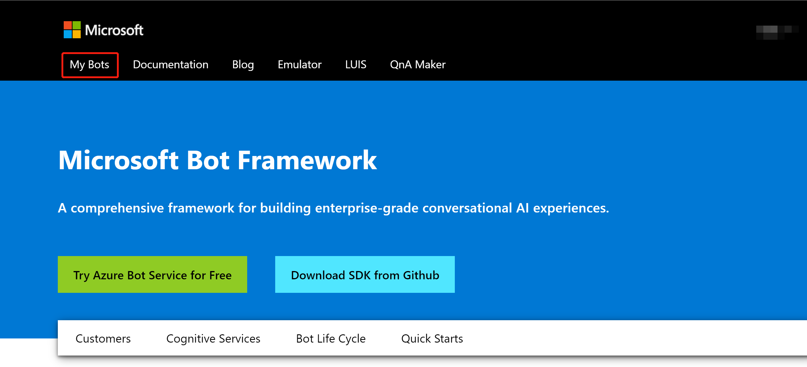
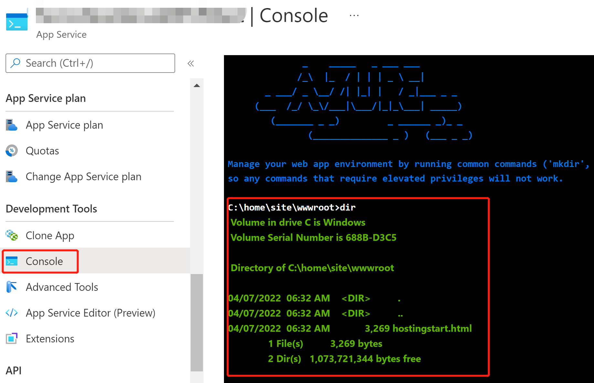
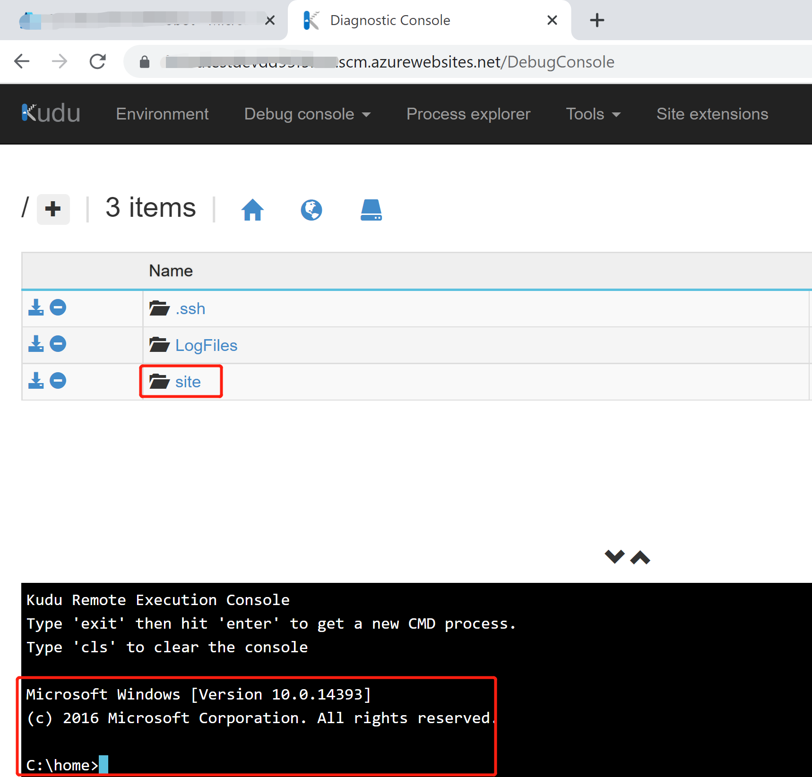
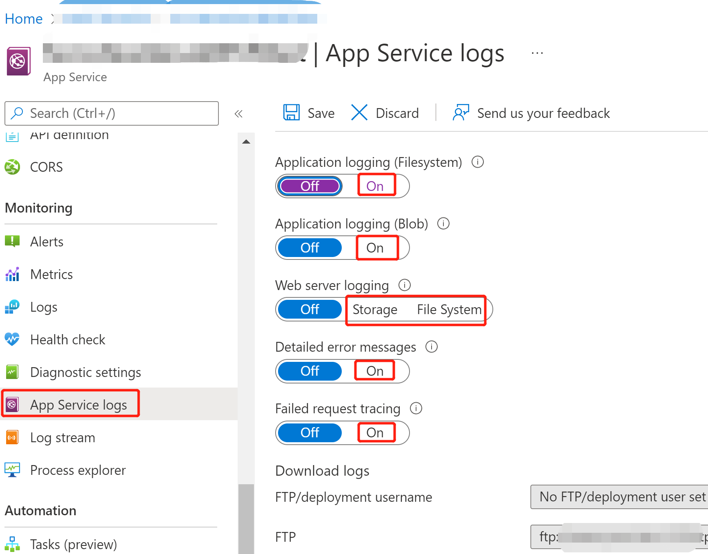
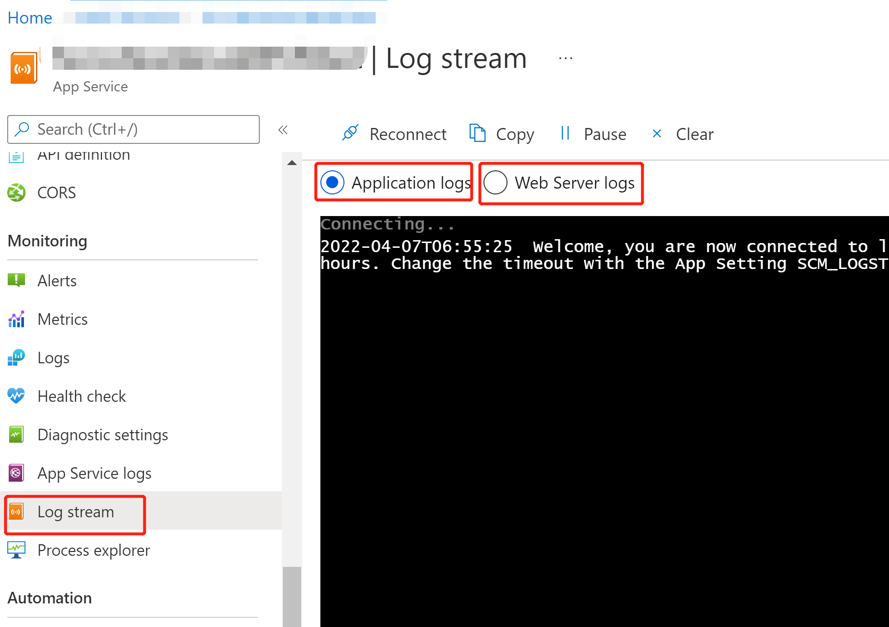

## BT.MissingSubscriptionRegistrationError

### Error Message

The subscription didn't register to use namespace 'Microsoft.BotService'.

### Mitigation

Please refer to this [link](https://aka.ms/rps-not-found) to register your subscription to use namespace 'Microsoft.BotService'.

## BT.BotRegistrationNotFoundError

### Error Message

Bot registration was not found. Click 'Get Help' button to learn more about how to check bot registrations.

### Mitigation

The first step is to make sure the remote bot registration doesn't exist.
Suppose your Teams app's name is `someTeamsApp`, then the target bot registration name you are supposed to find is something like `someTeamsApp-local-debug`. So follow the steps below:
1. Login to [Bot Framework Dev Portal](https://dev.botframework.com/) with your Microsoft 365 account which is the same account you used in Teams Toolkit.
1. Click `My Bots` to check the list of bot registrations associated with the current Microsoft 365 account.

1. Try to find the bot registration with name `someTeamsApp-local-debug`, and check the associated `App ID` if the target bot registration doesn't exist.

Once we verified that the remote bot registration is gone, to resolve the current error, two alternative ways are available.
1. Delete state files (config.local.json, state.local.json) of bot registration, rerun local debug (F5) to create new bot registration for use, if you don't care too much about which bot registration you're trying to use.
1. Find an existing bot registration, and apply [reuse existing AAD](http://aka.ms/teamsfx-bot-help#how-to-reuse-existing-aad-in-toolkit-v2), then rerun local debug (F5).

## How to reuse existing AAD in Toolkit v2?

Suppose an existing AAD has been registered, you can reuse this AAD by configuring Toolkit project settings.

### Register an AAD on Azure Portal
1. Manually create a new App Registration on [Azure Portal](https://ms.portal.azure.com/), note down the **Application (client) ID** on the "overview" page.
2. Create a client secret for the AAD created in step 1, note down the **client secret**.


3. Fill in the appid and secret in `${ProjectFolder}/.fx/configs/config.${env}.json`, add the `bot` section, and the settings will look like:
```
  "manifest": {
        "appName": {
            "short": "xxxx",
            "full": "Full name for xxxx"
        }
    },
    "bot": {
        "appId": "${Application (client) ID}",
        "appPassword": "${client secret}"
    }
```
4. Provision the Bot, then it will reuse this AAD and won't create a new one.

## How can I troubleshoot issues when Teams Bot isn't responding on Azure?
 
For general troubleshooting guidance, please refer to [Bot Framework Troubleshooting Index](https://docs.microsoft.com/en-us/azure/bot-service/bot-service-troubleshoot-index?view=azure-bot-service-4).

When Teams Bot isn't responding, you probably want to check its status on Azure. There're two fundamental points you'd better check first:
### 1. Is the Teams Bot deployed successfully? Is the Teams Bot up and running? Is the basic communication good?
1. Log into Azure by [portal](https://portal.azure.com/) and find your Azure Bot's app service.
1. Check if the deployment artifacts are existing under the folder of `wwwroot` by Console in control panel:

or the scm website `<yourwebsite>.scm.azurewebsites.net/DebugConsole`:

1. If you also host some static pages with the Bot, you can try to access the target urls to see if they're available. 
### 2. Is there anything wrong in the server log or application log?
1. As above, you have to log into Azure first.
1. Turn on app service logs.

1. Click `Log stream`, then try to send some messages to the Teams Bot.
1. Try to see if there any logs streamed out after a short delay.

1. Hopefully, you may find some insights about the reason why the Teams Bot isn't responding.
