# Local Debug FAQ

## Overall
Teams Toolkit allows you to debug your Teams app locally by leveraging Visual Studio Code debugging features. After pressing F5, several components of the app will be automatically started. The Teams web client will then be launched in your browser. Specifically, the following components may be started according to your app capabilities:
- Tab: a react app required by Teams Tab capability
- Auth: an authentication service acting as a proxy between the app and Azure Active Directory
- Function: a Azure Functions app that may be needed by Tab
- Bot: a bot server required by Teams Bot capability
- Ngrok: a tunneling service required by Teams Bot that forwards local address to public address

During debugging, a localhost development certificate will also be automatically generated and installed to your system after your confirmation.

Some frequently asked questions are listed bellow.

## Which ports will be used?
| Component | Port |
| --- | --- |
| Tab | 53000, or 3000 (for Teams Toolkit version < 3.2.0) |
| Auth | 55000. or 5000 (for Teams Toolkit version < 3.2.0) |
| Function | 7071 |
| Node inspector for Function | 9229 |
| Bot / Messaging Extension | 3978 |
| Node inspector for Bot / Messaging Extension | 9239 |

## What to do if some port is already in use?

### Error


### Reason
This is mainly because this port was not successfully closed after last local debug.

### Mitigation
You can follow the scripts below to find the process that occupies this port, and to kill that process. After the process is killed, start debugging again.

For Windows, in cmd or powershell:
```cmd
> netstat -ano | findstr <port>
> tskill <process id>
```

For Linux or OSX, in shell:
```shell
$ lsof -i:<port>
$ kill <process id>
```

## What to do if I want to add my own environment variables for local debug?
You can add your own local debug environment variables for frontend (`tabs/`), function (`api/`) and bot (`bot/`) components. There may already be a `.env.teamsfx.local` file under each component folder, with following content:
```
# TeamsFx will overwrite the following variable values when running debug
M365_CLIENT_ID=xxx
M365_CLIENT_SECRET=xxx
...
# Following variables can be customized or you can add your owns
# FOO=BAR
...
```

Just append your own local environment variables to that file.

Or, if there's no `.env.teamsfx.local` file in your project (e.g., migrated from legacy project), feel free to create `.env.teamsfx.local` file under `tabs/` or `api/` or `bot/` folder with your own environment variables. Teams Toolkit does add values to `.env.teamsfx.local` but will reserve yours.

## What to do if I want to use my own tunneling service instead of the built-in one for Bot or Messaging Extension?
### Reason
Since Bot and Messaging Extension requires a public address as the messaging endpoint, ngrok will be used by default to automatically create a tunnel connection forwarding localhost address to public address.

### Mitigation
To use your own tunneling service, you should set `siteEndpoint` configuration in *.fx/configs/config.local.json* under the project root.
```json
{
    "bot": {
        "siteEndpoint": "https://02f6-2404-f801-9000-1a-908c-79ca-3a8-ee86.ngrok.io"
    }
}
```
Please note that the `botEndpoint` should use https protocol.

You should also close the ngrok validation during local debug.

For VSCode, you should set the setting `fx-extension.prerequisiteCheck.skipNgrok` to be false.

For CLI, you should run command `teamsfx config set validate-ngrok off`.

## localdebug-plugin.NgrokTunnelNotConnected
### Error Message
Ngrok tunnel is not connected. Check your network settings and try again.

### Mitigation
Please ensure that your network connection is stable and then try again.

Or you can use your own tunneling service by following [the configuration](#what-to-do-if-i-want-to-use-my-own-tunneling-service-instead-of-the-built-in-one-for-bot-or-messaging-extension).

## What to do if Teams shows "App not found" when the Teams web client is opened?
### Error


### Reason

This is mainly because the Teams account you logged in when the Teams web client is opened is different from the M365 account you logged in when developing the Teams app.

### Mitigation
Please make sure you use the same M365 account. After logging in the correct account, start debugging again. You can see which M365 account you logged in via Teams Toolkit, like:


## What to do if Teams shows "Something went wrong" when the Teams web client is opened?
### Error


### Reason
This is mainly because there is some error in manifest.

### Mitigationn
Please [open an issue](https://github.com/OfficeDev/TeamsFx/issues/new/choose) with enough context and information.

## What to do if Teams shows "Permission needed" when the Teams web client is opened?
### Error


### Reason

This is mainly because the custom app uploading is not turned on for your Teams tenant.

### Mitigation
You can follow [this document](https://docs.microsoft.com/en-us/microsoftteams/platform/concepts/build-and-test/prepare-your-o365-tenant#enable-custom-teams-apps-and-turn-on-custom-app-uploading) to turn it on.

## What to do if I do not want to install the development certificate?
### Reason
Since Teams requires https Tab hosting endpoint, a localhost development certificate will be automatically generated and installed to your system after your confirmation. The confirmation window will be popped up during debugging, like:

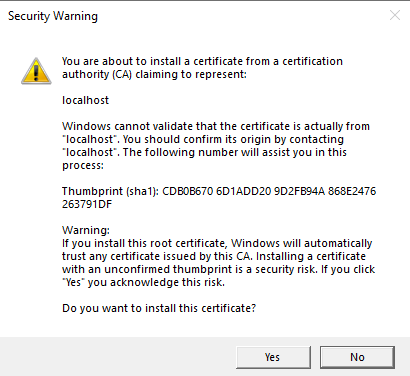

### Mitigation
We recommend you to install the development certificate. However, if you do not want to install the development certificate and do not want the confirmation window to pop up every time during debugging, you can follow the script bellow to disable the development certificate.

Close the trust development certificate setting, then start debugging.

For VSCode, you should set the setting `fx-extension.prerequisiteCheck.devCert` to be false.
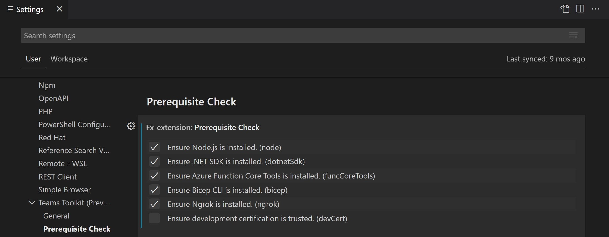
For CLI, you should run command `teamsfx config set trust-development-certificate off`.

If so, an error will show in the Tab page of your app, look like:


To resolve this issue, open a new tab in the same browser, go to https://localhost:53000/index.html#/tab, click the "Advanced" button and then select "Proceed to localhost (unsafe)". After doing this, refresh the Teams web client.


## How to manually install the development certificate for Windows Subsystem for Linux (WSL) users?
### Reason
Since Teams requires https Tab hosting endpoint, a localhost development certificate will be automatically generated when you launch local debug. Teams toolkit runs on WSL but the browser runs on Windows, so the dev certificate will not be automatically installed. If the development certificate is not installed, local debug will fail after adding app to Teams.


### Mitigation
#### Method 1: Trust the development certificate in browser
This method is simpler but only takes effect for current browser. You need to repeat these steps for each browser you use to debug your app.

1. Open a new tab in the same browser, go to https://localhost:53000/index.html#/tab.
2. Click the "Advanced" button and then select "Proceed to localhost (unsafe)".
3. Refresh the Teams web client.


#### Method 2: Trust the development certificate in Windows
This method is a little bit more complex but it takes effect globally. You only need to do once for all browsers.

1. Open the certificate folder of your WSL distribution in Windows Explorer (example path: `\\wsl$\{DISTRO_NAME}\home\{USER_NAME}\.fx\certificate`).

    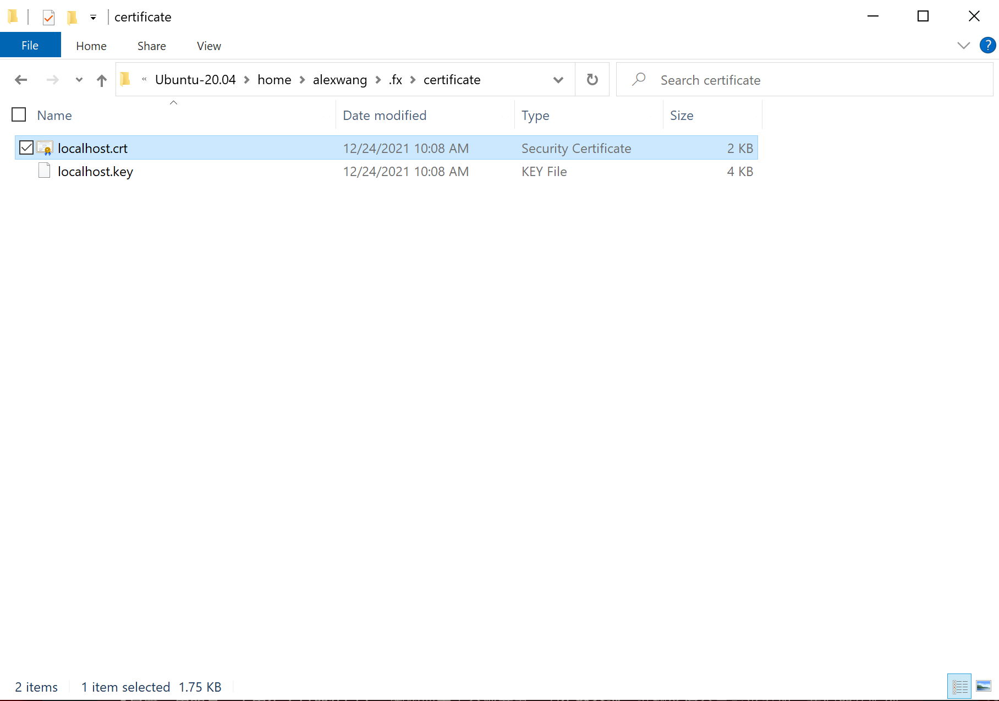

2. Open "localhost.crt" and click "Install Certificate...".

    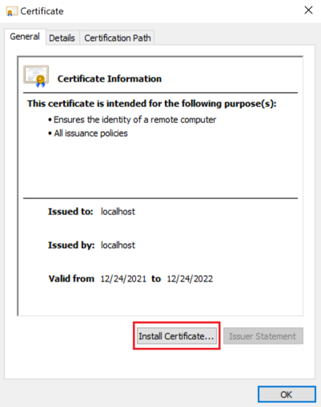

3. In the "Certificate Import Wizard", select "Next".

    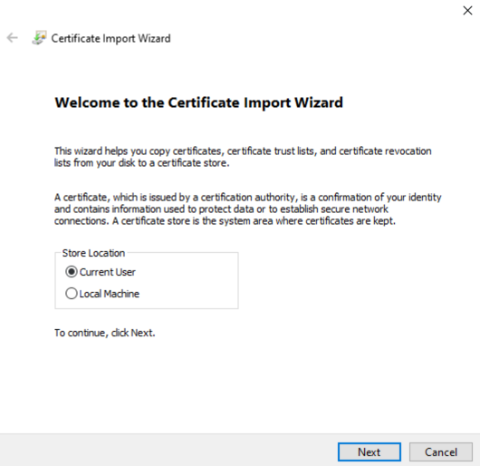

4. Select "Place all certificates in the following store" and click "Browse".

    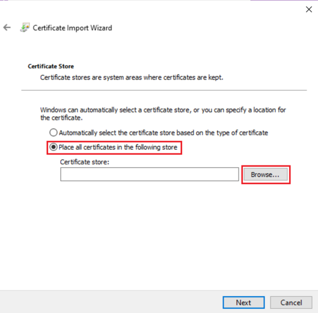

5. Select "Trusted Root Certification Authorities", click "OK" and then click "Next".

    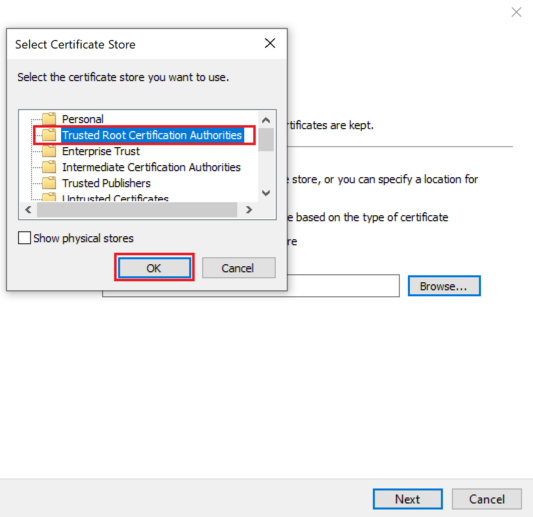

6. Click "OK" to confirm importing the certificate.

    

7. You will see a confirmation that the import process has succeeded.

    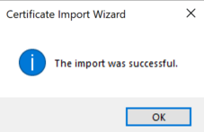

8. Restart your browser to take effect.

## SPFx known issue on Teams workbench debug on macOS/Linux
### Error
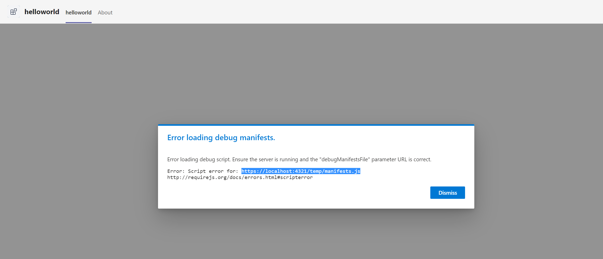
### Reason
For SPFx project, our toolkit will also help install the development certificate but it may be invalid on macOS/Linux system, thus on Teams workbench debug, it will fail to connect the local debug manifest url.
### Mitigation
To resolve this issue, open a new tab in the same browser, go to https://localhost:4321/temp/manifests.js, click the "Advanced" button and then select "Proceed to localhost (unsafe)". After doing this, refresh the Teams web client.

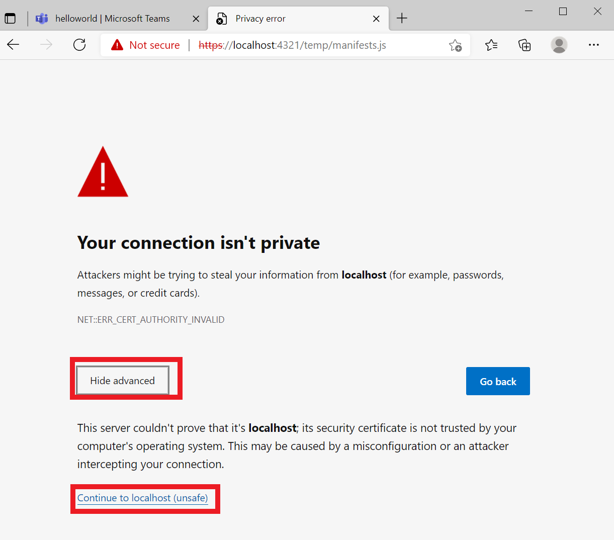

## Error "Value cannot be null. (Parameter 'provider')" when starting bot/api project
### Error
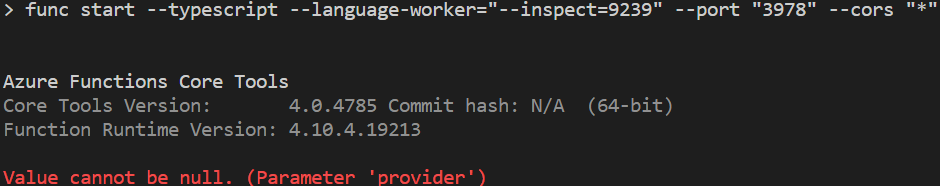
### Reason
Azure Functions Core Tools will download required dependencies on the first execution. This error occurs when there's failure during the dependency downloading period.
### Mitigation
To resolve this issue, ensure your network connection is stable when launching local service, and try again.

If still fail with the same error, try:
- Set Azure Functions log level to "*Debug*" to get more detailed logs when starting.
  ``` json
  // host.json of your azure functions
  {
    "version": "2.0",
    "logging": {
      ...
      "logLevel": {
        "default": "Debug"
      }
    },
    ...
  }
  ```
- Clear Azure Functions Core Tools local cache at `${HOME}/.azure-functions-core-tools/`.