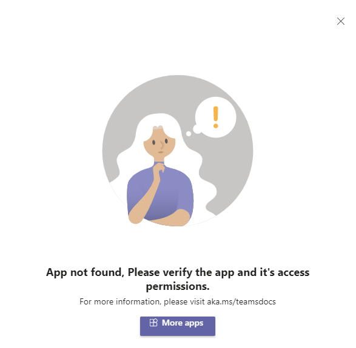
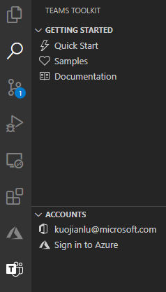
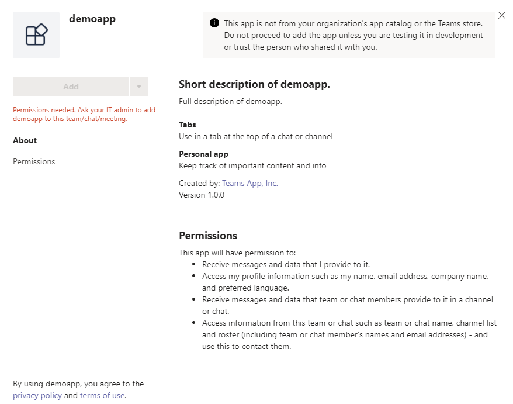

# Local Debug FAQ

## Which ports will be used?
| Port | Component |
| --- | --- |
| 3000 | Tab |
| 5000 | Auth |
| 7071 | Function |
| 9229 | Node inspector for Function |
| 3978 | Bot / Messaging Extension |
| 9239 | Node inspector for Bot / Messaging Extension |

## What to do if some port is already in use?
This issue may look like:


This is mainly because this port was not successfully closed after last local debug. You can follow the scripts below to find the process that occupies this port, and to kill that process. After the process is killed, start debugging again.

### Windows
In cmd or powershell:
```cmd
> netstat -ano | findstr <port>
> tskill <process id>
```

### Linux / OSX
In shell:
```shell
$ lsof -i:<port>
$ kill <process id>
```

## What to do if Teams shows "App not found" when sideloading?
This issue may look like:



This is mainly because the Teams account you logged in when sideloading is different from the M365 account you logged in when developing the Teams app. Please make sure you use the same M365 account. After logging in the correct account, start debugging again.

You can see which M365 account you logged in via Teams toolkit, like:



## What to do if Teams shows "Permission needed" when sideloading?
This issue may look like:



This is mainly because the custom app uploading is not turned on for your Teams tenant. You can follow [this document](https://docs.microsoft.com/en-us/microsoftteams/platform/concepts/build-and-test/prepare-your-o365-tenant#enable-custom-teams-apps-and-turn-on-custom-app-uploading) to turn it on.

## What to do if I want to use my own tunnelling service instead of ngrok for bot or messaging extension?
By default, ngrok will be used to create a tunnel connection forwarding localhost address to public address.

Set the following configurations in *.fx/default.userdata* under the project root, then start debugging, like:
```
fx-resource-local-debug.skipNgrok=true
fx-resource-local-debug.localBotEndpoint=https://767787237c6b.ngrok.io
```
Please note that the bot endpoint should use https protocol.

## What to do if I do not want to trust the development certificate?
Set the following configuration in *.fx/default.userdata* under the project root, then start debugging, like:
```
fx-resource-local-debug.trustDevCert=false
```
