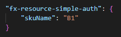

## FreeServerFarmsQuotaError

### Error Message

The maximum number of Free App Service Plan allowed in a Subscription is 10.

### Mitigation

There are three methods to mitigate this issue:

#### Method #1
1. Delete other Free App Service Plan
1. Run `Provision` command again

#### Method #2
1. Open `.fx\env.default.json` file
1. Set value of 'skuName' config of 'fx-resource-simple-auth' 

    

1. Run `Provision` command again

#### Method #3
1. Set 'SIMPLE_AUTH_SKU_NAME' environment variable with the SKU name (e.g. `B1`) in your computer 
1. Close all VS Code windows (to make environment variable take effect)
1. Open VS Code 
1. Run `Provision` command again