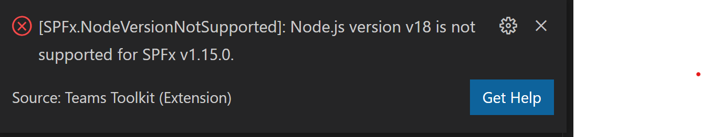
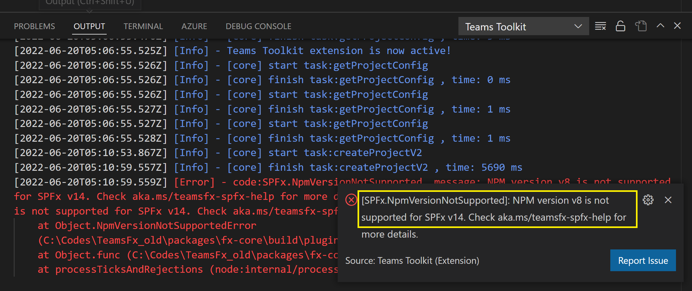
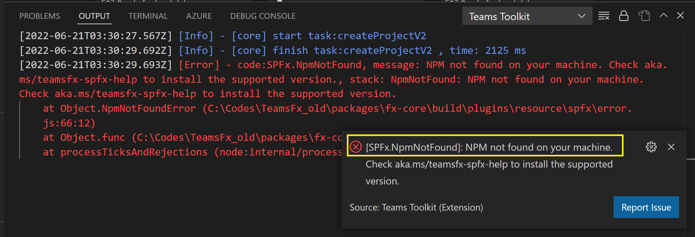
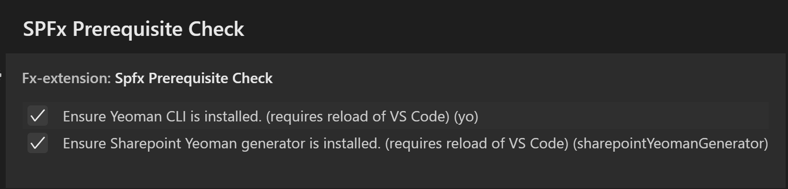
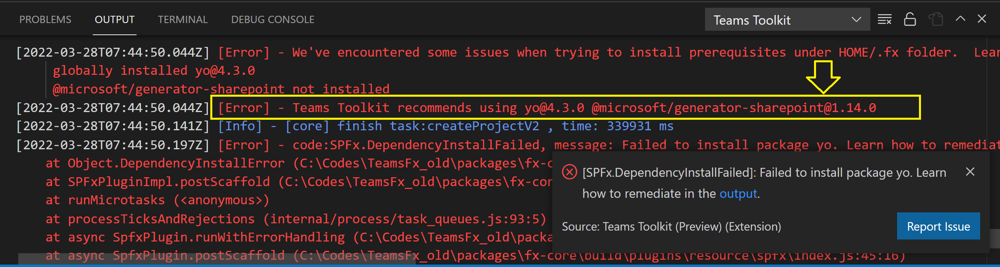

# SPFx troubleshoot

1. [Node.js and NPM compatiblity issues](#compatibility)
2. [Failure to install prerequisites](#prerequisites)
3. [Failure to add additional SPFx tab](#addfeature)


## 1. Node.js and NPM compatiblity issues<a name="compatibility"></a>
The following table lists SharePoint Framework and compatible versions of common tools and libraries, according to the [SharePoint Framework compatibility page](https://docs.microsoft.com/en-us/sharepoint/dev/spfx/compatibility#spfx-development-environment-compatibility):
|SPFx|Node.js|NPM|TypeScript|React|
|--------------|-----------|------------|-----------|------------|
| 1.14 | LTS v12, LTS v14 | v5, v6 | v3.9 | v16.13.1 |
| 1.15 | LTS v14, LTS v16 | v6, v7, v8 | v4.5 | v16.13.1 |
| 1.16 | LTS v16.13+ | v7, v8 | v4.5 | v17.0.1 |

### Error message
Teams Toolkit automatically checks Node.js and NPM versions for the latest SharePoint Framework it supports (SPFx v1.16.1 as of writing). You will encounter the following errors during scaffolding if Teams Toolkit detects unsupported Node.js or NPM versions:

#### SPFx.NodeVersionNotSupported



#### SPFx.NpmVersionNotSupported



#### SPFx.NpmNotFound

Teams Toolkit also checks if NPM is installed.


### Remediation

Check your npm and Node.js version. The SharePoint Framework [v1.16.1](https://docs.microsoft.com/en-us/sharepoint/dev/spfx/set-up-your-development-environment#install-nodejs) is supported on the following Node.js versions:

- Node.js v16 LTS (v16.13.x - v16.18.x, aka: Gallium)

**Corresponding npm version is v7, v8 for SPFx v1.16**. Please make sure you have the right version installed for both npm and Node.js.

## 2. Failure to install prerequisites<a name="prerequisites"></a>

For SPFx app, Teams Toolkit uses Yeoman Generator for scaffolding. This requires both [Yeoman CLI](https://github.com/yeoman/yo) and the correct SPFx generator version to be installed.

### Error message
SPFx scaffolding could fail due to unsuccessful installation of above prerequisites:

#### _"We've encountered some issues when trying to install prerequisites under HOME/.fx folder"_

### Remediation

As the default behavior, Teams Toolkit will try to install them locally under `HOME/.fx`. Should the installation fail, we would revert to use your globally installed ones.

#### Step 1: Disable Prerequisite Checker

Go to _Manage > Settings > Extension > Teams Toolkit > SPFx Prerequisite Check_ or run 'Preferences: Open User Settings'.


And uncheck these 2:

- Ensure Yeoman CLI is installed
- Ensure SPFx generator is installed

#### Step 2: Manually install or upgrade

In the output message in VSC, you should see the versions for Yeoman CLI and SPFx generator that Teams Toolkit supports. In this example output message, you can see that they are `4.3.0` and `1.14.0`:


In the following, navigate to **your applicable scenario**:

##### 1. If you have Yeoman CLI and SPFx generator installed with the correct versions

Teams Toolkit will use them for scaffolding, there's no further action that needs to be taken now. You can now retry creating a new SPFx Teams app.

##### 2. If no Yeoman CLI is installed in your system

1. Run this any place in a terminal:

```sh
npm install --global yo
```

2. Install the SPFx generator version that Teams Toolkit supports, say `1.14`:

```sh
npm install @microsoft/generator-sharepoint@1.14 -g
```

##### 3. If you have Yeoman CLI installed but it's not the correct version

Install the Yeoman CLI version that Teams Toolkit supports, say `4.3.0`:

```sh
npm install --global yo@4.3.0
```

##### 4. If you have Yeoman CLI installed but no SPFx generator

Install the SPFx generator version that Teams Toolkit supports, say `1.14`:

```sh
npm install @microsoft/generator-sharepoint@1.14 -g
```

##### 5. If you have SPFx generator installed but it's not the correct version

1. If the global version is higher than the supported version

You can continue with your currently installed version but please note that some of the latest features might not be supported in Teams Toolkit.

2. If the global version is lower than supported
Install the SPFx generator version that Teams Toolkit supports, say `1.14`:

```sh
npm install @microsoft/generator-sharepoint@1.14 -g
```

## 3. Failure to add additional SPFx tab<a name="addfeature"></a>

Multi-tab SPFx project is supported in Teams Toolkit. To add an additional SPFx tab, you can try "Add features" and select "SPFx tab". Behind the scenes, Yeoman Generator is executed according to the configuration file (.yo-rc.json) in the current solution.

If .yo-rc.json file doesn't exist in your SPFx project, adding SPFx tab will fail with the following error:

#### SPFx.NoConfigurationFile


### Remediation

Please follow the instructions here to continue:

- If your project is created by Teams Toolkit lower than v3.7.0, please create SPFx project with latest Teams Toolkit and migrate your codes.
- If your project is downloaded from Todo-list-SPFx sample app, please add the following configuration file to `SPFx` subfolder in your project:

```
{
  "@microsoft/generator-sharepoint": {
    "plusBeta": false,
    "isCreatingSolution": true,
    "version": ${SPFx_versioin},
    "libraryName": "todo-list-sp-fx",
    "libraryId": "c314487b-f51c-474d-823e-a2c3ec82b1ff",
    "environment": "spo",
    "packageManager": "npm",
    "solutionName": "todo-list-sp-fx",
    "solutionShortDescription": "todo-list-sp-fx description",
    "skipFeatureDeployment": true,
    "isDomainIsolated": false,
    "componentType": "webpart",
    "template": "react"
  }
}
```
Note: Replace `SPFx_version` with the SPFx version used in your project.