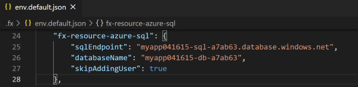

## SQL.DatabaseUserCreateError

### Error Message

database <database> create user <user> failed. 

### Mitigation

#### Step #1 add skip flag
1. Open `.fx\env.default.json` file.
1. Set value of 'skipAddingUser' config of 'fx-resource-azure-sql'.

      

1. Run `Provision` command again.

#### Step #2 add database user manually

To make sure the identity user can access to database correctly, you should add database user manually.
Since the current logged in account hasn't enough permission to add database user, you may get a user account have enough permission to access to database. 
1. Find values of 'sqlEndpoint', 'databaseName' config of 'fx-resource-azure-sql' and value of 'identity' config of 'fx-resource-identity'.

      

1. Provision aad admin in SQL Database. You can follow [set aad admin](https://docs.microsoft.com/en-us/azure/azure-sql/database/authentication-aad-configure?tabs=azure-powershell#provision-azure-ad-admin-sql-database) to set aad admin for the {sqlEndpoint}. 
   
   *Note: The aad admin account should own enough permission to add {identity} as user in database. You can try to use the **account logged-in Azure** first. If the Azure account lacks permission, you may seek for account with more permission to do it*

1. Login the SQL server from portal and select database to login.

      

1. Create contained database users. Execute Transact-SQL. 

   ```
   CREATE USER [{identity}] FROM EXTERNAL PROVIDER;
   go
   sp_addrolemember  'db_datareader',  '{identity}';
   go
   sp_addrolemember  'db_datawriter',  '{identity}';
   go
   ```

      

