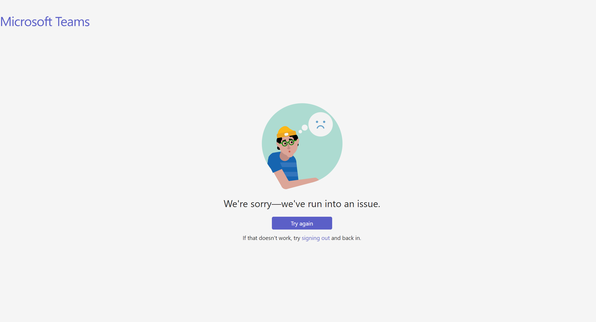
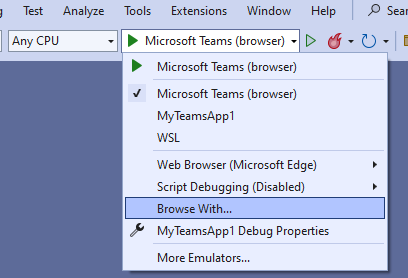
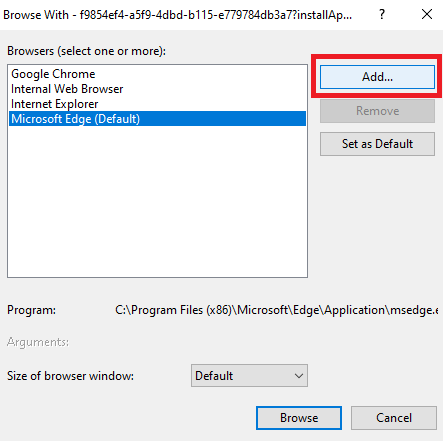
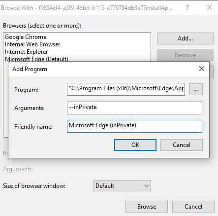
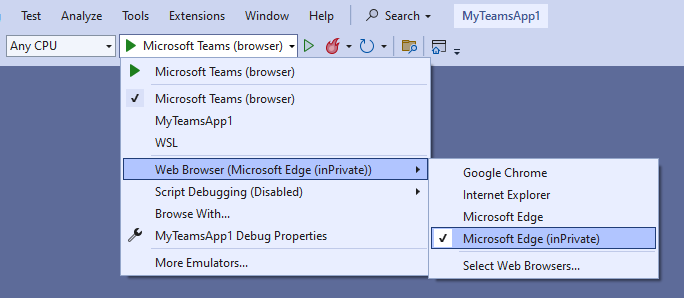

This doc is to help you understand what will happen when provisioning in an already-provisioned environment but with different account or Azure subscription or local debugging again with another Microsoft 365 account. We will also explain how to recover from the backups in this doc.

> Important Notes: After switching accounts and provisioning or local debugging again, resources have been created before in the old Microsoft 365 tenant or Azure subscription won't be deleted by default, and you have to manully delete them to avoid further costs if any. 

## Switch Microsoft 365 Account
### Local Debug
You could run local debugging for a Teams project with one Microsoft 365 tenant and then easily switch to another tenant for further local debugging. To do this, you only need to:
1. Sign out of the current Microsoft 365 account.
2. Sign in to the new account.
3. Start local debugging.

After that, we will 
1. Back up configuration files for local environment. [Learn more about backup & recover](#backup--recover).
2. Create all resources required for the local environment in the new Microsoft 365 tenant.
3. `state.local.json` file in .fx/states folder will be overwritten with the information of new resources in the new Microsoft 365 tenant. If the project requires AAD, `local.userdata` will be overwritten with the new client secret.

### Provision in a Remote Environment
You could provision resources in a remote environment with one Microsoft 365 tenant and then re-provision in the same environment but with another Microsoft 365 tenant. To do this, you only need to:
1. Sign out of the current Microsoft 365 account.
2. Sign in to the new account.
3. Start provision in the selected environment.

After that, we will 
1. Back up configuration files for the selected environment. [Learn more about backup & recover](#backup--recover).
2. Create a new Teams app and a new AAD app (if needed) in the new Microsoft 365 tenant. 
3. If the project requires Azure bot service, we will generate a new bot service name and save it as the value of "botServiceName" in `azure.parameters.{env}.json`. We will use this new name to provision a new Azure bot service in the selected resource group and the subscription since it is not allowed to edit the value of Microsoft App ID of an existing Azure bot service. 
4. If the project requires AAD, `{env}.userdata` will be overwritten with the new client secret.


## Switch Azure Subscription
### Provision in a Remote Environment
You could provision Azure resources of a remote environment in one Azure subscription and then switch to another Azure subscription for this environment. To do this, you only need to:
1. Sign out of the current Azure account if the subscription you are going to use is in another Azure account.
2. Select the correct subscription.
3. Start provision in the selected environment.

After that, we will
1. Back up configuration files for the selected environment. [Learn more about backup & recover](#backup--recover).
2. Update the value of "resourceBaseName" in `azure.parameters.{env}.json`.
3. If the project contains Azure bot service, we will create a new AAD app since a Microsoft App ID is required to create an Azure Bot resourc and one Microsoft App Id can only be registered to one bot application. We will replace the value of "fx-resource-bot.botPassword" in `{env.userdata}` with the new secret.
4. Start provision in the selected environment.

## Backup & Recover
### Why Backup
Configuration files will be overwritten by Teams Toolkit when provisioning in an already-provisioned environment but with different Microsoft 365 tenant or Azure subscription or local debugging again with another Microsoft 365 tenant. We will back up those files so that you could use the backups to locate the resources created using the previous account and then delete what you no longer need. Also with the help of backups, you could continue using the resources created before easily when you decide to switch back to the accounts or the subscription that you selected before. Otherwise, new resources will be created, and you have to delete the old resources manully to avoid costs.
### Backup
We will keep all backups in the .backup/.fx folder and name those backups with the current date and time in the format of YYYYMMDDHHMMSS (which is the value of "time" mentioned below) when a backup happens. "env" below indicates the environment you select, which could be local or any remote environment.
* The backup of `state.{env}.json` will be `state.{env}.{time}.json` in the .backup/.fx/states folder which contains generated resources information of the local or remote environment.
* `azure.parameters.{env}.json` will be copied and saved to `azure.parameters.{env}.{time}.json` in the .backup/.fx/configs folder if your project contains Azure resources and you have selected a remote environment.
* The backup of `{env}.userdata` which exists when your project requires AAD will be `{env}.{time}.userdata` in the ./backup/.fx/statesfolder which contains secret information.

### Recover
If you want to switch back to the account or subscription and reuse resources that have been provisioned before:
* Sign in with the correct accounts and select the correct Azure subscription.
* Determine the date and time of the backup that you want to recover.
* Keep a copy of `state.{env}.json`, `azure.parameters.{env}.json` and `{env}.userdata`.
* Copy the content of `state.{env}.{time}.json` to `state.{env}.json`.    
Note: if you want to recover for a remote environment and you have added new features, please edit the value of "provisionSucceeded" to "false" to provision resources required for the newly added features.
* If `{env}.{time}.userdata` exists in the backup folder, replace the content of `{env}.userdata` with the content of `{env}.{time}.userdata`. 
* If you want to recover for a remote environment and your project previously contains Azure sources, update the value of "resourceBaseName" and "botServiceName"(delete this key if not exists) to the value defined in `azure.parameters.{env}.{time}.json`.
* Run provision and deploy again.    
* Delete the backups when you think there is no need to keep them.

## Error
### Could not be Redirected to the Expected Teams Web Page
If you have previewed (local or remote) your Teams app in one Microsoft 365 tenant and then switch to another Microsoft 365 account, you may encounter error as shown below 

once the browser is launched when previewing in the new Microsoft 365 tenant. If clicking "try again" or waiting for a few seconds to let Teams bring you to the sign in page, you may notice that the page won't be redirected correctly to the page of adding the Teams app. This happens due to the previous account info saved in the browser storage.

#### Mitigation
* Launch browser with userData    
By default, the browser is launched with a separate user profile in a temp folder. You could override the value of "userDataDir" to "true" and then specify the path of user data folder in runtimeArgs.
  *  Visual Studio Code    
  For example, when you sign in with another Microsoft 365 account for local debugging, you could replace    
      ```
      {
        "name": "Attach to Frontend (Edge)",
          "type": "pwa-msedge",
          "request": "launch",
          "url": "https://teams.microsoft.com/l/app/${localTeamsAppId}?installAppPackage=true&webjoin=true&${account-hint}",
          "presentation": {
              "group": "all",
              "hidden": true
          }
      }
      ```
      with 
      ```
      {
        "name": "Attach to Frontend (Edge)",
          "type": "pwa-msedge",
          "request": "launch",
          "url": "https://teams.microsoft.com/l/app/${localTeamsAppId}?installAppPackage=true&webjoin=true&${account-hint}",
          "presentation": {
              "group": "all",
              "hidden": true
          },
          "userDataDir": true, // Enable to use customized user data folder.
          "runtimeArgs": [
            "--user-data-dir=C:\\Users\\{username}\\temp\\edge\\tenantb" // Pass the path of user data folder here.
          ]
      }
      ```
      If you want to switch back to the previous Microsoft 365 tenant for local debugging, please remove the lines about userDataDir and runtimeArgs that you just added before starting local debugging again.

      You could also specify the path of user data folder for each tenant, and edit the value of "user-data-dir" in runtimeArgs whenever you switch tenant for preview.

  * Visual Studio    
  When running local debug of a Teams project launched in Visual Studio, you could create a new browser configuration after switching to another Microsoft 365 tenant by following steps mentioned in [Add Browser Configuration in Visual Studio](#add-browser-configuration-in-visual-studio). Type `--user-data-dir=C:\\Users\\{username}\\temp\\edge\\tenantb` (replace the path with what it makes sense to you) as the argument when adding the program. And then choose the corresponding browser configuration before local debugging.    
  
     If you want to preview a Teams app in Visual Studio after switching Microsoft 365 tenant, you could copy the preview URL shown in the output pane and then run your browser with arguments using command line. For example, you could start Edge with `msedge.exe --user-data-dir="C:\\Users\\{username}\\temp\\edge\\tenantb"`. Once the browser is launched, paste the preview URL.
 
* Launch browser in incognito mode    
  This may not work for you if your org enables condition access. 
  * Visual Studio Code     
  runtimeArgs are the arguments passed to the runtime executable. You could edit the launch configuration by adding `"runtimeArgs": ["--inprivate"]` (for Edge) or `"runtimeArgs": ["--incognito"]` (for Chrome) to launch the browser in incognito mode. For example, you could replace 
    ```
    {
       "name": "Attach to Frontend (Edge)",
        "type": "pwa-msedge",
        "request": "launch",
        "url": "https://teams.microsoft.com/l/app/${localTeamsAppId}?installAppPackage=true&webjoin=true&${account-hint}",
        "presentation": {
            "group": "all",
            "hidden": true
        }
    }
    ```
    with 
    ```
    {
       "name": "Attach to Frontend (Edge)",
        "type": "pwa-msedge",
        "request": "launch",
        "url": "https://teams.microsoft.com/l/app/${localTeamsAppId}?installAppPackage=true&webjoin=true&${account-hint}",
        "presentation": {
            "group": "all",
            "hidden": true
        },
        "runtimeArgs": ["--inprivate"] // runtimeArgs that you need to add
    }
    ```

    to always start Edge in InPrivate browsing mode when local debugging.

  * Visual Studio     
    Similarly, for a Teams project launched in Visual Studio, you could create a new browser configuration by following steps mentioned in [Add Browser Configuration in Visual Studio](#add-browser-configuration-in-visual-studio). For arguments when adding the program, type `--inPrivate` (Edge) or `--incognito` (Chrome).

     If you want to preview a Teams app in a remote environment, you could launch the browser in incognito mode and then copy the preview URL shown in the output pane and paste it in the browser.
    
    

## Appendix 
### Add Browser Configuration in Visual Studio
To create a new browser configuration in Visual Studio, you could
1. Open the dropdown and select "Browser with".     

2. Select "Ädd" to add a new profile   

3. Find the path of the program, type the arguments you need in the field of "Arguments", and give it a friendly name. For example, we add a new configuration for Edge inPrivate mode as shown in the image below.    

4. Select the newly added broswer configuration and then Visual Studio will launch browser with the selected configuration.    


