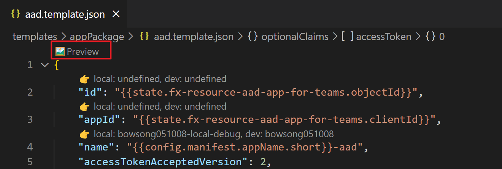

## Using existing Microsoft Entra app in TeamsFx project

This doc is for using existing Microsoft Entra app or Manually Create Microsoft Entra app for TeamsFx project. Please follow the instruction and make sure all reqirued info is properly set in your TeamsFx project.


### Create an Microsoft Entra app

> You may skip this part if you already has an Microsoft Entra app.

1. Go to the [Azure Portal](https://portal.azure.com) and select "Azure Active Directory".

1. Select "App Registrations" and click on "New registration" to create a new Microsoft Entra app:
   * **Name**: The name of your configuration app.
   * **Supported account types**: Select "Account in this organizational directory only"
   * Leave the "Redirect URL" field blank for now.
   * Click on the "Register" button.

1. When the app is registered, you'll be taken to the app's "Overview" page. Copy the **Application (client) ID** and **Object ID**; we will need it later. Verify that the "Supported account types" is set to **My organization only**.

### Create client secret for Microsoft Entra app (Required)

1. Go to app's "Certificates & secrets" page, select "Client Secret" and Click on "New client secret".
   * **Description**: The descirption of your client secret.
   * **Expires**: The expire time of your client secret.
   * Click on the "Add" button.

1. When the client secret is added, press the copy button under the "Value" column to copy the **Client Secret**.


### Create Access As User Scope for Microsoft Entra app (Optional)

> You can skip this part if your M365 account has permission to update this Microsoft Entra app. We will create the scope for you.

1. Go to app's "Expose an API" page, click on "Add a scope" under "Scopes defined by this API".
   * Click on "Save and continue".
   * **Scope name**: Fill in "access_as_user".
   * **Who can consent?**: Choose "Admins and users".
   * **Admin consent display name**: Fill in "Teams can access app’s web APIs".
   * **Admin consent description**: Fill in "Allows Teams to call the app’s web APIs as the current user.".
   * **User consent display name**: Fill in "Teams can access app’s web APIs and make requests on your behalf".
   * **User consent description**: Fill in "Enable Teams to call this app’s web APIs with the same rights that you have".
   * **State**: Choose "Enabled".
   * Click on "Add scope".

1. On the same page, click on "Add a client application" under "Authorized client applications".
   * **Client ID**: Fill in "1fec8e78-bce4-4aaf-ab1b-5451cc387264" which is Client Id for Teams on mobile and client.
   * **Authorized scopes**: Choose the existing "access_as_user" scope.
   * Click on "Add application".

1. Click again on "Add a client application".
   * **Client ID**: Fill in "5e3ce6c0-2b1f-4285-8d4b-75ee78787346" which is Client Id for Teams on web.
   * **Authorized scopes**: Choose the existing "access_as_user" scope.
   * Click on "Add application".

2. Go to app's "Manifest" page, copy the "id" under "oauth2Permissions" as **Access As User Scope ID**.


### Get necessary info from existing Microsoft Entra app

* You may skip this part if you follow the instruction above to create an Microsoft Entra app.

1. Go to the [Azure Portal](https://portal.azure.com) and select "Azure Active Directory".

1.  Select "App Registrations" and find your existing Microsoft Entra app.

1. Go to app's "Overview" page, copy the **Application (client) ID** and **Object ID**; we will need it later. Verify that the "Supported account types" is set to **My organization only**.

1. Go to app's "Certificates & secrets" page, press the copy button under the "Value" column to copy the **Client Secret**. Note: if you can not copy the secret, please follow the [instruction](#create-client-secret-for-azure-ad-app) to create a new client secret.

1. Go to app's "Expose an API" page. If you have already add "access_as_user" scope under "Scopes defined by this API" and pre-auth the two Teams Client Ids, go to app's "Manifest" page, copy the "id" under "oauth2Permissions" as **Access As User Scope ID**.


### Set necessary info in TeamsFx project

1. Open your TeamsFx project, and open `.fx/configs/config.dev.json`.

1. Set `AAD_APP_CLIENT_SECRET` = **Client Secret** in your system environment variable.
   
    *Note: You can change the env name `AAD_APP_CLIENT_SECRET` here, and remember to replace  `AAD_APP_CLIENT_SECRET` with your env name in the next step.*

1. Add follow code after existing code.

     ```
     "$schema": "https://aka.ms/teamsfx-env-config-schema",
     "description": "...",
     "manifest": {
       ...
     },
     // Add code below. Note you need to replace the placeholders with the values copied in previous steps.
     "auth": {
       "objectId": **Object ID**,
       "clientId": **Application (client) ID**,
       "clientSecret": {{ $env.AAD_APP_CLIENT_SECRET }},
       (optional) "accessAsUserScopeId": **Access As User Scope ID**
     }
     ```

1. Open Teams Toolkit extension and click on "Provision in the cloud". Wait until your project is successfully provisioned.

### Upload Microsoft Entra app manifest to Azure portal

* If Teams Toolkit failed to update Microsoft Entra app, there will be an alert says:

  ```
  Failed in step: Update AAD app. You need to go to Azure Protal and mannually update Microsoft Entra app manifest for the provided Microsoft Entra app.
  ```

   Please follow the instruction to update permission if you see the above message.

1. Open `templates/appPackage/aad.template.json`

1. Click on "preview" as shown below:

   

1. Select your env, and you manifest can be found under `build/appPackage/manifest.${env}.json`.

1. Copy the content in the manifest file.

1. Go to the [Azure Portal](https://portal.azure.com) and select "Azure Active Directory".

1.  Select "App Registrations" and find your existing Microsoft Entra app.

1. Go to app's "Manifest" page, paste the manifest content into the editor and Click `Save` to save the changes.