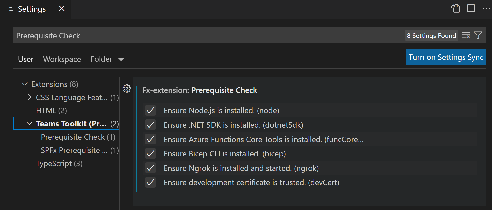

# Teams Toolkit Environment Checker FAQ

## Overall

Teams Toolkit will help to check if the required dependencies are installed.

Current required dependencies:

* [Node.js](https://nodejs.org/en/download/).
* [.NET SDK](https://dotnet.microsoft.com/download): To start simpleAuth service for local debugging and install the customized function binding extension.

Please Note:
- For `Node.js`, Teams Toolkit will check its existence, and provide with the link to users where and how to install.
- For `.NET SDK`, Teams Toolkit will try to install it for users if it cannot be found. `.NET SDK` will be installed with the official provided [dotnet-install script](https://docs.microsoft.com/en-us/dotnet/core/tools/dotnet-install-script). The script will download the portable version of `.NET Core SDK 3.1` and save it into under directory `%userprofile%/.fx/bin/dotnet` (on Windows) or `~/.fx/bin/dotnet` (on macOS/Linux), which is designed for Teams Toolkit's usage only and won't affect user's development environment. In addition, it's only needed to be installed once.

## How to install Node.js?

Please refer to [nodejs.org](https://nodejs.org/) to download and install the supported versions:

- For `Azure` hosting, please refer to the supported versions [here](#nodenotsupportedazure-hosting).
- For `SPFx` hosting, please refer to the supported versions [here](#nodenotsupportedspfx-hosting).

**NOTE**: Please restart all your Visual Studio Code instances after the installation is finished.

## How to install .NET SDK?

Please refer to [the official website](https://dotnet.microsoft.com/download) to download and install the supported versions: `.NET 5.0 SDK` or `.NET Core 3.1 SDK`.

**NOTE**: Please restart all your Visual Studio Code instances after the installation is finished.

## How to install Azure Functions Core Tools?

Please refer to [the official website](https://github.com/Azure/azure-functions-core-tools) to install the supported versions: `Azure Functions Core Tools v3 `.

**NOTE**: Please restart all your Visual Studio Code instances after the installation is finished.

## NodeNotFound
### Notification Message
> Cannot find Node.js. Teams Toolkit requires Node.js; the recommended version is v14.

As the Teams Toolkit project is implemented by `Node.js`, it's required to install the npm pacakges and run the project in local. 

### Mitigation
Please refer to [nodejs.org](https://nodejs.org/) to install the right version: currently only LTS versions (v10, v12 and v14) are supported by Teams Toolkit, and `Node v14` would be recommended to be installed.

**NOTE**: Please restart all your Visual Studio Code instances after the installation is finished.

## NodeNotSupported(Azure hosting)
### Notification Message
> Node.js (*node_version*) is not in the supported version list (v10, v12, v14).

When `Azure` is selected as the hosting type, only LTS versions (v10, v12 and v14) of Node.js are supported by Teams Toolkit currently, please make sure the installed Node.js meets this requirement. In addition, **Node v14 (LTS)** would be recommended to be installed.

### Mitigation
Please refer to [the guide](#how-to-install-nodejs) to install `Node.js`.

## NodeNotSupported(SPFx hosting)
### Notification Message
> Node.js (*node_version*) is not in the supported version list (v10, v12, v14).
  
The SharePoint Framework v1.12.1 is supported on the following Node.js versions:
- Node.js v10.13.0+ (Dubnium)
- Node.js v12.13.0+ (Erbium)
- Node.js v14.15.0+ (Fermium) 
 
And **the latest version of Node.js LTS v14** would be recommended to be installed. For details, please refer to: https://docs.microsoft.com/en-us/sharepoint/dev/spfx/set-up-your-development-environment#install-nodejs

### Mitigation
Please refer to [the guide](#how-to-install-nodejs) to install `Node.js`.

## FailToInstallDotnet
### Notification Message
> Failed to install .NET Core SDK (v3.1). Install .NET Core SDK (v3.1) manually and restart Visual Studio Code.

It might be caused by timeout issue (longer than 3 minutes), the process to install `.NET SDK` is killed, or other unknown issues.

### Mitigation
* Retry the operation (local debugging or Function app deployment).
* Please refer to [the guide](#how-to-install-net-sdk) to install `.NET SDK` manually.

## DotnetNotFound
### Notification Message
> Cannot find .NET Core SDK (v3.1 or v5.0). Teams Toolkit requires these dependencies.

### Mitigation
Please refer to [the guide](#how-to-install-net-sdk) to install `.NET SDK` manually.

## DotnetNotSupportTargetVersion
### Notification Message
> NETSDK1045: The current .NET SDK does not support 'newer version' as a target.

### Mitigation
Please refer to [the guide](https://docs.microsoft.com/dotnet/core/tools/sdk-errors/netsdk1045#globaljson-file) to check your `global.json` file in the root folder in your project and up the directory chain to the root of the volume, since it can be anywhere in the folder structure. If it contains an SDK version, delete the sdk node and all its children, or update it to the desired newer .NET Core version (`.NET 5` or `.NET Core 3.1` ).

The `global.json` file is not required, so if it doesn't contain anything other than the sdk node, you can delete the whole file.

## Teams Toolkit Validation Settings

There are two settings to turn on/off .NET SDK and Node.js validation, and both of them are enabled by default. You are able to uncheck the box if you do not need the dependencies validation and would like to install the dependencies by yourself. Check the [Node.js installation guide](#how-to-install-nodejs) and [.NET SDK installation guide](#how-to-install-net-sdk).

To open your user and workspace settings, use the following Visual Studio Code menu command:

* On Windows/Linux - **File > Preferences > Settings > Extensions > Teams Toolkit**
* On macOS - **Code > Preferences > Settings > Extensions > Teams Toolkit**

## Report issues 

If above FAQs can't solve your problem, please click [here](https://github.com/OfficeDev/Teamsfx/issues/new) to submit an issue on GitHub and attach the log from Visual Studio Code output channel named "Teams Toolkit".
