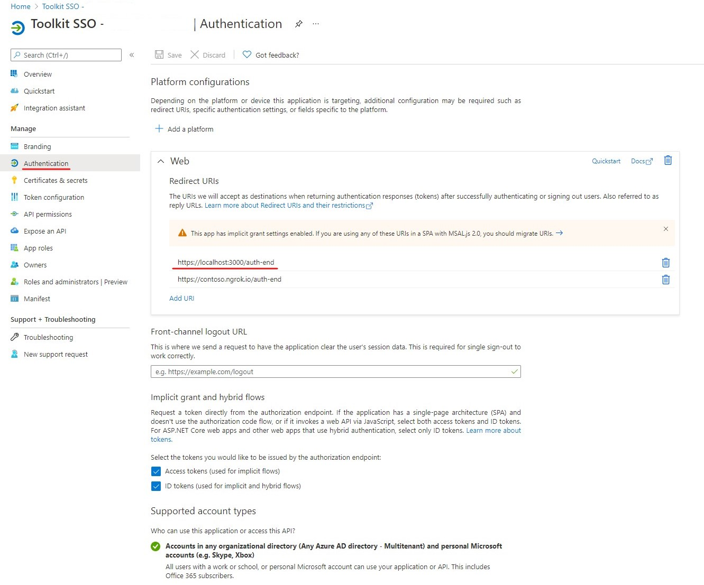
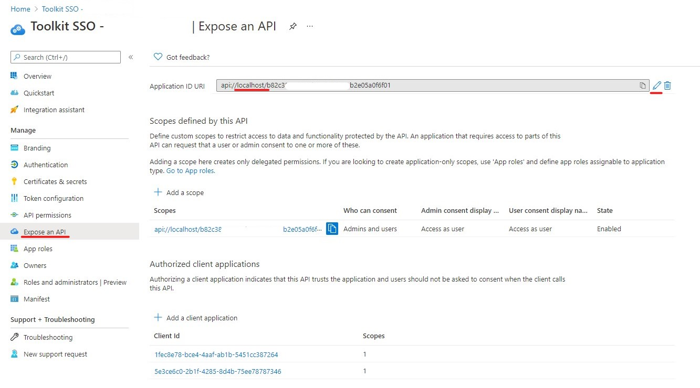

# Teams Toolkit V1 tab app migration
## Debug Tab App migrated from V1
Start debugging the project by hitting the `F5` key in Visual Studio Code. Alternatively use the `Run and Debug Activity Panel` in Visual Studio Code and click the `Start Debugging` green arrow button. 

> Note: A new teams app will be created for local debug. If your project is a tab app that also includes Single Sign-on feature, there are some manual steps to enable debug after migration.

## Manual steps for Tab project with Single Sign-on feature

### Start authentication service
`tabs/api-server` folder contains a server workload to handle authentication logics for your tab project. If you wish to enable features such as Single Sign-on, you need to manually start the auth service. Under `tabs/api-server`, execute 
 ```
 npm install
 npm start
 ```
 
### Setup configurations for Single Sign-on
You need to replace all the ngrok domain in the project to `localhost` because the debug in the latest Teams Toolkit do not need to use ngrok any more.

The following are the steps of how to manually configure a default tab app.

1. Update AAD application
	*	Go to your application in the [AAD portal](https://azure.microsoft.com/en-us/features/azure-portal/) and find your application.
		> Note: The application client id can be found in the property `webApplicationInfo.id` of `./templates/appPackage/manifest.local.template.json` or `.archive/appPackage/manifest.json`.
	*	Under **Manage**, select **Authentication**.
	*	Change the redirect URI domain to `localhost:3000`. 
			E.g. `https://contoso.ngrok.io/auth-end` to `https://localhost:3000/auth-end`
			
	*	Under **Manage**, select **Expose an API**.
	*	Edit the **Application ID URI**, change the domain to `localhost`.
			E.g. `api://contoso.ngrok.io/{app-id}` to `api://localhost/{app-id}`
			
 
2. Change manifest
   
	 Edit manifest template `./templates/appPackage/manifest.local.template.json`. Update the property `webApplicationInfo.resource` to the latest Application ID URI `api://localhost/{app-id}`.

3. Change environment variables
	
	Edit the environment configuration file `tabs/.env`. Update the value of `REACT_APP_BASE_URL` to `https://localhost:3000`.

## Edit the manifest
You can find the Teams app manifest in `./templates/appPackage/manifest.local.template.json`. It contains template arguments with `{...}` statements which will be replaced at build time. You may add any extra properties or permissions you require to this file. See the [schema reference](https://docs.microsoft.com/en-us/microsoftteams/platform/resources/schema/manifest-schema) for more.
