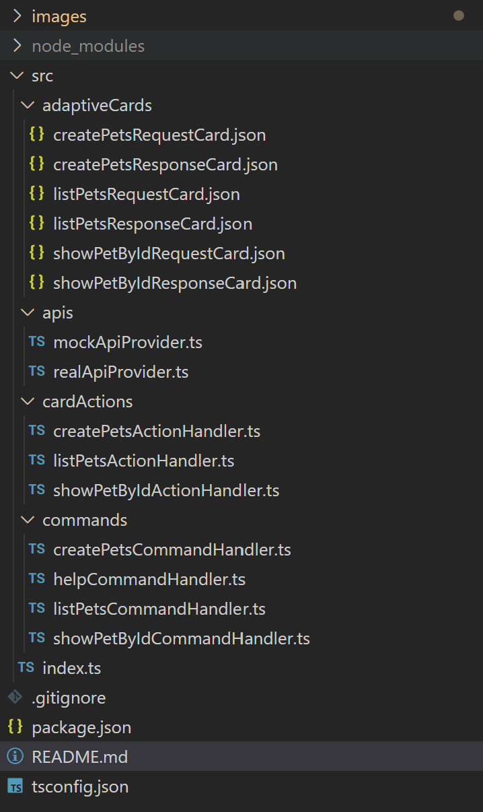
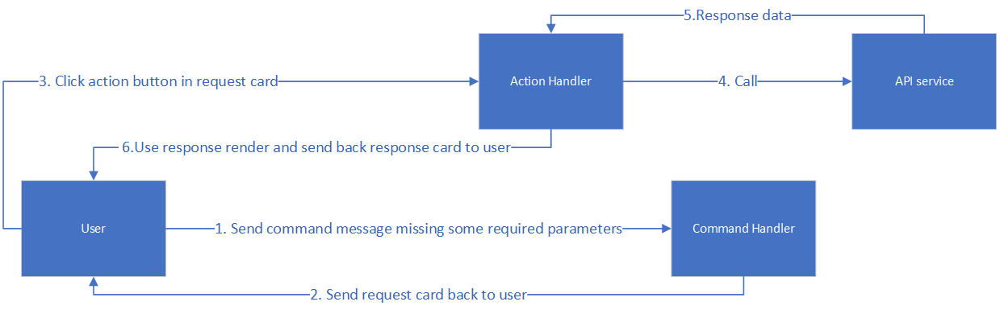
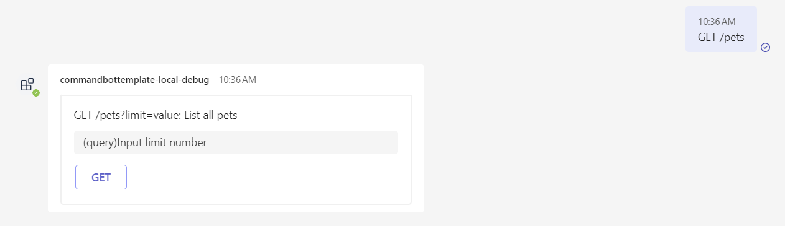
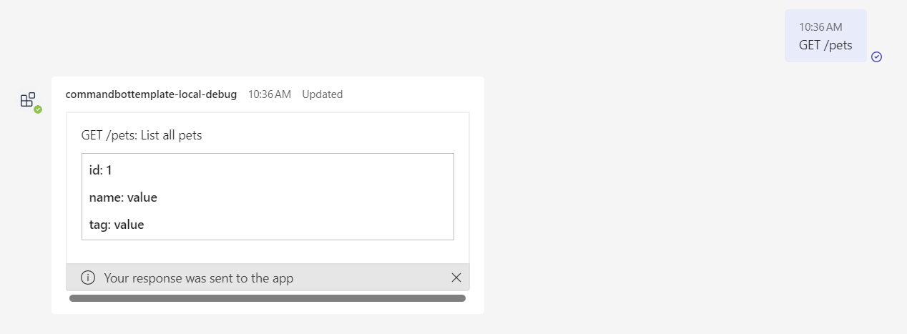
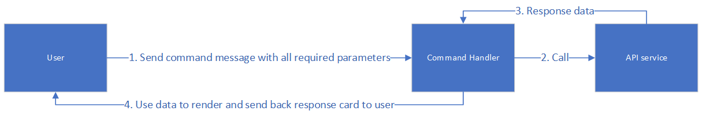
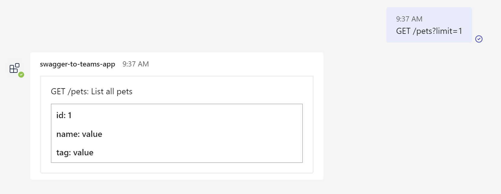

# Introduction
This Teams APP is generated by api2teams which responds to chat commands by displaying API response data using Adaptive Cards based on Open API spec.

# Prerequisites

To run this APP in your local dev machine or deploy to Azure, you will need:

- [Node.js](https://nodejs.org/), supported versions: 14, 16, 18
- An [Microsoft 365 account for development](https://docs.microsoft.com/microsoftteams/platform/toolkit/accounts)
- [Teams Toolkit Visual Studio Code Extension](https://aka.ms/teams-toolkit) version 5.0.0 and higher or [TeamsFx CLI](https://aka.ms/teamsfx-cli)
- [Option] If you want to deploy this APP to Azure, you also need an Azure subscription. If you don't have an Azure subscription, [create a free account](https://azure.microsoft.com/en-us/free/) before you begin

# Note
- Your app can be installed into a team, or a group chat, or as personal app. See [Installation and Uninstallation](https://aka.ms/teamsfx-command-new#customize-installation).


# Quick Start
1. First, select the Teams Toolkit icon on the left in the VS Code toolbar.
1. In the Account section, sign in with your [Microsoft 365 account](https://docs.microsoft.com/microsoftteams/platform/toolkit/accounts) if you haven't already.
1. Press F5 to start debugging which launches your app in Teams using a web browser. Select `Debug (Edge)` or `Debug (Chrome)`.
1. When Teams launches in the browser, select the Add button in the dialog to install your app to Teams.
1. Click message input dialog, you can see supported commands.
1. Input command in the chat and send it to bot, and then you can get adaptive card

# Converted Teams App Folder Structure
The generated Teams APP is a normal Teams Toolkit project. In the src folder, there are 4 subfolders and a index.ts file insdie:

* adaptiveCards folder
    - This folder contains adaptive card generated by Convert Tool based on APIs. Each API will generate two adaptive cards, one is `*RequestCard.json`, and another is `*ResponseCard.json`. Request card is for user to input parameters and click button to send request, and response card is used to render api response data.
    > Using this pattern is more clear than use component name (although it may produce duplicated cards), because component name can be used by multiple apis, and it is not easy for user to know which adaptive card is for specific api

* apis folder
    - This folder contains two ts file, one is for mock api calls (mockApiProvider.ts) and another is for real api calls (realApiProvider.ts). For real api calls, user need to manually update these files to call real backend service

* cardActions folder
    - This folder contains card action handlers, when user click action button in the request adaptive card, it would use these handlers to get response and render response adaptive card.

* commands folder
    - This folder contains bot command handlers, when user send messages, it will match the api, and send back request adaptive card. There is a special command handler which named `helpCommandHandler` which is used to show help messages.

* index.ts file
    - Index file using `restify` as web service framework to host bot server, and register command handlers and action handlers for bot to handle use messages and button clicking event. 



# Workflow
For example, below is the API to get pets list:

```yaml
paths:
  /pets:
    get:
      summary: List all pets
      parameters:
        - name: limit
          in: query
          description: How many items to return at one time (max 100)
          required: true
          schema:
            type: integer
            format: int32
      responses:
        '200':
          description: A paged array of pets
          content:
            application/json:    
              schema:
                $ref: "#/components/schemas/Pets"
components:
  schemas:
    Pet:
      type: object
      required:
        - id
        - name
      properties:
        id:
          type: integer
          format: int64
        name:
          type: string
        tag:
          type: string
    Pets:
      type: array
      maxItems: 100
      items:
        $ref: "#/components/schemas/Pet"
```

The workflow would be as below:

If user input command missing some required parameters:


- User input command message `GET /pets`
- Bot service receive this message, and trigger `listPetsCommandHandler`
- Due to the required query paramter `limit` is missing, so `listPetsCommandHandler` would send back `listPetsRequestCard`
- User receive `listPetsRequestCard`, and input limit number in the adaptive card, and click `GET` button
  
- The `GET` button trigger `listPetsActionHandler`, and this action handler call `mockApiProvider.listPets` to get the data from API service.
- `listPetsActionHandler` use the response data to render `PetsListCard.json` adaptive card and send back to user
  


If user input contains all required parameters:


- User input the command message `GET /pets?limit=3`
- Bot service receive this message, and trigger `listPetsCommandHandler`
- Due to the required parameter `limit` is inside the user message, so `listPetsCommandHandler` would call API service and use the response data to render `PetsListCard.json` card.  
-  Then `listPetsCommandHandler` would send back `PetsListCard.json` adaptive card to user.
  

# Customize adaptive cards
The generated adaptive card can be found in `src/adaptiveCards` folder and you can customize the cards according to your own personal needs. You can use [adaptive card designer](https://adaptivecards.io/designer) from browser to design your cards.

# Learn and customize command bot project
The generated project is a general TeamsFx command response bot project, and you can custimize and add your own command handlers, for more information, you can refer [this wiki page](https://github.com/OfficeDev/TeamsFx/wiki/Respond-to-chat-commands-in-Teams#how-command-and-response-works)


# Limitations
1. Only support openapi version >= 3.0.0
1. Authorization properties inside OpenAPI spec is not supported
1. `webhooks` property is not supported and would be ignored during convert
1. Do not support keyword `oneOf`, `anyOf`, `not`, not because there is no better ways to represent it in adaptive cards, only support `allOf` keyword
1. For request card, there is no proper element to represent array type in adaptive card, so user need to input the array value manually
1. Adaptive card doesn't support file upload, so if api contains file upload
1. Command intellisense can only contain max 10 items due to Teams limitation

# Reference
- [Teams Toolkit extension](https://learn.microsoft.com/en-us/microsoftteams/platform/toolkit/teams-toolkit-fundamentals)
- [Adaptive card official site](https://adaptivecards.io/)
- [Adaptive card designer](https://adaptivecards.io/designer)
- [How command-and-response works](https://github.com/OfficeDev/TeamsFx/wiki/Respond-to-chat-commands-in-Teams#how-command-and-response-works)

