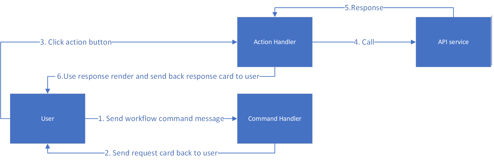

# Converted Teams App Code structure
The code structure of converted project is as below:

In the root folder, there are `package.json`, `README.md` and `tsconfig.json` files.

In the src folder, there are 4 sub folders:
* adaptiveCards folder
    - This folder contains adaptive card generated by Convert Tool based on APIs. Each API will generate two adaptive cards, one is `*RequestCard.json`, and another is `*ResponseCard.json`. Request card is for user to input parameters and click button to send request, and response card is used to render api response data.
    > Using this pattern is more clear than use component name (although it may produce duplicated cards), because component name can be used by multiple apis, and it is not easy for user to know which adaptive card is for specific api

* apis folder
    - This folder contains two ts file, one is for mock api calls (mockApiProvider.ts) and another is for real api calls (realApiProvider.ts). For real api calls, user need to manually update these files to call real backend service

* cardActions folder
    - This folder contains card action handlers, when user click action button in the request adaptive card, it would use these handlers to get response and render response adaptive card.

* commands folder
    - This folder contains bot command handlers, when user send messages, it will match the api, and send back request adaptive card. There is a special command handler which named `helpCommandHandler` which is used to show help messages.

# Workflow

- User input command message to the bot, for example `GET /pets`
- Bot service receive this message, and trigger `listPetsCommandHandler`
- `listPetsCommandHandler` send back `listPetsRequestCard`
- User receive `listPetsRequestCard`, and input limit number in the adaptive card, and click `GET` button
- The `GET` button trigger `listPetsActionHandler`, and this action handler call `mockApiProvider.listPets` and get the data from API service.
- `listPetsActionHandler` use the data to render `listPetsResponseCard` adaptive card and send back to user
  

  

# Discuss
- Tim's questions: why not call real backend service: Because our main target is help user to generate a working demo project, user can update it for real use. Call real code will introduce complexity (such as auth), and most backend service may contain their own sdk, user may want to use the sdk to call real code. And from our previous experience of our connector api inside teamsfx sdk(which generate code to help user to call their apis), and the usage is low.