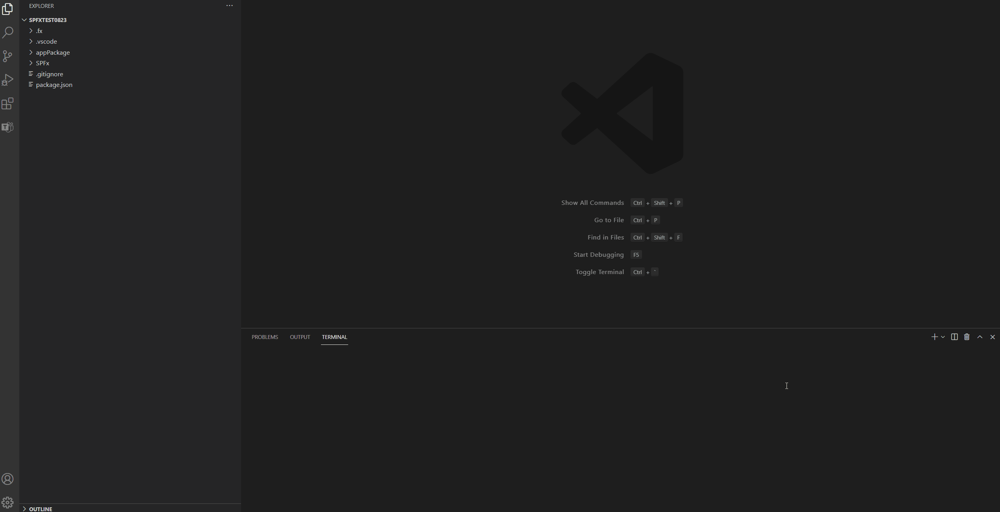

What Is New

- [2.6.0 - Sep 06, 2021](#260---sep-06-2021)
- [2.5.0 - Aug 23 2021](#250---aug-23-2021)
- [2.4.1 - Aug 10 2021](#241---aug-10-2021)
- [2.3.1 - July 26 2021](#231---july-26-2021)

## 2.6.0 - Sep 06, 2021

Incremental version for Teams Toolkit with multiple bugs fixed and the following updates：

New Feature:

- Support projects migration from Teams Toolkit V1 to V2. If your Teams projects are created using Teams Toolkit V1, try migrate your project follow the [migration instructions](https://aka.ms/teamsfx-migrate-v1).
- Support local debug experience for Teams Tab/Bot/Message Extension project migrated from Teams Toolkit V1.
- Check permission to turn-on Teams custom app uploading when user sign-in to M365 account. Learn more about [Teams app uploading or sideloading permission](https://docs.microsoft.com/en-us/microsoftteams/platform/concepts/build-and-test/prepare-your-o365-tenant#enable-custom-teams-apps-and-turn-on-custom-app-uploading).
- (Preview Feature) Support provision cloud resources using Azure Resource Manager. To enable this feature, please follow [instructions](https://github.com/OfficeDev/TeamsFx/wiki/Enable-Preview-Features-in-Teams-Toolkit).

Enhancement:

- UI Enhancement:
  - Hide Azure account login for SharePoint projects.
  - Tree View A/B testing: with non-Teams projects open, you may randomly see either one of two different Tree View layouts in the side bar.
- Optimization of created project folder structure.
- Improved getting start experience of creating new project for Bot.
- Upgrade Sample apps. Enable CI/CD workflow for Todo-List with Azure backend sample. More samples are coming, view them at [Sample GitHub open source repo](https://github.com/OfficeDev/TeamsFx-samples)

## 2.5.0 - Aug 23 2021

Incremental version for Teams Toolkit with multiple bugs fixed and the following updates：

New Feature:

- Enable create project from quick start page.
- Enable report issue from local debug pop-up error message.
- Enable CI/CD workflow with Github Actions. Check [CI/CD instructions](https://github.com/OfficeDev/TeamsFx/tree/dev/docs/cicd) to learn how to use.

Enhancement:

- Update new CLI progress bar.
- Improve some UI experience.
- Add more information in the output error message of debug.

## 2.4.1 - Aug 10 2021

Incremental version for Teams Toolkit with multiple bugs fixed and the following updates：

New Feature:

- Add extension accessiblity for the disabled.
- Add CLI command 'teamsfx preview' to preview SPFx apps.

Enhancement:

- A/B testing for Tree View design. You may randomly see either one of two different Tree View layouts in the side bar.

## 2.3.1 - July 26 2021

Incremental version for Teams Toolkit with multiple bugs fixed and the following updates：

New Feature:

- Add CLI command 'teamsfx preview' to directly preview Teams apps after scaffolding.
- For multiple developers collaborate on one project, Teams Toolkit enables developers to create their own local environment by pressing F5.
- Add encryption to secret data in .userdata file, and support view/edit secret data through VS Code UI and CLI tool.

Enhancement:

- Speed up the installation of npm dependency for debugging experience.
