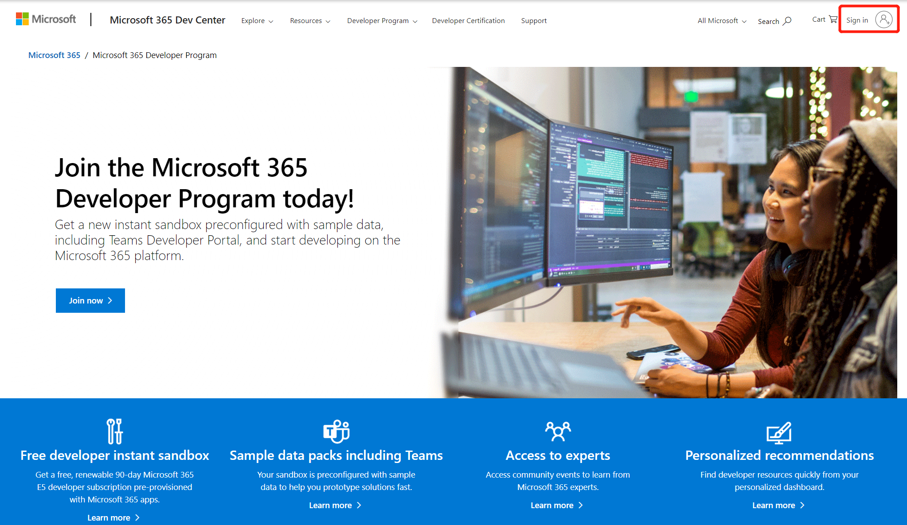
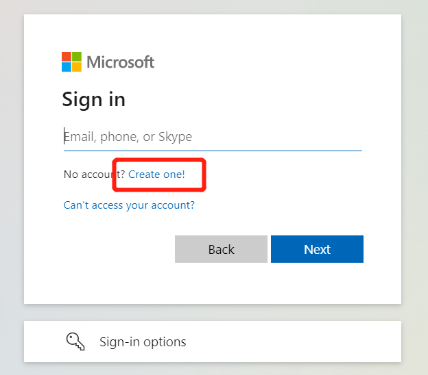
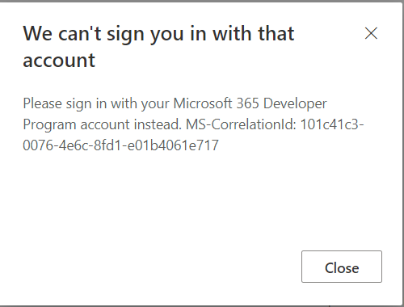
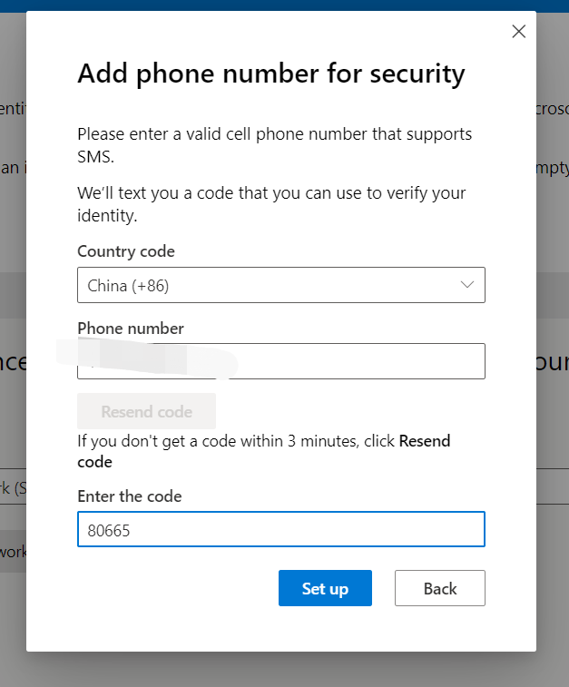

# How to create a free Teams developer tenant via ITP?

`ITP(Instant Tenant Procurement)` is to get you an instant sandbox of Microsoft 365 developer environment. Instead of making you provison all your Microsoft 365 apps and install your data packs one by one, it contains pre-installed sample data packs so you can quickly work on this tenant. E.g. The Teams App `sideloading permission` is pre-configured and you don' have to turn on the sideloading and wait for up to 24 hours util it takes effect.

## Prequisitives

- A personal Microsoft account, or a work or school account

## Steps to create instant sandbox

- Sign In [Microsoft 365 Dev program](https://developer.microsoft.com/en-us/microsoft-365/dev-program) with your personal Microsoft account or your work or school account.

If you don't have a personal Microsoft account, or a work or school account. You can click `Create one` to create an account.

>Note: You cannot Sign in with *.onmicrosoft.com account, otherwise you will meet following error in next step.

- Click `Join now`, this will navigate you to instant sandbox creation page.

- (Optional) If you already have a normal subscription before, you can click `Start` button on dashboard page to setup an instant sandbox.

- Answer some questions to customize your Developer Program experience

- Setup your Microsoft 365 E5 sandbox

- You may need to add a phone number for security verification.

- Now you have an instant sandbox. You can `sign in Teams Toolkit with admin or users account in this tenant`, and the sideloading permission is pre-configured.

