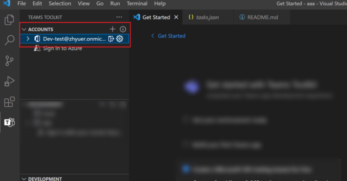

# Prepare a Qualified Microsoft 365 Account for Teams App Development

## Account Requirements

The following two conditions are required for Teams app development:

1. The Microsoft 365 account should be your work or school account, not your personal account.
2. The Microsoft 365 account needs permission to upload custom app in Teams.

You can contact your tenant administrator to turn on the upload custom app permission for your organization.

Or, if you're a Visual Studio subscriber, create a Microsoft 365 developer account to
resolve your account issues. [Get more info about Microsoft 365 Developer Program](https://learn.microsoft.com/en-us/office/developer-program/microsoft-365-developer-program).

## How

### Step 1. Create Microsoft 365 Development Account

[Sign up for Microsoft 365 developer program](https://developer.microsoft.com/en-us/microsoft-365/dev-program) to create an instant sandbox and get your developer account.

For more information, visit the [Set up a developer subscription documentation](https://learn.microsoft.com/en-us/office/developer-program/microsoft-365-developer-program-get-started).

> Use the Administrator account (\*.onmicrosoft.com) email address to log in to your development environment.

### Step 2. Use your development account in Teams Toolkit for Visual Studio Code

Open Teams Toolkit for Visual Studio Code and log into the Teams Toolkit extension using your developer account created in step 1.

The permission to upload custom app is already set up.

