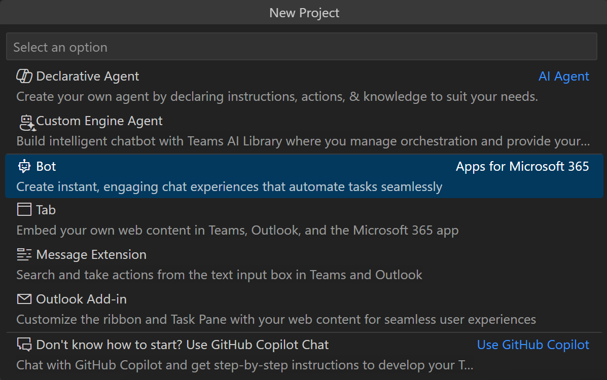

| Step summary        | Where it's located              |
|----------|----------------|
| 1. Click "Create a New App" |  |
| 2. Select Bot to create a new bot project |  |
| 3. Ensure that Chat Notification Message is selected as the App feature that you want to build in your app. |  |
| 4. Select HTTP Trigger Restify Server as the trigger. |  |
| 5. Select JavaScript as the programming language. |  |
| 6. Select Default folder to store your project root folder in default location. |  |
| 7. After your app is created, you will see the app instruction on the left pane. |  |
