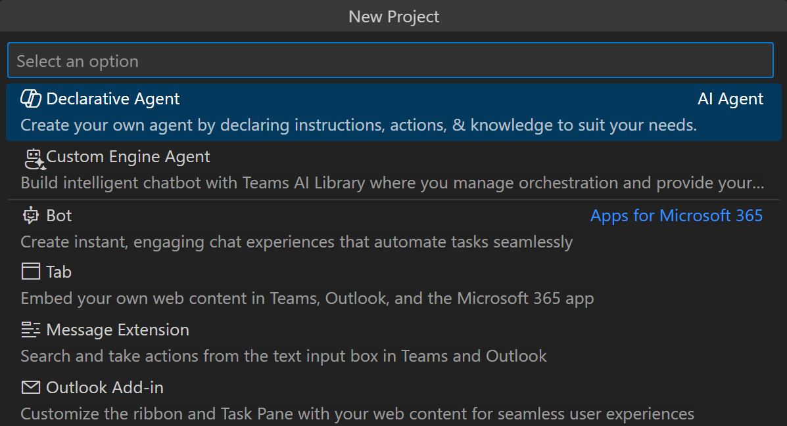

| Step Summary        | Where it's located              |
|----------|----------------|
| 1. Click "Create a New App" |  |
| 2. Select Declarative Agent |  |
| 3. Select No plugin to create a basic declarative agent. |  |
| 4. Select Default folder to store your project root folder in the default location. |  |
| 5. After your app is created, you will see the app instruction on the left pane. |  |
