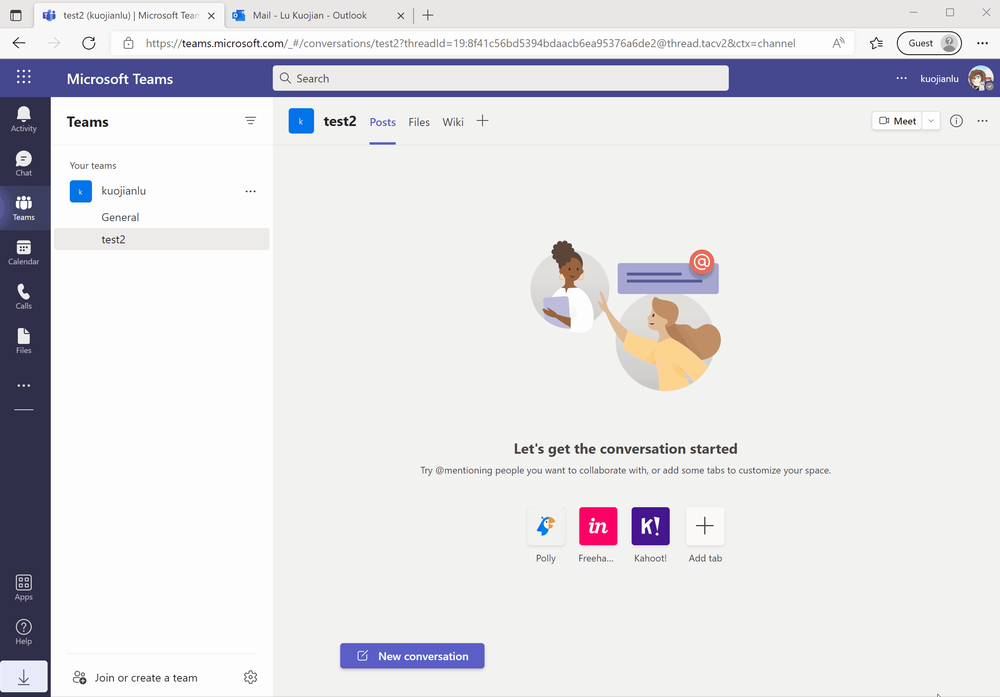
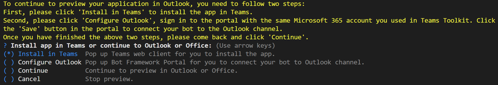
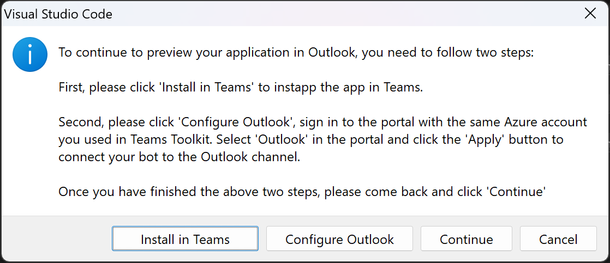
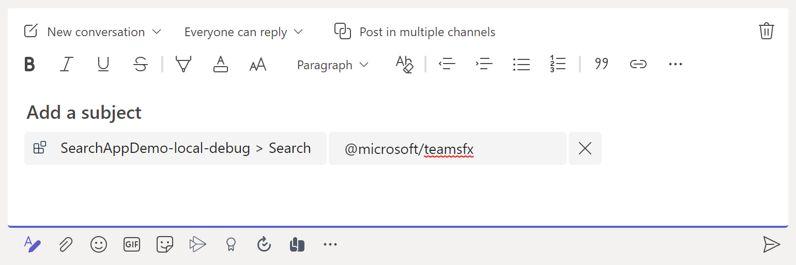
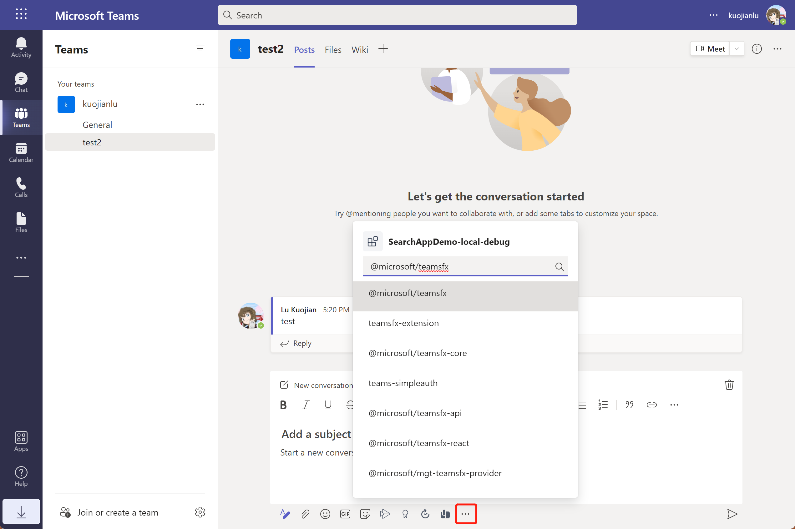

# How to use this M365 Messaging Extensions Search app

A Messaging Extension allows users to interact with your web service while composing messages in the Microsoft Teams and Outlook client. Users can invoke your web service to assist message composition, from the message compose box, or from the search bar.

Messaging Extensions are implemented on top of the Bot support architecture within Teams.

This is a simple search application with Messaging extension capabilities.

## Prerequisites

- [NodeJS](https://nodejs.org/en/)
- An M365 account. If you do not have M365 account, apply one from [M365 developer program](https://developer.microsoft.com/en-us/microsoft-365/dev-program)
- [Teams Toolkit Visual Studio Code Extension](https://aka.ms/teams-toolkit) version after 3.8.0 or [TeamsFx CLI](https://aka.ms/teamsfx-cli)

## Debug
### From Visual Studio Code
1. Use the `Run and Debug Activity Panel` in Visual Studio Code, select `Debug in Teams`, `Debug in Outlook` and click the `Run and Debug` green arrow button.
2. If you select `Debug in Outlook`, during debugging, a VS Code dialog will be popped up as the image below. Please click "Install in Teams" first to install the app in Teams, then click "Configure Outlook" to connect the bot to Outlook channel, then click "Continue" to continue to debug the app in Outlook.
  

### From TeamsFx CLI
1. From TeamsFx CLI: Start debugging the project by executing the command `teamsfx preview --local --m365-host <m365-host>` in your project directory, where `m365-host` is `teams` or `outlook`.
2. If you select `m365-host` as `outlook`, during debugging, a dialog will be popped up as the image below. Please select "Install in Teams" first to install the app in Teams, then select "Configure Outlook" to connect the bot to Outlook channel, then select "Continue" to continue to debug the app in Outlook.
  

## Edit the manifest

You can find the Teams app manifest in `templates/appPackage` folder. The folder contains one manifest file:
* `manifest.template.json`: Manifest file for Teams app running locally or running remotely (After deployed to Azure).

This file contains template arguments with `{...}` statements which will be replaced at build time. You may add any extra properties or permissions you require to this file. See the [schema reference](https://docs.microsoft.com/en-us/microsoftteams/platform/resources/schema/manifest-schema) for more information.

## Deploy to Azure

Deploy your project to Azure by following these steps:

| From Visual Studio Code                                                                                                                                                                                                                                                                                                                                                  | From TeamsFx CLI                                                                                                                                                                                                                    |
| :----------------------------------------------------------------------------------------------------------------------------------------------------------------------------------------------------------------------------------------------------------------------------------------------------------------------------------------------------------------------- | :---------------------------------------------------------------------------------------------------------------------------------------------------------------------------------------------------------------------------------- |
| <ul><li>Open Teams Toolkit, and sign into Azure by clicking the `Sign in to Azure` under the `ACCOUNTS` section from sidebar.</li> <li>After you signed in, select a subscription under your account.</li><li>Open the Teams Toolkit and click `Provision in the cloud` from DEVELOPMENT section or open the command palette and select: `Teams: Provision in the cloud`.</li><li>Open the Teams Toolkit and click `Deploy to the cloud` or open the command palette and select: `Teams: Deploy to the cloud`.</li></ul> | <ul> <li>Run command `teamsfx account login azure`.</li> <li>Run command `teamsfx account set --subscription <your-subscription-id>`.</li> <li> Run command `teamsfx provision`.</li> <li>Run command: `teamsfx deploy`. </li></ul> |

> Note: Provisioning and deployment may incur charges to your Azure Subscription.

## Preview

Once the provisioning and deployment steps are finished, you can preview your app.

### From Visual Studio Code
1. Open the `Teams Toolkit Activity Panel`.
2. In `ENVIRONMENTS`, select the environment you want to preview and click the `Preview App` icon.
3. For the prompted question, select the platform you want to preview in.
4. If you select `Outlook`, a VS Code dialog will be popped up as the image below. Please click "Install in Teams" first to install the app in Teams, then click "Configure Outlook" to connect the bot to Outlook channel, then click "Continue" to continue to preview the app in Outlook.
  

### From TeamsFx CLI
- Execute `teamsfx preview --remote --m365-host <m365-host>` in your project directory, where `m365-host` is `teams` or `outlook`.
2. If you select `m365-host` as `outlook`, during debugging, a dialog will be popped up as the image below. Please select "Install in Teams" first to install the app in Teams, then select "Configure Outlook" to connect the bot to Outlook channel, then select "Continue" to continue to debug the app in Outlook.
  

## Validate manifest file

To check that your manifest file is valid:

- From Visual Studio Code: open the command palette and select: `Teams: Validate manifest file`.
- From TeamsFx CLI: run command `teamsfx validate` in your project directory.

## Package

- From Visual Studio Code: open the Teams Toolkit and click `Zip Teams metadata package` or open the command palette and select `Teams: Zip Teams metadata package`.
- Alternatively, from the command line run `teamsfx package` in the project directory.

## Publish to Teams

Once deployed, you may want to distribute your application to your organization's internal app store in Teams. Your app will be submitted for admin approval.

- From Visual Studio Code: open the Teams Toolkit and click `Publish to Teams` or open the command palette and select: `Teams: Publish to Teams`.
- From TeamsFx CLI: run command `teamsfx publish` in your project directory.

## Play with Messaging Extension

This template provides the sample functionality:

- You can search for `npm` packages from the search bar.

To trigger the function in Teams, there are multiple entry points:

- `@mention` Your messaging extension, from the `search box area`.

  

- `@mention` your messaging extension from the `compose message area`.

  

- Click the `...` under compose message area, find your messaging extension.

  

To trigger these functions in Outlook:
- Click the "More apps" icon under compose email area, find your messaging extension.

  

## Further reading

### Bot

- [Bot Basics](https://docs.microsoft.com/azure/bot-service/bot-builder-basics?view=azure-bot-service-4.0)
- [Bot Framework Documentation](https://docs.botframework.com/)
- [Azure Bot Service Introduction](https://docs.microsoft.com/azure/bot-service/bot-service-overview-introduction?view=azure-bot-service-4.0)

### Messaging Extension

- [Search Command](https://docs.microsoft.com/en-us/microsoftteams/platform/messaging-extensions/how-to/search-commands/define-search-command)