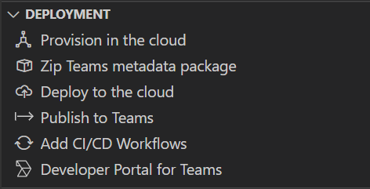
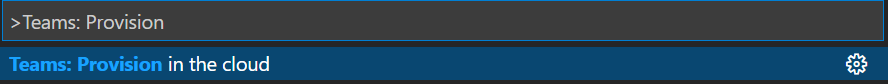
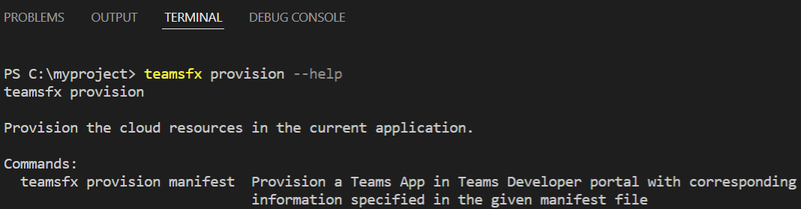
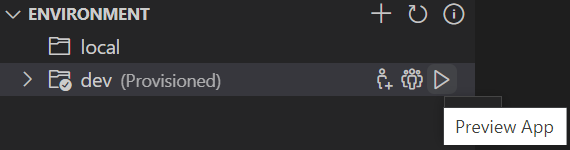
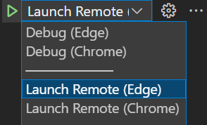

# Notification Bot

A notifiction bot is an app that proactively sends messages in Teams channel / group chat / personal chat.

For example, once triggered, it sends text, card, or other message(s) to Teams:


## Get Started

Before run this app locally, make sure you have prepared these prerequisites:

- Node.js (Recommended version is 14)
- An [M365 account for development](https://docs.microsoft.com/microsoftteams/platform/toolkit/accounts)
- (Optional) if you'd like to use CLI, install our [Teams Toolkit CLI](https://docs.microsoft.com/microsoftteams/platform/toolkit/teamsfx-cli).

Then, you can quickly start local debugging via `F5` in VSCode. Select `Debug (Edge)` or `Debug (Chrome)` debug option of your preferred browser.

(Optional) For CLI experience, execute command line `teamsfx preview --local` in your project directory to preview your app locally (without attaching debugger).

## Develop

This new project folder structure looks like:

| Folder | Contents |
| - | - |
| `.fx` | Project level settings and configurations |
| `.vscode` | VSCode files for local debug |
| `bot` | The bot source code |
| `templates` |Templates for Teams app manifest and corresponding Azure resources|

The core notification implementation is in `bot/` folder, containing following content:

| File / Folder | Contents |
| - | - |
| `src/adaptiveCards/` | Adaptive card templates |
| `src/internal/` | Generated initialize code for notification functionality |
| `src/cardModels.*s` | Adaptive card data models |
| `src/index.*s` | The entrypoint to handle bot messages and send notifications |
| `.gitignore` | The git ignore file to exclude local files from bot project |
| `package.json` | The NPM package file for bot project |

### To notify different targets

``` typescript
// list all installation targets
for (const target of await bot.notification.installations()) {
    // "Channel" means this bot is installed to a Team (default to notify General channel)
    if (target.type === "Channel") {
        // Directly notify the Team (to the default General channel)
        await target.sendAdaptiveCard(...);

        // List all members in the Team then notify each member
        const members = await target.members();
        for (const member of members) {
            await member.sendAdaptiveCard(...);
        }

        // List all channels in the Team then notify each channel
        const channels = await target.channels();
        for (const channel of channels) {
            await channel.sendAdaptiveCard(...);
        }
    }

    // "Group" means this bot is installed to a Group Chat
    if (target.type === "Group") {
        // Directly notify the Group Chat
        await target.sendAdaptiveCard(...);

        // List all members in the Group Chat then notify each member
        const members = await target.members();
        for (const member of members) {
            await member.sendAdaptiveCard(...);
        }
    }

    // "Person" means this bot is installed as Personal app
    if (target.type === "Person") {
        // Directly notify the individual person
        await target.sendAdaptiveCard(...);
    }
}
```

### To use your own storage

``` typescript
// implement your own storage
class MyStorage implements NotificationTargetStorage {...}
const myStorage = new MyStorage(...);

// initialize ConversationBot with notification enabled and customized storage
const bot = new ConversationBot({
    // The bot id and password to create BotFrameworkAdapter.
    // See https://aka.ms/about-bot-adapter to learn more about adapters.
    adapterConfig: {
        appId: process.env.BOT_ID,
        appPassword: process.env.BOT_PASSWORD,
    },
    // Enable notification
    notification: {
        enabled: true,
        storage: myStorage,
    },
});
```

> Note: It's recommended to use your own shared storage for production environment. If `storage` is not provided, a default local file storage will be used, which stores notification connections into:
>   - *.notification.localstore.json* if running locally
>   - *${process.env.TEMP}/.notification.localstore.json* if `process.env.RUNNING_ON_AZURE` is set to "1"

### To edit your Teams App manifest

You can find the Teams app manifest in `templates/appPackage/manifest.template.json`.

The file contains template arguments with `{...}` statements which will be replaced at build time. You may add any extra properties or permissions you require to this file. See the [schema reference](https://docs.microsoft.com/microsoftteams/platform/resources/schema/manifest-schema) for more information.

## Deployment

Teams Toolkit provides commands to help provision, deploy, preview, publish your app. You can execute those commands from

- VSCode Treeview
  

- VSCode Command Palette
  

- Teams Toolkit CLI
  

To provision cloud resource:

- Click `Provision in the cloud` from Treeview
- Or, use `Teams: Provision in the cloud` from Command Palette
- Or, execute `teamsfx provision <args>` command line

Then, to deploy your code to cloud:

- Click `Deploy to the cloud` from Treeview
- Or, use `Teams: Deploy to the cloud` from Command Palette
- Or, execute `teamsfx deploy <args>` command line

Then, to preview your app in Teams:

- Click preview button &#9654; from Treeview Environment section
  
- Or, use `Launch Remote (Edge)` or `Launch Remote (Chrome)` from VSCode Debug view
  
- Or, execute `teamsfx preview --remote <args>` command line

Then, to publish your app:

- Click `Publish to Teams` from Treeview
- Or, use `Teams: Publish to Teams` from Command Palette
- Or, execute `teamsfx publish <args>` command line

## Reference

[Teams Toolkit Notification](https://aka.ms/teamsfx-notification)

[Teams Toolkit and Step-by-step Documentations](https://docs.microsoft.com/microsoftteams/platform/toolkit/teams-toolkit-fundamentals)

[Teams Toolkit CLI](https://docs.microsoft.com/microsoftteams/platform/toolkit/teamsfx-cli)

[TeamsFx SDK](https://docs.microsoft.com/microsoftteams/platform/toolkit/teamsfx-sdk)

[Teams Toolkit Samples](https://github.com/OfficeDev/TeamsFx-Samples)