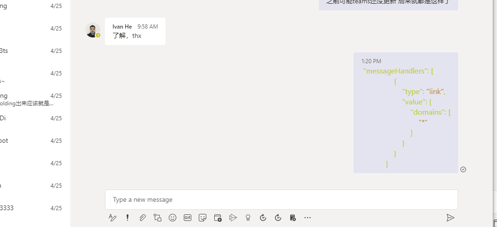
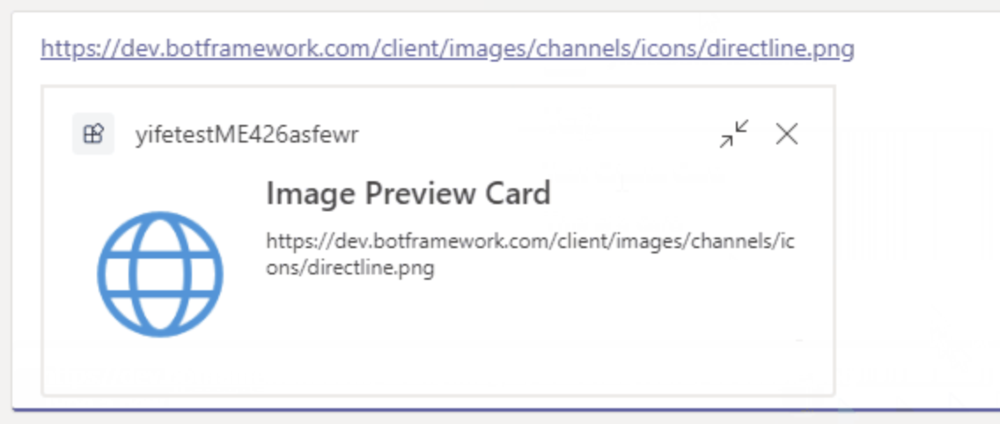

# Messaging Extension Hello World Template

*Messaging extensions* allows users to interact with your web service through buttons and forms in the Microsoft Teams client. They can search, or initiate actions, in an external system from the compose message area, the command box, or directly from a message. 

## Prerequisites
- NodeJS 
- An M365 account, if you do not have M365 account, apply one from [M365 developer program](https://developer.microsoft.com/en-us/microsoft-365/dev-program)
- Teams Toolkit or TeamsFx CLI 

## Create an application 

- From Visual Studio Code, there are two ways to create a new messaging extension, select `create a new project` in the left panel or open command palette and type `Teamsfx - Start a new project`.

- From TeamsFx CLI, run command `teamsfx new` to create a new messaging extension. 

## Debug
Start debugging the project by hitting the `F5` key. Alternatively use the `Run Panel` in Visual Studio Code and click the `Start Debugging` green arrow button.

## Build
-	From Teams Toolkit: In the project directory, execute “Teamsfx - Build Teams Package”.
-	From TeamsFx CLI: In the project directory, run command “teamsfx build”.

## Validate manifest
-	From Teams Toolkit: To check that your manifest is valid, from command palette select: “Teamsfx - Validate App Manifest File”.
-	From TeamsFx CLI: run command `teamsfx test`

## Deploy to Azure
Deploy your project to Azure when it’s ready by following these steps:
-	Log in to your Azure account
-	Select an active subscription
-	Provision your application resources in the cloud
-	Deploy your application to the cloud

You can do this using the Teams Toolkit in Visual Studio Code or using the TeamsFx CLI:
| Using Teams Toolkit |	Using TeamsFx CLI |
|-----------------------------|------------------------------|
| Open Teams Toolkit, and sign into Azure by clicking the `Sign to Azure` under the ACCOUNT section from sidebar. |	Run command `teamsfx account login azure`.|
| Once signed in, select a subscription under your account. | Run command `teamsfx account set --subscription $scriptionid` | 
| Open command palette, select: `Teamsfx - Provision in the Cloud`. | •	Run command `teamsfx provision`. | 
| Open command palette, select: `Teamsfx - Deploy to the Cloud`. | Run command: `teamsfx deploy`. |
 
> Note: This may incur costs in your Azure Subscription.

## Publish to Teams
Once deployed, you may want to submit your application to your organization's internal app store. Your app will be submitted for admin approval.
-	With Teams Toolkit: open command palette, select: “Teamsfx - Publish to Teams”.
-	With TeamsFx CLI: run command “teamsfx publish”.

## Use the App
Once the message extension is published to Teams (or in local preview mode), you should see the app running like this:

What you will learn in this hello world sample-
-	What is search command in message extension and how to use it.
-	What is action command in message extension and how to use it.
-	What is link unfurling in message extension and how to use it.
 
 ###	Search Command.
In the Message Extension sample, search command allows user to search npmjs.com, and insert the selected result into the message composing box in the format of a card. Search command can be invoked by click the app icon in the bottom of message composing box OR by @mentioning the app name in command box.

When the search command is invoked, type package name in the search bar to search. And select from the result list will automatically insert the result to message composing box. Then user can copy it to anywhere or just press send. 

Learn more about search commad, refer to doc [here](https://docs.microsoft.com/en-us/microsoftteams/platform/messaging-extensions/how-to/search-commands/define-search-command)

### Action Command

Action command allow users to interact with a pop-up dialog, which is called a task module in Teams. The task module in hello world send a card back to Teams. Invoke the action command by clicking the ‘Create Card’ button in the search dialog, a task module will be shown to collect user input.

Type the card title, subtitle and text in the task module and press submit, the text will be sent in the format of a card. Learn more information [here](https://docs.microsoft.com/en-us/microsoftteams/platform/messaging-extensions/how-to/action-commands/define-action-command)

### Link Unfurling
Link unfurling functions interpret an URL into a card that can provide additional information, image or actions. You can register your message extension to receive an invoke activity when a full URL is pasted into composing area, and respond with a card of text information, images or even actions. This helloworld app also implemented link unfurling, try to paste a URL and you will see what the message extension can do.

 Learn more information [here](https://docs.microsoft.com/en-us/microsoftteams/platform/messaging-extensions/how-to/link-unfurling?tabs=dotnet)

## Code of Conduct
This project has adopted the [Microsoft Open Source Code of Conduct](https://opensource.microsoft.com/codeofconduct/).
For more information see the [Code of Conduct FAQ](https://opensource.microsoft.com/codeofconduct/faq/) or
contact [opencode@microsoft.com](mailto:opencode@microsoft.com) with any additional questions or comments.

