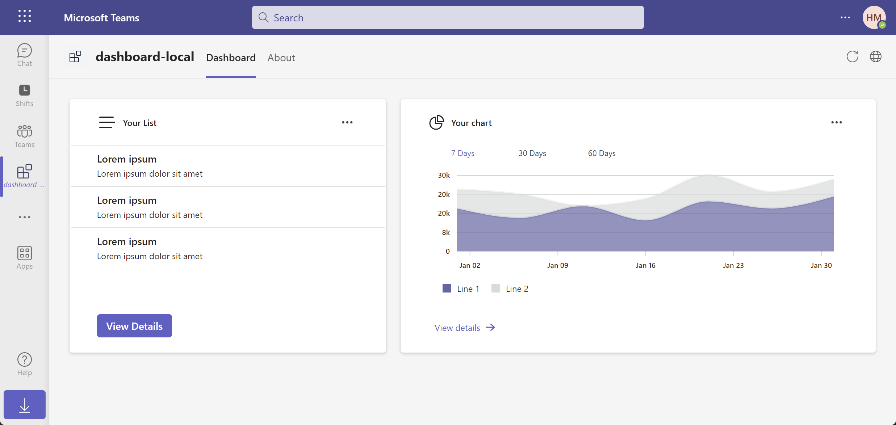
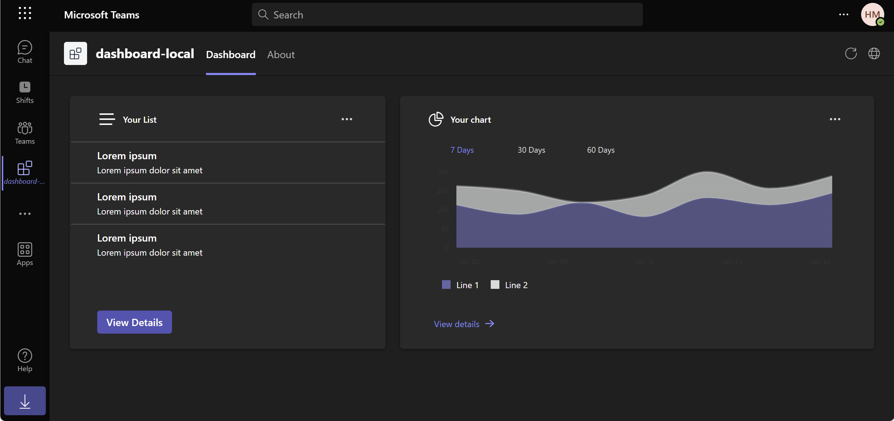

# Teams Toolkit v5.0 Pre-release

### What does pre-release mean?
Pre-release is meant for those who are eager to try the latest Teams Toolkit features and fixes. Even though pre-releases are not intended for use in production, they are at a sufficient quality level for you to generally use and [provide feedback](https://aka.ms/ttk-feedback). However, pre-release versions can and probably will change, and those changes could be major.

We've addressed a number of reported bugs and added major changes in this release based on your feedback to make Teams Toolkit more flexible. Some of the key highlights to these changes include:

- Use existing infrastructure, resource groups, and more when provisioning
- Use an existing Teams app ID
- Use an existing Azure AD app registration ID
- Use a different tunneling solution or customize the defaults
- Add custom steps to debugging, provisioning, deploying, publishing, etc.

### What about my existing Teams Toolkit projects?
The changes in this pre-release require upgrades to the TeamsFx configuration files. We recommend that you create a new app using this version. In the future, we'll provide a way to automatically upgrade existing Teams apps that were created with a previous version of Teams Toolkit.

Learn more about the changes in this pre-release at [https://aka.ms/teamsfx-v5.0-guide](https://aka.ms/teamsfx-v5.0-guide).

# Dashboard Tab

## Introduction

This is a Teams tab dashboard app that uses the [Fluent UI](https://react.fluentui.dev/?path=/docs/concepts-introduction--page) and the [Microsoft Graph API](https://learn.microsoft.com/en-us/graph/use-the-api) to display a user's profile information and recent Teams activity.



This app also supported teams different themes, including dark theme and high contrast theme.

|            Dark theme            |      High contrast theme       |
| :------------------------------: | :----------------------------: |
|  |  |

## Prerequisites

- [Node.js](https://nodejs.org/), supported versions: 14, 16, 18
- A Microsoft 365 account. If you do not have Microsoft 365 account, apply one from [Microsoft 365 developer program](https://developer.microsoft.com/en-us/microsoft-365/dev-program)
- [Teams Toolkit Visual Studio Code Extension](https://aka.ms/teams-toolkit) or [TeamsFx CLI](https://aka.ms/teamsfx-cli)

## Getting Started

Run your app with local debugging by pressing `F5` in VSCode. Select `Debug (Edge)` or `Debug (Chrome)`.

**Congratulations**! You are running an application that can now show a dashboard in Teams.

## Understanding the code

This section walks through the generated code. The project folder contains the following:

| Folder       | Contents                                                            |
| ------------ | ------------------------------------------------------------------- |
| `teamsfx`    | Project level settings, configurations, and environment information |
| `.vscode`    | VSCode files for debugging                                          |
| `src`        | The source code for the dashboard Teams application                 |
| `appPackage` | Templates for the Teams application manifest                        |
| `infra`      | Templates for provisioning Azure resources                          |

The following files provide the business logic for the dashboard tab. These files can be updated to fit your business logic requirements. The default implementation provides a starting point to help you get started.

| File                                       | Contents                                           |
| ------------------------------------------ | -------------------------------------------------- |
| `src/data/ListData.json`                   | Data for the list widget                           |
| `src/services/listService.js`              | A data retrive implementation for the list widget  |
| `src/services/chartService.js`             | A data retrive implementation for the chart widget |
| `src/views/dashboards/SampleDashboard.jsx` | A sample dashboard layout implementation           |
| `src/views/lib/Dashboard.styles.js`        | The dashbaord style file                           |
| `src/views/lib/Dashboard.jsx`              | An base class that defines the dashboard           |
| `src/views/lib/Widget.styles.js`           | The widgt style file                               |
| `src/views/lib/Widget.jsx`                 | An abstract class that defines the widget          |
| `src/views/styles/ChartWidget.styles.js`   | The chart widget style file                        |
| `src/views/styles/ListWidget.styles.js`    | The list widget style file                         |
| `src/views/widgets/ChartWidget.jsx`        | A widget implementation that can display a chart   |
| `src/views/widgets/ListWidget.jsx`         | A widget implementation that can display a list    |

The following files are project-related files. You generally will not need to customize these files.

| File                               | Contents                                                     |
| ---------------------------------- | ------------------------------------------------------------ |
| `src/index.jsx`                    | Application entry point                                      |
| `src/App.jsx`                      | Application route                                            |
| `src/internal/addNewScopes.js`     | Implementation of new scopes add                             |
| `src/internal/context.jsx`         | TeamsFx Context                                              |
| `src/internal/login.js`            | Implementation of login                                      |
| `src/internal/singletonContext.js` | Implementation of the TeamsUserCredential instance singleton |

## How to add a new widget

You can use the following steps to add a new widget to the dashboard:

1. [Step 1: Create a data retrive service](#step-1-create-a-data-retrive-service)
2. [Step 2: Create a widget file](#step-2-create-a-widget-file)
3. [Step 3: Add the widget to the dashboard](#step-3-add-the-widget-to-the-dashboard)

### Step 1: Create a data retrive service

Simplely, you can create a service that returns dummy data. We recommend that you put data files in the `src/data` folder, and put data retrive services in the `src/services` folder.

Here's a sample json file that contains dummy data:

```json
{
  "content": "Hello world!"
}
```

Here's a dummy data retrive service:

```javascript
import SampleData from "../data/SampleData.json";

export const getSampleData = () => SampleData;
```

> Note: You can also implement a service to retrieve data from the backend service or from the Microsoft Graph API.

### Step 2: Create a widget file

Create a widget file in `src/views/widgets` folder. Extend the [`Widget`](src/views/lib/Widget.jsx) class. The following table lists the methods that you can override to customize your widget.

| Methods           | Function                                                                                                                                      |
| ----------------- | --------------------------------------------------------------------------------------------------------------------------------------------- |
| `getData()`       | This method is used to get the data for the widget. You can implement it to get data from the backend service or from the Microsoft Graph API |
| `headerContent()` | Customize the content of the widget header                                                                                                    |
| `bodyContent()`   | Customize the content of the widget body                                                                                                      |
| `footerContent()` | Customize the content of the widget footer                                                                                                    |

> All methods are optional. If you do not override any method, the default widget layout will be used.

Here's a sample widget implementation:

```javascript
import { Button, Text } from "@fluentui/react-components";
import { Widget } from "../lib/Widget";
import { getSampleData } from "../../services/sampleService";

export class SampleWidget extends Widget {
  async getData() {
    return getSampleData();
  }

  headerContent() {
    return <Text>Sample Widget</Text>;
  }

  bodyContent() {
    return <div>{this.state.data?.content}</div>;
  }

  footerContent() {
    return (
      <Button appearance="primary" size="medium" onClick={() => {}}>
        View Details
      </Button>
    );
  }
}
```

### Step 3: Add the widget to the dashboard

1. Go to `src/views/dashboards/SampleDashboard.jsx`, if you want create a new dashboard, please refer to [How to add a new dashboard](#how-to-add-a-new-dashboard).
2. Update your `dashboardLayout()` method to add the widget to the dashboard:

```javascript
dashboardLayout() {
  return (
    <>
      <ListWidget />
      <ChartWidget />
      <SampleWidget />
    </>
  );
}
```

> Note: If you want put your widget in a column, you can use the [`oneColumn()`](src/views/lib/Dashboard.styles.js#L30) method to define the column layout. Here is an example:

```javascript
dashboardLayout() {
  return (
    <>
      <ListWidget />
      <div style={oneColumn()}>
        <ChartWidget />
        <SampleWidget />
      </div>
    </>
  );
}
```

## How to add a new dashboard

You can use the following steps to add a new dashboard layout:

1. [Step 1: Create a dashboard class](#step-1-create-a-dashboard-class)
2. [Step 2: Override methods to customize dashboard layout](#step-2-override-methods-to-customize-dashboard-layout)
3. [Step 3: Add a route for the new dashboard](#step-3-add-a-route-for-the-new-dashboard)
4. [Step 4: Modify manifest to add a new dashboard tab](#step-4-modify-manifest-to-add-a-new-dashboard-tab)

### Step 1: Create a dashboard class

Create a file with the extension `.jsx` for your dashboard in the `src/views/dashboards` directory. For example, `YourDashboard.jsx`. Then, create a class that extends the [Dashboard](src/views/lib/Dashboard.jsx) class.

```javascript
export default class YourDashboard extends Dashboard {}
```

### Step 2: Override methods to customize dashboard layout

Dashboard class provides some methods that you can override to customize the dashboard layout. The following table lists the methods that you can override.

| Methods             | Function                                                                          |
| ------------------- | --------------------------------------------------------------------------------- |
| `rowHeights()`      | Customize the height of each row of the dashboard                                 |
| `columnWidths()`    | Customize how many columns the dashboard has at most and the width of each column |
| `dashboardLayout()` | Define widgets layout                                                             |

Here is an example to customize the dashboard layout.

```javascript
export default class YourDashboard extends Dashboard {
  rowHeights() {
    return "500px";
  }

  columnWidths() {
    return "4fr 6fr";
  }

  dashboardLayout() {
    return (
      <>
        <SampleWidget />
        <div style={oneColumn("6fr 4fr")}>
          <SampleWidget />
          <SampleWidget />
        </div>
      </>
    );
  }
}
```

> Note: All methods are optional. If you do not override any method, the default dashboard layout will be used.

### Step 3: Add a route for the new dashboard

Open the `src/App.jsx` file, and add a route for the new dashboard. Here is an example:

```javascript
import YourDashboard from "./views/dashboards/YourDashboard";

export default function App() {
  ...
  <Route exact path="/yourdashboard" component={YourDashboard} />
  ...
}
```

### Step 4: Modify manifest to add a new dashboard tab

Open the [`appPackage/manifest.json`](appPackage/manifest.json) file, and add a new dashboard tab under the `staticTabs`. Here is an example:

```json
{
    "entityId": "index1",
    "name": "Your Dashboard",
    "contentUrl": "${{TAB_ENDPOINT}}/index.html#/yourdashboard",
    "websiteUrl": "${{TAB_ENDPOINT}}/index.html#/yourdashboard",
    "scopes": [
        "personal"
    ]
}
```

## How to add a new Graph API call

Please follow these two steps:
1.	Add SSO: Refer to How-to guides in Teams Toolkit by clicking Teams Toolkit in the side bar > `View how-to guides` > `Develop single sign-on experience in Teams`.
2.	Refer to [this document](https://learn.microsoft.com/en-us/microsoftteams/platform/toolkit/teamsfx-sdk#microsoft-graph-scenarios:~:text=caught%20and%20transformed.-,Microsoft%20Graph%20Scenarios,-This%20section%20provides) to call a Graph API via TeamsFx SDK.

## Additional resources

- [Fluent UI](https://react.fluentui.dev/?path=/docs/concepts-introduction--page)
- [Fluent UI React Charting Example](https://fluentuipr.z22.web.core.windows.net/heads/master/react-charting/demo/index.html#/)
