# Overview of the Link Unfurling app template

This is an Link Unfurling app that can unfurl an adaptive card when URLs with a particular domain are pasted into the compose message area. This app also enables Zero Install Link Unfurling which helps you unfurl a card for your links even before you discovered or installed your app in Teams.

Teams:

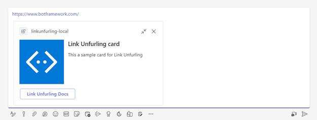

Outlook:

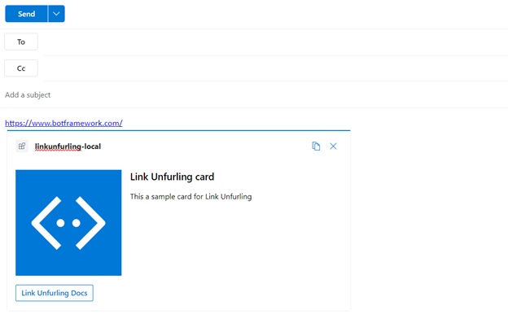

## Get Started

**Prerequisites**

- [Node.js](https://nodejs.org/), supported versions: 16, 18
- A Microsoft 365 account. If you do not have Microsoft 365 account, apply one from [Microsoft 365 developer program](https://developer.microsoft.com/en-us/microsoft-365/dev-program)
- [Teams Toolkit Visual Studio Code Extension](https://aka.ms/teams-toolkit) version 5.0.0 and higher or [TeamsFx CLI](https://aka.ms/teamsfx-cli)

**Debug**
- From Visual Studio Code: Click `Run and Debug` panel.
- Select a target Microsoft application where the link unfurling app runs: `Debug in Teams`, `Debug in Outlook` and click the `Run and Debug` green arrow button.
- From TeamsFx CLI: 
  - Install [ngrok](https://ngrok.com/download) and start your local tunnel service by running the command `ngrok http 3978`.
  - In the `env/.env.local` file, fill in the values for `BOT_DOMAIN` and `BOT_ENDPOINT` with your ngrok URL.
    ```
    BOT_DOMAIN=sample-id.ngrok.io
    BOT_ENDPOINT=http://sample-id.ngrok.io
    ```
  - Executing the command `teamsfx provision --env local` in your project directory.
  - Executing the command `teamsfx deploy --env local` in your project directory.
  - Executing the command `teamsfx preview --env local --m365-host <m365-host>` in your project directory, where options for m365-host are `teams` or `outlook`.

**Edit the manifest**

You can find the Teams app manifest in `./appPackage` folder. The folder contains one manifest file:
* `manifest.json`: Manifest file for Teams app running locally or running remotely (After deployed to Azure).

This file contains template arguments with `${{...}}` statements which will be replaced at build time. You may add any extra properties or permissions you require to this file. See the [schema reference](https://docs.microsoft.com/en-us/microsoftteams/platform/resources/schema/manifest-schema) for more information.

**Deploy to Azure**

Deploy your project to Azure by following these steps:

| From Visual Studio Code                                                                                                                                                                                                                                                                                                                                                  | From TeamsFx CLI                                                                                                                                                                                                                    |
| :----------------------------------------------------------------------------------------------------------------------------------------------------------------------------------------------------------------------------------------------------------------------------------------------------------------------------------------------------------------------- | :---------------------------------------------------------------------------------------------------------------------------------------------------------------------------------------------------------------------------------- |
| <ul><li>Open Teams Toolkit, and sign into Azure by clicking the `Sign in to Azure` under the `ACCOUNTS` section from sidebar.</li> <li>After you signed in, select a subscription under your account.</li><li>Open the Teams Toolkit and click `Provision` from DEPLOYMENT section or open the command palette and select: `Teams: Provision`.</li><li>Open the Teams Toolkit and click `Deploy` or open the command palette and select: `Teams: Deploy`.</li></ul> | <ul> <li>Run command `teamsfx account login azure`.</li> <li>Run command `teamsfx provision --env dev`.</li> <li>Run command: `teamsfx deploy --env dev`. </li></ul> |

> Note: Provisioning and deployment may incur charges to your Azure Subscription.

**Preview**

Once the provisioning and deployment steps are finished, you can preview your app:

- From Visual Studio Code

  1. Open the `Run and Debug Activity Panel`.
  1. Select `Launch Remote in Teams` or `Launch Remote in Outlook` from the launch configuration drop-down.
  1. Press the Play (green arrow) button to launch your app - now running remotely from Azure.

- From TeamsFx CLI: execute `teamsfx preview --env dev --m365-host <m365-host>` in your project directory to launch your application, where options for m365-host are `teams` or `outlook`.

## What's included in the template
| Folder / File | Contents |
| - | - |
| `teamsapp.yml` | Main project file describes your application configuration and defines the set of actions to run in each lifecycle stages |
| `teamsapp.local.yml`| This overrides `teamsapp.yml` with actions that enable local execution and debugging |
| `.vscode/` | VSCode files for local debug |
| `src/` | The source code for the link unfurling application |
| `appPackage/` | Templates for the Teams application manifest |
| `infra/` | Templates for provisioning Azure resources |

The following files can be customized and demonstrate an example implementation to get you started.

| File | Contents |
| - | - |
| `src/index.ts` | Application entry point and `restify` handlers |
| `src/linkUnfurlingApp.ts`| The teams activity handler |
| `src/adaptiveCards/helloWorldCard.json` | The adaptive card |

## Extend this template

This section introduces how to customize or extend this template, including:

[How to use Zero Install Link Unfurling in Teams](#how-to-use-zero-install-link-unfurling-in-teams)

[How to add link unfurling cache in Teams](#how-to-add-link-unfurling-cache-in-teams)

[How to customize Zero Install Link Unfurling's adaptive cards](#how-to-customize-zero-install-link-unfurlings-adaptive-cards)

[How to add stage view (Teams)](#how-to-add-stage-view-teams)

[How to add task module (Teams)](#how-to-add-task-module-teams)

[How to add adaptive card action (Teams)](#how-to-add-adaptive-card-action-teams)
### How to use Zero Install Link Unfurling in Teams

Zero Install Link Unfurling requires link unfurling app to be published. You need an admin account to publish an app into your org.

Login your admin account in Teams. Go to `Manage your apps` -> `Upload an app`. Click `Upload an app to your org's app catalog` to upload your app's zip file.

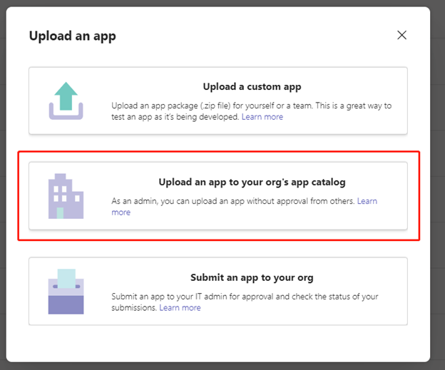

Switch to another user account. Without installing this app, paste the link "https://www.botframework.com" into chatbox, and you should see the adaptive card like below.

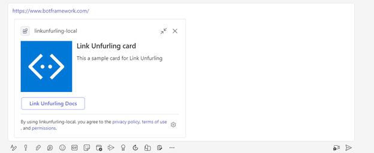
### How to add link unfurling cache in Teams

This template removes cache by default to provide convenience for debug. To add cache, ***REMOVE*** following JSON part from adaptive card in `linkUnfurlingApp.ts`:
```ts
suggestedActions: {
          actions: [
            {
              title: "default",
              type: "setCachePolicy",
              value: '{"type":"no-cache"}',
            },
          ],
        }
```
After removing this, the link unfurling result will be cached in Teams for 30 minutes. 

Please refer to [link unfurling document](https://learn.microsoft.com/en-us/microsoftteams/platform/messaging-extensions/how-to/link-unfurling?tabs=desktop%2Cjson%2Cadvantages#remove-link-unfurling-cache) for more details.

### How to customize Zero Install Link Unfurling's adaptive cards

The supported types for Zero Install Link Unfurling are "result" and "auth" and this template uses "result" as default. By changing it to "auth", the adaptive card will be:

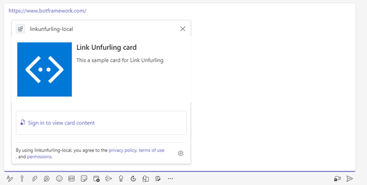

For card with type "auth", the Teams client strips away any action buttons from the card, and adds a sign in action button. 

Please refer to [zero install link unfurling document](https://learn.microsoft.com/en-us/microsoftteams/platform/messaging-extensions/how-to/link-unfurling?tabs=desktop%2Cjson%2Climitations#zero-install-for-link-unfurling) for more details.
  
### How to add stage view (Teams)

You can use the following steps to add stage view in the adaptive card.

**Step 1: Update `staticTabs` in manifest**

In `appPackage/manifest.json`, update `staticTabs` section.
```json
    "staticTabs": [
        {
            "entityId": "stageViewTask",
            "name": "Stage View",
            "contentUrl": "https://${{BOT_DOMAIN}}/tab",
            "websiteUrl": "https://${{BOT_DOMAIN}}/tab",
            "searchUrl": "https://${{BOT_DOMAIN}}/tab",
            "scopes": [
                "personal"
            ],
            "context": [
                "personalTab",
                "channelTab"
            ]
        }
    ],
```

**Step 2: Update `index.ts`**

In `src/index.ts`, add following code.
```ts
server.get("/tab", async (req, res) => {
  const body = `<!DOCTYPE html>
  <html lang="en">
  
  <div class="text-center">
    <h1 class="display-4">Tab in stage View</h1>
  </div>
  
  </html>`;
  res.writeHead(200, {
    'Content-Length': Buffer.byteLength(body),
    'Content-Type': 'text/html'
  });
  res.write(body);
  res.end();
});
```
**Step 3: Set `BOT_DOMAIN` and `TEAMS_APP_ID` in environment variables**

For local debug:

Update action `file/createOrUpdateEnvironmentFile` in `teamsapp.local.yml`, add `TEAMS_APP_ID` and `BOT_DOMAIN` to env.
```yaml
  - uses: file/createOrUpdateEnvironmentFile # Generate runtime environment variables
    with:
      target: ./.localConfigs
      envs:
        BOT_ID: ${{BOT_ID}}
        BOT_PASSWORD: ${{SECRET_BOT_PASSWORD}}
        TEAMS_APP_ID: ${{TEAMS_APP_ID}}
        BOT_DOMAIN: ${{BOT_DOMAIN}}
```

For remote:

Update `infra/azure.parameters.json`. Add following to `parameters`:
```json
    "teamsAppId":{
      "value": "${{TEAMS_APP_ID}}"
    }
```

Add following to `infra/azure.bicep`:
```bicep
param teamsAppId string 

resource webAppSettings 'Microsoft.Web/sites/config@2022-09-01' = {
  parent: webApp
  name: 'appsettings'
  properties: {
    BOT_DOMAIN: webApp.properties.defaultHostName
    BOT_ID: botAadAppClientId
    BOT_PASSWORD: botAadAppClientSecret
    RUNNING_ON_AZURE: '1'
    TEAMS_APP_ID: teamsAppId
    WEBSITE_NODE_DEFAULT_VERSION: '~18'
    WEBSITE_RUN_FROM_PACKAGE: '1'
  }
}
```
**Step 4: Update adaptive card**

In `src/adaptiveCards/helloWorldCard.json`, update `actions` to be following.
```json
"actions": [
        {
            "type": "Action.Submit",
            "title": "View Via card",
            "data":{
                "msteams": {
                    "type": "invoke",
                    "value": {
                        "type": "tab/tabInfoAction",
                        "tabInfo": {
                            "contentUrl": "https://${url}/tab",
                            "websiteUrl": "https://${url}/tab"
                        }
                    }
                }
            }
        },
        {
            "type": "Action.OpenUrl",
            "title": "View Via Deep Link",
            "url": "https://teams.microsoft.com/l/stage/${appId}/0?context=%7B%22contentUrl%22%3A%22https%3A%2F%2F${url}%2Ftab%22%2C%22websiteUrl%22%3A%22https%3A%2F%2F${url}%2Fcontent%22%2C%22name%22%3A%22DemoStageView%22%7D"
        }
      ],
```
Run `npm install @microsoft/adaptivecards-tools`. This package helps render placeholders such as `${url}` in adaptive card to be real values.

In `linkUnfurlingApp.ts`, update variable `attachment` to be following.
```ts
    const data = { url: process.env.BOT_DOMAIN, appId: process.env.TEAMS_APP_ID };

    const renderedCard = AdaptiveCards.declare(card).render(data);

    const attachment = { ...CardFactory.adaptiveCard(renderedCard), preview: previewCard };

```
In Teams, the adaptive card will be like:

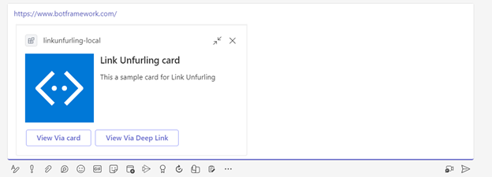

Opening stage view from Adaptive card Action:

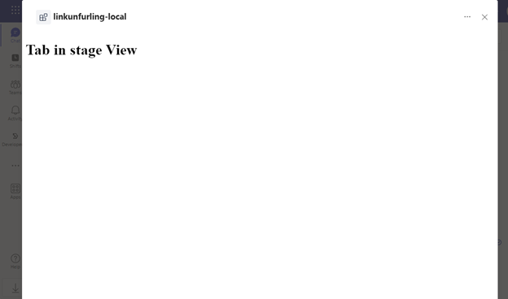

Opening stage view from Adative card via deep link:

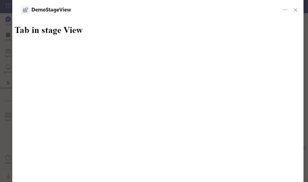

Please refer to [Stage view document](https://learn.microsoft.com/en-us/microsoftteams/platform/tabs/tabs-link-unfurling) for more details.

### How to add task module (Teams)

**Step 1: Update adaptive card**

In `src/adaptiveCards/helloWorldCard.json`, update `actions` to be following.
```json
    "actions": [
        {
            "type": "Action.Submit",
            "title": "Task module",
            "data": {
                "msteams": {
                    "type": "task/fetch",
                    "data": "task module"
                }
            }
        }
      ],
```

**Step 2: Add `handleTeamsTaskModuleFetch` function in handler**

In `src/linkUnfurlingApp.ts`, add following method to `LinkUnfurlingApp` class.
```ts
  public async handleTeamsTaskModuleFetch(context: TurnContext, taskModuleRequest: TaskModuleRequest): Promise<TaskModuleResponse> {
    return {
      task: {
        type: "continue",
        value: {
          title: "Task Module Fetch",
          height: 200,
          width: 400,
          card: CardFactory.adaptiveCard({
            version: '1.0.0',
            type: 'AdaptiveCard',
            body: [
              {
                type: 'TextBlock',
                text: 'Enter Text Here'
              },
              {
                type: 'Input.Text',
                id: 'usertext',
                placeholder: 'add some text and submit',
                IsMultiline: true
              }
            ],
            actions: [
              {
                type: 'Action.Submit',
                title: 'Submit'
              }
            ]
          })
        },
      },
    };
  }
```

**Step 3: Add `handleTeamsTaskModuleSubmit` function in handler**

In `src/linkUnfurlingApp.ts`, add following method to `LinkUnfurlingApp` class.
```ts
  public async handleTeamsTaskModuleSubmit(context: TurnContext, taskModuleRequest: TaskModuleRequest): Promise<TaskModuleResponse> {
    return {
      task: {
        type: 'message',
        value: 'Thanks!'
      }
    };
  }
```
In Teams, the adaptive card will be like:

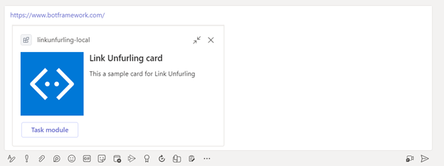

Click "Task module" button:

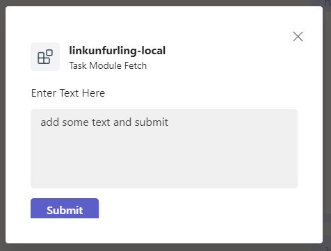

Click "Submit" button:

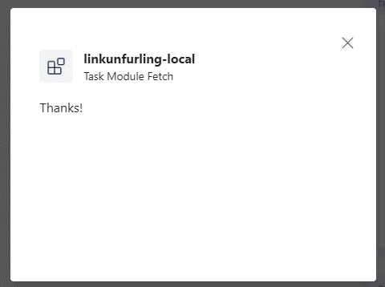

Please refer to [Task module document](https://learn.microsoft.com/en-us/microsoftteams/platform/task-modules-and-cards/task-modules/task-modules-bots?tabs=nodejs) for more details.

### How to add adaptive card action (Teams)

**Step 1: Update `bots` section in manifest**

The card action requires bot capability. In `appPackage/manifest.json`, update `bots` section to be following.
```json
    "bots": [
        {
            "botId": "${{BOT_ID}}",
            "scopes": [
                "team",
                "personal",
                "groupchat"
            ],
            "supportsFiles": false,
            "isNotificationOnly": false
        }
    ]
```
**Step 2: Update adaptive card**

In `src/adaptiveCards/helloWorldCard.json`, update `actions` to be following.
```json
    "actions": [
        {
            "type": "Action.Execute",
            "title": "card action",
            "verb": "cardAction",
            "id": "cardAction"
        }
    ],
```
**Step 3: Add `onAdaptiveCardInvoke` function in handler**

In `src/linkUnfurlingApp.ts`, add following method to `LinkUnfurlingApp` class.
```ts
  public async onAdaptiveCardInvoke(context: TurnContext, invokeValue: AdaptiveCardInvokeValue): Promise<AdaptiveCardInvokeResponse> {
    const card = {
      "type": "AdaptiveCard",
      "body": [
        {
          "type": "TextBlock",
          "text": "Your reponse was sent to the app",
          "size": "Medium",
          "weight": "Bolder",
          "wrap": true
        },
      ],
      "$schema": "http://adaptivecards.io/schemas/adaptive-card.json",
      "version": "1.4"
    };
    const res = { statusCode: 200, type: "application/vnd.microsoft.card.adaptive", value: card };
    return res;
  }
```

In Teams, the adaptive card will be like:

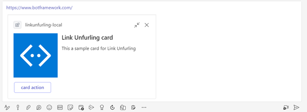

Click "card action" button, the adaptive card will be updated to be following:

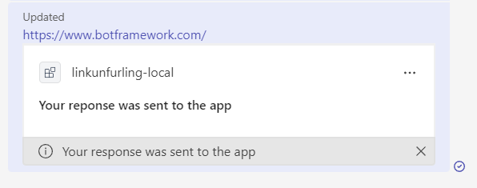

Please refer to [Universal actions document](https://learn.microsoft.com/en-us/microsoftteams/platform/task-modules-and-cards/cards/universal-actions-for-adaptive-cards/overview) for more details.