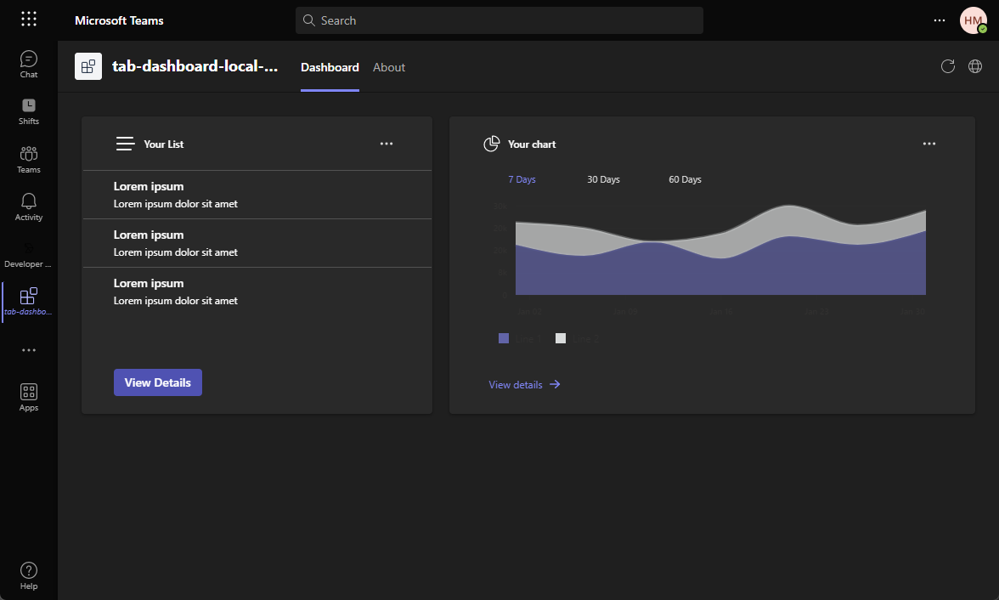
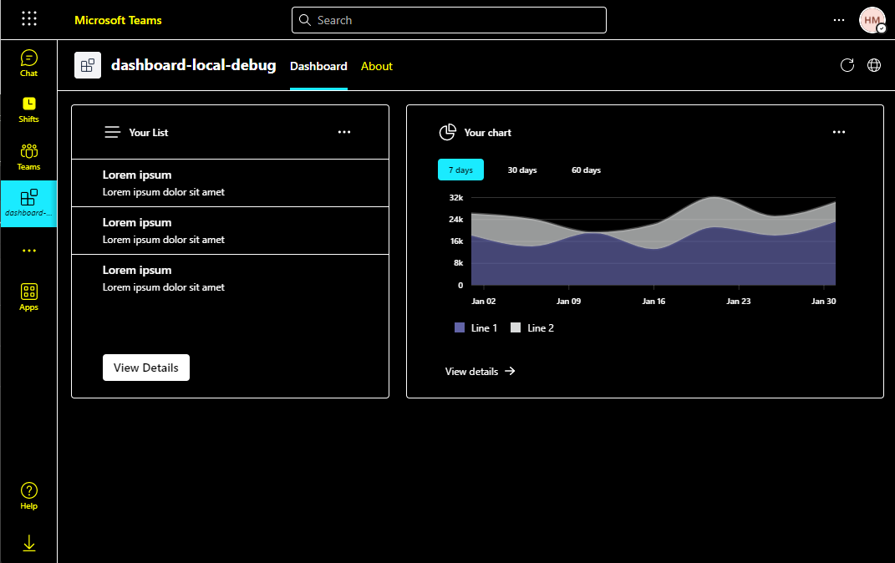

# Dashboard Tab

## Introduction

This is a Teams tab dashboard app that uses the [Fluent UI](https://react.fluentui.dev/?path=/docs/concepts-introduction--page) and the [Microsoft Graph API](https://learn.microsoft.com/en-us/graph/use-the-api) to display a user's profile information and recent Teams activity.


This app also supported teams different themes, including dark theme and high contrast theme.

|              Dark theme              |        High contrast theme         |
| :----------------------------------: | :--------------------------------: |
|  |  |

## Prerequisites

- [NodeJS](https://nodejs.org/en/), fully tested on NodeJS 14, 16
- A Microsoft 365 account. If you do not have Microsoft 365 account, apply one from [Microsoft 365 developer program](https://developer.microsoft.com/en-us/microsoft-365/dev-program)
- [Teams Toolkit Visual Studio Code Extension](https://aka.ms/teams-toolkit) or [TeamsFx CLI](https://aka.ms/teamsfx-cli)

## Getting Started

Run your app with local debugging by pressing `F5` in VSCode. Select `Debug (Edge)` or `Debug (Chrome)`.

**Congratulations**! You are running an application that can now show a dashboard in Teams.

## Understanding the code

This section walks through the generated code. The project folder contains the following:

| Folder      | Contents                                                                          |
| ----------- | --------------------------------------------------------------------------------- |
| `.fx`       | Project level settings, configurations, and environment information               |
| `.vscode`   | VSCode files for local debug                                                      |
| `tabs`      | The source code for the dashboard tab Teams application                           |
| `templates` | Templates for the Teams application manifest and for provisioning Azure resources |

The core dashboard implementation is in `tabs` folder.

The following files provide the business logic for the dashboard tab. These files can be updated to fit your business logic requirements. The default implementation provides a starting point to help you get started.

| File                                       | Contents                                          |
| ------------------------------------------ | ------------------------------------------------- |
| `src/data/listData.json`                   | Data for the list widget                          |
| `src/models/listModel.ts`                  | Data model for the list widget                    |
| `src/services/chartService.ts`             | A data retrive implementation for the chart widget|
| `src/services/listService.ts`              | A data retrive implementation for the list widget |
| `src/views/dashboards/SampleDashboard.tsx` | A sample dashboard layout implementation          |
| `src/views/lib/Dashboard.styles.ts`        | The dashbaord style file                          |
| `src/views/lib/Dashboard.tsx`              | An base class that defines the dashboard          |
| `src/views/lib/Widget.styles.ts`           | The widgt style file                              |
| `src/views/lib/Widget.tsx`                 | An abstract class that defines the widget         |
| `src/views/styles/ChartWidget.styles.ts`   | The chart widget style file                       |
| `src/views/styles/ListWidget.styles.ts`    | The list widget style file                        |
| `src/views/widgets/ChartWidget.tsx`        | A widget implementation that can display a chart  |
| `src/views/widgets/ListWidget.tsx`         | A widget implementation that can display a list   |

The following files are project-related files. You generally will not need to customize these files.

| File                               | Contents                                                     |
| ---------------------------------- | ------------------------------------------------------------ |
| `src/index.tsx`                    | Application entry point                                      |
| `src/App.tsx`                      | Application route                                            |
| `src/internal/addNewScopes.ts`     | Implementation of new scopes add                             |
| `src/internal/context.ts`          | TeamsFx Context                                              |
| `src/internal/login.ts`            | Implementation of login                                      |
| `src/internal/singletonContext.ts` | Implementation of the TeamsUserCredential instance singleton |

## How to add a new widget

You can use the following steps to add a new widget to the dashboard:

1. [Step 1: Define a data model](#step-1-define-a-data-model)
2. [Step 2: Create a data retrive service](#step-2-create-a-data-retrive-service)
3. [Step 3: Create a widget file](#step-3-create-a-widget-file)
4. [Step 4: Add the widget to the dashboard](#step-4-add-the-widget-to-the-dashboard)

### Step 1: Define a data model

Define a data model based on the business scenario, and put it in `tabs/src/models` folder. The widget model defined according to the data you want to display in the widget. Here's a sample data model:

```typescript
export interface SampleModel {
  content: string;
}
```

### Step 2: Create a data retrive service

Simplely, you can create a service that returns dummy data. We recommend that you put data files in the `tabs/src/data` folder, and put data retrive services in the `tabs/src/services` folder.

Here's a sample json file that contains dummy data:

```json
{
  "content": "Hello world!"
}
```

Here's a dummy data retrive service:

```typescript
import { SampleModel } from "../models/sampleModel";
import SampleData from "../data/SampleData.json";

export const getSampleData = (): SampleModel => SampleData;
```

> Note: You can also implement a service to retrieve data from the backend service or from the Microsoft Graph API.

### Step 3: Create a widget file

Create a widget file in `tabs/src/views/widgets` folder. Extend the [`Widget`](src/views/lib/Widget.tsx) class. The following table lists the methods that you can override to customize your widget.

| Methods           | Function                                                                                                                                      |
| ----------------- | --------------------------------------------------------------------------------------------------------------------------------------------- |
| `getData()`       | This method is used to get the data for the widget. You can implement it to get data from the backend service or from the Microsoft Graph API |
| `headerContent()` | Customize the content of the widget header                                                                                                    |
| `bodyContent()`   | Customize the content of the widget body                                                                                                      |
| `footerContent()` | Customize the content of the widget footer                                                                                                    |

> All methods are optional. If you do not override any method, the default widget layout will be used.

Here's a sample widget implementation:

```tsx
import { Button, Text } from "@fluentui/react-components";
import { Widget } from "../lib/Widget";
import { SampleModel } from "../../models/sampleModel";
import { getSampleData } from "../../services/sampleService";

export class SampleWidget extends Widget<SampleModel> {
  async getData(): Promise<SampleModel> {
    return getSampleData();
  }

  headerContent(): JSX.Element | undefined {
    return <Text>Sample Widget</Text>;
  }

  bodyContent(): JSX.Element | undefined {
    return <div>{this.state.data?.content}</div>;
  }

  footerContent(): JSX.Element | undefined {
    return (
      <Button
        appearance="primary"
        size="medium"
        style={{ width: "fit-content" }}
        onClick={() => {}}
      >
        View Details
      </Button>
    );
  }
}
```

### Step 4: Add the widget to the dashboard

1. Go to `tabs/src/views/dashboards/SampleDashboard.tsx`, if you want create a new dashboard, please refer to [How to add a new dashboard](#how-to-add-a-new-dashboard).
2. Update your `dashboardLayout()` method to add the widget to the dashboard:

```tsx
protected dashboardLayout(): JSX.Element | undefined {
  return (
    <>
      <ListWidget />
      <ChartWidget />
      <SampleWidget />
    </>
  );
}
```

> Note: If you want put your widget in a column, you can use the [`oneColumn()`](src/views/lib/Dashboard.styles.ts#L32) method to define the column layout. Here is an example:

```tsx
protected dashboardLayout(): JSX.Element | undefined {
  return (
    <>
      <ListWidget />
      <div style={oneColumn()}>
        <ChartWidget />
        <SampleWidget />
      </div>
    </>
  );
}
```

## How to add a new dashboard

You can use the following steps to add a new dashboard layout:

1. [Step 1: Create a dashboard class](#step-1-create-a-dashboard-class)
2. [Step 2: Override methods to customize dashboard layout](#step-2-override-methods-to-customize-dashboard-layout)
3. [Step 3: Add a route for the new dashboard](#step-3-add-a-route-for-the-new-dashboard)
4. [Step 4: Modify manifest to add a new dashboard tab](#step-4-modify-manifest-to-add-a-new-dashboard-tab)

### Step 1: Create a dashboard class

Create a file with the extension `.tsx` for your dashboard in the `tabs/src/views/dashboards` directory. For example, `YourDashboard.tsx`. Then, create a class that extends the [Dashboard](src/views/lib/Dashboard.tsx) class.

```tsx
export default class YourDashboard extends Dashboard {}
```

### Step 2: Override methods to customize dashboard layout

Dashboard class provides some methods that you can override to customize the dashboard layout. The following table lists the methods that you can override.

| Methods             | Function                                                                          |
| ------------------- | --------------------------------------------------------------------------------- |
| `rowHeights()`      | Customize the height of each row of the dashboard                                 |
| `columnWidths()`    | Customize how many columns the dashboard has at most and the width of each column |
| `dashboardLayout()` | Define widgets layout                                                             |

Here is an example to customize the dashboard layout.

```tsx
export default class YourDashboard extends Dashboard {
  protected rowHeights(): string | undefined {
    return "500px";
  }

  protected columnWidths(): string | undefined {
    return "4fr 6fr";
  }

  protected dashboardLayout(): JSX.Element | undefined {
    return (
      <>
        <SampleWidget />
        <div style={oneColumn("6fr 4fr")}>
          <SampleWidget />
          <SampleWidget />
        </div>
      </>
    );
  }
}
```

> Note: All methods are optional. If you do not override any method, the default dashboard layout will be used.

### Step 3: Add a route for the new dashboard

Open the `tabs/src/App.tsx` file, and add a route for the new dashboard. Here is an example:

```tsx
import YourDashboard from "./views/dashboards/YourDashboard";

export default function App() {
  ...
  <Route exact path="/yourdashboard" component={YourDashboard} />
  ...
}
```

### Step 4: Modify manifest to add a new dashboard tab

Open the [`templates/appPackage/manifest.template.json`](../templates/appPackage/manifest.template.json) file, and add a new dashboard tab under the `staticTabs`. Here is an example:

```json
{
  "entityId": "index",
  "name": "Your Dashboard",
  "contentUrl": "{{state.fx-resource-frontend-hosting.endpoint}}{{state.fx-resource-frontend-hosting.indexPath}}/yourdashboard",
  "websiteUrl": "{{state.fx-resource-frontend-hosting.endpoint}}{{state.fx-resource-frontend-hosting.indexPath}}/yourdashboard",
  "scopes": ["personal"]
}
```

## How to add a new Graph API call

### Add SSO First

Before you add your logic of calling a Graph API, you should enable your dashboard project to use SSO. It is convenient to add SSO related files by using `Teams Toolkit`. Refer to the following 2 steps to add SSO.

1. Step 1: Click `Teams Toolkit` in the side bar > Click `Add features` in `DEVELOPMENT`.

   

2. Step 2: Choose `Single Sign-On` to add.

   

3. Step 3: Move `auth-start.html` and `auth-end.html` in `auth/tab/public` folder to `tabs/public/`.
   These two HTML files are used for auth redirects.

4. Step 4: Move `sso` folder under `auth/tab` to `tabs/src/sso/`.

Now you have already added SSO files to your project, and you can call Graph APIs. There are two types of Graph APIs, one will be called from the front-end(most of APIs, use delegated permissions), the other will be called from the back-end(sendActivityNotification, e.g., use application permissions). You can refer to [this tutorial](https://learn.microsoft.com/en-us/graph/api/overview?view=graph-rest-beta) to check permission types of the Graph APIs you want to call.

### Call graph api from the front-end(use delegated permissions)

If you want to call a Graph API from the front-end tab, you can refer to the following steps.

1. [Step 1: Consent delegated permissions first](#step-1-consent-delegated-permissions-first)
2. [Step 2: Create a graph client by adding the scope related to the Graph API you want to call](#step-2-create-a-graph-client-by-adding-the-scope-related-to-the-graph-api-you-want-to-call)
3. [Step 3: Call the Graph API, and parse the response into a certain model, which will be used by front-end](#step-3-call-the-graph-api-and-parse-the-response-into-a-certain-model-which-will-be-used-by-front-end)

#### Step 1: Consent delegated permissions first

You can call [`addNewPermissionScope(scopes: string[])`](src/internal/addNewScopes.ts) to consent the scopes of permissions you want to add. And the consented status will be preserved in a global context [`TeamsUserCredentialContext`](src/internal/singletonContext.ts).

You can refer to [the Graph API V1.0](https://learn.microsoft.com/en-us/graph/api/overview?view=graph-rest-1.0) to get the `scope name of the permission` related to the Graph API you want to call.

#### Step 2: Create a graph client by adding the scope related to the Graph API you want to call

You can refer to the following code snippet:

```ts
const teamsUserCredential = TeamsUserCredentialContext.getInstance().getCredential();
const graphClient: Client = createMicrosoftGraphClientWithCredential(teamsUserCredential, scope);
```

#### Step 3: Call the Graph API, and parse the response into a certain model, which will be used by front-end

You can refer to the following code snippet:

```ts
try {
  const graphApiResult = await graphClient.api("<GRAPH_API_PATH>").get();
  // Parse the graphApiResult into a Model you defined, used by the front-end.
} catch (e) {}
```

### Call graph api from the back-end(use application permissions)

If you want to call a Graph API from the back-end, you can refer to the following steps.

1. [Step 1: Consent application permissions first](#step-1-consent-application-permissions-first)
2. [Step 2: Add an Azure Function](#step-2-add-an-azure-function)
3. [Step 3: Add your logic in Azure Function](#step-4-add-your-logic-in-azure-function)
4. [Step 4: Call the Azure Function from the front-end](#step-5-call-the-azure-function-from-the-front-end)

#### Step 1: Consent application permissions first

Go to [Azure portal](https://portal.azure.com/) > Click `Azure Active Directory` > Click `App registrations` in the side bar > Click your Dashboard app > Click `API permissions` in the side bar > Click `+Add a permission` > Choose `Microsoft Graph` > Choose `Application permissions` > Find the permissions you need > Click `Add permissions` button in the bottom > Click `✔Grant admin consent for XXX` and then click `Yes` button to finish the admin consent

#### Step 2: Add an Azure Function

In the VS Code side bar, click `Add features` in `Teams Toolkit` > Choose `Azure functions` > Enter the function name

   

#### Step 3: Add your logic in Azure Function

In the `index.tsx` under the folder named in step 2, you can add the your logic which contains back-end graph api calling with application permissions. You can refer to the following code snippet.

```ts
/**
 * This function handles requests from teamsfx client.
 * The HTTP request should contain an SSO token queried from Teams in the header.
 * Before trigger this function, teamsfx binding would process the SSO token and generate teamsfx configuration.
 *
 * You should initializes the teamsfx SDK with the configuration and calls these APIs.
 *
 * The response contains multiple message blocks constructed into a JSON object, including:
 * - An echo of the request body.
 * - The display name encoded in the SSO token.
 * - Current user's Microsoft 365 profile if the user has consented.
 *
 * @param {Context} context - The Azure Functions context object.
 * @param {HttpRequest} req - The HTTP request.
 * @param {teamsfxContext} TeamsfxContext - The context generated by teamsfx binding.
 */
export default async function run(
  context: Context,
  req: HttpRequest,
  teamsfxContext: TeamsfxContext
): Promise<Response> {
  context.log("HTTP trigger function processed a request.");

  // Initialize response.
  const res: Response = {
    status: 200,
    body: {},
  };

  // Your logic here.

  return res;
}
```
#### Step 4: Call the Azure Function from the front-end

Call the Azure Function by function name. You can refer to the following code snippet to call the Azure Function.

```ts
const functionName = process.env.REACT_APP_FUNC_NAME || "myFunc";
async function callFunction(teamsUserCredential?: TeamsUserCredential) {
  if (!teamsUserCredential) {
    throw new Error("TeamsFx SDK is not initialized.");
  }
  try {
    const apiBaseUrl = process.env.REACT_APP_FUNC_ENDPOINT + "/api/";
    // createApiClient(...) creates an Axios instance which uses BearerTokenAuthProvider to inject token to request header
    const apiClient = createApiClient(
      apiBaseUrl,
      new BearerTokenAuthProvider(
        async () => (await teamsUserCredential.getToken(""))!.token
      )
    );
    const response = await apiClient.get(functionName);
    return response.data;
  } catch (e) {}
}
```

Refer to [this sample](https://github.com/OfficeDev/TeamsFx-Samples/blob/dev/hello-world-tab-with-backend/tabs/src/components/sample/AzureFunctions.tsx) for some helps. And you can read [this doc](https://learn.microsoft.com/en-us/azure/azure-functions/functions-reference?tabs=blob) for more details.

## Additional resources

- [Fluent UI](https://react.fluentui.dev/?path=/docs/concepts-introduction--page)
- [Fluent UI React Charting Example](https://fluentuipr.z22.web.core.windows.net/heads/master/react-charting/demo/index.html#/)