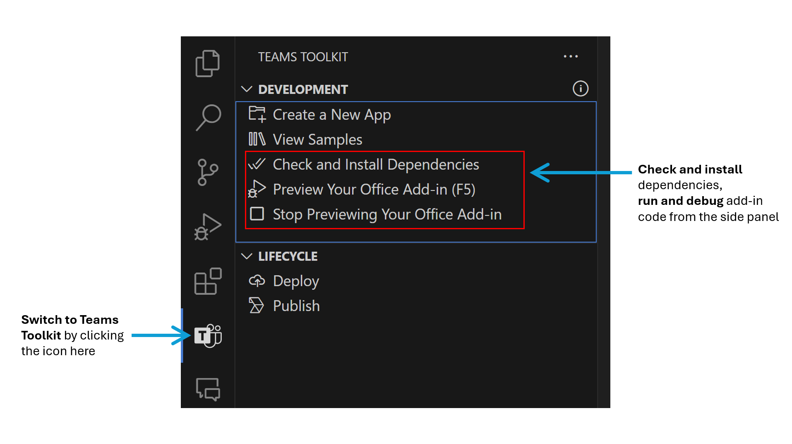
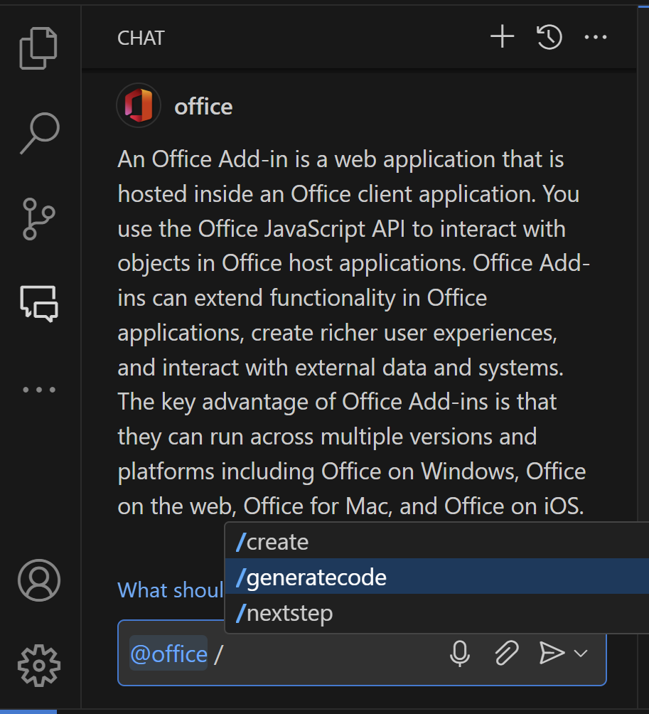

# Build Excel add-ins using GitHub Copilot Extension for Office Add-ins

> **Notice:** This add-in project is found by GitHub Copilot Extension for Office Add-ins per your description, please take a look. GitHub Copilot is powered by AI, so mistakes are possible.

Excel add-ins are integrations built by third parties into Excel by using [Excel JavaScript API](https://learn.microsoft.com/en-us/office/dev/add-ins/reference/overview/excel-add-ins-reference-overview) and [Office Platform capabilities](https://learn.microsoft.com/en-us/office/dev/add-ins/overview/office-add-ins).

## How to run this sample

### Prerequisites

- [Node.js](https://nodejs.org) 16, 18, or 20 (18 is preferred) and [npm](https://www.npmjs.com/get-npm). To verify if you've already installed these tools, run the commands `node -v` and `npm -v` in your terminal.
- Office connected to a Microsoft 365 subscription. You might qualify for a Microsoft 365 E5 developer subscription through the [Microsoft 365 Developer Program](
https://developer.microsoft.com/microsoft-365/dev-program), see [FAQ](
https://learn.microsoft.com/office/developer-program/microsoft-365-developer-program-faq#who-qualifies-for-a-microsoft-365-e5-developer-subscription-) for details.
Alternatively, you can [sign up for a 1-month free trial](
https://www.microsoft.com/microsoft-365/try?rtc=1)
or [purchase a Microsoft 365 plan](
https://www.microsoft.com/microsoft-365/buy/compare-all-microsoft-365-products).

### Run the add-in using Teams Toolkit

You can use [Teams Tookit](https://marketplace.visualstudio.com/items?itemName=TeamsDevApp.ms-teams-vscode-extension) to easily run and debug your Office add-in.
 

1. **Check and Install Dependencies**

    Select `Check and Install Dependencies` to check your environment and install necessary dependencies in order to run and debug the add-in code.

1. **Preview Your Office Add-in (F5)**

    Select `Preview Your Office Add-in(F5)` on the side panel to start running and debugging the add-in code. A Word/Excel/PowerPoint app will launch with the add-in sample side-loaded.
    - You can also start debugging by hitting the `F5` key or running `npm run start` command in the terminal.
    - To debug on Office on the web, go to [Sideload Office Add-ins to Office on the web](https://learn.microsoft.com/office/dev/add-ins/testing/sideload-office-add-ins-for-testing)
    - To debug in Desktop (Edge Legacy), go to [Debug Edge Legacy Webview](https://learn.microsoft.com/office/dev/add-ins/testing/debug-add-ins-using-devtools-edge-legacy)

    **If you meet sideload errors, please first confirm the following items and check [troubleshoot development errors]( https://learn.microsoft.com/en-us/office/dev/add-ins/testing/troubleshoot-development-errors) for common issues. If you still have problems, [Create an issue](https://github.com/OfficeDev/office-js/issues/new/choose) and we'll help you out.**

    - You have installed dependencies.
    - You have closed all Word/Excel/PowerPoint apps.
    - You have stopped your last add-in previewing session.

1. **Stop Previewing Your Office Add-in**

    Select `Stop Previewing Your Office Add-in` to stop debugging.

## How to use this sample

This add-in project contains sample code for a basic Excel task pane add-in.

### Explore sample files

To explore the components of the add-in project, review the key files listed below.

- The `./manifest.xml` file in the root directory of the project defines the settings and capabilities of the add-in.   You can check whether your manifest file is valid by selecting `Validate Manifest File` in the `Teams Toolkit` extension tree view.
- The `./src/taskpane/taskpane.html` file contains the HTML markup for the task pane.
- The `./src/taskpane/taskpane.css` file contains the CSS that's applied to content in the task pane.
- The `./src/taskpane/taskpane.js` file contains the Office JavaScript API code that facilitates interaction between the task pane and the Excel application.

### Make code changes

**GitHub Copilot Extension for Office Add-ins:**

1. Type in `@office` to invoke the extension.
1. Type in `/generatecode` and describe the feature you would like to build, then send the request to Copilot. You can [view prompt examples for GitHub Copilot](
https://learn.microsoft.com/en-us/office/dev/add-ins/resources/resources-github-copilot-prompt-library
) to see how to write prompts for Office add-in development.
1. Get the response from the extension and use the code.
 

**Resources to learn more Office add-ins capabilities:**

- [Read the documentation](https://learn.microsoft.com/office/dev/add-ins/overview/office-add-ins) of Office add-ins.
- Check [Office Add-ins code samples](https://github.com/OfficeDev/Office-Add-in-samples) for real-world examples and code structures.

## Engage with the team

Did you experience any problems with the sample? [Create an issue](https://github.com/OfficeDev/office-js/issues/new/choose) and we'll help you out.

If you have suggestions for GitHub Copilot Extension for Office Add-ins, [give us feedback](
aka.ms/GitHubCopilotextensionforOfficeAddinsFeedback
) and help us improve the product.

Want to learn more about new features, development practices, and additional information? [Join the Microsoft Office Add-ins community call.](https://learn.microsoft.com/office/dev/add-ins/overview/office-add-ins-community-call)

## Copyright

Copyright (c) 2024 Microsoft Corporation. All rights reserved.

## Disclaimer

**THIS CODE IS PROVIDED *AS IS* WITHOUT WARRANTY OF ANY KIND, EITHER EXPRESS OR IMPLIED, INCLUDING ANY IMPLIED WARRANTIES OF FITNESS FOR A PARTICULAR PURPOSE, MERCHANTABILITY, OR NON-INFRINGEMENT.**
